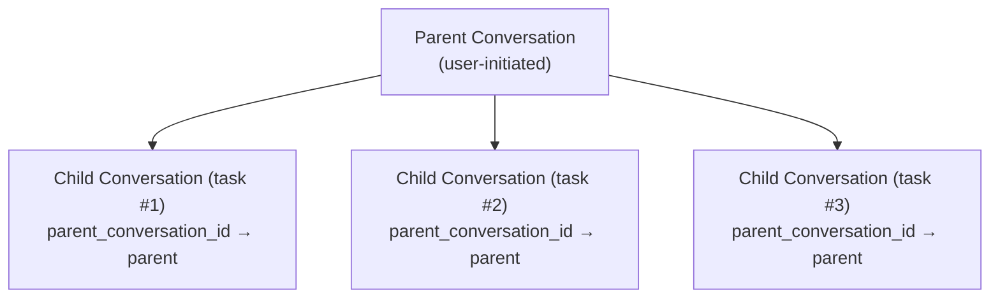

# ADR-004: Session Storage Lifecycle Management

> **Status**: Accepted (2026-06-10)
> **Context**: entelecheia + shittim-chest
> **Inspired by**: [opencode #16101](https://github.com/anomalyco/opencode/issues/16101)

## Context

opencode (a comparable AI coding agent) accumulated 9GB of chat history DB in just 2 months with ~30B tokens consumed. Memory usage regularly exceeded 30GiB with only ~10 projects loaded. The root cause was lack of session lifecycle management: no TTL, no auto-cleanup, no storage cap, and no post-compaction reclamation.

entelecheia and shittim-chest face the same fundamental problem if left unaddressed:

- **entelecheia**: `conversations` and `messages` DB tables existed but were never written to; actual chat was stored as unlimited TOML log files; `dialogue_events` table had CRUD code but no migration; configuration limits (`MAX_DIALOGUE_HISTORY_LEN`, `MAX_DIALOGUE_RECORDS`, `DIALOGUE_TIMEOUT_MS`) were defined but never enforced.
- **shittim-chest**: Has working conversation/message persistence but no automated cleanup for expired auth sessions, stale workspace sessions, cruise history, or webhook delivery logs.

## Decision

Implement a unified storage lifecycle management system with these principles:

### 1. Conversations have a lifecycle, not just a birth

- **TTL**: Conversations inactive beyond `CONVERSATION_TTL_DAYS` (default 90 days) are eligible for cleanup after archiving.
- **Archive-before-delete**: Conversations must be archived (`is_archived = TRUE`) before TTL cleanup removes them.
- **Child sessions**: Parent-child conversation relationships are tracked via `parent_conversation_id`. Child conversations can be independently archived and cleaned up after `CHILD_SESSION_RETENTION_DAYS` (default 7 days).

### 2. Cleanup is automatic, not manual

- **Background tasks**: Periodic cleanup runs on configurable intervals (`CLEANUP_INTERVAL_MINUTES`, default 60).
- **Mixed strategy**: Startup scan + periodic timer. Does not require user intervention.
- **Idempotent**: Cleanup tasks can be run multiple times safely.

### 3. Compaction enables storage reclamation

- Messages marked as `is_compacted = TRUE` have had their content summarized. Their detailed content can be cleaned up after the retention period.
- Conservative by default: only clear compacted message content, preserve metadata (tool name, timestamps, token counts).

### 4. Configuration is centralized

All lifecycle parameters live in `StorageLifecycleConfig` (entelecheia) and `CleanupConfig` (shittim-chest), loaded from environment variables with sensible defaults.

### 5. File-based logs are secondary

- `CHAT_LOG_ENABLED` defaults to `false`. TOML chat log files are for debugging only.
- When enabled, log files are cleaned up after `CHAT_LOG_RETENTION_DAYS` (default 7).

## Schema Changes

### conversations table (entelecheia)

Added columns:

- `parent_conversation_id UUID REFERENCES conversations(conversation_id)` — child session tracking
- `is_archived BOOLEAN NOT NULL DEFAULT FALSE` — archive flag
- `archived_at TIMESTAMPTZ` — when archived
- `metadata JSONB NOT NULL DEFAULT '{}'` — extensible metadata

### messages table (entelecheia)

Added columns:

- `is_compacted BOOLEAN NOT NULL DEFAULT FALSE` — marks compacted messages eligible for content cleanup
- `metadata JSONB NOT NULL DEFAULT '{}'` — extensible metadata

### dialogue_events table (entelecheia)

Previously had CRUD code but no `CREATE TABLE` migration. Now included in `baseline_tables.sql`.

### rbac_sessions table (entelecheia)

New table for kirino session persistence (SQL backend).

## Implementation Phases

| Phase | Description | Status |
| --- | --- | --- |
| 0.1 | Schema migration fixes (dialogue_events, conversations/messages upgrade) | Done |
| 1.2 | Unified config namespace (`StorageLifecycleConfig`) | Done |
| 0.2 | `ConversationStore` with CRUD + cleanup methods | Done |
| 2.1 | Generic `CleanupScheduler` infrastructure | Done |
| 2.2 | entelecheia cleanup tasks wired into scepter `setup.rs` | Done |
| 2.3 | shittim-chest cleanup tasks | Removed (package does not exist) |
| 1.3 | kirino `PgSessionManager` (SQL session backend) | Done |
| 3.1 | Enforce existing dialogue limits (`max_dialogue_records`, `enforce_max_conversations`) | Done |
| 3.2 | Chat log file default-off + TTL cleanup | Done |
| 4.1 | CLI management commands (`session stats`, `session purge`) | Done |
| 5 | Child session cascade + orphan lifecycle | Done |

## Consequences

### Positive

- Prevents unbounded storage growth that plagued opencode
- Conversations have explicit lifecycle: active → archived → cleaned
- Background cleanup requires no user intervention
- Configuration-driven with sensible defaults
- PostgreSQL VACUUM reclaims disk space after deletion (unlike SQLite which opencode uses)

### Negative

- Additional background tasks consume minimal CPU/memory
- Archived conversations lose detailed content after TTL (by design)
- Requires monitoring to ensure cleanup tasks are running

### Risks mitigated

- **Data loss**: Archive-before-delete provides a grace period. Cleanup only removes already-archived conversations.
- **Performance impact**: Cleanup runs on configurable intervals, uses indexed queries on `updated_at`/`created_at`.
- **Child session orphaning**: `parent_conversation_id` tracks relationships; orphan TTL is shorter (30 days vs 90 days).

## Child Session Lifecycle Design (Phase 5)

### Problem

opencode issue #16101 revealed that 86% of sessions are child sessions spawned by `task()`, accounting for 75% of storage. These child sessions accumulate without independent lifecycle management.

### Architecture



### Lifecycle Rules

1. **Creation**: When a skill chain spawns a sub-task, a new conversation is created with `parent_conversation_id` set to the parent's `conversation_id`.

1. **Independent archival**: Children can be archived independently of the parent. When a child task completes, it is automatically archived after `CHILD_SESSION_RETENTION_DAYS` (default 7 days).

1. **Cascade on parent archive**: When a parent is archived, all children are archived. When a parent is deleted, all children are deleted.

1. **Orphan handling**: Conversations with `parent_conversation_id` pointing to a deleted/nonexistent parent are treated as orphans and cleaned up after `ORPHAN_CONVERSATION_TTL_DAYS` (default 30 days).

1. **Compaction eligibility**: Child conversations are eligible for message compaction immediately after archival (no grace period), since the parent retains the summary.

### Cleanup Queries

```sql
-- Archive children whose parent is archived
UPDATE conversations SET is_archived = TRUE, archived_at = NOW()
WHERE parent_conversation_id IN (
    SELECT conversation_id FROM conversations WHERE is_archived = TRUE
) AND is_archived = FALSE;

-- Delete children whose parent is deleted
DELETE FROM conversations WHERE parent_conversation_id IS NOT NULL
    AND parent_conversation_id NOT IN (SELECT conversation_id FROM conversations);

-- Delete archived children older than retention
DELETE FROM conversations WHERE is_archived = TRUE
    AND archived_at < NOW() - (CHILD_SESSION_RETENTION_DAYS || ' days')::interval
    AND parent_conversation_id IS NOT NULL;
```

### Implementation Status

- `parent_conversation_id` column exists in `conversations` table (Phase 0.1)
- `ConversationStore.cleanup_expired_conversations()` handles TTL-based cleanup (Phase 0.2)
- `StorageLifecycleConfig.child_session_retention_days` and `orphan_conversation_ttl_days` configured (Phase 1.2)
- Cascade queries implemented in `ConversationStore`:
  - `cascade_archive_children()` — archives children when parent is archived
  - `cascade_delete_orphaned_children()` — deletes children whose parent was deleted
  - `cleanup_expired_child_conversations()` — TTL-based cleanup for archived children
  - `cleanup_orphan_conversations()` — cleanup children with missing parent
  - `enforce_max_dialogue_records()` — hard cap on `dialogue_events` count
  - `enforce_max_conversations()` — hard cap on active conversations count
- All registered as periodic cleanup tasks in scepter `setup.rs`
