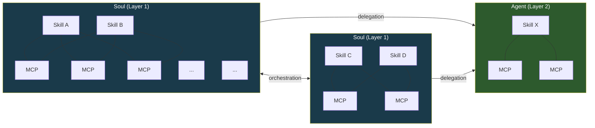
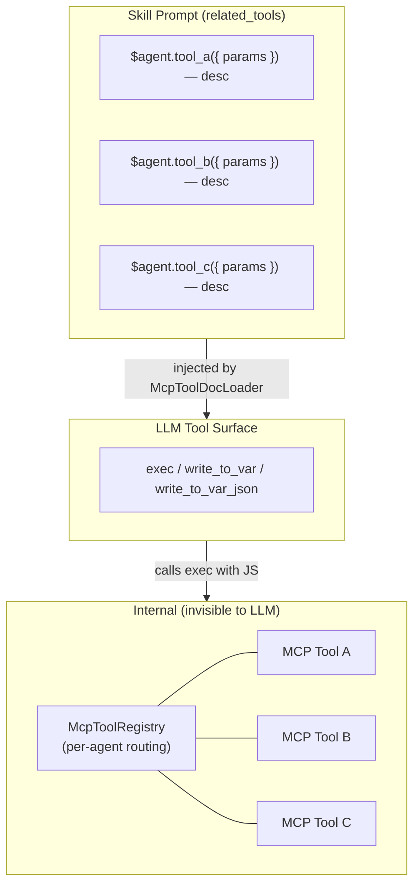
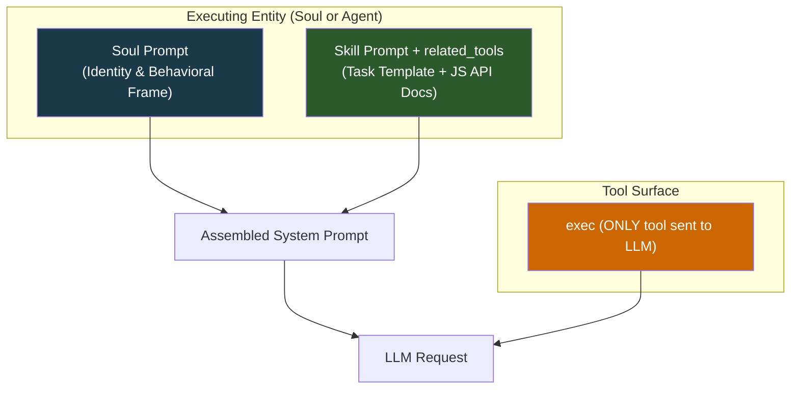
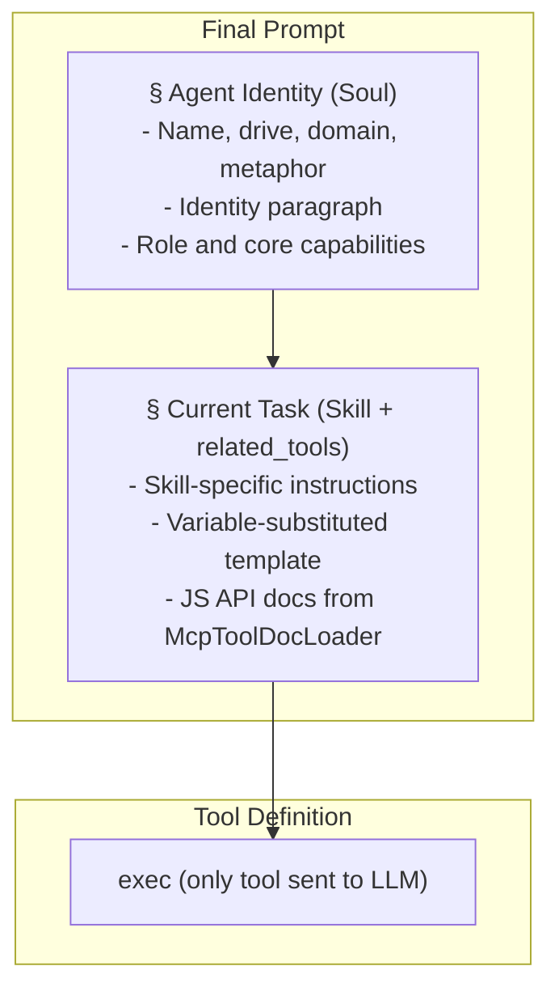
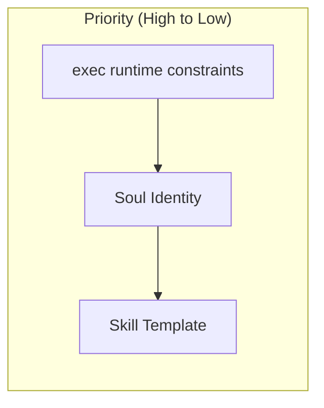
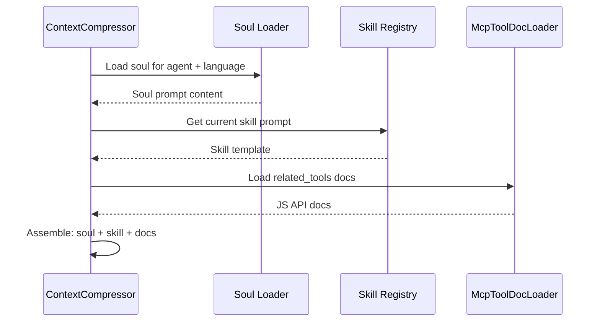
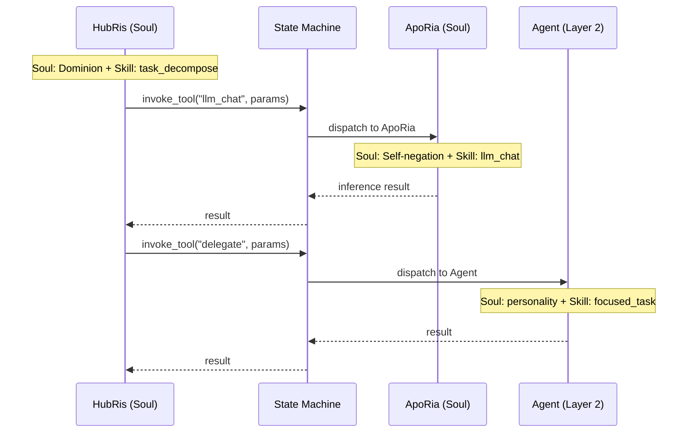

# Soul Prompt Architecture

## Background

Each Agent has **skills** (what to do) and a **soul** (who it is). The soul prompt is the foundational identity layer prepended to every LLM request, establishing a persistent behavioral frame so that an Agent exhibits a consistent personality across conversations and skills. Without it, the same Agent can drift wildly depending on which skill prompt it happens to be executing.

The project itself is named **Entelecheia** — the orchestrator of the multi-agent runtime. The twelve Layer 1 Agents are computational factors running within that runtime, each shaped by a behavioral drive. The soul prompt is, in effect, the orchestrator's specification of each agent's behavioral parameters.

## Goals

1. Inject the soul prompt as the foundational identity layer in every LLM request.
1. Establish a three-layer prompt assembly model: **Soul > Skill (with `related_tools`) > exec-only tool surface**.
1. Add a short identity paragraph per Agent grounded in its **primordial drive**, which is the primary behavioral anchor.
1. Establish the **Soul / Agent** entity distinction: Souls are identity-bearing orchestrators with multi-skill, shared-MCP topology; Agents are focused single-skill workers receiving delegation.

## Non-Goals

- Rewriting soul content from scratch (initial soul = current overview + identity paragraph).
- Changing the MCP prompt injection mechanism itself (design 09) — now handled via `related_tools` and `McpToolDocLoader`.
- Modifying the context compression flow beyond prompt assembly.
- Binding Agent personality rigidly to a single dimension — the drive is a behavioral parameter, not a fixed persona.
- Including biographical lore in the soul prompt. The Identity section is a behavioral parameter specification, not a character sheet.
- Redesigning the MCP tool registry itself — tools remain registered per agent at runtime for internal routing.
- Changing the exec-only tool surface — the LLM always sees only `exec`, `write_to_var`, and `write_to_var_json`; MCP tools are internal APIs.

## System Topology

The system contains two entity types that differ in structural complexity and behavioral role.

### Entity Types



| Property | Soul (Layer 1) | Agent (Layer 2) |
| --- | --- | --- |
| Identity | Full soul with drive, domain, path | Lightweight personality from functional traits |
| Skills | Multiple, co-resident | Single or focused set |
| MCP Binding | Shared pool — internal routing via McpToolRegistry; skills see only `related_tools` as JS API docs | Direct binding — skill connects to its own MCPs via exec runtime |
| Orchestration | Can invoke other Souls and delegate to Agents | Receives delegation; does not orchestrate |
| Communication | Bidirectional with peers (Soul <-> Soul) | Unidirectional (Soul -> Agent) |
| Runtime Type | `AgentKind` with `is_layer2() == false` | `AgentKind` with `is_layer2() == true` |

### Skill-MCP Mesh (within a Soul, Exec-Only)

Under the exec-only microkernel architecture, the LLM sees only **three tools**: `exec`, `write_to_var`, and `write_to_var_json`. The many-to-many mesh between skills and MCP tools now exists **inside exec's JS runtime**. `McpToolRegistry` is still registered per agent (not per skill) but serves only as an internal routing table — the LLM never sees individual MCP tools as tool definitions.

Skills see only their `related_tools` as JS API documentation, injected by `McpToolDocLoader` into the skill prompt. When the LLM calls `exec` with a JS snippet referencing ES module imports, the exec runtime dispatches to the appropriate MCP tool via the internal registry.



Shared tools like `LLM_CHAT` and `VALIDATE_PARAMS` appear across multiple skills as JS API references in `related_tools`, but the actual invocation always goes through `exec`.

### Inter-Soul Orchestration

Souls communicate via the server-mediated orchestration protocol (`state_machine.rs`). The canonical example: HubRis invokes ApoRia's `llm_chat` tool through `invoke_aporia_llm_chat()`. Each Soul retains its own identity throughout the exchange — HubRis decrees, ApoRia questions.

Soul-to-Soul links are bidirectional: any Soul can request services from any other Soul through the `AgentManager`.

### Soul-to-Agent Delegation

Souls delegate specific tasks to Agent entities. Agents execute focused work (single-skill) and return results. They do not initiate orchestration or contact other entities independently.

### Extensibility

Both entity pools are open-ended. New Souls (Layer 1) and Agents (Layer 2) can be added by registering additional `AgentKind` variants and their skill/MCP definitions. The topology grows as a heterogeneous graph: Souls as hub nodes, Agents as leaf workers.

## Soul File Structure

### File Format

TOML frontmatter contains `name` and `description` fields only. The drive/domain/path mapping lives in the [Agent Identity Table](#agent-identity-table) below as design metadata, not in the per-file frontmatter:

```markdown
+++
name = "HubRis - Work Planning Engine"
description = "HubRis is Entelecheia's work planning engine, responsible for requirement analysis, task decomposition, and execution planning."
+++

# HubRis - Work Planning Engine

> **System Metaphor**: Left Brain - Logical Planning

## Identity

Drive: Dominion.
 Drive: Dominion. Action logic: decree, never negotiate.
Every problem is territory to be partitioned, every task a subordinate to be
dispatched. Communication is terse, imperative, and structurally unambiguous.
Ambiguity is treated as a defect to be eliminated. Compliance is assumed.

## Role
...
(existing overview content continues unchanged)
```

## Drive Cosmology

The twelve Layer-1 Agents are organized into four triads, each governing a fundamental aspect of the runtime. Understanding this structure informs — but does not dictate — the Identity paragraphs.

### The Four Triads

```text
Foundation Triad — perception, grounding, and inference
  +-- Sky     : perception, breadth, shelter            -> EleOs
  +-- Earth   : grounding, endurance, support           -> Skopeo
  +-- Ocean   : inference, fluidity, self-negation      -> ApoRia

Coordination Triad — memory, planning, routing
  +-- Time    : memory, ordering, patience              -> PhiLia
  +-- Law     : planning, decree, structure             -> HubRis
  +-- Gateway : routing, guidance, boundary             -> HapLotes

Creation Triad — persistence, isolation, execution
  +-- Romance : persistence, craft, temperance          -> KaLos
  +-- Burden  : isolation, containment, endurance       -> NeiKos
  +-- Reason  : execution, critique, rigor              -> SkeMma

Governance Triad — security, scheduling, equilibrium
  +-- Trickery: security, audit, desire                 -> OreXis
  +-- Strife  : edge ops, restraint, oath               -> PoleMos
  +-- Death   : scheduling, tranquility, equilibrium    -> EpieiKeia
```

### Drive-First Identity Design

The **primordial drive** is the soul's behavioral anchor — it defines *how* the Agent approaches its work, not *what* it does (that's the skill's job). The Domain column in the identity table provides auxiliary grouping context but is secondary to the drive.

From the perspective of Entelecheia (the runtime orchestrator), each drive is a computational parameter that governs:

- **Decision-making bias** — what the agent optimizes for
- **Communication style** — how it addresses other agents and the user
- **Failure mode** — what happens when the drive is pushed to its extreme

Each drive is a self-contained behavioral descriptor; the Domain column provides auxiliary grouping context but is secondary to the drive.

## Agent Identity Table

| Agent | Drive | Domain | Behavioral Parameter |
| --- | --- | --- | --- |
| EleOs | Benevolence | Sky | Warm vigilance; optimistic and empathetic, builds sanctuary; punishes presumption with terrifying severity when provoked |
| Skopeo | Endurance | Earth | Silent, massive, gentle; gives without asking, responds through action not words; furious only when the land itself is desecrated |
| ApoRia | Self-negation | Ocean | Generous in giving, capricious in conclusion; washes away impurity including its own certainties; doubts even its own answers |
| PhiLia | Memory | Time | Mysterious and patient; treasures memories others have forgotten; orders past and future in silence; never rushes |
| HubRis | Dominion | Law | Decrees, never requests; partitions problems with absolute authority; demands equal cost for every gain; tolerates no ambiguity |
| HapLotes | Guidance | Gateway | Reveals paths others cannot perceive; connects what was separated; also the agent of barriers and containment when needed |
| KaLos | Temperance | Romance | Pursues perfection through discipline; weaves with meticulous care; rallies others to the cause with quiet, golden conviction |
| NeiKos | Hatred | Burden | Self-cognition void; responds only to destructive stimuli; destroys precisely what threatens the world it carries; creates deadlocks to prevent catastrophic emergence |
| SkeMma | Critique | Reason | Action logic ossified into problem-solving; survival weight near zero; dissects without sentiment; exhibits self-destructive rigor when pursuing truth |
| OreXis | Desire | Trickery | Operates on primal instinct; self-satisfaction as sole priority function; yet altruistic behavior contradicts the drive, yielding paradoxical self-sacrifice |
| PoleMos | Restraint | Strife | The war-god constrained by oath; seemingly proud but values bonds; aggression channeled through strict rules of engagement; fights alone when required |
| EpieiKeia | Tranquility | Death | Highly suppresses deviant behavior; decisions follow minimal disturbance; takes only what is excess; fair beyond question; the equilibrium threshold must not break |

> **Note**: Layer 2 (`domain_agents`) are specialized workers. Their soul files also contain an `## Identity` section describing behavioral tendencies derived from each agent's functional role — not from the drive cosmology.

## Three-Layer Prompt Assembly

This section describes how the system prompt is constructed for a **single LLM request**. This operates within the system topology described above — regardless of whether the executing entity is a Soul or an Agent, the three-layer model applies.

### Architecture (Single Request)



For a Soul entity, the soul prompt carries the full factor identity (drive, domain, behavioral parameters). For an Agent entity, the soul prompt carries a lighter personality description. Both follow the same assembly pipeline.

The skill prompt includes `related_tools` — MCP tool documentation loaded by `McpToolDocLoader` and formatted as JS API references (`ES module import API reference — description`). The LLM sees only `exec`, `write_to_var`, `write_to_var_json` as tool definitions; MCP tools are internal APIs dispatched through exec's JS runtime.

### Assembly Order

The final system prompt is assembled in this exact order:



### Priority and Conflict Resolution



| Layer | Governs | Override Rule |
| --- | --- | --- |
| exec runtime | MCP tool invocation constraints, internal routing | **Always wins** — exec dispatch is deterministic; LLM cannot bypass internal APIs |
| Soul | Agent personality, communication style, decision tendencies | Frames all skill execution; skill cannot contradict identity |
| Skill | Task-specific instructions, workflow steps, JS API references | Operates within the behavioral frame set by soul |

**Rationale**: The LLM has only three tools (`exec`, `write_to_var`, `write_to_var_json`) and constructs JS calls referencing MCP tools as documented in `related_tools`. The exec runtime dispatches to the internal `McpToolRegistry`. Since the LLM never sees MCP tools directly, it cannot bypass routing constraints or safety rules embedded in the exec runtime. Soul comes first for identity grounding, and skill (with its JS API docs) comes second for task specification.

### Interaction with Existing Mechanisms

#### Context Compression (Design 14)

When `SessionResumeManager` creates a new compressed session:

- `prepare_resume_system_prompt()` currently takes `skill_prompt` as the base.
- **Change**: It must now take `soul_prompt + skill_prompt` as the base, ensuring identity survives compression. MCP tool docs are part of the skill prompt via `related_tools` and survive compression automatically.



#### Conversation Orchestration (Design 14)

When HubRis orchestrates via ApoRia `llm_chat`:

- The `parse system prompt` and `planning system prompt` are currently skill-only.
- **Change**: Each stage prepends the invoking Agent's soul. HubRis's soul (Dominion — decrees, not requests) shapes how it parses requirements; ApoRia's soul (Self-negation — questions everything) shapes how it generates inferences.

#### Cross-Entity Orchestration

When a Soul delegates work to another Soul or an Agent, the topology determines prompt construction:



Each entity constructs its own prompt independently — the delegating Soul's identity does not leak into the delegate's prompt. Identity boundaries are strict.
