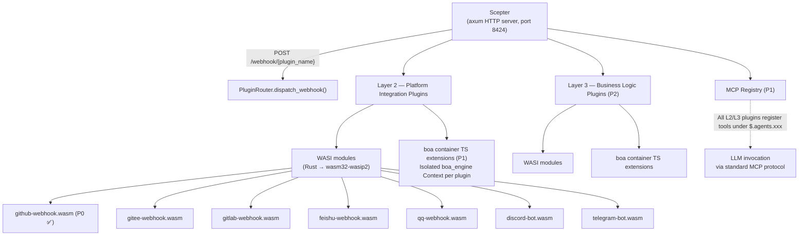
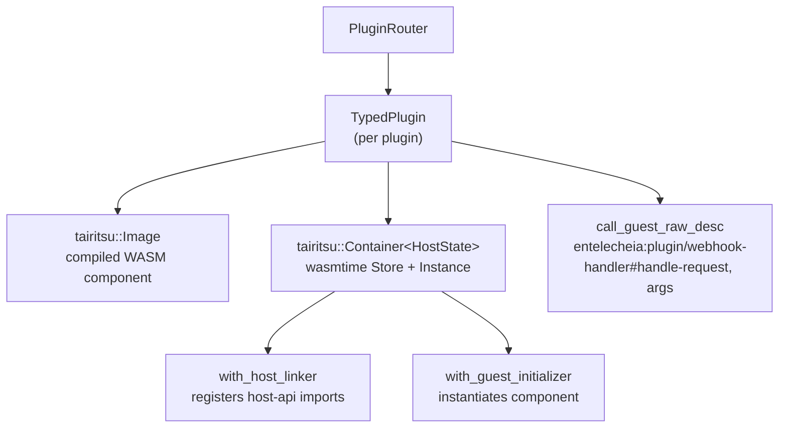

# 25 — WASI Plugin System Design

## Overview

The WASI Plugin System replaces the previous Python/TypeScript webhook scaffolding with **WASM component model** plugins, providing sandboxed, language-agnostic platform integrations (Layer 2) and business logic extensions (Layer 3). Key design goals:

1. **Dual extension mechanism**: Layer 2 (platform integration) and Layer 3 (business logic) both support WASI modules and boa TS extensions.
1. **Unified MCP registration**: All plugins register tools under `$.agents.xxx` regardless of implementation language.
1. **Host-managed I/O**: Host (Scepter axum server) handles HTTP routing, WebSocket, and long-lived connections; plugins only process logic.
1. **Strong sandboxing**: WASM modules run under wasmtime with fuel limits and epoch interruption.

## Architecture



## WIT Interface Definitions

Located in `packages/shared/plugin_host/wit/plugin.wit`:

```wit
package entelecheia:plugin;

interface host-api {
    http-request:  func(method: string, url: string, headers: string, body: string) -> result<string, string>;
    forward-event: func(event-json: string) -> result<_, string>;
    query-ai:      func(message: string, context: option<string>) -> result<string, string>;
    log:           func(level: string, message: string);
    config-get:    func(key: string) -> option<string>;
    kv-get:        func(key: string) -> option<string>;
    kv-set:        func(key: string, value: string) -> result<_, string>;
    register-mcp-tool: func(tool-name: string, description: string, schema: string) -> result<_, string>;
}

interface webhook-handler {
    name: func() -> string;
    handle-request: func(method: string, path: string, headers: string, body: string) -> result<string, string>;
}

interface bot-handler {
    name: func() -> string;
    on-message: func(platform: string, message: string) -> result<option<string>, string>;
}

world layer2-plugin {
    import host-api;
    export webhook-handler;
}

world layer2-bot {
    import host-api;
    export bot-handler;
}
```

### Host-side API Registration

The host registers all `host-api` functions using wasmtime's `component::Linker::func_wrap` before component instantiation:

```rust
let mut instance = linker.root().instance("entelecheia:plugin/host-api")?;

instance.func_wrap("http-request",
    |_: StoreContextMut<'_, HostState>,
     (method, url, headers, body): (String, String, String, String)| {
        Ok::<(Result<String, String>,), wasmtime::Error>(
            (api.http_request(method, url, headers, body),)
        )
    }
)?;
```

### Guest-side Bindings

Plugins use `wit_bindgen::generate!()` to generate guest-side bindings:

```rust
wit_bindgen::generate!({
    path: "wit",
    world: "layer2-plugin",
});

struct GithubWebhookPlugin;
impl exports::entelecheia::plugin::webhook_handler::Guest for GithubWebhookPlugin {
    fn name() -> String { "github-webhook".to_string() }
    fn handle_request(method: String, path: String, headers: String, body: String)
        -> Result<String, String> { /* ... */ }
}
export!(GithubWebhookPlugin);
```

## Plugin Host Architecture

### Crate: `_shared_plugin_host` (`packages/shared/plugin_host/`)

| Module | Role |
| --- | --- |
| `plugin_state.rs` | `HostFunctions` — implements all `host-api` functions (HTTP, KV, config, events) |
| `plugin_loader.rs` | `TypedPlugin` — builds wasmtime containers, registers host imports, calls guest exports via dynamic `call_guest_raw_desc` |
| `plugin_router.rs` | `PluginRouter` — manages loaded plugins, dispatches webhook/bot requests, auto-scans `plugins/` dir |
| `host_functions.rs` | Re-exports `HostFunctions` and `HostApiProvider` trait |

### Runtime Stack



### Guest Export Names

Since `wit_bindgen::generate!` on the guest side exports functions under the WIT interface name, the host uses fully-qualified names for dynamic invocation:

```text
entelecheia:plugin/webhook-handler#name
entelecheia:plugin/webhook-handler#handle-request
entelecheia:plugin/webhook-handler#on-message
```

### Async Bridge

Host functions are synchronous (wasmtime requirement) but implementations need async (HTTP, database). The bridge uses `tokio::task::block_in_place` + `Handle::block_on`:

```rust
instance.func_wrap("kv-get",
    move |_: StoreContextMut<'_, HostState>, (key,): (String,)| {
        let result = tokio::task::block_in_place(|| {
            let handle = tokio::runtime::Handle::current();
            handle.block_on(api.kv_get(&key))
        });
        Ok::<(Option<String>,), wasmtime::Error>((result,))
    }
)?;
```

Scepter's webhook handler uses `tokio::task::spawn_blocking` to call synchronous WASM methods from async axum handlers.

## Scepter Integration

### Route Registration

`packages/scepter/src/app/setup.rs` — added to axum router:

```rust
.merge(crate::api::plugin_webhook::create_plugin_webhook_routes())
```

### Webhook Handler

`packages/scepter/src/api/plugin_webhook.rs`:

- `POST /webhook/{plugin_name}` — extracts path, headers, body
- Calls `PluginRouter::dispatch_webhook()` inside `tokio::task::spawn_blocking`
- Returns the plugin's response or an error

### Plugin Auto-Loading

At startup, Scepter creates a `PluginRouter` and scans `plugins/` (or `$PLUGIN_DIR`) for `.wasm` files:

```rust
let plugin_dir = std::path::PathBuf::from(
    std::env::var("PLUGIN_DIR").unwrap_or_else(|_| "plugins".to_string()),
);
router.scan_and_load_dir(&plugin_dir)?;
```

## Plugin Development Guide

### Creating a WASI Plugin

1. Initialize a new crate under `plugins/`:

```toml
# plugins/my-platform/Cargo.toml
[package]
name = "plugin-my-platform"
version = "0.1.0"
edition = "2024"

[lib]
crate-type = ["cdylib", "rlib"]

[dependencies]
wit-bindgen = "0.57"
serde = { version = "1", features = ["derive"] }
serde_json = "1"
```

1. Copy the WIT file:

```text
plugins/my-platform/wit/plugin.wit  ← symlink or copy from packages/shared/plugin_host/wit/
```

1. Implement the `Guest` trait:

```rust
// plugins/my-platform/src/lib.rs
wit_bindgen::generate!({ path: "wit", world: "layer2-plugin" });

use exports::entelecheia::plugin::webhook_handler::Guest;

struct MyPlatformPlugin;

impl Guest for MyPlatformPlugin {
    fn name() -> String { "my-platform".to_string() }
    fn handle_request(method: String, path: String, headers: String, body: String)
        -> Result<String, String> {
        // Use host-api functions: log(), http-request(), kv-get(), etc.
        log("info", &format!("received {} request", method));
        Ok(r#"{"status":"ok"}"#.to_string())
    }
}

export!(MyPlatformPlugin);
```

1. Configure `.cargo/config.toml`:

```toml
[target.wasm32-wasip2]
rustflags = ["--cfg=unstable_wasi_extension", "--cfg=unstable_wasi_export_wasi_reactor"]
```

1. Build:

```bash
cargo build --target wasm32-wasip2 --release -p plugin-my-platform --lib
```

1. Deploy: copy the `.wasm` file to `plugins/` directory (or set `PLUGIN_DIR`).

## Host Functions Reference

| Function | Signature | Description |
| --- | --- | --- |
| `http-request` | `(method, url, headers, body) → result<string, string>` | Make HTTP requests (for replying to external platforms) |
| `forward-event` | `(event-json) → result<_, string>` | Forward structured events to Scepter |
| `query-ai` | `(message, context?) → result<string, string>` | Query the AI pipeline (not yet connected) |
| `log` | `(level, message)` | Emit structured log through Scepter's tracing |
| `config-get` | `(key) → option<string>` | Read plugin configuration |
| `kv-get` | `(key) → option<string>` | Persistent KV store (OAuth tokens, etc.) |
| `kv-set` | `(key, value) → result<_, string>` | Write to persistent KV store |
| `register-mcp-tool` | `(name, description, schema) → result<_, string>` | Register an MCP tool (P1) |

## Security Model

| Mechanism | Implementation |
| --- | --- |
| **Sandbox** | wasmtime component model sandbox — no filesystem, no network access by default |
| **Resource limits** | Fuel metering (per-instruction accounting) + epoch interruption (timeout) via tairitsu Container builder |
| **Host-only I/O** | All I/O goes through host functions; plugins cannot open sockets or files |
| **Plugin isolation** | Each plugin is a separate wasmtime instance with its own memory, no cross-plugin sharing |
| **TS sandbox (P1)** | boa_engine Context with COMPUTE_TIMEOUT (120s) / ABSOLUTE_CEILING (600s) from skemma |

## Implementation Status

| Phase | Component | Status |
| --- | --- | --- |
| **P0** | GitHub webhook WASI plugin | ✅ Done |
| **P0** | PluginRouter + Scepter integration | ✅ Done |
| **P0** | HostFunctions (all 8 host-api functions) | ✅ Done |
| **P1** | boa TS extension infrastructure | Not started |
| **P1** | MCP tool registration via `$.agents.xxx` | Not started |
| **P2** | Remaining platform plugins (Gitee, GitLab, Feishu, QQ, Discord, Telegram) | Not started |
| **P2** | Layer 3 business logic plugins | Not started |

## Key Files

| File | Purpose |
| --- | --- |
| `packages/shared/plugin_host/Cargo.toml` | wasmtime 43, tairitsu runtime, reqwest |
| `packages/shared/plugin_host/wit/plugin.wit` | Canonical WIT interface definition |
| `packages/shared/plugin_host/src/plugin_state.rs` | HostFunctions, HostApiProvider trait |
| `packages/shared/plugin_host/src/plugin_loader.rs` | TypedPlugin, host function registration |
| `packages/shared/plugin_host/src/plugin_router.rs` | PluginRouter, dispatch, scan_and_load_dir |
| `packages/scepter/src/api/plugin_webhook.rs` | Axum webhook route handler |
| `packages/scepter/src/app/setup.rs` | Route registration + PluginRouter init |
| `plugins/github-webhook/` | Reference implementation |
| `plugins/github-webhook/src/lib.rs` | GitHub webhook plugin (issues, PR, push, comment) |
