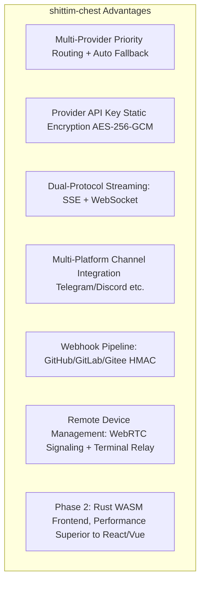

# Product Positioning & Competitive Landscape

## Overview

shittim-chest is a loosely-coupled LLM WebUI platform, with direct competitors being Open WebUI, LobeChat, and the like. Its integration with entelecheia is an optional feature, not an architectural prerequisite.

## Core Positioning

| Dimension | Description |
| --- | --- |
| Essence | A standalone, multi-Provider LLM chat WebUI |
| Competitors | Open WebUI, LobeChat, NextChat |
| Relationship with entelecheia | Loosely coupled: optional integration bridged via JWT proxy |
| Independence | Provides a complete chat experience without entelecheia |

## Differentiation from Open WebUI

## Boundary with entelecheia

| shittim-chest | entelecheia |
| --- | --- |
| User Auth (argon2 + JWT) | User Identity + Permissions (RBAC) |
| Session Management | Agent Orchestration (scepter) |
| Chat Data (conversations/messages) | Cosmos Container Runtime |
| LLM Provider Management + Key Encryption | IEPL TypeScript Execution Engine |
| Webhook Ingress (HMAC Verification + Forwarding) | Agent Tool Invocation |
| Frontend Rendering (arona) | WebSocket Agent Channel |
| Remote Device Sessions + Signaling Relay | polemos Device Agent |
| Multi-Platform Channel Configuration | — |

**Key Principle**: shittim-chest only holds "user-side" data; entelecheia only holds "Agent-side" data. The two communicate via JWT-authenticated HTTP/WebSocket, never accessing each other's databases.

## Architecture Evolution Roadmap

| Phase | Status | Content |
| --- | --- | --- |
| P1-P6 | Completed | Standalone chat, auth, Provider management, Webhooks, proxy bridging, device management |
| P7 | Planned | Voice input/output (STT Docker container + TTS proxy) |
| P8 | Planned | PWA mobile + Tauri Mobile |
| P9 | Planned | Rust WASM frontend migration (arona → Tairitsu) |

## Design Philosophy

1. **Standalone-first**: All core features do not depend on entelecheia. `LLM_DEFAULT_PROVIDER_*` environment variables suffice to launch chat independently.
1. **Loosely-coupled integration**: entelecheia integration is an optional proxy layer. Users can choose to use only LLM chat, or enable Agent orchestration via entelecheia.
1. **Progressive WASM**: The Vue 3 frontend is delivered first as a "living specification"; WASM migration has clear decision thresholds (framework maturity, ecosystem coverage, development bandwidth).
1. **Docker native**: All server-side components are managed via the bollard Docker API, with no dependency on docker-compose.
