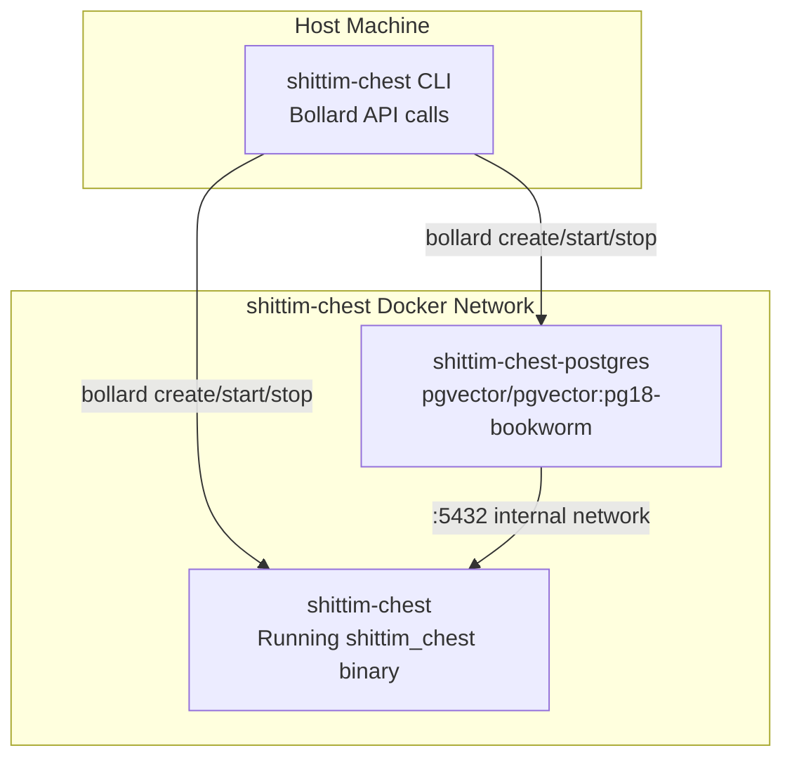

# CLI Wrapper Architecture: Bollard-Based Docker Orchestration

## Overview

`packages/cli/` is a Rust binary that manages container lifecycles directly via the Bollard Docker API, fully replacing docker-compose and shell scripts. The CLI runs on the host machine, while the server binary (`shittim_chest`) runs inside containers.

## Why Not docker-compose

| Dimension | docker-compose | bollard (current approach) |
| --- | --- | --- |
| Dependency | Requires standalone docker-compose installation | Reuses Docker Engine API |
| Programmability | YAML declarative, limited logic | Rust native, arbitrary control flow |
| Health checks | depends_on + condition is event-based | Active polling; death detection without timeouts |
| Error handling | Container exit = failure | Retries + log collection + detailed error info |
| Resource cleanup | `down -v` all-or-nothing | Granular cleanup by container/network/volume |
| Integration | External tool | Embedded as a library, extensible with more logic |

## Container Topology



## Container Naming & Resources

| Constant | Value | Purpose |
| --- | --- | --- |
| `NET` | `shittim-chest` | Docker bridge network |
| `PG` | `shittim-chest-postgres` | PostgreSQL container name |
| `APP` | `shittim-chest` | Application container name |
| `VOL` | `shittim-chest-pgdata` | PG data volume |
| `PG_IMG` | `pgvector/pgvector:pg18-bookworm` | PG image |
| `RUNTIME_IMG` | `debian:bookworm-slim` | Dev mode runtime image |
| `BUILD_IMG` | `shittim-chest` | Release mode build image |

## Command Mapping

| Command | Behavior |
| --- | --- |
| `dev [--clean]` | One-shot startup: env → network → volume → PG → cargo build → migrate → launch → streaming logs |
| `up` | Release mode: docker build image → migrate → background launch (restart=unless-stopped) |
| `down [--clean]` | Stop containers (optional volume + network cleanup) |
| `migrate` | Run db-migrate in a one-shot container (retries up to 5 times, 2s interval) |
| `logs` | Stream-follow application container logs |
| `status` | Check PG and app container running status + health check status |
| `build` | Build the full Docker image (`docker build -t shittim-chest`) |

## Environment Variable Propagation

```text
.env file → dotenvy::from_path_iter → HashMap<String, String>
→ Merge SHITTIM_CHEST_HOST / PORT / DATABASE_URL
→ Vec<String> = ["KEY=VALUE", ...]
→ bollard Config::env()
```

The CLI does not read its own configuration from `.env` — it only passes the full `.env` content into the `shittim_chest` process inside the container. Passwords and ports are read via the two specific keys `SHITTIM_CHEST_DB_PASSWORD` and `SHITTIM_CHEST_PORT`.

## Logging Conventions

CLI logs output directly to stderr, using the same format as entelecheia:

- `tracing-subscriber` + `ShortTimer` (HH:MM:SS format)
- `.compact()` compact mode
- `.with_target(false)` hide module paths
- `--log-level` CLI parameter (default `info`)

## Design Principles

1. **CLI does not perform business logic**: All business logic resides in the `shittim_chest` binary inside the container
1. **Containers are immutable units**: The CLI creates/destroys containers, never modifies running ones
1. **Network isolation**: PG port is not exposed to the host, only reachable within the internal Docker network
1. **Passive polling for health checks**: Does not rely on Docker events (unreliable); directly polls inspect results
