# Dual-Mode Deployment Paths: Dev vs Release

## Overview

shittim-chest supports two deployment modes: Dev (local fast iteration, no Node, no image build) and Release (full Docker image with embedded frontend static files). Both modes share the same container topology and network.

## Design Motivation

Building a full Docker image (Node frontend build + Rust compilation + `embedded-frontend`) takes 30+ seconds, unsuitable for daily development iteration. Dev mode leverages the host machine's incremental Rust compilation cache, bind-mounting the binary into a minimal runtime container for sub-second restart times.

## Path Comparison

```mermaid
flowchart TB
    subgraph Dev[Dev Path]
        D1[cargo build -p shittim_chest] --> D2[Binary: target/debug/shittim_chest]
        D2 --> D3[bind mount into debian:bookworm-slim]
        D3 --> D4[Container running]
    end
    subgraph Release[Release Path]
        R1[docker build -t shittim-chest] --> R2[Multi-stage build]
        R2 --> R3[Node:22-slim build frontend]
        R3 --> R4[Rust:1.85-slim compile + embedded-frontend]
        R4 --> R5[debian:bookworm-slim runtime]
        R5 --> R6[Container running]
    end
```



| Dimension | Dev mode (`just dev`) | Release mode (`just up`) |
| --- | --- | --- |
| Frontend | Built by Vite, served by backend via `just dev` | Embedded in binary (`embedded-frontend` feature) |
| Requires Node | Yes (for Vite build) | Yes (inside Docker) |
| Binary source | Local `cargo build` | Compiled inside Docker |
| Container base image | `debian:bookworm-slim` | `debian:bookworm-slim` (multi-stage build result) |
| Restart speed | < 5s (after incremental compilation) | 30-60s (full build) |
| Use case | Daily development, debugging | CI/production deployment |
| Container launch method | `Config.cmd = ["shittim_chest"]` | Image includes ENTRYPOINT |

## Dev Mode Implementation Details

### Local Compilation

```rust
async fn cargo_build() -> Result<()> {
    Command::new("cargo")
        .args(["build", "-p", "shittim_chest"])
        .status().await?;
}
```

The compilation output path is fixed at `$PWD/target/debug/shittim_chest` (debug profile, debug symbols preserved).

### Bind Mount Launch

```rust
let config = Config::<String> {
    image: Some("debian:bookworm-slim".into()),   // minimal runtime
    cmd: Some(vec!["shittim_chest".to_string()]),
    host_config: Some(HostConfig {
        binds: Some(vec![
            format!("{bin_path}:/usr/local/bin/shittim_chest:ro")
        ]),
        network_mode: Some(NET.into()),
        port_bindings: ...,
        ..
    }),
    env: Some(container_env(password, port)),
    ..
};
```

Key points:

- The binary is mounted read-only (`:ro`) to prevent accidental in-container modification
- Binary location is `/usr/local/bin/shittim_chest`, executed directly inside the container
- The base image `debian:bookworm-slim` provides the required glibc runtime

### Migration Execution

Migrations are executed via a one-shot container:

```bash
docker run --rm --network shittim-chest \
  -v $PWD/target/debug/shittim_chest:/usr/local/bin/shittim_chest:ro \
  -e SHITTIM_CHEST_DATABASE_URL=... \
  debian:bookworm-slim \
  shittim_chest db-migrate
```

Automatically retries up to 5 times (2-second interval) to handle the case where PG is not yet fully ready.

## Release Mode Implementation Details

### Dockerfile Multi-Stage Build

```dockerfile
# Stage 1: frontend → Node:22-slim + pnpm → pnpm build:all → /app/dist/
# Stage 2: builder  → Rust:1.85-slim + COPY dist/ → cargo build --features embedded-frontend
# Stage 3: runtime  → debian:bookworm-slim + ca-certificates + COPY binary
```

### embedded-frontend Feature

```rust
# [cfg(feature = "embedded-frontend")]
{
    static FRONTEND_DIR: Dir<'_> = include_dir!("$CARGO_MANIFEST_DIR/../dist");
    // Mounted on Axum Router at /static/* paths
}
```

This feature uses the `include_dir!` macro to embed frontend build artifacts into the binary at compile time. In Release mode, a full SPA can be served without an additional reverse proxy.

## Migration & Launch Function Naming

To avoid confusion, the code explicitly distinguishes two sets of functions:

| Dev Path | Release Path |
| --- | --- |
| `run_migrate_dev()` | `run_migrate_release()` |
| `start_app_dev()` | `start_app_release()` |
| `cargo_build()` | `build_image()` |

## Frontend Development

In Dev mode, `dev.py` rebuilds frontend assets on file changes. The backend serves both static files and API on the same port (:3000 for dev, :80 for production).
