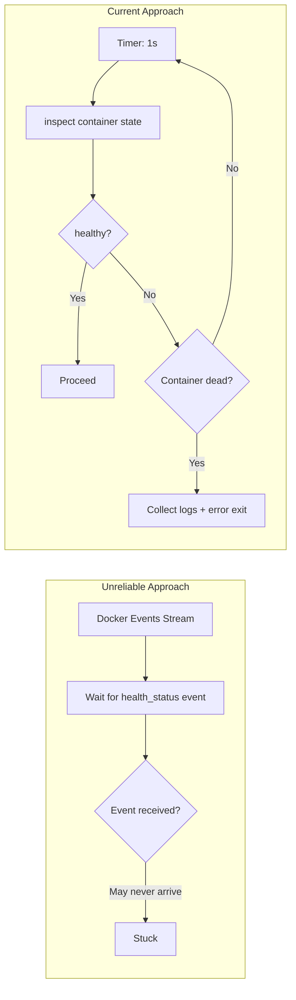

# PostgreSQL Health Check Strategy

## Overview

The CLI wrapper must ensure PostgreSQL is ready before starting the application container. This document defines the design decisions behind the passive polling health check strategy — rejecting Docker events (unreliable) and fixed timeouts (inflexible).

## Why Not Docker Events



In Docker events streams, the `container` filter is unreliable for `health_status` events — especially after a PG container restart. In practice, events may never fire, causing the CLI to wait indefinitely.

## Polling Strategy

```text
while true:
    sleep 1s
    state = docker.inspect_container(PG)
    if state.health.status == HEALTHY:
        break
    if !state.running:
        bail!(collect_logs(PG))
```

| Parameter | Value | Rationale |
| --- | --- | --- |
| Polling interval | 1s | Responsive enough, no inspect overhead |
| Timeout | None | No hard timeout; PG may have cold start |
| Death detection | Every poll | Container absent → immediately error and dump last 50 lines of logs |

## PostgreSQL Container Health Configuration

```rust
HealthConfig {
    test:        ["CMD-SHELL", "pg_isready -U shittim_chest"],
    interval:    5_000_000_000,   // 5s (nanoseconds)
    timeout:     5_000_000_000,   // 5s
    retries:     10,
    start_period: 30_000_000_000, // 30s initial grace period
}
```

| Parameter | Value | Rationale |
| --- | --- | --- |
| `pg_isready` | User-level | More reliable than TCP port detection; ensures PG is fully accepting connections |
| `interval: 5s` | Moderate | Avoids frequent retries and log noise |
| `retries: 10` | High | Migration and initdb may be time-consuming; ample retries |
| `start_period: 30s` | Long | pg18 initdb first startup can be slow |

## Data Volume Mount Path

```rust
Mount {
    target: "/var/lib/postgresql",     // pg18 new path
    source: "shittim-chest-pgdata",
    typ: MountTypeEnum::VOLUME,
}
```

pg18 changed the data directory from `/var/lib/postgresql/data` to `/var/lib/postgresql`. Using the wrong path causes PG to fail to find data after startup.

## Migration Retries

Database migrations have an independent 5-retry logic:

```text
for retry in 0..5:
    execute docker run --rm ... shittim_chest db-migrate
    if success: break
    sleep 2s
```

Even after `wait_healthy` returns, migrations may fail because PG is still finishing recovery. Short retries handle this critical window.

## Log Collection

When a container crashes, the last 50 lines of logs are automatically collected:

```rust
async fn collect_logs(docker: &Docker, name: &str) -> String {
    docker.logs(name, LogsOptions { tail: "50", stdout: true, stderr: true, .. })
}
```

This is crucial for debugging PG startup failures — initdb errors, permission issues, port conflicts, etc. are only visible in container logs.
