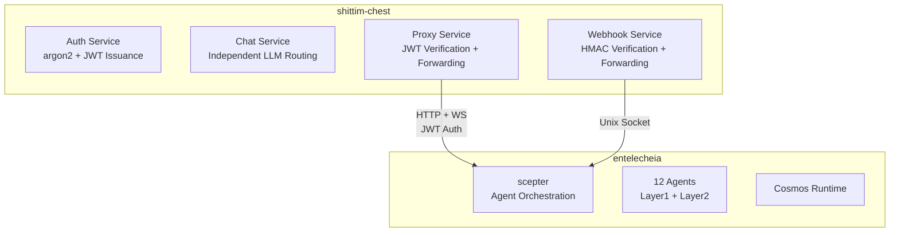

# Loose Coupling with entelecheia

## Overview

The integration between shittim-chest and entelecheia is based on a JWT-authenticated HTTP/WebSocket proxy bridge. This design allows shittim-chest to run completely independently without entelecheia, while enabling Agent orchestration capabilities on demand when needed.

## Boundary Design



## Data Ownership

| shittim_chest_db | entelecheia_db |
| --- | --- |
| auth_users (password hashes) | user_identities (user_id) |
| sessions (active sessions) | groups |
| refresh_tokens | group_memberships |
| oauth_connections | role_assignments |
| api_keys (encrypted Provider Keys) | group_permissions (Provider quotas) |
| conversations | agent_configs |
| messages | cosmos_state |
| llm_providers (Provider configs) | iepl_state |
| remote_devices (device records) | |
| device_sessions | |
| channel_configs | |
| webhook_logs (delivery logs) | |

**Principle**: shittim-chest holds "user-side" data; entelecheia holds "Agent-side" data. `user_id` is the linkage key between the two sides.

## JWT Authentication Protocol

### Key Sharing

shittim-chest and scepter share the JWT signing key via the same `JWT_SECRET` environment variable. Both sides can independently verify JWTs issued by the other.

### Token Structure

```json
{
  "sub": "user-uuid",
  "groups": ["admin", "developer"],
  "exp": 1710000000,
  "iat": 1709996400
}
```

| Field | Description |
| --- | --- |
| `sub` | User UUID (shared across both databases) |
| `groups` | List of groups the user belongs to |
| `exp` | Expiration time (default 1 hour) |
| `iat` | Issued-at time |

### Login Flow

```text
User → shittim_chest: POST /api/auth/login
shittim_chest: Verify argon2 password
shittim_chest → scepter: GET /api/user/{id}/permissions
scepter → entelecheia_db: Query groups and permissions
scepter → shittim_chest: { groups, permissions }
shittim_chest: Issue JWT (access + refresh)
shittim_chest → User: tokens
```

## Proxy Bridging

### HTTP Proxy

```text
Browser → shittim_chest:80/api/proxy/chat (JWT in Header)
shittim_chest: Verify JWT
shittim_chest → scepter:8424/api/chat (Forward JWT)
scepter → Agent → LLM → scepter → shittim_chest → Browser
```

### WebSocket Proxy

```text
Browser → shittim_chest:80/api/proxy/ws (JWT in Header)
shittim_chest: Verify JWT
shittim_chest ↔ scepter:8424/ws (Bidirectional forwarding + JWT)
Browser ↔ scepter: Full-duplex Agent interaction
```

### Rate Limiting & Monitoring

At the proxy layer, shittim-chest is responsible for:

- Rate limiting (per-user / per-IP)
- Usage logging
- Connection lifecycle management
- Reconnection on abnormal disconnects

## Webhook Pipeline

```text
GitHub/GitLab/Gitee → POST /api/webhook/{source} → HMAC verification → Parse event → Unix socket → scepter
```

shittim-chest handles HMAC verification and event parsing; scepter triggers Agent actions based on events (e.g., automated code review).

## Standalone Operation Mode

When the scepter URL is not configured in environment variables or `SHITTIM_CHEST_SCEPTER_PROXY` is set to `disabled`:

- `/api/proxy/*` endpoints return 503 (Service Unavailable)
- `/api/devices/*` endpoints return 503
- Chat fully uses the built-in LlmRouter
- All other features (auth, chat, Provider management, webhook ingress) function normally

This allows shittim-chest to be deployed as a complete standalone LLM WebUI without entelecheia.
