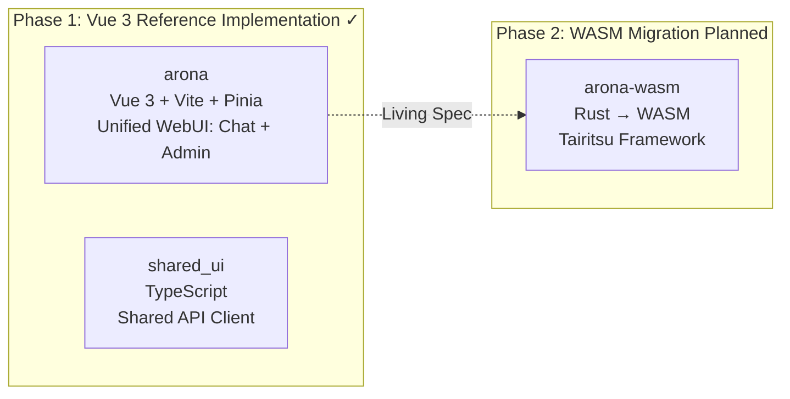
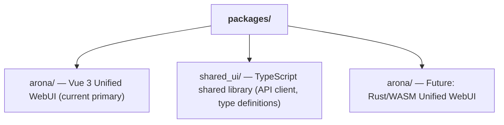

# Dual Frontend WASM Migration Strategy

## Overview

shittim-chest employs a "Vue 3 first, WASM later" two-phase frontend strategy. The Vue 3 version is delivered first as a production-grade reference implementation, with the Rust/WASM version migrating when conditions are mature. During the period when both versions run in parallel, identical user interactions must produce identical results.

## Phase Breakdown



## Technology Stack Comparison

| Dimension | Phase 1 (Vue 3) | Phase 2 (WASM) |
| --- | --- | --- |
| Language | TypeScript / Vue 3 SFC | Rust |
| Framework | Vite + Pinia + Vue Router | Tairitsu (self-developed) |
| Build artifact | JS/CSS bundle | WASM binary |
| Bundle size | Larger | Significantly smaller |
| Runtime performance | Good | Excellent (near-native speed) |
| Developer experience | Instant HMR | Compilation wait |
| Ecosystem maturity | Mature | Early stage |

## The "Living Specification" Principle

The Vue 3 version is not merely a temporary implementation; it serves as the **executable specification** for WASM migration:

1. **Feature completeness**: Every feature in the WASM version must behave identically to the Vue 3 version
1. **API contract**: Both versions use the same REST API and WebSocket protocol
1. **Visual consistency**: Both versions render the same UI in identical states
1. **Progressive replacement**: arona's chat and admin features can be migrated to WASM independently

## WASM Migration Decision Thresholds

Migration to WASM will not start before conditions are mature. Decision thresholds:

| Condition | Description |
| --- | --- |
| Tairitsu framework maturity | Component library, routing, state management, i18n, and other infrastructure must be complete |
| WASM ecosystem coverage | `web-sys` / `wasm-bindgen` must support the required Web APIs |
| Development bandwidth | Sufficient personnel to maintain both versions while advancing migration |
| Performance requirements | Vue 3 version encounters performance bottlenecks in real-world scenarios |

## Frontend Package Structure



`shared_ui/` contains shared frontend code:

- API client (auth, chat, Provider management, etc.)
- Auth utilities (JWT storage, refresh, interceptors)
- Type definitions (domain enums, request/response types)

## Frontend Development Commands

```bash
just build-frontend  # Build both frontends (pnpm build:all)
dev.py               # Watch + auto-rebuild on file changes
```

In Dev mode, `dev.py` watches source files and runs `pnpm build` on changes. The backend serves both static assets and API endpoints on the same port — no separate dev server or proxy needed.

## Design Principles

1. **Vue 3 delivers features first**: Do not wait for WASM. Users can use a fully-featured chat and admin interface today.
1. **WASM is enhancement, not replacement**: Migration does not affect existing users — both versions use the same backend API.
1. **Framework-agnostic backend**: The `shittim_chest` backend is unaware of the frontend implementation. Any HTTP/WS client can integrate.
1. **Tairitsu is a dependency, not an internal development**: The start of WASM migration depends on the maturity of the external Tairitsu framework.
