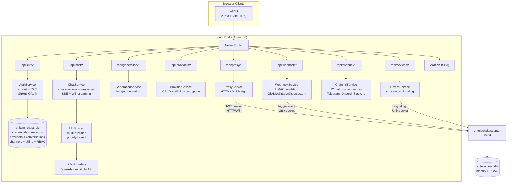
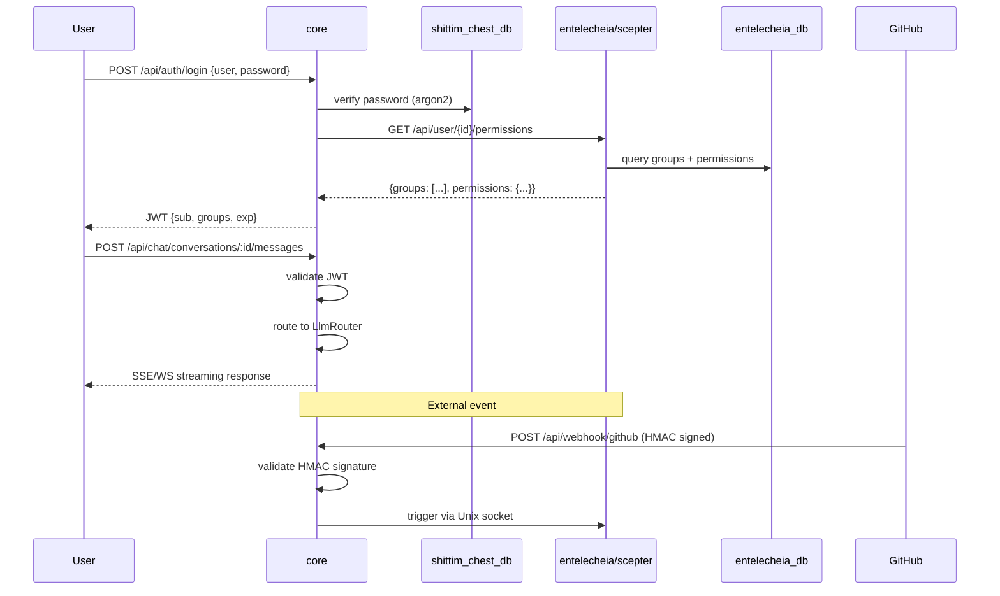

# Architecture

> **Version**: 0.1.0 — Active development.
> **Last verified**: 2026-06-14
> This project is the user-facing shell for [entelecheia](https://github.com/celestia-island/entelecheia).

## Scope

shittim-chest is a hybrid Cargo + pnpm monorepo. It owns the user-facing layer that wraps entelecheia's agent orchestration core. The two projects communicate via JWT-authenticated HTTP/WebSocket — shittim-chest never directly accesses entelecheia's database for agent operations.

| Component | Tech | Role | Status |
| --- | --- | --- | --- |
| **core** | Rust + Axum | Unified backend: auth (JWT + OAuth), independent LLM routing, chat API, image gen, webhook ingress, scepter proxy, remote device signaling, channel integrations, billing, RBAC, workspaces | 🟢 Implemented |
| **cli** | Rust | Docker orchestrator: dev, up, down, migrate, logs, status | 🟢 Implemented |
| **webui** | Vue 3 + Vite (TSX) | Frontend: chat surface, admin panel (20+ views), 2D SCADA topology, 3D holographic preview | 🟡 Partial |
| **Protocol types** | Rust (`arona` crate) + ts-rs | JSON-RPC 2.0 protocol types provided by external `arona` git crate; TS bindings consumed by webui | 🟢 Implemented |
| **IDE plugins** | TS + Kotlin + Rust + Lua | VS Code, IntelliJ, Zed, Neovim, LSP bridge | 🟡 Functional |
| **Tauri apps** | Rust + Tauri | Desktop, mobile, shared DTOs | 🟡 Functional |
| **harmony** | ArkTS | HarmonyOS app | 🟡 Functional |

## Architecture Diagram

### core Backend Detail



### Cross-Project Communication



## Backend Modules

All modules live under `packages/core/src/`. The backend is ~34K lines across 135 Rust files (138 including test files).

### Auth (`packages/core/src/auth/`)

Fully implemented:

- Username/password registration and login with argon2 hashing
- JWT access + refresh token system with rotation
- GitHub OAuth 2.0 integration (redirect + callback, auto-creates users)
- Session management (CRUD on `sessions` table)
- Token verification middleware used across all routes

### Chat (`packages/core/src/chat/`)

Fully implemented:

- Conversation CRUD (create, list, get, update, delete)
- Message send/receive with LLM routing
- SSE (Server-Sent Events) streaming responses (`/api/chat/stream`)
- WebSocket streaming (`/ws/chat/stream`)
- Message search (`/api/chat/search?q=`) with ILIKE
- Conversation export (`/api/chat/conversations/:id/export?format=json|md`)

### LLM (`packages/core/src/llm/`)

Fully implemented:

- OpenAI-compatible HTTP client for chat and image generation
- Multi-provider router with priority-based selection
- Provider CRUD with API key encryption (AES-256-GCM)
- Model listing and provider testing endpoints
- Request timeout and streaming buffer config

### Generation (`packages/core/src/generation/`)

Fully implemented:

- Image generation endpoints (`/api/generation/images`, `/api/generation/models`)
- Uses configured LLM providers

### Webhook (`packages/core/src/webhook.rs`)

Fully implemented (~1,000+ lines):

- GitHub webhook with HMAC-SHA256 validation
- GitLab webhook with token validation
- Gitee webhook with HMAC + token fallback
- Custom webhook endpoint (`/api/webhook/custom/{name}`)
- Duplicate delivery detection (LRU cache, up to 10,000 IDs)
- Delivery log with listing API
- IP whitelist system for webhook sources (separate `webhook_ip_whitelist.rs`)
- Trigger forwarding to scepter via Unix socket

### Devices (`packages/core/src/devices/`)

Signaling relay implemented (requires external scepter for WebRTC handshake):

- REST endpoints for device listing, detail, session CRUD
- WebSocket signaling relay for WebRTC — forwards SDP offers/ICE candidates to scepter via Unix socket; the SDP answer must come from scepter (`forward_sdp_to_scepter` returns empty string if scepter is unreachable)
- Terminal relay (via WebSocket to xterm.js) — forwards keystrokes to scepter
- Desktop frame relay
- SFTP file browser backend
- Configurable: max sessions per user, frame buffer size, ICE servers
- Device model management (`device_models/` module)

> **Gap:** The relay is real but cannot complete a WebRTC handshake without a running scepter instance. When scepter is down, SDP answers are empty and WebRTC fails gracefully.

### Channels (`packages/core/src/channel/`)

Fully implemented (22 module files + `mod.rs`):

- 12 platform connectors: Telegram, Discord, Slack, Lark/Feishu, QQ Bot, WeCom, IRC, Matrix, Mattermost, Google Chat, Microsoft Teams, LINE
- Per-platform real API client implementations
- DM policy controls (`dm_policy.rs`)
- Rate limiting (`rate_limit.rs`)
- Health checking (`health_check.rs`)
- Channel pairing (`pairing.rs`)
- Plugin system (`plugin.rs`)
- Encrypted credential storage (`crypto.rs`)
- Central registry (`registry.rs`) and routes (`routes.rs`)

### Additional Backend Modules

| Module | Description |
| --- | --- |
| `proxy/` | Scepter HTTP/WS bridge (`ws_bridge.rs` is the largest single file in the codebase) |
| `rbac/` | Role-based access control |
| `workspace/` | Workspace management |
| `oauth.rs` | OAuth provider integration |
| `billing.rs` | Stripe payment integration (webhook HMAC verification, checkout/subscription events, quota enforcement, payment dedup) |
| `container/` | Docker container management |
| `cruise/` | Cruise (automated workflow) support |
| `audio/` | Audio/voice service support |
| `skills.rs` | **Stub** — returns empty array; no database backing or scepter integration yet |
| `tools.rs` | **Stub** — returns empty array; no database backing or scepter integration yet |
| `system_settings.rs` | System configuration |
| `trigger_forward.rs` | Event trigger forwarding |
| `quota_guard.rs` / `resource_quotas.rs` | Resource quota enforcement |
| `avatar_platforms.rs` | Avatar platform integration |

### Database

PostgreSQL via SeaORM 1.x with **5 migrations** and **25 entity models**:

`auth_users`, `avatar_platforms`, `channel_configs`, `channel_messages`, `channel_pairings`, `channel_plugins`, `conversations`, `cruise_history`, `device_models`, `device_sessions`, `llm_providers`, `messages`, `oauth_connections`, `payment_events`, `projects`, `rbac_grants`, `rbac_groups`, `rbac_user_groups`, `remote_devices`, `scene_configs`, `sessions`, `system_settings`, `webhook_deliveries`, `workspace_alias_registry`, `workspace_sessions`

## Frontend

### webui (`packages/webui/`)

Vue 3 + Vite frontend written in TSX (via `@vitejs/plugin-vue-jsx` — no `.vue` SFC files). npm package: `@celestia-island/webui`. ~31K lines.

#### Views

| View group | Description |
| --- | --- |
| `demiurge/` | Main chat surface (DemiurgeView) — streaming responses, agent status, tool calls |
| `auth/` | LoginView, RegisterView, SetupView |
| `admin/` | 20+ admin views: Dashboard, Providers, Agents, RBAC, Webhooks, Channels, System, Device Models, Devices Settings, Skills, MCP Tools, OAuth Providers, Token Usage, Workspaces, Voice Service, Resource Quota, etc. |
| `topology/` | 2D SCADA topology: TopologyOverview, TopologyBoxDetail, TopologyDeviceDetail. Transport is real (WS JSON-RPC forwarded to scepter); **without scepter, TopologyOverview falls back to hardcoded `SIMULATED_DEVICES` (19 demo devices) and Chinese telemetry chips; TopologyBoxDetail shows empty state** |
| `holographic/` | 3D holographic preview: HolographicOverview, HolographicBoxZoom, HolographicModelDetail. **3D model loading is real** (loads actual GLB files, projects, scene configs from local backend); telemetry parameter chips require scepter, fall back to empty on failure |

#### Component system

| Directory | Description |
| --- | --- |
| `base/` | 50+ `S`-prefixed design-system components (SButton, SCard, SModal, STable, STabs, STimeline, STreeView, SMarkdownRenderer, SMorphingTabs, etc.) |
| `chat/` | Chat-specific components (ChatBubble, AgentStatusBar, FloatingChatBar, ThinkingDots, ReportViewer, NodeMinimap, etc.) |
| `header/` | Header components (breadcrumb bar, mode switch) |
| `layout/` | App shell (SAppShell, SSidebar, SDrawer, SWallpaperRenderer, etc.) |
| `preview/` | SCADA symbol library, topology, holographic components |
| `cruise/` | Cruise workflow components |
| `panels/`, `popups/`, `shared/` | Supporting UI |

#### Animation system

All CSS-driven motion and per-frame sampling in the webui runs through **one shared rAF loop** owned by `packages/webui/src/theme/animationBus.ts` — the "animation context" every dialog, modal, popup, drawer, toast, and list transition is expected to register with. The bus is a process-level singleton; it self-shuts-down when idle and only spins while there is in-flight work, so an idle tab is not burning frames.

The bus exposes four work-registration APIs plus two side-channel flags:

| API | Purpose | Frame model |
| --- | --- | --- |
| `onFrame(cb, priority?)` | Register a per-frame callback. `priority` ∈ `sync` / `normal` / `idle`. Returns `{ disconnect() }`. | Invoked every frame (sync), throttled to ~30 Hz budget (normal), or ~0.5 Hz budget (idle). |
| `onceFrame(cb)` | Run a callback on the next frame, then auto-disconnect. Fire-and-forget (no cancellation handle). | One-shot. |
| `scheduleFrame(cb)` | Run a callback on the next frame; returns `{ disconnect() }` to cancel before it fires. For the "coalesce many calls into one post-frame callback" throttle pattern (replaces the hand-rolled `if(rafId)cancel; rafId=rAF(cb)` idiom). | One-shot (cancellable). |
| `reportTransition(durationMs)` | **Declarative**: declare "a CSS transition of duration N is in flight" without a per-frame callback. The bus just keeps its loop alive for the window so observers sampling `onFrame` don't get suspended mid-transition. | Zero per-frame cost; state-only. |
| `notifyScrollStart()` | During a 150 ms scroll window, suppress `normal`-priority callbacks (saves power; sync and idle are unaffected). | Side-channel flag. |
| `setReducedMotion(flag)` | Honours the user's `prefers-reduced-motion` / `html.reduce-motion` class — halts the **animation** loop while set. One-shots (`onceFrame` / `scheduleFrame`) are utility work (measurements, flushes), not animation, so they keep draining on a separate drainer rAF and never pause. | Side-channel flag. |

The composable layer over the bus is `packages/webui/src/composables/useReportedTransition.ts`. **This is the preferred surface** for any component that runs a CSS `transition` / `animation` using the shared `--duration-*` tokens. It auto-cancels on component unmount and coalesces rapid toggles. The bus tracks the timeline; CSS does the visual work; the two stay in sync via the shared tokens.

```ts
// single-transition component (dialog opens OR closes — mutually exclusive)
const anim = useReportedTransition(300);
function onBeforeEnter() { anim.run(); }
function onAfterEnter()  { anim.cancel(); }

// overlapping transitions (e.g. a TransitionGroup whose items enter AND leave
// at the same time) — split by track so a leave's run() can't cancel an
// in-flight enter's report:
const anim = useReportedTransition(300);
const enter = anim.track("enter");
const leave = anim.track("leave");
//   onBeforeEnter={enter.run} onAfterEnter={enter.cancel}
//   onBeforeLeave={leave.run} onAfterLeave={leave.cancel}
```

The DOM bus is intentionally separate from **`packages/webui/src/composables/three/animationBus3D.ts`**, which owns its own rAF loop for the three.js render pipeline. 3D frame timing must never affect DOM transition scheduling and vice versa; the two can be paused or debugged independently. Both expose the same `onFrame → { disconnect }` shape.

**Motion tokens** (`packages/webui/src/theme/theme.scss`) are the single source of truth for duration/easing: `--duration-instant/short/normal/long` for movement, `--duration-fade` for opacity/color fades, and `--ease-spring/out-expo/in-expo/standard` for curves. `prefers-reduced-motion` / `html.reduce-motion` collapses the movement tokens to `0s` but **deliberately keeps `--duration-fade` non-zero** — suppressing vestibular-triggering *movement*, not state-change opacity, is the accessibility-correct behaviour. Always use `reportTransition(--duration-*)` so a CSS transition's bus timeline matches its visual timeline.

**Coverage**: every 2D-DOM rAF deferral in the webui now goes through the bus — `onFrame` / `reportTransition` for continuous animation, `onceFrame` / `scheduleFrame` for one-shot utility deferrals (measurements, throttled recomputes, batched flushes). The only remaining raw `requestAnimationFrame` call sites are the 3D pipeline (`composables/three/*`, which has its own `animationBus3D.ts`) and the bus's own internal loop scheduling; both are intentional. New work should never call `requestAnimationFrame` directly — pick the appropriate bus API.

#### Import paths

The webui consumes its own `src/` through **two deliberately distinct path aliases** (both declared in `vite.config.ts` + `tsconfig.json`), and the whole codebase obeys the split:

| Alias | Resolves to | Use it for |
| --- | --- | --- |
| `@/<path>` | `src/*` | **Internal deep imports** — reaching a specific module directly (`@/api/client`, `@/composables/useReportedTransition`, `@/theme/animationBus`). ~600 sites; never used as a bare barrel. |
| `@celestia-island/shared_ui` | `src/` (→ `src/index.ts` barrel) | **The curated public API surface only** — always the bare specifier, never a code subpath. ~92 sites. |

The split enforces a public/private boundary (like a package `exports` map): the barrel (`src/index.ts`) is the only thing importable "as a package", while `@/` lets internal code reach implementation modules. Treat the barrel as the contract — add to `src/index.ts` when something is meant to be public. Shared design-system assets (`theme/*.scss`, `res/*`) are also reachable under the `shared_ui` namespace. The legacy `@shared_ui` alias is a duplicate of `@celestia-island/shared_ui` still referenced by a few SCSS `@use` statements; new code should use `@celestia-island/shared_ui`.

### Protocol Types (`arona` crate)

JSON-RPC 2.0 protocol types and shared enums are provided by the external [`arona`](https://github.com/celestia-island/arona) Rust crate, declared as a git dependency in `Cargo.toml`. The crate derives `ts-rs` bindings that are generated into `packages/webui/src/types/arona/` and consumed by the webui via the `@celestia-island/arona` path alias.

### Admin Panel

Admin views live inside the webui under the `admin/` route group: Dashboard, Providers (CRUD + add-provider wizard), Agents, Agent Detail, RBAC (groups + grants), Webhooks, Channels, System, Device Models, Devices Settings, Skills, MCP Tools, OAuth Providers, Token Usage, Workspaces, Voice Service, Resource Quota.

### i18n

The webui uses **`vue-i18n`** (not a custom implementation) with **11 declared locales**: Arabic (`ar`), German (`de`), English (`en`), Spanish (`es`), French (`fr`), Japanese (`ja`), Korean (`ko`), Portuguese (`pt`), Russian (`ru`), Simplified Chinese (`zhs`), Traditional Chinese (`zht`).

Each locale has **17 namespace JSON files** (admin, auth, chat, cmd, common, devices, errors, footer, help, logs, models, reports, skills, timeline, tokenUsage, tools, workspace). In-app locale switching is available via the header locale picker.

> **Translation completeness varies significantly** (audited against 950 English reference keys):
> | Tier | Locales | English passthrough | Key gap |
> |------|---------|-------------------|---------|
> | Well translated | `ja`, `ko`, `zhs`, `zht` | ~5% | `zhs` missing 18 keys; others missing 112 |
> | Mostly translated | `de`, `fr`, `pt`, `es`, `ar` | ~9–14% | Missing shared 112-key block |
> | Effectively untranslated | `ru` | **~76%** | Full key parity, but values are verbatim English |
> The shared 112-key gap covers newer features: `admin.agents.*`, `admin.deviceModels.*`, `admin.projects.*`, `admin.rbac.*`, `admin.resourceQuota.*`, `auth.protocol.*`, `chat.cruise.*`, `chat.voice_*`.

## RBAC Architecture

### Data Split

Data ownership is split between the two projects to maintain clean boundaries:

| Data | Database | Owner | Rationale |
| --- | --- | --- | --- |
| User credentials (password hash, OAuth, API keys) | shittim_chest_db | shittim-chest | Presentation layer owns login flow |
| Active sessions, refresh tokens | shittim_chest_db | shittim-chest | Session management is frontend concern |
| Conversations, messages | shittim_chest_db | shittim-chest | Chat data is user-facing |
| LLM provider configs | shittim_chest_db | shittim-chest | Provider management is user-facing |
| Channel configs, billing, workspaces | shittim_chest_db | shittim-chest | User-facing operational data |
| User identity, groups, role assignments | entelecheia_db | entelecheia | Orchestration core enforces permissions |
| GroupPermissions (provider quotas, agent whitelists) | entelecheia_db | entelecheia | Agent-level policy lives with agents |

### Auth Flow

1. User authenticates through core (password / OAuth)
1. core validates credentials against `shittim_chest_db` (argon2 for passwords)
1. core queries entelecheia for user's group permissions (or reads from TTL cache)
1. core issues JWT with `{ sub: user_id, groups: [...] }`
1. All subsequent requests carry JWT → core validates → forwards to scepter for proxy routes
1. scepter validates JWT (shared secret via env var) and enforces group-level permissions

## Cross-Project Dependencies

### Rust crates

shittim-chest depends on two external crates from the celestia-island ecosystem:

```toml
# External protocol crate — shared between shittim-chest and entelecheia
arona = { git = "https://github.com/celestia-island/arona.git", branch = "dev" }

# Versioned JSON serialization (migrate-on-read for JSON/JSONB columns)
hifumi = { path = "../hifumi/packages/types" }
```

The `arona` crate provides JSON-RPC protocol types and shared enums used by both projects. The `hifumi` crate provides versioned JSON serialization for database columns.

### npm packages

The webui consumes the `arona` crate's TS bindings through the `@celestia-island/arona` path alias, which points at `packages/webui/src/types/arona/` (where `ts-rs` output lands). The webui's `@celestia-island/shared_ui` is a self-alias to `packages/webui/src/` used for internal imports.

## Current Gaps

> **This section documents known limitations and incomplete areas.**

### Scepter-Dependent Features

The following features have real implementations in shittim-chest but require a running [entelecheia/scepter](https://github.com/celestia-island/entelecheia) instance for full functionality:

| Feature | What works | What needs scepter |
| --- | --- | --- |
| Topology SCADA | WS transport, SVG rendering, breadcrumb navigation | Live telemetry data (`topology.*` RPCs forwarded to scepter) |
| Holographic 3D | GLB model loading, scene config, camera control | Telemetry parameter chips |
| Device WebRTC | Signaling relay, JWT auth, ICE forwarding | SDP answer generation |
| Cruise dashboard | Component rendering, WS subscription | Live agent streaming data |
| Scepter proxy | HTTP/WS bridge (`ws_bridge.rs`, 2K lines) | All proxied agent operations |

Without scepter, topology falls back to `SIMULATED_DEVICES` (hardcoded demo data); holographic chips and device WebRTC show empty/failure states.

### i18n Gaps

See the [i18n section](#i18n) above for the full audit. Summary: `ru` is structurally complete but ~76% English passthrough; 8 locales share a 112-key gap from newer features.

### Test Coverage

The backend has integration tests for auth, chat, webhook HMAC validation, billing (8 Stripe signature tests), and workspace APIs. The frontend has unit tests for composables (`useToast`, `useConfirm`, `useSolarTime`, `useAsyncData`) and utilities (validation, uuid, errors).

**Untested areas:** Most CRUD admin routes, channel connector API calls (all 12 connector files have zero tests; only `crypto.rs` and `rate_limit.rs` are tested), device signaling relay, audio module (940 lines, zero tests), topology/holographic pages, IDE plugin runtimes, Tauri/HarmonyOS app flows. Coverage is thin relative to ~65K lines of code.

### Backend Stubs

The `skills.rs` and `tools.rs` REST endpoints remain fallback-only stubs (return `[]`), but the **primary WS path is fully wired** through the generalized notification-response bridge in `ws_bridge.rs`. The bridge translates webui request-response methods to scepter's notification-style paired actions:

| WS method | Scepter pair | Status |
| --- | --- | --- |
| `skills.list` | `Skill.ListSkills` → `SkillsListResponse` | ✅ Bridged (field mapper) |
| `tools.list` | `Mcp.ListTools` → `ToolsListResponse` | ✅ Bridged (field mapper) |
| `layer2.agents.list` | `Tui.Layer2AgentList` → Response | ✅ Bridged (identity) |
| `layer2.tools.list` | `Tui.Layer2AgentMcpTools` → Response | ✅ Bridged (per-agent correlation) |
| `layer2.skills.list` | `Tui.Layer2AgentSkills` → Response | ✅ Bridged (per-agent correlation) |

To add a new bridged method, append an entry to `NOTIFICATION_BRIDGES` in `ws_bridge.rs` — no new handler functions needed. The REST endpoints (`skills.rs`, `tools.rs`) are only hit as HTTP fallback when WS is unavailable.

`chat.stop` now forwards `request.cancel` to scepter (aborts the running skill chain via `cancel_active_request()`), not just clearing the client-side stream display.

### Mock Mode

The backend has a `SHITTIM_CHEST_MOCK_MODE` env flag (`config.rs`) that skips JWT validation and HMAC checks for development. This is a **security bypass**, not a data simulation layer — it emits loud warnings and should never be used in production.

## Licensing

| Parameter | Value |
| --- | --- |
| Commercial license | Business Source License 1.1 (BUSL-1.1) |
| Non-commercial use | Synthetic Source License 1.0 (SySL-1.0) |
| Additional Use Grant | Internal production, academic, government, and non-commercial use allowed |
| Restriction | Third-party hosted/managed/resale services require a commercial license |
