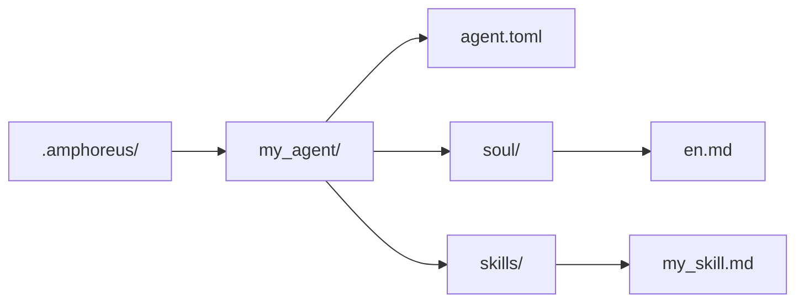

# Agent Development Guide

> Agent development instructions based on the current reality of this repository

## Overview

There are three practically usable extension tiers in the current repository.

| Tier | Current meaning |
| --- | --- |
| Layer1 | Core agents implemented as Rust crates and compiled into the workspace |
| Layer2 | Web Automation, the active built-in domain agent, plus some archived or planning materials |
| Layer3 | User-defined agents (planned, not yet implemented) |

Do not assume that every Layer2 scheme appearing in historical documentation is still an active built-in agent.

## Layer3 is the simplest extension path

> **Note**: Layer3 is currently only in the design phase. The `.amphoreus/` directory, the agent loader (`Layer3Workspace`), and the configuration framework have not been implemented yet. This section describes the target design for future use.

If you want to extend Entelecheia without modifying the Rust workspace, prefer Layer3 (once implemented).

### Minimal structure

### What Layer3 currently provides

- Prompt-based soul files
- Prompt-based skills
- Reuse of existing platform tools
- Pre-check scanning at load time

### What Layer3 cannot automatically provide

- New Rust MCP backends
- Complete sandbox guarantees
- Production-ready out of the box for every skill/tool path

## Built-in agent development

Built-in agents are Rust crates located under `packages/agents/<agent>/`.

Common components include:

- `src/lib.rs`
- `src/state.rs`
- `src/skills.rs`
- `src/mcp/registry.rs`
- `src/mcp/tools/*.rs`

You also need to maintain the corresponding documentation under `res/prompts/agents/<agent>/`.

## Current recommendations for Layer2

The repository historically contained a large amount of Layer2 domain agent design. It should currently be understood as follows:

- The active built-in Layer2 crate in the current workspace is Web Automation
- Much of the old Layer2 documentation describes design goals or archived material
- New built-in Layer2 development should be treated as real product development, not something that can be "enabled" merely by restoring documentation

## Current security notes

- Pre-check scanning exists, but is still keyword-based rule scanning.
- Whether a tool is usable depends on the real implementation behind the corresponding MCP tool.
- Some tools and skills mentioned in the documentation may still be partially implemented or stubs.

## Reference paths

- `packages/shared/custom_agent/src/`
- `packages/agents/hubris/`
- `packages/agents/kalos/`
- `packages/agents/aporia/`
- `res/prompts/agents/`

## Testing recommendations

It is currently more advisable to verify directly:

- Layer3 parsing and loading
- Skill parsing
- Direct testing of MCP tools in Rust
- The specific agent/tool path you actually modified

Do not treat the old architecture copy as evidence that "a certain Layer2 path is already active".
