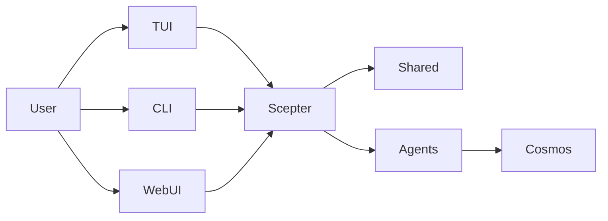

+++
title = "Architecture"
description = """> Based on the current runtime structure, not the target-state imagination"""
lang = "en"
category = "guides"
subcategory = "core"
+++

# Architecture

> Based on the current runtime structure, not the target-state imagination

## Runtime overview

The core of the current platform is `packages/scepter`, `packages/shared`, and `packages/tui`.

## Currently the most mature parts

- Scepter server-side orchestration
- Configuration, tool names, prompts, and state types in Shared
- The TUI user path
- The container-based execution path

## Currently only partially implemented parts

- CLI command coverage
- Advanced memory / RAG integration
- Most domain-specific Layer2 schemes

## Current active agent structure

### Layer1

The workspace currently compiles 12 Layer1 agents, covering capabilities related to message routing, planning, files, containers, scripts, knowledge, search, scheduling, security, memory, and devices.

### Layer2

The current workspace has two active built-in Layer2 crates: **Web Automation** (browser automation) and **Classical Software Engineering** (static analysis, code review, quality metrics, refactoring, LSP diagnostics/symbols/refactoring). The 11 specialized agents listed in old documentation describe content beyond these two that has been archived or planned.

### Layer3

Layer3 is still a custom agent extension point based on `.amphoreus/` (design phase, not yet implemented).

## Execution model

### Model-visible tools

The model typically only sees:

- `exec`
- `write_to_var`
- `write_to_var_json`

Internal MCP tools are invoked indirectly through the runtime.

### In-process and container paths

Some logic executes within the Scepter process, while other work is done through containerized paths and runtime helper modules.

### WebUI / IDE / Tauri

The Web UI (arona), the management panel (malkuth), the IDE plugins, and the Tauri apps have been migrated to the sister project **shittim-chest** and removed from this repository. The preferred interface for this repository is the **TUI**; the Web/IDE layer lives in shittim-chest and communicates with Scepter via JWT + WebSocket/HTTP.

## Memory and knowledge capabilities

RAG and memory are more mature than described in the old overview, but some integration glue still needs to be filled in:

- Three embedding backends have been implemented: API (OpenAI compatible), local ONNX inference (`FastEmbeddingService`, default BGE-M3), and a SHA-256 hash fallback
- Both in-memory vector documents and **PgVector** storage (HNSW index) are usable
- Graph traversal and hybrid retrieval (RRF fusion) are usable
- The embedding→RAG auto-wiring and RAG subscription synchronization still need to be integrated
