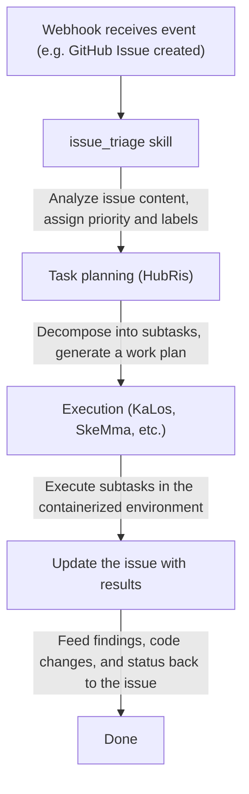

+++
title = "Issue Tracking Integration"
description = """> Connect external issue tracking systems to Entelecheia's agent workflow"""
lang = "en"
category = "guides"
subcategory = "core"
+++

# Issue Tracking Integration

> Connect external issue tracking systems to Entelecheia's agent workflow
> Current status note: HubRis does currently provide issue create, update, search, and comment helper capabilities, and webhook integrations also exist in the repository. However, this document should not be read as "there already exists a complete, unified, cross-platform issue product surface."

---

## Table of Contents

- [Overview](#overview)
- [Container three-tier identifiers](#container-three-tier-identifiers)
- [Binding ID format](#binding-id-format)
- [How agents interact with issues](#how-agents-interact-with-issues)
- [Issue-driven workflow](#issue-driven-workflow)
- [Platform prefix registry](#platform-prefix-registry)
- [Container fork branch naming](#container-fork-branch-naming)
- [WebUI integration](#webui-integration)

---

## Overview

Entelecheia's current issue-related capabilities come from two directions:

- webhook integration can forward external events into the system
- HubRis provides issue-style CRUD helper capabilities

Cross-platform issue automation can be viewed as an existing direction and a partially implemented feature, but you should not assume by default that every workflow in this document is already fully closed-loop.

---

## Container three-tier identifiers

Containers in Entelecheia use a three-tier ID system to maintain identity across different contexts:

| Tier | Format | Lifetime | Use |
| --- | --- | --- | --- |
| UUID | Standard UUID (e.g. `550e8400-e29b-41d4-a716-446655440000`) | Permanent | Database primary key, cross-restart tracking |
| Binding ID | `@platform#id` (e.g. `@github#234`) | Stable | External resource binding, branch naming |
| Runtime ID | `#xxx` (e.g. `#616`) | Per session | TUI display, Unix socket routing |

The **Binding ID** links a container to an external platform resource. It remains stable across Scepter restarts, unlike the runtime ID which is reassigned on each start.

---

## Binding ID format

The general format of a binding ID is:

```text
@platform#id[@#floor]
```

- `platform` — the platform prefix (e.g. `github`, `gitee`, `gitlab`)
- `id` — the issue or resource number on the platform
- `@#floor` — optional floor number, used for nested references (e.g. comments)

### Examples

| Binding ID | Meaning |
| --- | --- |
| `@github#123` | GitHub Issue #123 |
| `@gitee#456` | Gitee Issue #456 |
| `@gitlab#789` | GitLab Issue #789 |
| `@github#123@#5` | The 5th comment on GitHub Issue #123 |
| `@feishu#abc123` | Feishu message topic abc123 |

Binding IDs are used for:

- Container labels and metadata
- Branch names for issue-driven development
- Agent skill parameters
- WebUI issue list filtering

---

## How agents interact with issues

Agents interact with external issues through HubRis MCP tools. These tools wrap platform-specific APIs:

### Available issue operations

| Tool | Description |
| --- | --- |
| `$.agent.HubRis.issue_create()` | Create a new issue on an external platform |
| `$.agent.HubRis.issue_update()` | Update an existing issue (title, body, state, labels) |
| `$.agent.HubRis.issue_search()` | Search issues across platforms with filters applied |
| `$.agent.HubRis.issue_comment()` | Add a comment to an existing issue |

### Usage in exec code

```typescript
$.agent.HubRis.issue_create({
  platform: "github",
  repository: "celestia-island/entelecheia",
  title: "Fix WebSocket reconnection logic",
  body: "The WebSocket client does not retry on connection loss.",
  labels: ["bug", "priority:high"]
});
```

```typescript
$.agent.HubRis.issue_search({
  platform: "github",
  repository: "celestia-island/entelecheia",
  state: "open",
  labels: ["bug"]
});
```

```typescript
$.agent.HubRis.issue_comment({
  binding_id: "@github#123",
  body: "Investigation complete. Root cause identified in src/ws/client.rs:42."
});
```

---

## Issue-driven workflow

The default issue-driven workflow follows this pipeline:



### Step-by-step example

1. A developer creates an issue `@github#42` titled "Memory leak in container cleanup"
1. The GitHub webhook forwards the event to Scepter
1. The `issue_triage` skill classifies it as a **bug** with priority **high**
1. HubRis breaks down the task: (a) reproduce the leak (b) find the root cause (c) implement the fix
1. KaLos reads the relevant source files, SkeMma runs diagnostic scripts
1. The agent commits the fix and comments the solution on `@github#42`

---

## Platform prefix registry

The platform prefix mapping is configurable. The default registry includes:

| Prefix | Platform | Issue URL pattern |
| --- | --- | --- |
| `github` | GitHub | `https://github.com/{repo}/issues/{id}` |
| `gitee` | Gitee | `https://gitee.com/{repo}/issues/{id}` |
| `gitlab` | GitLab | `https://gitlab.com/{repo}/-/issues/{id}` |
| `feishu` | Feishu / Lark | Internal message link |
| `discord` | Discord | Channel message link |
| `telegram` | Telegram | Chat message link |

### Internationalization support

Platform prefixes support internationalized names. For example, Feishu can be referenced via:

- `@feishu#123` (English name)
- `@飞书#123` (Chinese name)

The prefix registry internally normalizes these to the canonical prefix.

---

## Container fork branch naming

When an agent creates a branch for issue-driven work, the branch follows a naming convention:

### Format

```text
cosmos-<binding_id>-<reason>
```

or

```text
cosmos-<uuid8>-<reason>
```

### Examples

| Branch name | Context |
| --- | --- |
| `cosmos-@github#42-fix-memory-leak` | Fixing GitHub Issue #42 |
| `cosmos-@gitee#15-add-ci-pipeline` | Feature work for Gitee Issue #15 |
| `cosmos-a1b2c3d4-refactor-auth-module` | Internal task using a UUID prefix |

The binding ID format ensures a branch can be traced back to its originating issue.

---

## WebUI integration

The Entelecheia WebUI provides a unified view of issues across all connected platforms.

### Left sidebar — aggregated issue list

- Shows issues from all platforms in a single list
- Each entry shows: platform icon, issue number, title, state, assigned agent
- Clicking an issue opens its detail view

### Filtering

Issues can be filtered by:

- **Platform**: show only GitHub, Gitee, GitLab, etc.
- **State**: open, closed, in progress
- **Priority**: high, medium, low (derived from labels)
- **Assigned agent**: filter by the agent currently working on the issue

### Issue detail view

The detail view shows:

- The full issue title and body (rendered from Markdown)
- A platform link (opens the original issue in a browser)
- The agent activity log (skill calls, comments posted)
- Associated containers and branches

---

## Next steps

- Read [Webhook platform setup](webhook-setup.md) to connect your platform
- Browse the [architecture](architecture.md) to understand the HubRis agent design
- IDE integrations have been migrated to the sibling repository [shittim-chest](https://github.com/celestia-island/shittim-chest)
