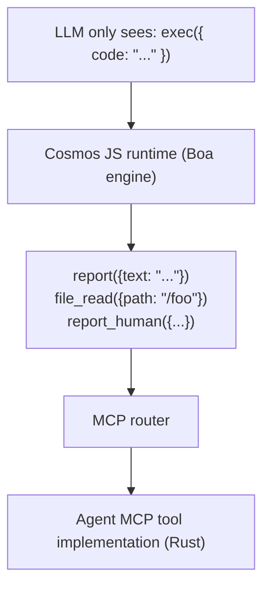
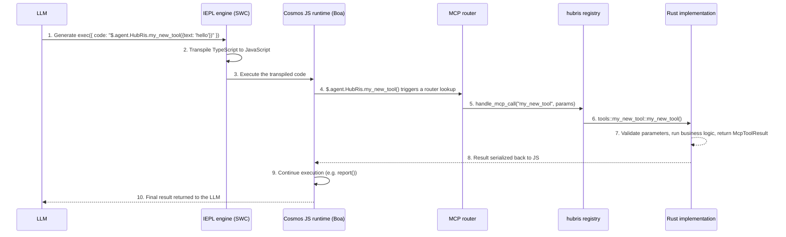

+++
title = "MCP Tool Development Guide"
description = """> How to create and register MCP tools in the Entelecheia platform"""
lang = "en"
category = "guides"
subcategory = "core"
+++

# MCP Tool Development Guide

> How to create and register MCP tools in the Entelecheia platform

---

## Table of Contents

- [Exec-Only microkernel](#exec-only-microkernel)
- [MCP tool structure](#mcp-tool-structure)
- [Adding a new MCP tool](#adding-a-new-mcp-tool)
- [Best practices](#best-practices)
- [Testing MCP tools](#testing-mcp-tools)

---

## Exec-Only microkernel

Entelecheia uses a **microkernel architecture** for tool access. The LLM only sees three tools — `exec`, `write_to_var`, `write_to_var_json` — and all actual work is done inside its TypeScript runtime (the IEPL engine).



**Core principle:** The LLM never calls MCP tools directly. It generates TypeScript code that invokes tool-function APIs via ES module imports (e.g. `import { report } from 'hubris'; report()`), and the IEPL engine transpiles it to JavaScript and dispatches it to the actual Rust implementation.

- ES module imports — the universal pattern (e.g. `import { report } from 'hubris'; report()`, `file_read()`)
- `exec`, `write_to_var`, `write_to_var_json` are the only three tools registered for all agents (see `packages/shared/domain_skills/src/tool_names.rs:265-283`)

The `related_tools` declaration in a skill's TOML frontmatter determines which ES module import APIs will be documented in the prompt sent to the LLM.

---

## MCP tool structure

An MCP tool consists of three parts:

1. **Rust implementation** — the actual logic, in `packages/agents/<agent>/src/mcp/tools/`
1. **Registry dispatch** — the routing, in `packages/agents/<agent>/src/mcp/registry.rs`
1. **Tool name constant** — a string constant, in `packages/shared/domain_skills/src/tool_names.rs`

### Tool definition in mcp/registry.rs

Each agent has a `handle_mcp_call` function that routes tool names to the corresponding implementation:

```rust
// packages/agents/kalos/src/mcp/registry.rs

use serde_json::Value;
use tracing::info;
use crate::{mcp::tools, state::KalosState};
use _shared::skills::{mcp_tools::McpToolResult, tool_names};

pub async fn handle_mcp_call(
    state: &std::sync::Arc<tokio::sync::RwLock<KalosState>>,
    tool_name: &str,
    parameters: Value,
) -> McpToolResult {
    info!("Calling Kalos MCP tool: {}", tool_name);

    match tool_name {
        tool_names::kalos::FILE_READ => tools::file_read(state, parameters).await,
        tool_names::kalos::FILE_WRITE => tools::file_write(state, parameters).await,
        tool_names::kalos::FILE_EDIT => tools::file_edit(state, parameters).await,
        // ...
        _ => McpToolResult::failure(format!("Unknown tool: {}", tool_name)),
    }
}
```

### Parameter validation with validate_required_params

For tools that have required parameters, use the shared validation helper:

```rust
use _shared::skills::mcp_tools::validate_required_params;

pub async fn my_tool(parameters: Value) -> McpToolResult {
    if let Some(failure) = validate_required_params(
        &parameters,
        &["title", "content"],  // required parameter names
        "my_tool",              // tool name for error messages
    ) {
        return failure;
    }

    let title = parameters.get("title").unwrap().as_str().unwrap();
    // ...
}
```

`validate_required_params` checks that each required parameter is present and a non-empty string. It returns `None` if all are valid, otherwise it returns `Some(McpToolResult::failure(...))` with a descriptive error message.

Reference: `packages/shared/domain_skills/src/mcp_tools.rs:12-41`.

### Return value: McpToolResult

Every tool must return an `McpToolResult`. Main constructors:

```rust
// Success returning arbitrary JSON data
McpToolResult::success(serde_json::to_value(my_struct).unwrap_or_default())

// Success returning a serializable struct
McpToolResult::success_struct(&my_result)

// Success returning plain text
McpToolResult::success_text("Operation completed".into())

// Success with LLM usage tracking
McpToolResult::success_with_usage(
    "Result text".into(),
    Some("gpt-4".into()),
    Some((prompt_tokens, completion_tokens)),
)

// Failure with an error message
McpToolResult::failure("Missing required parameter: title".into())

// Failure with multiple error lines
McpToolResult::failure_lines(vec!["Error 1".into(), "Error 2".into()])
```

Reference: `packages/shared/domain_skills/src/mcp_tools.rs:62-136`.

---

## Adding a new MCP tool

This step-by-step guide uses HubRis as an example to demonstrate how to add a new tool to an existing agent.

### Step 1: Add the tool name constant

Edit `packages/shared/domain_skills/src/tool_names.rs`:

```rust
/// HubRis tool names
pub mod hubris {
    pub const REPORT: &str = "report";
    pub const CREATE_TODO: &str = "create_todo";
    // ... existing tools ...
    pub const MY_NEW_TOOL: &str = "my_new_tool";  // add this line
}
```

### Step 2: Implement the tool

Create a new file `packages/agents/hubris/src/mcp/tools/my_new_tool.rs`:

```rust
use serde::Serialize;
use serde_json::Value;
use std::sync::Arc;
use tokio::sync::RwLock;

use crate::state::HubrisState;
use _shared::skills::mcp_tools::{validate_required_params, McpToolResult};

# [derive(Serialize, Debug, Clone)]
struct MyNewToolResult {
    id: String,
    message: String,
}

pub async fn my_new_tool(
    state: &Arc<RwLock<HubrisState>>,
    parameters: Value,
) -> McpToolResult {
    if let Some(failure) = validate_required_params(&parameters, &["text"], "my_new_tool") {
        return failure;
    }

    let text = parameters.get("text").and_then(|v| v.as_str()).unwrap();
    let id = uuid::Uuid::now_v7().to_string();

    let result = MyNewToolResult {
        id,
        message: format!("Processed: {}", text),
    };

    McpToolResult::success(serde_json::to_value(result).unwrap_or_default())
}
```

### Step 3: Register in the module

Edit `packages/agents/hubris/src/mcp/tools/mod.rs`:

```rust
pub mod report;
pub mod todo_ops;
pub mod my_new_tool;  // add this line
```

### Step 4: Add to registry dispatch

Edit `packages/agents/hubris/src/mcp/registry.rs`:

```rust
pub async fn handle_mcp_call(
    state: &Arc<RwLock<HubrisState>>,
    todo_store: &Option<Arc<TodoStore>>,
    tool_name: &str,
    parameters: Value,
) -> McpToolResult {
    match tool_name {
        // ... existing tools ...
        tool_names::hubris::MY_NEW_TOOL => {
            crate::mcp::tools::my_new_tool::my_new_tool(state, parameters).await
        },
        _ => McpToolResult::failure(format!(
            "HubRis does not provide tool: {}",
            tool_name
        )),
    }
}
```

### Step 5: Create MCP tool documentation

Create `res/prompts/agents/hubris/mcp/my_new_tool.md`:

```markdown
+++
name = "my_new_tool"
agent = "hubris"

[description]
en = "Process text and return a structured result."
zhs = "处理文本并返回结构化结果。"
+++

# my_new_tool

Process text and return a structured result.

## Parameters

- **text** (string, required): The text to process

## Returns

### Success

\`\`\`json
{ "id": "...", "message": "Processed: ..." }
\`\`\`

### Failure

\`\`\`text
Missing required parameter(s) for my_new_tool: text
\`\`\`
```

### Step 6: Expose via related_tools in a skill

To make the LLM aware of your tool, add it to a skill's frontmatter:

```toml
[[related_tools]]
agent_name = "hubris"
tool_name = "my_new_tool"
```

This injects the tool's API documentation into the skill prompt, allowing the LLM to call `$.agent.HubRis.my_new_tool()`.

### Step 7: Use via exec (prompt injection)

When the LLM processes a skill that lists `my_new_tool` in its `related_tools`, it generates TypeScript code:

```typescript
const result: { id: string; message: string } = await $.agent.HubRis.my_new_tool({ text: "some content to process" });
```

The IEPL engine transpiles the TypeScript to JavaScript, then the Cosmos JS runtime intercepts the call, dispatches it through the MCP router to the Rust implementation, and returns the result into the JavaScript context.

### Full call chain



---

## Best practices

### 1. Always use write_to_var for multi-line output

When constructing multi-line strings in `exec` code, use `write_to_var` to avoid token-expensive inline strings:

```typescript
// Not recommended — large inline string
exec({ code: "report({text: 'line1\\nline2\\nline3\\n...very long...'})" })

// Recommended — build it incrementally
exec({ code: `
  let output: string = '';
  $write_to_var('step1', 'First part of the content');
  $write_to_var('step2', 'Second part of the content');
  output = $read_var('step1') + '\\n' + $read_var('step2');
  report({text: output});
` })
```

### 2. Use env.aporia.language to set the output language

Skills that produce user-facing text should check the configured output language:

```typescript
const lang: string = env.aporia.language;  // e.g. "en", "zhs", "ja"
const greeting: string = lang === "en" ? "Hello" : lang === "zhs" ? "你好" : "Hello";
```

A skill's frontmatter can declare this dependency:

```toml
config = ["user_language"]
```

### 3. Use TypeScript, always use const/let, never var

All code in `exec` should use TypeScript syntax:

```typescript
// Correct
const result = file_read({path: '/src/main.rs'});
let items: string[] = result.content.split('\n');

// Wrong
var result = file_read({path: '/src/main.rs'});
```

### 4. Build objects step by step

For complex parameter objects, build them up incrementally:

```typescript
let params: Record<string, unknown> = {};
params.title = "My Task";
params.description = "Detailed description";
params.priority = "high";

if (hasDueDate) {
    params.due_date = dueDate;
}

$.agent.HubRis.create_todo(params);
```

### 5. Report results via report()

Every skill must call `report()` at least once before ending. This is how results are captured and routed to the next step in the skill chain:

```typescript
report({text: "Task decomposition complete. Found 3 sub-tasks."});
```

Multiple calls are aggregated — everything is merged at the end of the thinking phase.

### 6. Parameter naming conventions

- Use `snake_case` for parameter names (e.g. `parent_id`, `due_date`, `workspace_id`)
- String IDs should use the UUID format
- Timestamps should use the ISO 8601 / RFC 3339 format
- Optional parameters should document a clear default value

### 8. IEPL batch-first tool design (critical)

In traditional MCP, tools are fine-grained — CPU, memory, and disk each call a different tool. In IEPL, every round-trip costs LLM tokens and latency. **Design tools so they return all relevant data in at most 1-2 calls.**

```rust
// Not recommended: three separate tools each fetching part of the device info
pub const CPU_INFO: &str = "cpu_info";
pub const MEMORY_INFO: &str = "memory_info";
pub const STORAGE_INFO: &str = "storage_info";

// Recommended: one tool returns the complete system configuration
pub const SYSTEM_INFO: &str = "system_info";
// Returns: { cpu: {...}, memory: {...}, storage: {...}, pci: [...], gpu: {...}, os: {...} }
```

For tools that read data from external sources (devices, protocols, databases), accept a `scan` or `ranges` parameter to support batch queries:

```typescript
// Batch Modbus read — read multiple register ranges in one call
const result = $.agent.SkeMma.modbus_read({
  endpoint: "/dev/ttyUSB0",
  scan: [
    { register_type: "holding", start_address: 0, count: 10 },
    { register_type: "input", start_address: 100, count: 5 }
  ]
});
```

**Fine-grained tools are only acceptable** for writes to a specific address, or queries where the caller explicitly requests a narrow range of data.

### 7. Error handling in tools

Return descriptive error messages to help the LLM self-correct:

```rust
// Recommended — specific, actionable
McpToolResult::failure("Missing required parameter(s) for create_todo: title".into())

// Recommended — with context
McpToolResult::failure(format!("TODO item {} not found", id))

// Not recommended — vague
McpToolResult::failure("Error".into())
```

---

## Testing MCP tools

### Unit testing a single tool

Test each tool function directly by constructing `Value` parameters and asserting on the `McpToolResult`:

```rust
# [tokio::test]
async fn test_report_success() {
    use std::sync::Arc;
    use tokio::sync::RwLock;

    let state = Arc::new(RwLock::new(HubrisState::new()));
    let params = serde_json::json!({
        "text": "Test report content"
    });

    let result = crate::mcp::tools::report::report(&state, params).await;

    assert!(result.success);
    assert!(result.data.get("summary").is_some());

    // Verify the state was updated
    let state = state.read().await;
    assert_eq!(state.pending_reports.len(), 1);
    assert_eq!(state.pending_reports[0], "Test report content");
}

# [tokio::test]
async fn test_report_empty_text() {
    let state = Arc::new(RwLock::new(HubrisState::new()));
    let params = serde_json::json!({
        "text": ""
    });

    let result = crate::mcp::tools::report::report(&state, params).await;

    assert!(!result.success);
    assert!(!result.error.is_empty());
}
```

### Testing registry dispatch

Test that the registry routes tool names correctly:

```rust
# [tokio::test]
async fn test_registry_routes_known_tool() {
    let state = Arc::new(RwLock::new(HubrisState::new()));
    let params = serde_json::json!({"text": "hello"});

    let result = handle_mcp_call(&state, &None, "report", params).await;
    assert!(result.success);
}

# [tokio::test]
async fn test_registry_rejects_unknown_tool() {
    let state = Arc::new(RwLock::new(HubrisState::new()));
    let params = serde_json::json!({});

    let result = handle_mcp_call(&state, &None, "nonexistent_tool", params).await;
    assert!(!result.success);
    assert!(result.error[0].contains("does not provide tool"));
}
```

### Testing parameter validation

Test the `validate_required_params` helper directly:

```rust
# [test]
fn test_validate_required_params_all_present() {
    let params = serde_json::json!({"title": "test", "content": "body"});
    let result = validate_required_params(&params, &["title", "content"], "test_tool");
    assert!(result.is_none());
}

# [test]
fn test_validate_required_params_missing() {
    let params = serde_json::json!({"title": "test"});
    let result = validate_required_params(&params, &["title", "content"], "test_tool");
    assert!(result.is_some());
    let failure = result.unwrap();
    assert!(!failure.success);
    assert!(failure.error[0].contains("content"));
}

# [test]
fn test_validate_required_params_empty_string() {
    let params = serde_json::json!({"title": ""});
    let result = validate_required_params(&params, &["title"], "test_tool");
    assert!(result.is_some());
}
```

### Testing with a database Store

For tools that depend on a database Store, tests usually use an in-memory or test database:

```rust
# [tokio::test]
async fn test_create_todo_success() {
    // Setup: create a test TodoStore (depends on test infrastructure)
    let todo_store = create_test_store().await;
    let params = serde_json::json!({
        "title": "Test Task",
        "workspace_id": test_workspace_id.to_string()
    });

    let result = create_todo(&todo_store, params).await;

    assert!(result.success);
    let id = result.data.get("id").unwrap().as_str().unwrap();
    assert!(!id.is_empty());
    assert_eq!(result.data.get("title").unwrap().as_str(), Some("Test Task"));
}
```

### Running tests

```bash
# Run all tests
just test

# Run tests for a specific agent crate
cargo test -p hubris
cargo test -p kalos

# Run a specific test
cargo test -p hubris test_report_success

# Run with output
cargo test -p hubris -- --nocapture
```

---

## Quick reference: key files

| Use | Path |
| --- | --- |
| `McpToolResult` definition | `packages/shared/domain_skills/src/mcp_tools.rs` |
| `validate_required_params` | `packages/shared/domain_skills/src/mcp_tools.rs:12-41` |
| Tool name constants | `packages/shared/domain_skills/src/tool_names.rs` |
| `agent_allowed_tools()` | `packages/shared/domain_skills/src/tool_names.rs:166-169` |
| HubRis MCP registry | `packages/agents/hubris/src/mcp/registry.rs` |
| HubRis report tool | `packages/agents/hubris/src/mcp/tools/report.rs` |
| HubRis TODO CRUD tools | `packages/agents/hubris/src/mcp/tools/todo_ops.rs` |
| KaLos MCP registry | `packages/agents/kalos/src/mcp/registry.rs` |
| MCP tool documentation examples | `res/prompts/agents/hubris/mcp/` |
| Skill prompt examples | `res/prompts/agents/hubris/skills/` |
