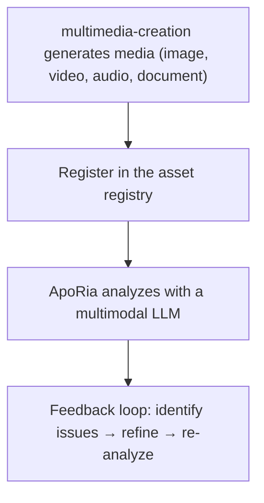

# Multimodal Pipeline

> **⚠️ Archived agent reference — not in the development pipeline**
> The `multimedia-creation` Layer2 agent referenced in this document has been **archived**. Its Rust code, `.d.ts` bindings, and agent registration have all been removed. The multimodal pipeline described here is a **design goal**, not a delivered feature. Unless a developer explicitly requests it, do not implement or schedule work on this pipeline.
> Generate, register, and analyze media using multimedia-creation and ApoRia
> Current status note: This document primarily describes the target workflow. The codebase does contain ApoRia's multimodal-related tools, but it has not yet fully reached the centralized asset registry and full closed-loop capabilities described below.

---

## Table of Contents

- [Overview](#overview)
- [Asset registry](#asset-registry)
- [Generation tools](#generation-tools)
- [Registration](#registration)
- [Multimodal analysis](#multimodal-analysis)
- [Review loop](#review-loop)
- [Office documents](#office-documents)
- [Complete example](#complete-example)

---

## Overview

Entelecheia currently contains multimodal-related foundational modules, especially early tools on the ApoRia side. But the multimedia-creation → centralized asset registry → multimodal review closed loop described here is better viewed as a target design rather than a complete current state.



---

## Asset registry

The asset registry is the centralized media-metadata store managed by ApoRia. It tracks:

- File paths and storage locations
- MIME type
- Generation metadata (prompt, parameters, timestamp)
- Analysis history and quality scores

### Register / retrieve workflow

```typescript
const asset = $.agent.ApoRia.media_asset_register({
  file_path: "/output/marketing-banner.png",
  mime_type: "image/png",
  metadata: {
    prompt: "A futuristic city skyline at sunset",
    generator: "multimedia-creation",
    model: "stable-diffusion-xl"
  }
});

const asset_id: string = asset.id;

const retrieved = $.agent.ApoRia.media_asset_retrieve({
  asset_id: asset_id
});
```

---

## Generation tools

multimedia-creation provides generation tools for various media types. All tools are called via `$multimedia-creation.<tool>()` inside exec code.

### Image generation

```typescript
$multimedia-creation.image_generate({
  prompt: "A futuristic city skyline at sunset, cyberpunk style",
  width: 1024,
  height: 512,
  model: "stable-diffusion-xl",
  output_path: "/output/city-skyline.png"
});
```

### Video generation

```typescript
$multimedia-creation.video_generate({
  prompt: "Camera panning across a mountain landscape at golden hour",
  duration_seconds: 10,
  fps: 24,
  resolution: "1080p",
  output_path: "/output/mountain-pan.mp4"
});
```

### Audio generation

```typescript
$multimedia-creation.audio_generate({
  prompt: "Ambient electronic background music, calm and atmospheric",
  duration_seconds: 30,
  format: "mp3",
  output_path: "/output/ambient-bg.mp3"
});
```

### Document generation

```typescript
$multimedia-creation.doc_generate({
  template: "technical-report",
  title: "Q4 Performance Analysis",
  content: report_markdown,
  format: "docx",
  output_path: "/output/q4-report.docx"
});
```

### Spreadsheet generation

```typescript
$multimedia-creation.sheet_generate({
  title: "Budget Forecast 2025",
  data: budget_data,
  format: "xlsx",
  output_path: "/output/budget-2025.xlsx"
});
```

### Slide generation

```typescript
$multimedia-creation.slide_generate({
  title: "Product Roadmap Presentation",
  sections: slide_sections,
  format: "pptx",
  output_path: "/output/roadmap.pptx"
});
```

---

## Registration

After generating media, register it in the asset registry so that ApoRia can analyze it:

```typescript
const result = $multimedia-creation.image_generate({
  prompt: "Product hero shot on white background",
  width: 1920,
  height: 1080,
  output_path: "/output/hero-shot.png"
});

const asset = $.agent.ApoRia.media_asset_register({
  file_path: result.output_path,
  mime_type: "image/png",
  metadata: {
    prompt: "Product hero shot on white background",
    generator: "multimedia-creation",
    dimensions: "1920x1080"
  }
});

const asset_id: string = asset.id;
```

---

## Multimodal analysis

ApoRia provides multimodal analysis via `$.agent.ApoRia.multimodal_chat()`. Pass one or more asset IDs along with a text prompt:

```typescript
const analysis = $.agent.ApoRia.multimodal_chat({
  prompt: "Analyze this image for composition, color balance, and visual hierarchy. Rate each aspect from 1-10.",
  asset_ids: [asset_id]
});
```

### Analyzing multiple assets

```typescript
const comparison = $.agent.ApoRia.multimodal_chat({
  prompt: "Compare these two design variations. Which one has better visual balance and why?",
  asset_ids: [variant_a_id, variant_b_id]
});
```

### Analysis with context

```typescript
const context_analysis = $.agent.ApoRia.multimodal_chat({
  prompt: "Does this image match the brand guidelines? Guidelines: primary color blue (#0066CC), clean layout, sans-serif typography.",
  asset_ids: [asset_id]
});
```

---

## Review loop

The multimodal pipeline supports an iterative review cycle:

1. **Generate** — multimedia-creation creates the initial media
1. **Register** — store it in the asset registry
1. **Analyze** — ApoRia evaluates the media with a multimodal LLM
1. **Identify issues** — extract concrete improvement points from the analysis
1. **Refine** — multimedia-creation regenerates with adjusted parameters based on the feedback
1. **Re-analyze** — ApoRia evaluates the refined output

### Review-loop example in exec code

```typescript
let iteration: number = 0;
const max_iterations: number = 3;
const quality_threshold: number = 8.0;
let current_prompt: string = "A serene mountain lake at dawn, photorealistic";

while (iteration < max_iterations) {
  iteration++;

  const gen_result = $multimedia-creation.image_generate({
    prompt: current_prompt,
    width: 1024,
    height: 768,
    output_path: `/output/lake-v${iteration}.png`
  });

  const asset = $.agent.ApoRia.media_asset_register({
    file_path: gen_result.output_path,
    mime_type: "image/png",
    metadata: { prompt: current_prompt, iteration: iteration }
  });

  const analysis = $.agent.ApoRia.multimodal_chat({
    prompt: "Rate this image on composition (1-10), color harmony (1-10), and overall quality (1-10). Provide specific improvement suggestions.",
    asset_ids: [asset.id]
  });

  const overall_score: number = analysis.data.overall_quality;

  if (overall_score >= quality_threshold) {
    report({ text: `Quality threshold met at iteration ${iteration}. Score: ${overall_score}` });
    break;
  }

  const suggestions = analysis.data.improvement_suggestions;
  current_prompt = current_prompt + ". " + suggestions.join(". ");

  if (iteration === max_iterations) {
    report({ text: `Max iterations reached. Final score: ${overall_score}` });
  }
}
```

---

## Office documents

multimedia-creation can generate Office-compatible documents:

### Word documents (`doc_generate`)

Generates `.docx` files from Markdown or structured content. Supports templates for common document types:

- Technical reports
- Meeting minutes
- Proposals

```typescript
$multimedia-creation.doc_generate({
  template: "meeting-notes",
  title: "Sprint Planning - Week 12",
  content: meeting_content,
  format: "docx",
  output_path: "/output/sprint-12-notes.docx"
});
```

### Excel spreadsheets (`sheet_generate`)

Generates `.xlsx` files with structured data, formulas, and formatting:

```typescript
$multimedia-creation.sheet_generate({
  title: "Monthly Revenue",
  data: revenue_data,
  format: "xlsx",
  output_path: "/output/revenue.xlsx"
});
```

### PowerPoint presentations (`slide_generate`)

Generates `.pptx` files with sections, bullet points, and optional image embedding:

```typescript
$multimedia-creation.slide_generate({
  title: "Quarterly Business Review",
  sections: [
    { title: "Revenue", bullets: ["Q1: $1.2M", "Q2: $1.5M"] },
    { title: "Goals", bullets: ["Launch v2.0", "Expand to APAC"] }
  ],
  format: "pptx",
  output_path: "/output/qbr.pptx"
});
```

---

## Complete example

This example demonstrates the full pipeline: generate a marketing image, register it, analyze it, and refine it.

### Step 1: Generate the initial image

```typescript
const gen = $multimedia-creation.image_generate({
  prompt: "A modern SaaS product dashboard mockup, clean UI, blue and white color scheme",
  width: 1920,
  height: 1080,
  output_path: "/output/dashboard-v1.png"
});
```

### Step 2: Register the asset

```typescript
const asset = $.agent.ApoRia.media_asset_register({
  file_path: gen.output_path,
  mime_type: "image/png",
  metadata: {
    prompt: "SaaS dashboard mockup",
    purpose: "marketing",
    version: 1
  }
});
```

### Step 3: Analyze the composition

```typescript
const analysis = $.agent.ApoRia.multimodal_chat({
  prompt: "Analyze this dashboard mockup for: 1) Visual hierarchy, 2) Color consistency, 3) Readability of data elements. Provide a score (1-10) for each and specific suggestions for improvement.",
  asset_ids: [asset.id]
});
```

### Step 4: Refine based on feedback

```typescript
const refined = $multimedia-creation.image_generate({
  prompt: "A modern SaaS product dashboard mockup, clean UI, blue and white color scheme. " + analysis.data.suggestions.join(". "),
  width: 1920,
  height: 1080,
  output_path: "/output/dashboard-v2.png"
});
```

### Step 5: Register and re-analyze

```typescript
const refined_asset = $.agent.ApoRia.media_asset_register({
  file_path: refined.output_path,
  mime_type: "image/png",
  metadata: {
    prompt: "SaaS dashboard mockup (refined)",
    purpose: "marketing",
    version: 2,
    previous_version: asset.id
  }
});

const final_analysis = $.agent.ApoRia.multimodal_chat({
  prompt: "Compare this refined version to the original. Has the visual hierarchy improved? Rate the overall quality 1-10.",
  asset_ids: [asset.id, refined_asset.id]
});

report({
  text: `Marketing image pipeline complete. Initial score: ${analysis.data.overall_score}, Refined score: ${final_analysis.data.overall_score}`
});
```

---

## Next steps

- Read the [Fundamentals guide](fundamentals.md) for details on the multimedia-creation and ApoRia agents
- Browse the [architecture](architecture.md) for a full overview of the agent system
- Set up [Webhook integration](webhook-setup.md) to trigger generation from external events
