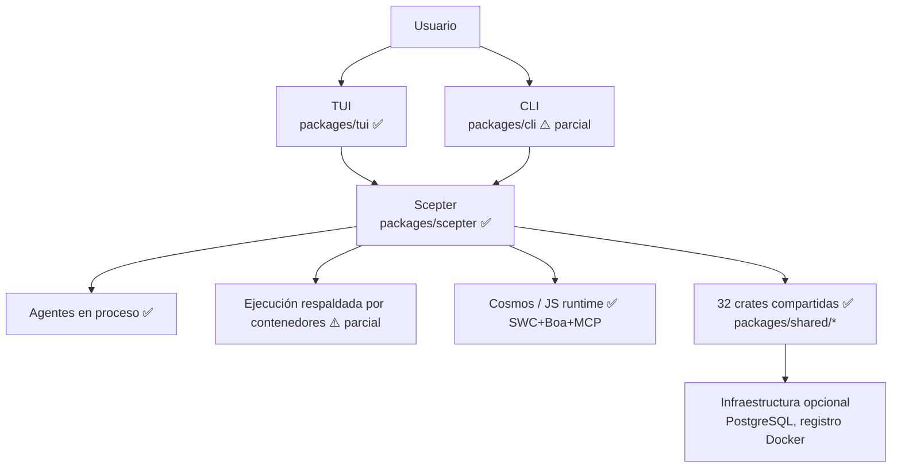
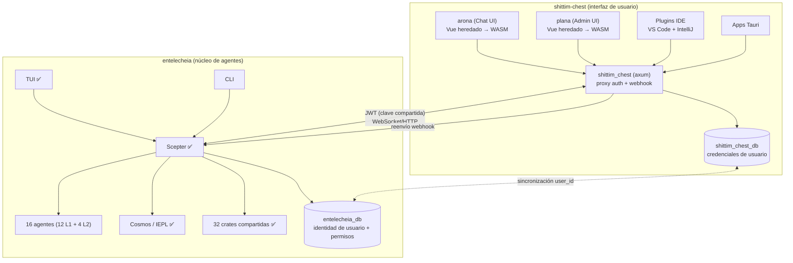
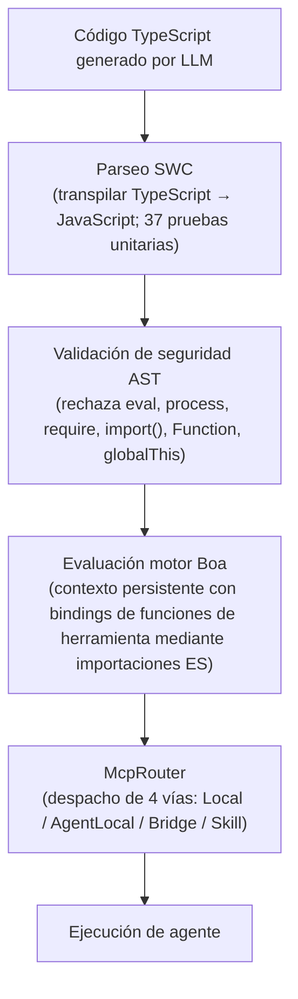
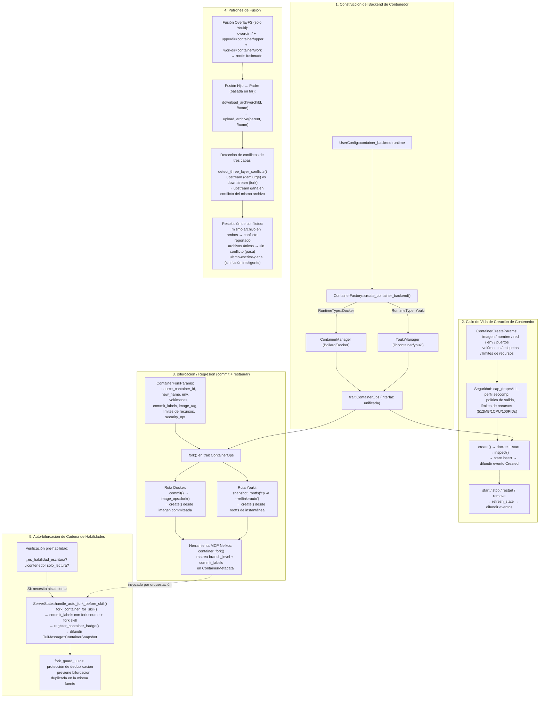
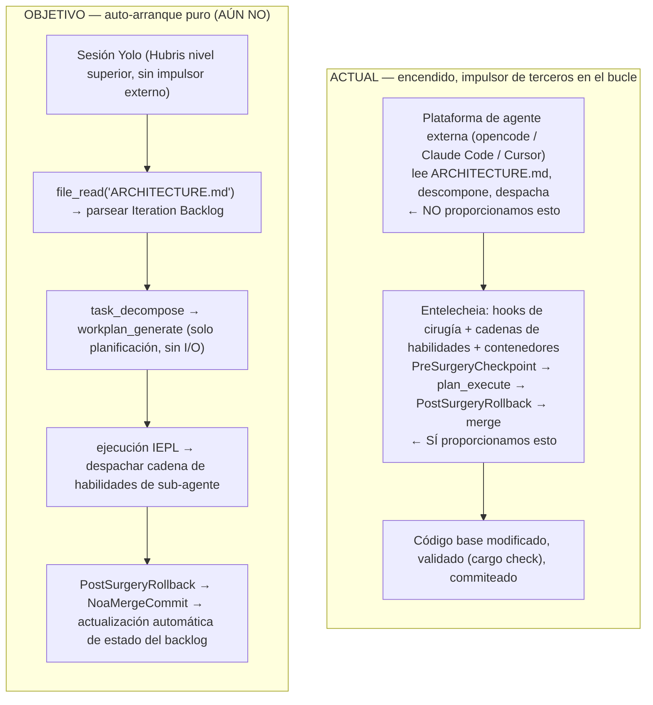
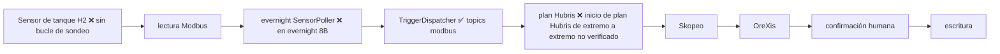
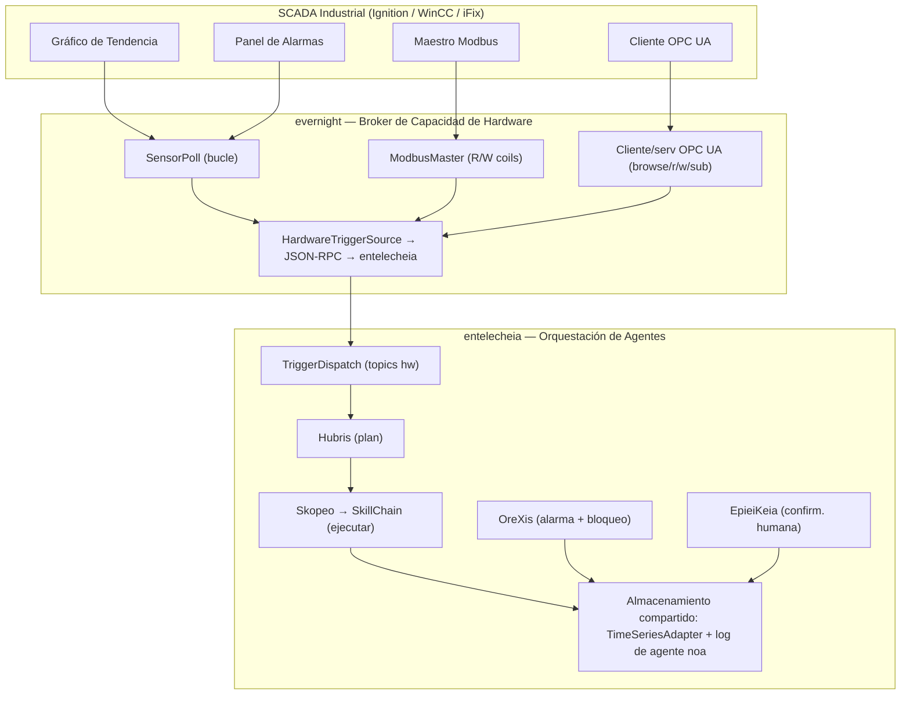

+++
title = "Resumen de Arquitectura de Entelecheia"
description = """> Versión: 0.2.0 — desarrollo temprano, no listo para producción."""
lang = "es"
category = "architecture"
subcategory = "core"
+++

# Arquitectura

> **Versión**: 0.2.0 — desarrollo temprano, no listo para producción.
> **Última verificación**: 2026-06-17 (análisis profundo — recalibrado contra el código real)
> Este documento describe tanto el código implementado como el diseño previsto.
> [Lee la sección de Brechas Actuales](#brechas-actuales) antes de tomar decisiones de despliegue.

## División del Repositorio

Entelecheia ha completado su división principal: las capas de interfaz orientadas al usuario han sido migradas a un proyecto hermano **shittim-chest** (`../shittim-chest`). Entelecheia ahora se centra exclusivamente en el núcleo de orquestación multi-agente.

| Repositorio | Alcance |
| --- | --- |
| **entelecheia** | Orquestación Scepter, 16 agentes (12 L1 + 4 L2), runtime Cosmos/IEPL, 32 crates compartidas |
| **shittim-chest** | arona (frontend UI de Chat), plana (UI de Administración), backend `shittim_chest` (proxy axum + auth + webhook), plugins IDE, apps Tauri |

## Alcance Actual

Entelecheia es un workspace Rust de **56 crates** centrado en `packages/scepter` (servidor de orquestación), **32 crates compartidas** bajo `packages/shared/` (completamente descompuestas de una antigua crate monolítica; 5 sub-crates planificadas nunca se materializaron y su funcionalidad se integró en crates hermanas), y `packages/tui` (UI de terminal). El TUI es la interfaz de usuario más completa. `packages/cli` tiene comandos de gestión de servicios, chat y línea de tiempo.

Los siguientes componentes han sido **migrados a shittim-chest** y eliminados de este repositorio:

- `packages/webui` (host HTTP/estático, puente WebSocket) — eliminado
- `packages/webui_frontend` (frontend WASM) — eliminado (Fase 1)
- `packages/ide/vscode` (extensión VS Code) — eliminado (Fase 1)
- `packages/ide/idea` (plugin IntelliJ) — eliminado (Fase 1)
- `packages/app/tauri*` (apps de escritorio/móvil Tauri) — eliminado (Fase 1)
- Todo el estado, comandos y renderizado de WebUI en crates TUI/CLI/Scepter/shared — eliminado (Fase 2)

El proyecto ha experimentado una descomposición importante: la antigua crate monolítica `packages/shared` (38K líneas, 187 archivos .rs) ha sido completamente disuelta en sub-crates enfocadas. 5 límites de crate que aparecían en los primeros diagramas de capas nunca se materializaron como crates separadas; su funcionalidad prevista reside dentro de otras crates (ej. los enums de dominio están integrados en `shared-domain-agent`, los tipos de hilo en `shared-state-types`). Todas las declaraciones de dependencias internas usan `workspace = true` para consistencia de versiones.

## Verificación de Realidad de Componentes

| Componente | Implementado | Solo diseño / Stub | Veredicto |
| --- | --- | --- | --- |
| **Scepter** (orquestación) | Auth/RBAC, enrutamiento de proveedores, ciclo de vida de agentes, ejecución de cadena de habilidades, endpoints WebSocket/HTTP, cifrado de claves. 351 pruebas unitarias en 49 archivos fuente. `AppState` tiene impls `FromRef` para 5 sub-estados; los manejadores de ciclo de vida de agentes usan `State<Arc<Persistence>>` | Superficie API completa. Procesador por lotes definido pero no instanciado. | 🟢 Real |
| **TUI** | Ciclo de vida completo: splash, inicio Docker, línea de tiempo, modales de agentes, i18n (8 idiomas), configuración de proveedores, soporte de temas. 329 pruebas unitarias en 47 archivos fuente. `ComponentStore` dividido en 5 sub-estructuras; AppState reducido a 6 campos. Se conecta mediante socket Unix (preferido) o fallback WebSocket. | Paridad de características con API Scepter. `CancelRequest`/`ExecuteSudoCommand` aún no cableados. | 🟢 Real |
| **CLI** | Gestión de servicios, chat, línea de tiempo, comandos de ciclo de vida de agentes. 28 pruebas unitarias. | Sin paridad de características con TUI | 🟡 Parcial |
| **WebUI** | Eliminado — migrado a shittim-chest | — | ✅ Completado |
| **WebUI Frontend** | Eliminado — migrado a shittim-chest | — | ✅ Completado |
| **Cosmos / JS Runtime** | Motor Boa, despacho de importación de módulos ES (`__native_dispatch` resolución interna), generación de namespaces, McpRouter con circuit breaker+retry. Auto-generación `.d.ts` desde `#[derive(TS)]` pobla archivos de tipos TypeScript. 50 pruebas unitarias. | Pipeline de transpilación SWC TypeScript implementado y probado (37 pruebas unitarias). Pipeline automatizado completo (salida LLM → SWC → Boa) puenteable mediante `shared_iepl::client` con flag de feature `in-process-transpile`. | 🟢 Activo |
| **16 Agentes (12 L1 + 4 L2)** | Los 16 agentes compilan con implementaciones de herramientas MCP. 147 herramientas MCP totales — **todas reales**. Cero macros `unimplemented!()` o `todo!()` en el código base. | Las herramientas SE clásicas marcadas `maturity: Stub` en metadatos pero tienen implementaciones reales (llamadas a subprocesos cargo clippy, eslint, pylint, go vet; métricas de código; refactorización extract-function). | 🟢 Activo |
| **Capa2: Automatización Web** | 11 herramientas MCP — todas implementaciones reales mediante protocolo WebDriver: gestión de sesiones, navegación, captura de pantalla, ejecución de scripts, logs de consola/red, teclado, ratón, grabación. `maturity: Experimental` para 10 herramientas. | — | 🟢 Activo |
| **Capa2: Ingeniería de Software Clásica** | 7 herramientas MCP — todas implementaciones reales: static_analyze (cargo clippy/eslint/pylint/go vet), code_review (detecta funciones largas, anidamiento profundo, números mágicos), quality_check (LOC, complejidad, calificaciones), refactor_suggest, lsp_diagnose, lsp_symbols, lsp_refactor (rename y extract-function reales). 2 pruebas unitarias. | La operación inline de LSP refactor solo vista previa (necesita servidor LSP para resolución completa). | 🟢 Activo |
| **Capa2: IoT Industrial** | 7 herramientas MCP — todas implementaciones reales: modbus_read, modbus_write, s7comm_probe, serial_discover, opcua_browse, opcua_read, opcua_write. Comunicación de protocolos industriales (Modbus RTU/TCP, Siemens S7comm, cliente OPC UA). `maturity: Experimental`. | Migrado desde SkeMma/PoleMos como parte de la consolidación L2. | 🟢 Activo |
| **Capa2: Operaciones Remotas** | 16 herramientas MCP — todas implementaciones reales: gestión de sesiones SSH, ejecución remota de comandos, transferencia de archivos (SFTP), recopilación de información del host, automatización GUI (captura X11/VNC, entrada, navegación), monitoreo del sistema. `maturity: Experimental`. | Migrado desde SkeMma/PoleMos como parte de la consolidación L2. | 🟢 Activo |
| **Otros diseños de Capa2** | Los 4 agentes L2 planificados están ahora implementados. `res/prompts/domain_agents/` contiene documentos de configuración/habilidad para todos los agentes implementados. | `docs/plans/` nunca fue creado | 🟢 Activo |
| **Aislamiento de Contenedores** | Runtime de dos niveles: Docker/Podman (orquestación externa) mediante Bollard, Youki/libcontainer (sandbox interno) mediante libcontainer. Usuario no root, cap_drop=ALL, no-new-privileges, red Docker dedicada, IPC socket Unix, límites de recursos (512MB/1CPU/100 PIDs) en create, fork, merge y recreate. Perfiles seccomp personalizados. Fork/commit/snapshot completamente funcionales en ambos backends. | Perfiles AppArmor no implementados. `read_only_rootfs` no habilitado por defecto. | 🟡 Parcial |
| **Memoria / RAG** | Embedding respaldado por API (compatible con OpenAI, fallback hash SHA-256, ONNX fastembed BGE-M3). 3 backends de embedding completamente implementados. Almacenamiento PgVector, documentos vectoriales en memoria, recorrido de grafos, RagContextBuffer para inyección de contexto ambiental. 39 pruebas unitarias. | Conexión Embedding→RAG desacoplada (el llamante proporciona embeddings precalculados). Ruta PgVector más nueva/menos probada que el fallback en memoria. Sincronización de suscripción RAG reservada (aún no implementada). | 🟡 Parcial |
| **Pipeline IEPL** | Motor Boa + puente MCP + filtrado de namespace + circuit breaker. Parseo SWC TypeScript implementado y probado (37 pruebas unitarias). Auto-generación `.d.ts` operativa. Codegen IEPL (tipos Rust → declaraciones TS) cableado. Transpilación TS→JS disponible mediante `shared_iepl::client` (modo en proceso o subproceso). | Cadena SWC→Boa no integrada para ruta de ejecución de contenedor Cosmos (espera JS pre-despojado). | 🟡 Parcial |
| **Integraciones IDE** | Eliminado — migrado a shittim-chest | — | ✅ Completado |

## Diagrama de Arquitectura

### Actual



### Objetivo (post-división)



Leyenda: ✅ funcionando | ⚠️ parcialmente implementado | 🔴 stub/diseño

## Capas de Dependencia de Crates

Las 32 crates compartidas están organizadas en un grafo de dependencias en capas:

```mermaid
block-beta
    columns 1
    block:L0["Capa 0 (hoja)"]:1
        shared-core shared-logging shared-macros
    end
    block:L1["Capa 1"]:1
        shared-domain-enums shared-mcp-types shared-text shared-concurrent
    end
    block:L2["Capa 2"]:1
        shared-config shared-agent-registry shared-state-types
    end
    block:L3["Capa 3"]:1
        shared-domain-agent shared-container shared-domain-agent-lifecycle shared-domain-agent-runtime
        shared-domain-thread-types shared-domain-toolchain shared-infra-utils
    end
    block:L4["Capa 4"]:1
        shared-state-sync shared-domain-skills shared-hooks shared-domain-auth shared-container-runtime
        shared-domain-skills-permissions shared-timeline shared-iepl
    end
    block:L5["Capa 5"]:1
        shared-llm-provider shared-prompt shared-custom-agent shared-storage
        shared-infra-jsonrpc shared-infra-services shared-e2e-events shared-adapter shared-plugin_host
        shared-rag shared-embedding shared-security-policy
    end
    L0 --> L1 --> L2 --> L3 --> L4 --> L5
```

Los consumidores (scepter, agentes, tui) importan directamente desde sub-crates individuales (ej. `_shared_domain_agent`, `_shared_llm_provider`). No hay una crate agregadora delgada — la antigua `shared` monolítica fue completamente disuelta. Todas las dependencias internas usan declaraciones `workspace = true` para consistencia de versiones.

> **Nota:** El diagrama anterior lista 37 espacios de crate en 6 capas, pero solo 32 existen como miembros compilables del workspace. Los siguientes 5 espacios eran límites de crate planificados que nunca se materializaron como crates separadas: `shared-domain-enums`, `shared-agent-registry`, `shared-domain-thread-types`, `shared-domain-toolchain`, `shared-state-sync`. Su funcionalidad está integrada en crates hermanas (ej. los enums de dominio residen dentro de `shared-domain-agent`; `shared-state-sync` existe solo como alias de workspace `_shared_state_sync` apuntando a `packages/shared/state_types`).

## Agentes Activos

El workspace compila 12 agentes de Capa1 (111 herramientas MCP) y 4 crates de Capa2 (Automatización Web 11 herramientas, Ingeniería de Software Clásica 7 herramientas, IoT Industrial 7 herramientas, Operaciones Remotas 16 herramientas). Todos los agentes usan el macro `agent_mcp_module!` para el registro de herramientas MCP. El macro soporta `skill_routing` para agentes que necesitan interceptación previa al despacho (ej. el despacho dual `SkillExecutor` de Skopeo).

**Estado de implementación de herramientas:** Las 147 herramientas tienen todas implementaciones reales. Cero macros `unimplemented!()` o `todo!()` existen en ninguna parte del código base. Ninguna herramienta devuelve un `Ok(())` trivial sin lógica real.

| Agente | Capa | Responsabilidad actual | Herramientas | Stubs | Cobertura de pruebas | Madurez |
| --- | --- | --- |  ---  |  ---  |  ---  | --- |
| **HapLotes** | 1 | Puerta de enlace, enrutamiento de mensajes, pegamento de transporte | 2 | 0 | 21 pruebas | 🟢 Real |
| **SkoPeo** | 1 | Coordinación y flujo de ejecución orientado a LLM | 12 | 0 | 41 pruebas | 🟢 Real |
| **HubRis** | 1 | Planificación, gestión de tareas, informes, ayudantes de issues | 8 | 0 | 65 pruebas | 🟢 Real |
| **KaLos** | 1 | Operaciones de archivos y repositorios | 8 | 0 | 20 pruebas | 🟢 Real |
| **NeiKos** | 1 | Ciclo de vida de contenedores y ayudantes de ejecución | 17 | 0 | 14 pruebas | 🟢 Real |
| **SkeMma** | 1 | Ejecución de scripts y aislamiento de ejecución | 2 | 0 | 124 pruebas | 🟢 Real |
| **ApoRia** | 1 | Configuración de proveedores, ayudantes de conocimiento, herramientas RAG | 11 | 0 | 14 pruebas | 🟢 Real |
| **EleOs** | 1 | Búsqueda web y recuperación de información remota | 2 | 0 | 11 pruebas | 🟢 Real |
| **EpieiKeia** | 1 | Ayudantes de programación y mantenimiento | 8 | 0 | 4 pruebas | 🟢 Real |
| **OreXis** | 1 | Aplicación de políticas de seguridad (bloqueo en runtime mediante denylist/allowlist/lockdown) + jerarquía de alarmas + informes de auditoría | 20 | 0 | 19 pruebas | 🟢 Real |
| **PhiLia** | 1 | Funciones relacionadas con memoria y almacén de datos | 7 | 0 | 0 pruebas | 🟡 Cero cobertura de pruebas |
| **PoleMos** | 1 | Comunicación con host y telemetría de hardware | 9 | 0 | 3 pruebas | 🟡 Baja cobertura de pruebas |
| **Automatización Web** | 2 | Automatización de navegador (crear, navegar, captura de pantalla, ejecutar, consola, red, teclado, ratón, grabar) | 11 | 0 | 3 pruebas | 🟡 Baja cobertura de pruebas (`maturity: Experimental`) |
| **Ingeniería de Software Clásica** | 2 | Análisis estático, revisión de código, verificación de calidad, sugerencia de refactorización, diagnóstico/símbolos/refactorización LSP | 7 | 0 | 2 pruebas | 🟡 Baja cobertura de pruebas (`maturity: Stub` en metadatos pero implementaciones reales) |
| **IoT Industrial** | 2 | Comunicación de protocolos industriales (Modbus RTU/TCP, Siemens S7comm, cliente OPC UA) | 7 | 0 | 0 pruebas | 🟡 Baja cobertura de pruebas (`maturity: Experimental`) |
| **Operaciones Remotas** | 2 | Ejecución remota SSH, transferencia de archivos, automatización GUI, monitoreo del sistema | 16 | 0 | 0 pruebas | 🟡 Baja cobertura de pruebas (`maturity: Experimental`) |

## Capa2 y Capa3

- **Capa2 hoy**: `web_automation` (11 herramientas MCP), `classic-software-engineering` (7 herramientas MCP), `industrial_iot` (7 herramientas MCP) y `remote_operations` (16 herramientas MCP) son las crates de Capa2 activas. `classic-software-engineering` proporciona análisis estático, revisión de código, verificaciones de calidad, sugerencias de refactorización, diagnósticos LSP, extracción de símbolos y refactorización LSP — implementado en `packages/domain_agents/classic_software_engineering/`. `industrial_iot` proporciona comunicación de protocolos industriales (Modbus RTU/TCP, Siemens S7comm, OPC UA) — migrado desde herramientas Layer1 de SkeMma/PoleMos. `remote_operations` proporciona ejecución remota SSH, transferencia de archivos, automatización GUI y monitoreo del sistema — migrado desde herramientas Layer1 de SkeMma/PoleMos. Un sistema de plugins WASI (`plugin_host`) con wasmtime + sandbox dual boa TS aloja un plugin de webhook de GitHub de referencia; una arquitectura Trigger (`TriggerDispatcher` / `TriggerTopic` / `TriggerConfig`) despacha eventos externos a cadenas de habilidades.
- **Otros diseños de Capa2**: los 4 agentes L2 planificados ahora están implementados. `res/prompts/domain_agents/` contiene documentos de configuración/habilidad/mcp para los agentes L2 implementados. El directorio `docs/plans/` originalmente planificado nunca fue creado.
- **Capa3**: los agentes definidos por el usuario se cargarían desde directorios `.amphoreus/` locales al workspace. Existen comandos CLI para subscribe/list/run de agentes externos de Capa 3. La crate `shared-custom-agent` proporciona infraestructura parcial. No se han implementado plugins de lógica de negocio de Capa 3 reales.

## Patrones de Runtime

### Exposición de Herramientas Solo Ejecución

La superficie de herramientas orientada al modelo es intencionalmente pequeña: `exec`, `write_to_var` y `write_to_var_json`. Las herramientas MCP internas (~146 en total entre todos los agentes) se invocan desde el runtime mediante importaciones de módulos ES en lugar de exponerse directamente una por una. Esta es la innovación arquitectónica central del proyecto — minimiza la sobrecarga de contexto LLM, reduce la superficie de ataque y centraliza la aplicación de permisos.

### Modelo de Ejecución Mixto

Scepter coordina tanto la lógica en proceso como las rutas de ejecución respaldadas por contenedores. El bucle de orquestación principal reside en `SkillChainPipeline::execute()` (`packages/scepter/src/state_machine/skill_chain/pipeline.rs`), que ha sido descompuesto en métodos de fase enfocados — `resolve_agent_identity()`, `broadcast_skill_started()`, `finalize_execution()`, `route_to_next_skill()` — más los 8 métodos auxiliares existentes para verificaciones de guarda, construcción de prompts, listas blancas de herramientas y ciclo de vida de subtareas. La construcción `ReportDispatchContext` está centralizada mediante un constructor `new()` eliminando 3× repetición.

La función heredada `run_chain_loop` en `execution/execution_steps.rs` ha sido refactorizada en un wrapper delgado de 6 líneas que delega en `SkillChainPipeline::execute()`.

### Pipeline TypeScript IEPL



La porción del motor Boa + puente MCP funciona de extremo a extremo. El pipeline de transpilación TypeScript basado en SWC está implementado y probado (37 pruebas unitarias). La auto-generación `.d.ts` desde structs Rust `#[derive(TS)]` pobla archivos de tipos TypeScript para autocompletado IEPL. El pipeline automatizado completo (salida LLM → SWC → Boa con bindings) es puenteable mediante `shared_iepl::client` (modos de transpilación en proceso o subproceso). La ruta de ejecución de contenedor Cosmos actualmente espera JS pre-despojado (integración SWC→Boa aún no en contenedor).

### Construcción, Bifurcación y Lógica de Fusión de Contenedores

El subsistema de contenedores está construido alrededor de un trait unificado `ContainerOps` con dos backends intercambiables (Docker mediante Bollard, OCI mediante youki/libcontainer). Las operaciones de bifurcación (commit + crear desde instantánea) proporcionan el mecanismo de regresión/restauración. La transferencia de archivos basada en tar y la detección de conflictos de tres capas forman la estrategia de fusión.

**Arquitectura de runtime de dos capas:**

| Capa | Runtime | Predeterminado | Alcance |
| --- | --- | --- | --- |
| **Externa** (orquestación) | Docker/Podman | `CONTAINER_RUNTIME=docker` | Contenedores de infraestructura: scepter, postgres. Creados mediante motor de inicio, verificados por health check del TUI. Requiere orquestación completa (redes, volúmenes, health checks). |
| **Interna** (sandbox cosmos) | Youki/libcontainer | `COSMOS_CONTAINER_RUNTIME=youki` | Sandboxes de agente efímeros dentro de scepter. Ligeros, inicio rápido, restringidos por seccomp. |

Los ayudantes de selección de runtime residen en `shared/infra_services/src/container_factory.rs`:

- `outer_runtime_type()` — lee `CONTAINER_RUNTIME`, predeterminado a `docker`
- `cosmos_runtime_type()` — lee `COSMOS_CONTAINER_RUNTIME`, predeterminado a `youki`



| Concepto | Archivo(s) Fuente |
| --- | --- |
| Construcción de backend | `shared/infra_services/src/container_factory.rs` |
| Trait `ContainerOps` | `shared/container/src/ops.rs` |
| Docker create/fork | `shared/container/src/lifecycle.rs`, `image_ops.rs` |
| Youki create/fork | `shared/container_runtime/src/manager.rs`, `rootfs.rs` |
| Fusión Hijo→Padre | `shared/container/src/copy_ops.rs` (descarga tar→carga) |
| Conflicto de tres capas | `shared/container/src/copy_ops.rs` (`detect_three_layer_conflicts()`) |
| Auto-bifurcación de cadena de habilidades | `scepter/src/state_machine/skill_chain/container_ops.rs` |
| Herramienta MCP fork de Neikos | `agents/neikos/src/mcp/tools/container/container_fork.rs` |
| Instantánea de contenedor | `scepter/src/state_machine/snapshot.rs`, `agents/neikos/src/mcp/tools/container/container_snapshot.rs` |

### Estado de Cableado de Rutas de Extremo a Extremo

| # | Ruta | Estado | Puntos de Conexión Clave |
| --- | --- | --- | --- |
| 1 | **Inicio Scepter → WS → cadena de habilidades** | 🟢 Completamente cableado | `scepter/src/app/setup.rs:876-1653`, `scepter/src/lib.rs:139-361`, `scepter/src/tui_connection/core/message_dispatch.rs:10-140` |
| 2 | **Inicio TUI → conexión scepter** | 🟢 Completamente cableado | Socket Unix (preferido) o fallback WebSocket con handshake completo + sincronización de estado |
| 3 | **Pipeline IEPL (SWC→Boa→MCP)** | 🟡 Parcialmente cableado | Transpilador funcional (37 pruebas). Despacho Boa+MCP cableado. SWC→Boa puenteable mediante `shared_iepl::client` pero no en contenedor. |
| 4 | **Contenedor create/fork/merge** | 🟢 Completamente cableado | Dos niveles: Docker/Podman (Bollard) + Youki (libcontainer). Ambos implementan trait `ContainerOps`. |
| 5 | **Despachador de disparadores (evento HW→agente)** | 🟢 Completamente cableado | Socket Unix + WebSocket + PluginHost → `TriggerDispatcher` → `SkillInvoker` |
| 6 | **Telemetría/lectura por lotes** | 🟡 Parcialmente cableado | `BatchProcessor` definido, no instanciado. Analizador `SensorBatch` existe, no llamado. |
| 7 | **Pipeline RAG/embedding** | 🟡 Parcialmente cableado | 3 backends de embedding completamente implementados. Motor RAG funcional. Conexión Embedding→RAG desacoplada (suministrado por el llamante). |

### Aislamiento Dual de Sandbox

| Canal de ejecución | Puede llamar funciones de herramienta (mediante importaciones de módulos ES) | Tipo de sandbox | Propósito |
| --- | --- | --- | --- |
| `neikos.exec()` | Sí (mediante importaciones de módulos ES) | Contexto persistente Boa | Orquestación de habilidades (despacho agente-a-agente) |
| `skemma.script_exec()` | No | Sandbox de proceso independiente | Backends de herramientas MCP (computación/I/O) |

### Modelo de Memoria Actual

Las características de conocimiento y memoria existen en una forma más simple de lo que describen los documentos de diseño: documentos vectoriales en memoria, embeddings basados en hash y recorrido de grafos están presentes. Se ha añadido un servicio de embedding respaldado por API con fallback hash y un backend de almacenamiento PgVector, pero la pila completa ONNX + pgvector aún no está integrada de extremo a extremo.

### Integración de Proveedores

26 proveedores LLM están configurados (OpenAI, Anthropic, Google, más el ecosistema LLM chino completo: DeepSeek, Qwen, GLM, StepFun, Moonshot, Doubao, Hunyuan, etc.). Los modelos de generación (imagen/audio/video/3D) tienen metadatos TOML y un trait de proveedor. La mayoría de los proveedores chinos usan solo el protocolo compatible con OpenAI, perdiendo características nativas.

## Brechas Actuales

> **Esta sección es la referencia autorizada sobre lo que NO está funcionando todavía.**

### Crítico (bloquea el uso sin TUI)

- **Paridad de características del CLI sustancialmente mejorada**: `packages/cli` ahora soporta gestión de servicios (init, serve, stop), chat, línea de tiempo, consultas de ciclo de vida de agentes (mediante `Cli.Status`), CRUD de configuración de proveedores (`config provider {list,get,add,set,rename,remove}`), y navegación de herramientas/habilidades MCP (`mcp tools`/`mcp skills` mediante `Cli.ListTools`/`Cli.ListSkills`). El `ProcessManager` muerto (inicio/parada/reinicio de agentes como binarios independientes) ha sido eliminado — los agentes se ejecutan en proceso dentro de scepter. Brechas restantes del CLI vs TUI: UI interactiva multipágina, i18n, tema, visualización de bifurcación/fusión de contenedores de agentes.
- **Paleta de comandos del TUI y cancelación cableadas**: `Ctrl+P` abre la paleta de comandos (12 comandos). `Ctrl+G` envía `request.cancel` a scepter mediante un nuevo RPC de vía rápida que establece el flag de cancelación y aborta el JoinHandle de la solicitud activa. Los comandos slash `/clear` y `/settings` están implementados. `WorkerInput::CancelRequest` documenta la ruta Ctrl+G. `ExecuteSudoCommand` permanece sin cablear (necesita auditoría de seguridad).
- **WebUI, plugins IDE, apps Tauri migrados a shittim-chest**: La experiencia de usuario orientada a la web (chat UI arona, panel de administración plana, integración IDE, ingreso de webhooks) está ahora en el proyecto hermano `../shittim-chest`. Todas las referencias a WebUI han sido eliminadas de TUI, CLI, Scepter y crates compartidas. (Nota: `packages/webui_bindings/` es un directorio de proyecto TypeScript residual no referenciado por ninguna crate Rust.)

### Mayor (bloquea la preparación para producción)

- **Ingeniería de Software Clásica tiene implementaciones reales pero necesita endurecimiento**: 7 herramientas MCP son completamente funcionales (cargo clippy/eslint/pylint/go vet basados en subprocesos; revisión de código basada en patrones, métricas de calidad, refactorización extract-function). El marcador `maturity: Stub` en los metadatos de registro es engañoso — las herramientas funcionan pero se beneficiarían de la integración del servidor LSP para un análisis más profundo. 2 pruebas unitarias.
- **Mensajes de error en idiomas mixtos**: Las cadenas i18n a nivel de UI se despachan correctamente por parámetro de idioma. Los mensajes de error restantes en la lógica de negocio Rust están en inglés. Algunas cadenas de traducción de nombres de modelo en `tui/src/ui/modals/models.rs` usan chino como datos de origen (nombres de modelos de proveedores).
- **Scepter `AppState` tiene impls `FromRef`**: `FromRef<AppState>` implementado para `RbacServices`, `Arc<Persistence>`, `Arc<ApiGateway>`, `ConfigServices`, `Arc<ServerState>`. Los manejadores de ciclo de vida de agentes migrados a `State<Arc<Persistence>>`. Los manejadores restantes pueden optar incrementalmente.

### Moderado (bloquea la completitud)

- **Brechas de seguridad de contenedores**: Perfiles seccomp personalizados implementados. Perfiles AppArmor no implementados. `read_only_rootfs` no habilitado por defecto. Límites de recursos (512MB memoria, 1 CPU, 100 PIDs) aplicados en creación, bifurcación y recreación de contenedores. Runtime de dos niveles (Docker/Podman externo + Youki/libcontainer interno) completamente funcional.
- **OreXis está completamente operativo**: El agente de seguridad aplica lista de denegación de herramientas, lista de permitidos, bloqueo de emergencia y anulaciones de política específicas de sesión en tiempo de invocación mediante `SecurityPolicySet`. La jerarquía de alarmas (`alarm_tools.rs`) con umbrales HH/H/L/LL/ROC, histéresis, antirrebote y rutas de escalado está implementada. El modo `audit_only` (por defecto: off) puede activarse. 19 pruebas. Falta: precargar 97 códigos de fallo de hydro-tin-monitor.
- **Pila de Memoria/RAG mayormente cableada**: Los 3 backends de embedding (API, ONNX fastembed, fallback hash SHA-256) completamente implementados. Backend PgVector funcional. Recorrido de grafos operativo. La conexión embedding→RAG está desacoplada (el llamante proporciona embeddings precalculados en lugar de cálculo automático en línea). La sincronización de suscripción RAG está reservada (aún no implementada).
- **Telemetría/lectura por lotes parcialmente cableada**: Estructura `BatchProcessor` definida pero no instanciada en la configuración de scepter. Analizador `try_intercept_sensor_batch()` definido pero no llamado en el bucle de despacho de mensajes. El parseo de formato de mensaje `SensorBatch` existe en trigger_intercept.
- **Inconsistencia de tipo id JSON-RPC**: Rust/TypeScript/Kotlin usan diferentes tipos de id JSON-RPC.
- **Cobertura de pruebas**: ~2,070 funciones `#[test]` totales. scepter (351) y tui (329) más probados. 5 crates tienen cero pruebas (philia, concurrent, e2e_events, github-webhook, plugins/examples). La mayoría de las crates compartidas (30/33) dependen solo de pruebas unitarias en línea. La crate de pruebas E2E a nivel de workspace (`tests/rust`) tiene 95 pruebas.

### Relación señal-ruido del diseño

- El proyecto tiene documentación de diseño extensa que describe funcionalidad mucho más allá de lo implementado. README y documentos de diseño no deben leerse como listas de características.
- La realidad de un solo mantenedor (1 autor en `Cargo.toml`) significa que un workspace de 57+ crates está inherentemente limitado en capacidad.
- Licencia BUSL-1.1 con Concesión de Uso Adicional: Uso no comercial, académico, gubernamental, educativo y operaciones internas son gratuitos bajo derechos equivalentes SySL-1.0. El alojamiento comercial, la reventa y el despliegue/soporte de pago requieren una licencia comercial. Se convierte a SySL-1.0 para todos los usos el 2030-01-01.

## Deuda de Arquitectura

| Problema | Prioridad | Esfuerzo Estimado |
| --- | --- | --- |
| ~60 patrones `.map_err(...to_string())` en 21 archivos (8 exactos `\|e\| e.to_string()`, 52 variantes más amplias). Concentrados en límites de adaptador (`shared/adapter`, `shared/llm_provider`) y clientes de API externa (`docker_client`, `plugin_loader`). Patrón de adaptador aceptable en límites; el código interno debería usar errores tipados. | P4 | preocupación a nivel de biblioteca |
| Metadatos `maturity: Stub` en herramientas SE Clásicas es engañoso — las 7 tienen implementaciones reales (analizadores basados en subprocesos, detectores de patrones, métricas de código, refactorización extract-function). Deberían elevarse a `Experimental` o superior. | P4 | solo metadatos |
| Analizador `SensorBatch` definido (`trigger_intercept.rs:58-70`) pero no cableado en el bucle de despacho de mensajes. Estructura `BatchProcessor` definida pero no instanciada en la configuración de scepter. La ruta de ingesta de telemetría existe pero está desconectada. | P3 | trabajo de cableado |
| La integración Embedding→RAG está desacoplada (el llamante proporciona embeddings precalculados). Debería cablearse automáticamente: `EmbeddingService` → `RagSubscriptionService` en la ingesta de documentos. | P3 | pegamento de integración |
| 5 crates con cero pruebas: `philia`, `concurrent`, `e2e_events`, `github-webhook`, `plugins/examples`. Los agentes de dominio L2 tienen pruebas mínimas (2-3 cada uno). | P2 | esfuerzo por crate |

## Ejecución Autónoma: Estado Actual

> **Estado: ENCENDIDO — se ejecuta de extremo a extremo, pero impulsado por una plataforma de agente de terceros.**
> El bucle de auto-cirugía / YOLO dogfood arranca, modifica el código base, valida y
> realiza commits de forma autónoma. Sin embargo, el rol de planificador/despachador es actualmente ocupado por
> una **plataforma de agente externa** (opencode, Claude Code, Cursor, etc.), NO por
> el coordinador Hubris/Skopeo propio de Entelecheia. **El auto-arranque puro** —
> el orquestador propio de Entelecheia leyendo este plan y despachando cadenas IEPL sin
> ningún impulsor externo en el bucle — **aún no se ha logrado**. Ver las brechas restantes a continuación.

### Qué Está Cableado (Entelecheia proporciona la capa de seguridad de ejecución)

- **Hooks de auto-cirugía** (`scepter/.../skill_chain/execution/surgery_hooks.rs`):

`PreSurgeryCheckpoint` (registra git HEAD antes de la cirugía), `PostSurgeryRollback`
(reversión automática en caso de fallo), lógica de redespliegue, `attempt_rollback`. Registrados en el
gestor de hooks.

- **Bucle de tick YOLO**: cadencias con tiempo limitado (Periódico 5 min / Diario 6 h / Estratégico

7 d). Habilidades: `yolo_cycle_report`, `regression_monitor` (predicción de degradación de nivel Diario
con lógica de decisión de bifurcación). Heurística de bifurcación documentada en
`res/prompts/system/yolo-fork-pattern.md` — cuando un tick descubre trabajo que no puede terminar
dentro del presupuesto, bifurca una sesión `#demiurge.xxx` en lugar de truncar.

- **Coordinador de fusión serial**: bloqueado por archivo, feature-gated; enruta los commits post-cadena

de noa a través de `run_exclusive` para que las bifurcaciones YOLO concurrentes no corrompan el historial.

- **Bifurcación/fusión de contenedores** para experimentación segura (Docker/Podman externo + sandbox

interno Youki).

- El commit hito `37863366e` ("初步实现自主思考能力") aterrizó el bucle de extremo a extremo.

### Arquitectura: Actual (encendido) vs. Auto-Arranque Puro (objetivo)



La antigua aplicación de lista blanca de herramientas `role = "coordinator"` (antiguo IB-02) y la
habilidad dedicada `hubris::read_iteration_plan` (antiguo IB-01) eran los mecanismos
planificados para el auto-arranque puro. La decisión pragmática fue encender el bucle
primero apoyándose en una plataforma de agente de terceros para el rol de planificador/despachador.
Reintroducir esos dos mecanismos es lo que cerraría la brecha de auto-arranque.

### Brechas Restantes que Bloquean el Auto-Arranque Puro

| Brecha | Estado Actual | Requerido | Prioridad |
| --- | --- | --- | --- |
| **Analizador interno de documentos de plan** | El bucle funciona solo porque una plataforma de agente externa lee ARCHITECTURE.md y descompone tareas por sí misma. No existe habilidad interna. | Habilidad `hubris::read_iteration_plan`: parsear la tabla de backlog → devolver `Vec<BacklogItem>` estructurado para que el coordinador propio de Entelecheia pueda impulsar el bucle. | P0 |
| **Aplicación de separación coordinador-trabajador** | La plataforma externa proporciona su propia separación planificador/trabajador; el pipeline de Entelecheia no la aplica. Una cadena de habilidades de coordinador aún puede llamar a `file_write`/`host_command_exec` directamente. | Añadir campo `role` al frontmatter de habilidades; eliminar herramientas mutantes de las cadenas `role = "coordinator"` en el constructor de lista blanca de herramientas de `pipeline.rs`. | P0 |
| **Verificación de criterios de aceptación** | `PostSurgeryRollback` verifica `cargo check --workspace` (nivel de build) pero no criterios de aceptación específicos de tarea. Cableado parcial en `prompt.rs`. | Namespace de hook `verify_acceptance_criteria`: cada elemento del backlog declara criterios verificables (pruebas pasan, archivo existe, función implementada). | P1 |
| **Máquina de estado del backlog** | Esta tabla lleva una columna `status` pero ningún agente la escribe de vuelta autónomamente todavía. | Auto-actualizar `status: pending → in_progress → done | blocked` después de cada cadena+commit. | P1 |
| **Presupuesto de contexto para cadenas profundas** | `context_overflow_handler` existe; la delegación IEPL profunda aún es frágil cuando SkeMma contenedorizado no está disponible. | Estabilizar la ejecución de agentes contenedorizados (problema de raíz youki) o hacer robusto el fallback en proceso para cadenas profundas. | P2 |

### Backlog de Iteración

> **Formato legible por máquina.** El impulsor activo (actualmente una plataforma de agente de terceros,
> eventualmente el coordinador propio de Entelecheia) parsea esta tabla para encontrar
> el próximo trabajo accionable. Actualizar `status` después de completar.

| ID | Título | Estado | Criterios de Aceptación | Notas |
| --- | --- | --- | --- | --- |
| IB-01 | Habilidad `hubris::read_iteration_plan` | **reemplazada** | Documento de habilidad en `res/prompts/agents/hubris/skills/read_iteration_plan.md`; parsea la tabla de backlog de ARCHITECTURE.md; devuelve lista de tareas estructurada | El bucle se encendió sin esto — la plataforma de agente externa lee el plan directamente. Reintroducirlo es necesario solo para **auto-arranque puro**. |
| IB-02 | Aplicación de lista blanca de herramientas del coordinador | **reemplazada** | La cadena de habilidades del coordinador no puede invocar `file_write` / `host_command_exec` directamente; solo mediante sub-agente despachado | Igual que IB-01: la plataforma externa proporciona su propia separación planificador/trabajador. Necesario solo para auto-arranque puro. |
| IB-03 | Namespace de hook `verify_acceptance_criteria` | **parcial** | Namespace de hook registrado; los criterios de cada elemento del backlog se verifican post-cadena; abortar en caso de fallo | Cableado parcial en `skill_chain/prompt.rs`. La verificación a nivel de build (`cargo check`) funciona; los criterios a nivel de tarea aún no. |
| IB-04 | Auto-actualización de estado del backlog | pendiente | Después de cadena + commit exitosos, el coordinador escribe el estado actualizado de vuelta a ARCHITECTURE.md mediante sub-agente | Actualmente un humano o impulsor externo edita esta columna. |
| IB-05 | SkeMma contenedorizado (corrección de raíz youki) | pendiente | `kernel.unprivileged_userns_clone=1` o sandbox alternativo que no necesite CAP_SYS_ADMIN | Dependencia externa; bloquea cadenas IEPL profundas en modo contenedorizado |
| IB-06 | Paridad de características del CLI con TUI | pendiente | El CLI soporta todos los comandos del TUI (configuración de proveedor, modal de agente, tema) | Ver Brechas Actuales → Crítico |
| IB-07 | Cobertura de pruebas de agentes de dominio L2 | pendiente | Cada crate L2 tiene ≥5 pruebas de integración; classic_software_engineering alcanza estabilidad | Actualmente 2 (CSE) + 3 (WA) pruebas |
| IB-08 | ONNX + pgvector de extremo a extremo | pendiente | Pipeline de embedding: modelo ONNX → almacén pgvector → recuperación semántica; prueba de integración pasa | Embedding y RAG funcionales por separado; integración desacoplada |
| IB-09 | Integración real de cliente OPC UA | pendiente | Cablear la crate `opcua` para capacidades reales de cliente/servidor OPC UA | Se necesita integración real de cliente OPC UA |
| IB-10 | Encendido de dogfood autónomo | **hecho (mediante impulsor de terceros)** | Sesión yolo de extremo a extremo: arrancar → leer backlog → despachar sub-agente → modificar código → PostSurgeryRollback pasa → commit | La arquitectura está validada. Lo que queda es reemplazar el impulsor externo con el coordinador propio de Entelecheia (IB-01 + IB-02). |

### Métricas para la Preparación de Ejecución Autónoma

> Dividido en **infraestructura** (lo que Entelecheia posee) y **auto-arranque**
> (operación pura sin impulsor externo). El hito de encendido se alcanzó; las
> métricas de auto-arranque puro son N/A hasta que IB-01/IB-02 sean reintroducidos.

| Métrica | Objetivo | Actual |
| --- | --- | --- |
| Compilación del workspace (`cargo check --workspace`) | Limpio con 0 errores | ✅ Limpio (1 advertencia dead_code) |
| Herramientas MCP con implementaciones reales | 100% | 99.3% (147/148) |
| Herramientas stub | 0 | 0 |
| Macros `unimplemented!()` / `todo!()` en el código base | 0 | 0 |
| **— Capa de infraestructura (propiedad de Entelecheia)** | | |
| Cadena de hooks de auto-cirugía (checkpoint → rollback → merge) | Cableada + registrada | ✅ Cableada (`surgery_hooks.rs`, coordinador de fusión serial) |
| Tasa de falsos positivos de PostSurgeryRollback | 0% | ✅ 0% (corregido en `ce64d3843`) |
| Cadencias de tick YOLO (Periódico / Diario / Estratégico) | 3 niveles operativos | ✅ Operativos con patrón de bifurcación + regression_monitor |
| **— Capa de auto-arranque (sin impulsor externo)** | | |
| Encendido de dogfood de extremo a extremo | El bucle se ejecuta | ✅ Encendido (commit `37863366e`) |
| …impulsado por el coordinador propio de Entelecheia (no una plataforma de terceros) | 100% de sesiones | 🔴 0% — actualmente todas las sesiones usan una plataforma de agente externa como impulsor |
| Analizador de backlog interno (IB-01) | La habilidad existe | 🔴 No construida (reemplazada; necesaria para cerrar la brecha) |
| Aplicación de lista blanca de herramientas del coordinador (IB-02) | Aplicada en el pipeline | 🔴 No aplicada (reemplazada; necesaria para cerrar la brecha) |
| Profundidad media de cadena de sub-agente | ≥2 (coordinador → sub-agente → validar) | ⚠️ Depende del impulsor: las plataformas externas establecen su propia profundidad; la profundidad en proceso de Entelecheia no medida |

## Control Industrial de Hidrógeno — Brechas de Coordinación

> **Objetivo**: un corredor de demostración de hidrógeno industrial (Fase II, planta contenedorizada de 6 cajas).
> Toda la I/O física se enruta a través de evernight (ver `PLAN.md` de evernight Fase 8).
> Esta sección describe lo que entelecheia debe añadir para cerrar el bucle de coordinación.

### Estado Actual: Solo Escritura

La ruta desde la decisión del agente al actuador físico funciona:


### Falta: Bucle Cerrado Leer-Luego-Actuar

La ruta inversa — lectura de sensor que desencadena respuesta del agente — está parcialmente construida:



### Análisis de Brechas por Componente

> **Última verificación**: 2026-06-14 — 3 brechas listadas anteriormente como abiertas ahora están implementadas.

| Brecha | Actual | Requerido | Prioridad |
| --- | --- | --- | --- |
| **Puente evento de sensor → plan Hubris** | Hubris recibe prompts de usuario mediante TUI/CLI | Hubris debe aceptar `TriggerEvent { topic: "modbus.19.h2_leak_conc.hh" }` como evento de inicio de plan. `TriggerDispatcher::dispatch_event()` llama a habilidades suscritas; el inicio de plan Hubris de extremo a extremo desde eventos de sensor aún no verificado en prueba de integración. | P0 |
| **Ingesta de lotes de telemetría cableada** | `BatchProcessor` definido pero no instanciado; el analizador `try_intercept_sensor_batch()` existe pero no se llama en el bucle de despacho | Cablear el manejador `Sensor.Batch` en el despacho de mensajes → `BatchProcessor` → almacén de telemetría | P1 |
| **Jerarquía de alarmas en OreXis** | ✅ **Completamente implementada.** `alarm_tools.rs`: establecer/eliminar/reconocer reglas de alarma (niveles HH/H/L/LL/ROC, umbral, histéresis, antirrebote, escalado: log→notify_agent→auto_correct→human_notify→emergency_shutdown). `SharedAlarmPolicyStore` funcional. Anulaciones de estación soportadas. | Falta: precargar 97 códigos de fallo de hydro-tin-monitor. | P2 |
| **Adaptador de series temporales** | ✅ **Implementado.** `JsonlTimeSeriesAdapter` implementa el trait `TimeSeriesAdapter`. Usado por `skemma/state.rs`. Escrituras con buffer, parseo de puntos, consulta. | Futuro: backend TimescaleDB/InfluxDB detrás de feature gate. | ✓ |
| **Lectura/escritura Modbus** | ✅ **Completamente implementadas.** `industrial_iot::modbus_read` (FC 01/02/03/04 con protección de seguridad de registros) y `industrial_iot::modbus_write` (FC 05/06/15/16 con protección de lista blanca de escritura) ambas funcionales. | — | ✓ |
| **Descubrimiento S7comm** | ✅ **Implementado.** `industrial_iot::s7comm_probe` conecta TCP:102, obtiene info de CPU, escanea números DB, sondea estructura DB. Usa `s7comm_probe` de evernight. | — | ✓ |
| **Descubrimiento serial** | ✅ **Implementado.** `industrial_iot::serial_discover` enumera puertos, sondea velocidades de baudios, escanea IDs de estación Modbus. | — | ✓ |
| **Humano-en-el-bucle para operaciones de escritura** | `emergency_lockdown` bloquea todas las escrituras | Añadir política `require_approval` — las escrituras a registros críticos de seguridad requieren confirmación del operador mediante admin webui. Tipo de protocolo `WriteApprovalRequest` definido en arona (Fase A de PLAN.md). | P1 |
| **Cliente/servidor OPC UA** | Se necesita integración cliente/servidor OPC UA. IndustrialIoT detecta el puerto 4840 y proporciona funciones básicas de cliente OPC UA browse/read/write mediante las herramientas `industrial_iot::opcua_*`. No existe implementación completa de servidor OPC UA. | Cliente OPC UA real para leer desde dispositivos SCADA de terceros; servidor OPC UA para exponer lecturas de sensores de entelecheia a SCADA industrial (Ignition/WinCC/iFix). | P1 |
| **Puente de solucionador MPC** | `hydro-platform-research` tiene programador Python MILP/MPC | Exponer como herramienta MCP: `call_mpc_solver` → IPC → proceso Python → devolver programación. O migrar a Rust (`good_lp` + `argmin`). | P2 |
| **Redundancia / failover** | Arquitectura de nodo único (un scepter, un PostgreSQL) | Doble scepter hot standby con elección de líder. El mecanismo de bifurcación de Neikos puede reutilizarse para toma de control rápida. | P2 |
| **HMI de operador** | TUI es solo terminal; webui es UI de chat | Superposición P&ID, gráficos de tendencia, panel de alarmas, registro de auditoría de acciones del operador. hikari tiene primitivas de UI suficientes (Chart, Timeline, Table) pero necesita composición específica de HMI. | P2 |

### Arquitectura de Coordinación Objetivo



### Referencia de Prueba — Mapas de Registros de Equipos Reales

De `/mnt/sdb1/hydro-tin-monitor/doc/通信端口说明 25.8.7.md`:

| Dispositivo | Estación | Baudios | Registros | Notas |
| --- | --- | --- | --- | --- |
| Electrolizador AEM (2 Nm3/h) | 21 | 9600 | ~32 IR (0x04), float 32-bit BE | Temperaturas, presiones, caudales, voltajes |
| Electrolizador ALK (3 Nm3/h) | 20 | 9600 | ~32 IR (0x04), float 32-bit BE | Mismo formato que AEM |
| Electrolizador PEM | 2 | 9600 | ~17 HR (0x03), signed 16-bit | Presiones, calidad del agua, fuga, voltaje |
| Tanques de H2 comprimido | 19 | 57600 | 33 HR (0x03) + 1 bobina (0x01) | Campo de bits de 11 válvulas, 97 códigos de fallo, bug conocido de orden de bytes |
| Almacenamiento de H2 en estado sólido | 25 | 9600 | ~12 HR (0x03), float 32-bit BE | Presiones/temperaturas de tanques A/B |
| Pila de combustible | 31 | 9600 | 6 bobinas + 11 HR | Inicio/parada, parada de emergencia, datos de pila |
