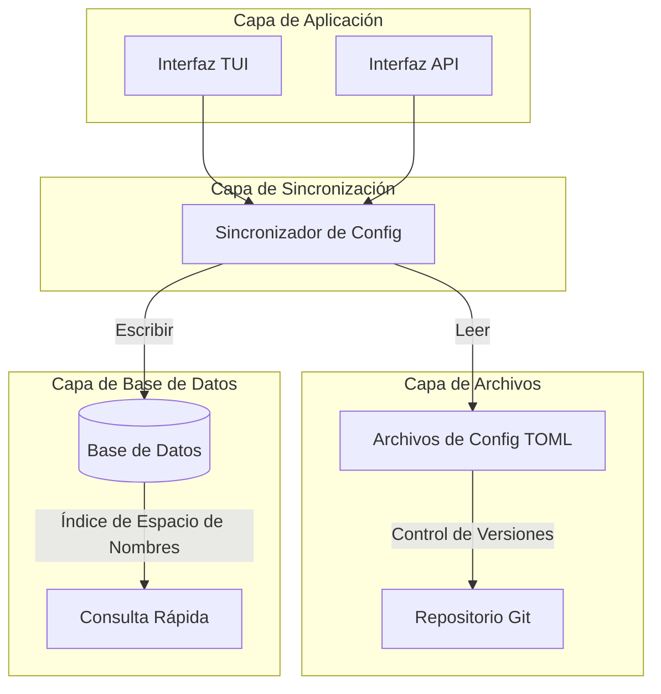
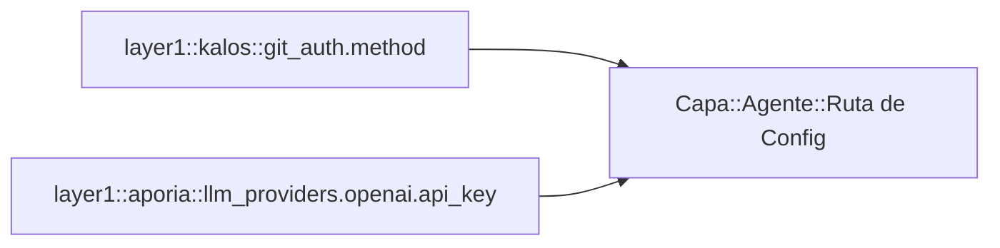
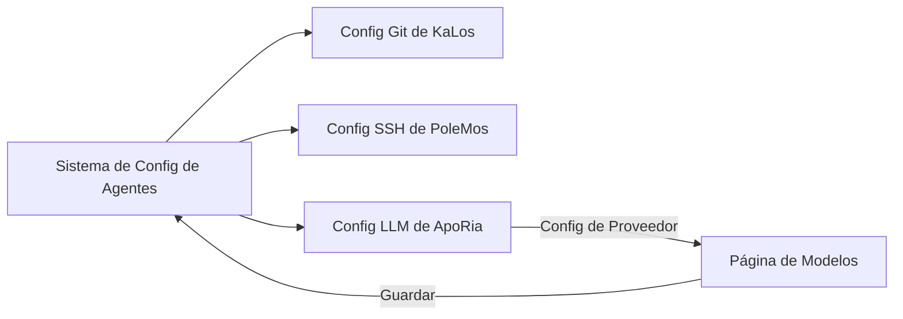

+++
title = "Diseño del Sistema de Configuración de Agentes"
description = """El Sistema de Configuración de Agentes proporciona un mecanismo unificado de gestión de configuración, soportando almacenamiento en archivos TOML y persistencia en base de datos, implementando gest"""
lang = "es"
category = "design"
subcategory = "core"
+++

# Diseño del Sistema de Configuración de Agentes

## Descripción General

El Sistema de Configuración de Agentes proporciona un mecanismo unificado de gestión de configuración, soportando almacenamiento en archivos TOML y persistencia en base de datos, implementando gestión de versiones de configuración y recarga en caliente.

## Principios Fundamentales

### Arquitectura de Almacenamiento de Doble Capa



### Espacio de Nombres de Configuración

Adoptando un diseño de espacio de nombres jerárquico:



## Diseño de Arquitectura

### Ciclo de Vida de la Configuración

```mermaid
stateDiagram-v2
    [*] --> Default: Valores Predeterminados del Sistema
    Default --> FileConfig: Cargar TOML
    FileConfig --> DbSync: Sincronizar a BD
    DbSync --> Active: Configuración Activa

    Active --> Updated: Modificación del Usuario
    Updated --> Validated: Validación de Formato
    Validated --> DbSync: Guardar Cambios

    Active --> HotReload: Disparador de Recarga en Caliente
    HotReload --> Active: Sin Necesidad de Reinicio
```

### Interfaz de Configuración TUI

```mermaid
graph TB
    subgraph Modal de Documento de Agente
        Tabs[Resumen | Config | MCP | Habilidades]
        Tabs --> Content[Área de Contenido]
    end

    subgraph Página de Configuración
        Groups[Lista de Grupos de Configuración]
        Groups --> Group1[Config de Autenticación Git]
        Groups --> Group2[Config de Gestión de Fuentes]
        Groups --> AddGroup[Agregar Nuevo Grupo de Config]
    end

    Content --> Groups
```

## Relación con Otros Módulos



## Consideraciones de Diseño

### Seguridad

- Almacenamiento encriptado de configuración sensible
- Control de permisos de acceso
- Auditoría de cambios de configuración

### Extensibilidad

- Soporte para tipos de configuración personalizados
- Reglas de validación flexibles
- Manejadores de configuración conectables

### Consistencia

- Sincronización entre archivos y base de datos
- Gestión de versiones de configuración
- Detección y resolución de conflictos
