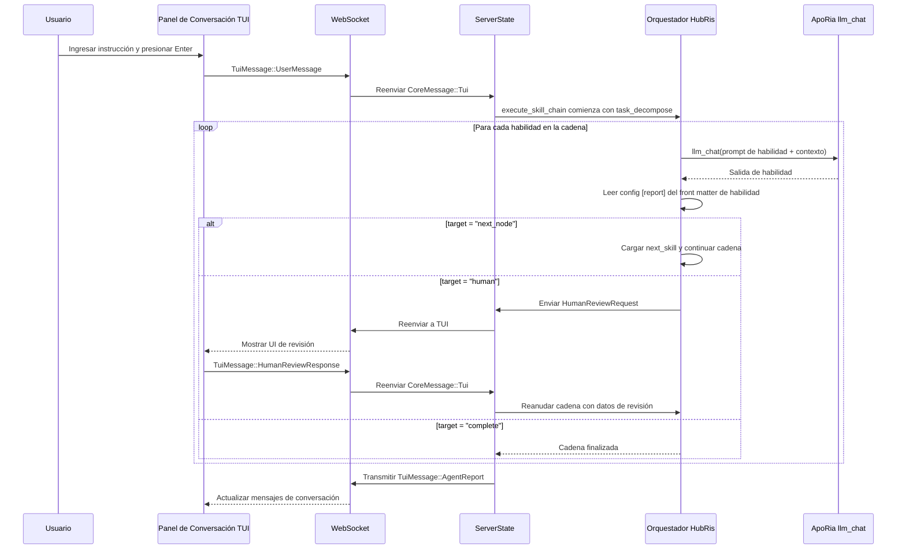

+++
title = "Diseño de Orquestación de Conversaciones (HubRis + ApoRia)"
description = """HubRis es un "Agente de Habilidad Pura" — todas las capacidades son habilidades solo de prompt"""
lang = "es"
category = "design"
subcategory = "core"
+++

# Diseño de Orquestación de Conversaciones (HubRis + ApoRia)

## Antecedentes

HubRis es un "Agente de Habilidad Pura" — todas las capacidades son habilidades solo de prompt
invocadas a través de ApoRia `llm_chat`. Después de implementar la capa de enrutamiento de reportes,
las habilidades declaran su comportamiento de enrutamiento en el front matter TOML mediante una
sección `[report]`, reemplazando la lógica de orquestación hardcodeada.

## Objetivos

1. Las habilidades declaran su comportamiento de enrutamiento en el front matter (no hardcodeado).
1. Un ejecutor genérico de cadena de habilidades reemplaza el pipeline de 2 etapas hardcodeado.
1. La revisión humana es un destino de enrutamiento de primera clase.
1. Limpieza del lenguaje de prompts: los archivos planos de habilidad/MCP son solo en inglés.

## Configuración de Reporte de Habilidad (Front Matter TOML)

```toml
[report]
target = "next_node"              # "next_node" | "parent" | "human" | "complete"
next_skill = "workplan_generate"  # requerido si target = "next_node"
```

## Cadena de Habilidades de HubRis

```text
task_decompose → workplan_generate → operator → workplan_execute → submit_report → human
```

## Flujo de Extremo a Extremo



## Destinos de Enrutamiento de Reporte

| Destino       | Comportamiento                                                        |
| --- | --- |
| `next_node`  | El ejecutor carga la habilidad nombrada en `next_skill` y la ejecuta.     |
| `parent`     | Devuelve el control al orquestador padre (reservado para cadenas anidadas). |
| `human`      | Pausa la cadena, envía `HumanReviewRequest` a TUI, reanuda con `HumanReviewResponse`. |
| `complete`   | Termina la cadena y devuelve el `AgentReport` acumulado.  |

## Estructura de Archivos (Fase 1)

```text
res/prompts/agents/hubris/skills/
  task_decompose.md
  workplan_generate.md
  operator.md
  workplan_execute.md
  submit_report.md
```

Cada archivo es un documento Markdown plano, solo en inglés, con front matter TOML
que contiene la sección `[report]` y cualquier otro metadato de habilidad.

## Configuración de Idioma Humano

La configuración de runtime del agente incluye un campo `human_language` usando nombres de idioma
nativos (ej. `"中文"`, `"English"`, `"日本語"`). Esto controla el idioma
de toda la salida orientada al usuario sin afectar los archivos de prompt de habilidad solo en inglés.

## Política de Modelo Predeterminado

El inicio usa `glm-4.7-flash` como el modelo predeterminado normalizado del entorno.
ApoRia `llm_chat` usa ese modelo por defecto para mantener bajo el costo de desarrollo y pruebas.

## Política de Respaldo ante Fallos

1. Si una habilidad falla: devolver mensaje de fallo y finalizar la cadena actual.
1. Si ApoRia está fuera de línea: devolver mensaje `Agent not ready`.
1. Si la revisión humana agota el tiempo: devolver aviso de tiempo de espera sin bloquear

chats subsiguientes.
