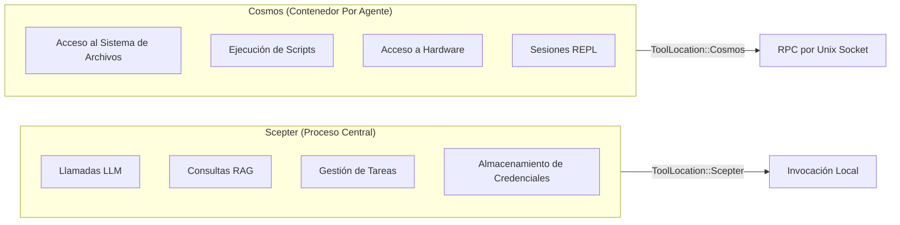
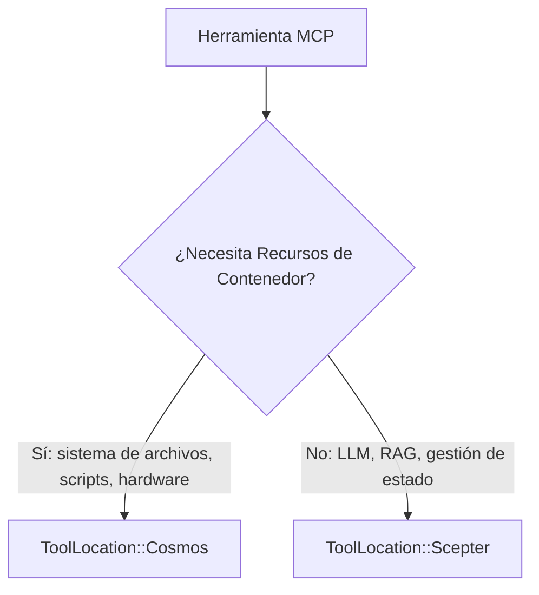
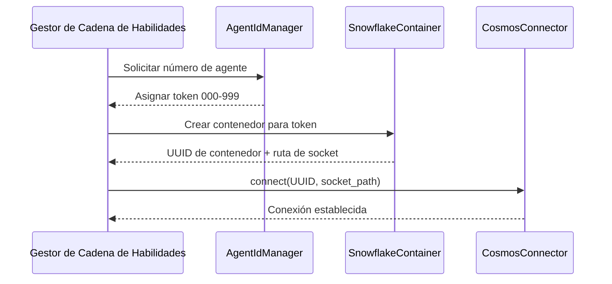
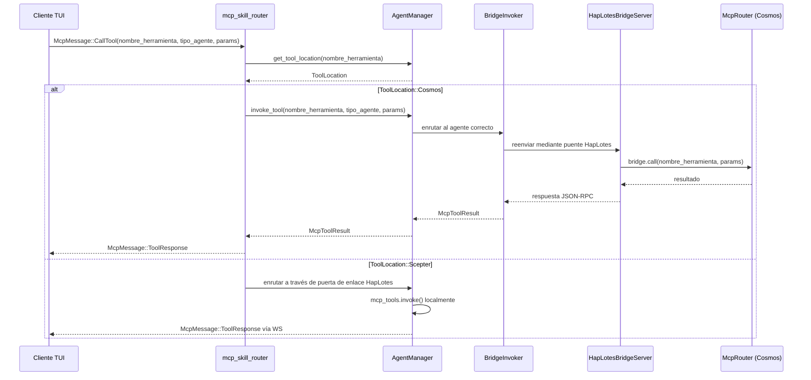
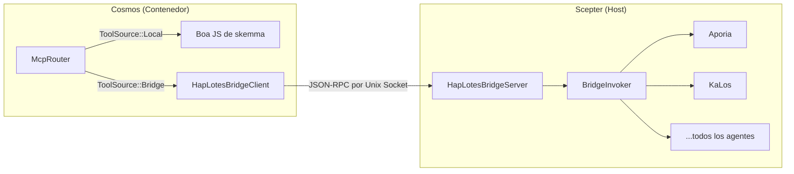
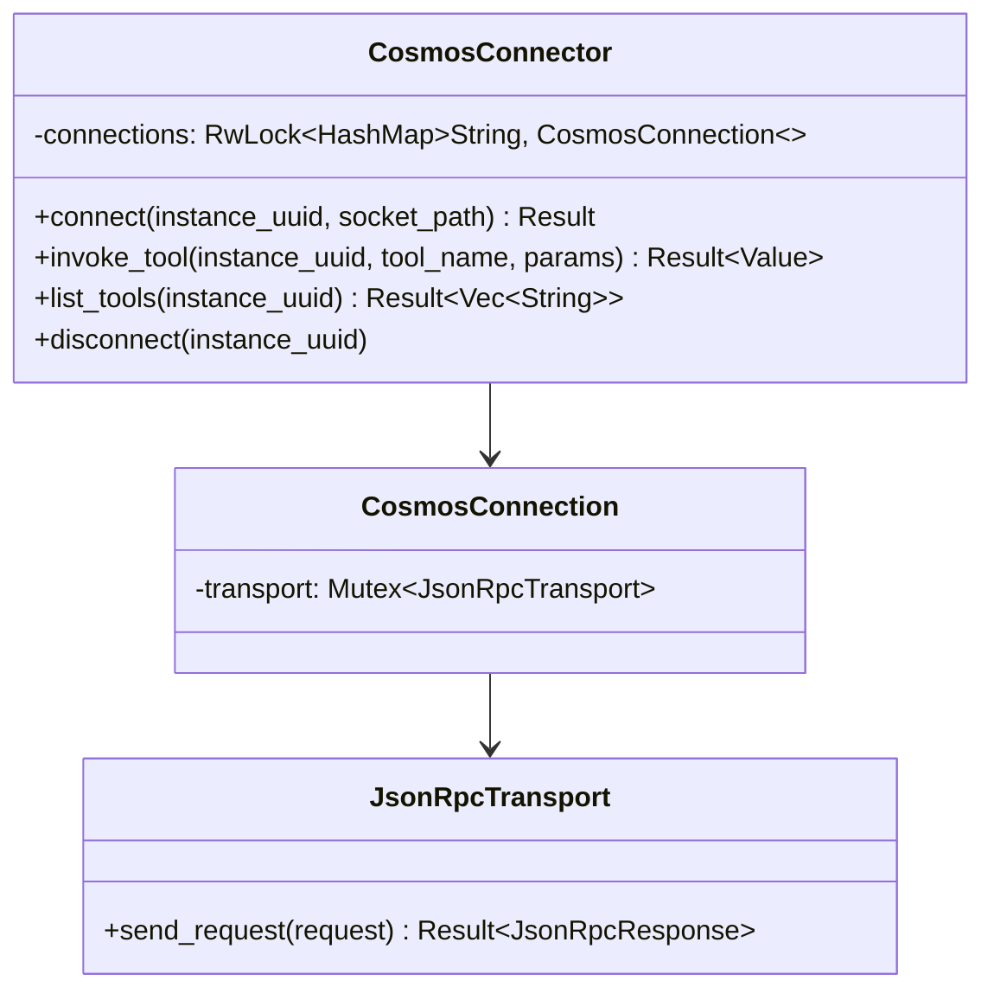
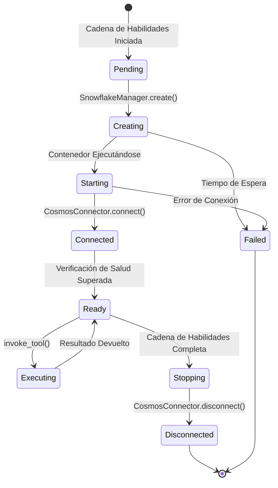
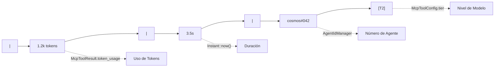
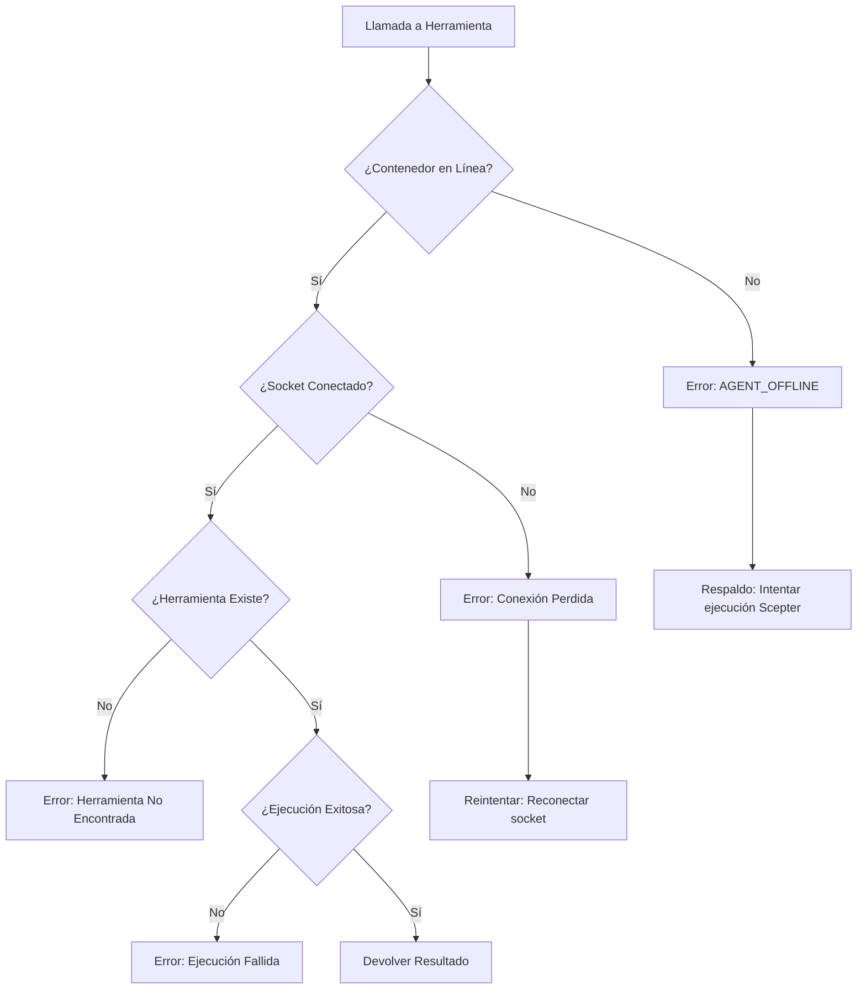

+++
title = "Diseño de Programación de Contenedores Cosmos y Enrutamiento de Tokens"
description = """Este documento describe la arquitectura de programación de contenedores Cosmos: cómo las herramientas MCP marcadas con `ToolLocation::Cosmos` se enrutan a través de JSON-RPC por Unix socket a sus cont"""
lang = "es"
category = "design"
subcategory = "core"
+++

# Diseño de Programación de Contenedores Cosmos y Enrutamiento de Tokens

## Descripción General

Este documento describe la arquitectura de programación de contenedores Cosmos: cómo las herramientas MCP marcadas con `ToolLocation::Cosmos` se enrutan a través de JSON-RPC por Unix socket a sus contenedores correspondientes, y cómo el sistema de tokens (número de agente) se vincula con la identidad y el enrutamiento del contenedor.

## I. Modelo de Ubicación de Herramientas

### Entorno de Ejecución Dual



### Enum ToolLocation

| Variante | Sitio de Ejecución | Transporte |
| --- | --- | --- |
| `Scepter` (predeterminado) | En proceso mediante `McpToolInvoker` | Llamada directa a función |
| `Cosmos` | En contenedor mediante `CosmosConnector` | JSON-RPC por Unix socket |

### Criterios de Decisión de Ubicación



Las herramientas que requieren recursos de contenedor (sistema de archivos, ejecución de scripts, acceso a hardware) se marcan `Cosmos`. Los servicios centralizados (LLM, RAG, gestión de tareas, interacción humana) permanecen `Scepter`.

## II. Sistema de Tokens e Identidad del Contenedor

### Asignación de Número de Agente



### Propiedades del Token

| Propiedad | Descripción |
| --- | --- |
| Formato | Número de tres dígitos: `000`-`999` |
| Asignador | `AgentIdManager` en la cadena de habilidades |
| Vinculación | Un token por panel de cadena de habilidades |
| Visualización | Mostrado en la línea de estadísticas TUI como `cosmos#NNN` |
| Persistencia | Sobrevive a reinicios de agente |

## III. Flujo de Enrutamiento de Solicitudes

### Llamada MCP Originada en TUI



### Lógica de Enrutamiento Clave

La decisión de enrutamiento ocurre en `mcp_skill_router.rs`:

1. Verificar `agent_manager.get_tool_location(nombre_herramienta)`
1. Si `ToolLocation::Cosmos` y modo contenedorizado activo:

   - Llamar `agent_manager.invoke_tool()` que enruta a través de `BridgeInvoker` → puente HapLotes → `McpRouter` de Cosmos
   - El `McpRouter` de Cosmos despacha localmente (skemma) o de vuelta a Scepter mediante puente para agentes remotos
   - Devolver `McpMessage::ToolResponse` directamente a TUI

1. De lo contrario: enrutar a través de la puerta de enlace HapLotes al proceso del agente

## IV. Arquitectura CosmosConnector / Puente

### Puente HapLotes (Actual)

El puente HapLotes es el **único canal de comunicación** entre Scepter y los contenedores Cosmos.



### Pool de Conexiones (CosmosConnector — lado Scepter)



### Protocolo JSON-RPC

Todos los nombres de método usan el enum `UnixMethod` para seguridad de tipos en tiempo de compilación:

| Variante UnixMethod | Dirección | Parámetros |
| --- | --- | --- |
| `UnixMethod::McpCall` | Scepter → Cosmos | `{ tool_name, parameters }` |
| `UnixMethod::McpListTools` | Scepter → Cosmos | Ninguno |
| `UnixMethod::ReplSnapshot` | Scepter → Cosmos | `{ path }` |
| `UnixMethod::ReplRestore` | Scepter → Cosmos | `{ path }` |
| `UnixMethod::BridgeCall` | Cosmos → Scepter | `{ tool_name, parameters }` |
| `UnixMethod::BridgeListTools` | Cosmos → Scepter | Ninguno |

### Formato de Respuesta

```json
{
  "success": true,
  "data": { ... },
  "error": null
}
```

## V. Ciclo de Vida del Contenedor



### Agentes de Contenedor

Dentro de los contenedores Cosmos, solo skemma se ejecuta localmente (motor Boa JS). Todas las demás herramientas de agente se enrutan a través del puente HapLotes de vuelta a Scepter:

| Agente | Rol | ¿En Cosmos? |
| --- | --- | --- |
| SkeMma | Ejecución de scripts (Boa JS) | **Local** (en proceso) |
| Aporia | Chat LLM | Vía puente → Scepter |
| KaLos | E/S de archivos | Vía puente → Scepter |
| NeiKos | Gestión de contenedores | Vía puente → Scepter |
| EleOs | Búsqueda web | Vía puente → Scepter |
| Todos los demás | Varios | Vía puente → Scepter |

## VI. Integración de Línea de Estadísticas

### Formato de Visualización

En la `AgentDetailPage` de TUI, la línea de estadísticas muestra:



| Segmento | Origen |
| --- | --- |
| `1.2k tokens` | `McpToolResult.token_usage` |
| `3.5s` | Duración desde `Instant::now()` |
| `cosmos#042` | Número de agente de `AgentIdManager` |
| `[T2]` | Nivel de modelo de `McpToolConfig.tier` |

## VII. Manejo de Errores

### Modos de Fallo



### Degradación con Gracia

Cuando el contenedor no está disponible, el sistema puede opcionalmente recurrir a la ejecución local `Scepter` si la herramienta tiene una implementación local registrada.

## VIII. Extensiones Futuras

| Característica | Descripción | Prioridad |
| --- | --- | --- |
| Pooling de contenedores | Reutilizar contenedores entre cadenas de habilidades | Media |
| Monitoreo de salud | Verificaciones periódicas de salud del contenedor | Alta |
| Límites de recursos | Límites de CPU/memoria por contenedor | Alta |
| Herramientas multi-contenedor | Herramientas que abarcan múltiples contenedores | Baja |
| Migración de contenedores | Mover contenedores en ejecución entre hosts | Baja |
