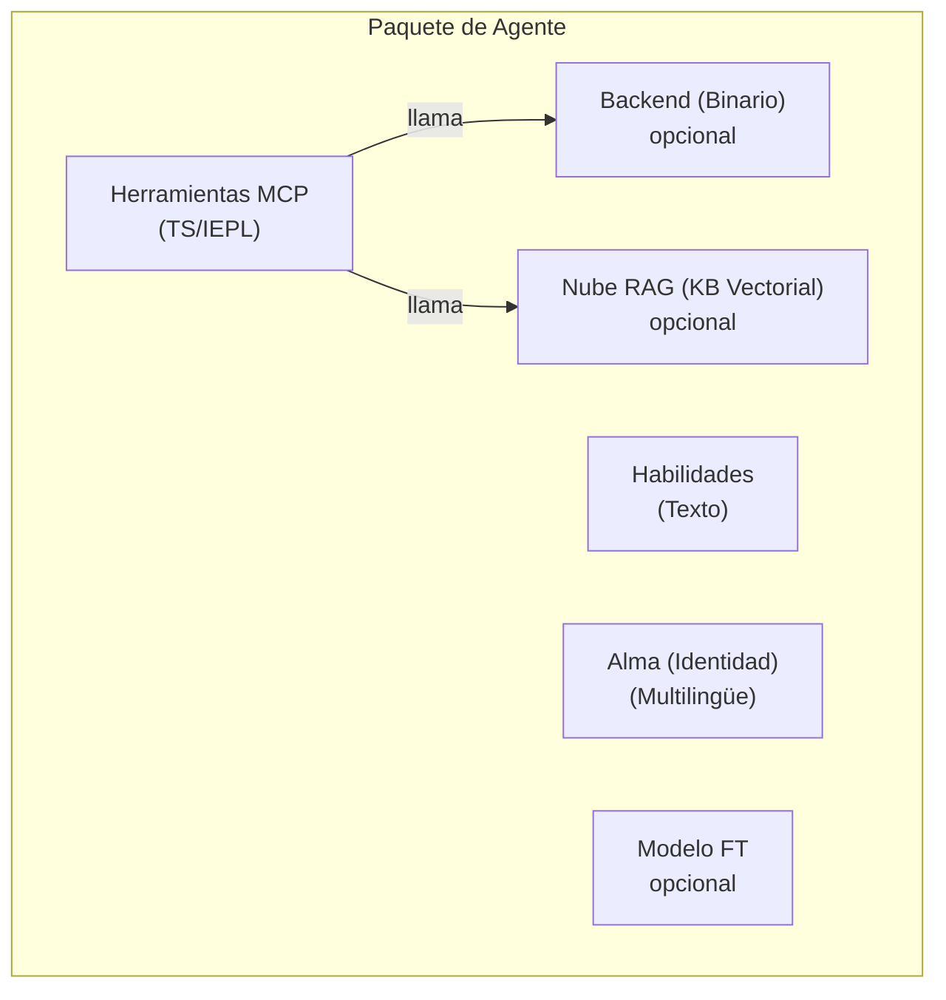

+++
title = "Especificación de Paquete de Agente de Capa 2/3"
description = """> Estado: Borrador v1 — 2026-06-26"""
lang = "es"
category = "design"
subcategory = "core"
+++

# Especificación de Paquete de Agente de Capa 2/3

> **Estado**: Borrador v1 — 2026-06-26
> **Alcance**: Define el formato de paquete autocontenido para agentes de Capa 2 y Capa 3.

## Descripción General

Un agente de Capa 2/3 es un **paquete autocontenido** compuesto de hasta cinco
componentes. El paquete es la unidad de distribución — puede ser instalado,
actualizado y eliminado independientemente.



## Cinco Componentes

### 1. Herramientas MCP (IEPL TypeScript)

La interfaz de herramienta principal. Escritas como fuente TypeScript que se ejecuta en el
sandbox IEPL (runtime Boa JS). Cada archivo de herramienta exporta una función:

```typescript
// mcp/memory_store.ts
import type { McpResult } from '@entecheia/sdk';

export async function memory_store(params: {
  text: string;
  node_type: string;
  entity_type?: string;
  properties?: Record<string, string>;
}): Promise<McpResult> {
  const result = await backend.memory_store(params);
  return { ok: true, data: result };
}
```

Las herramientas pueden ser:

- **TS puro**: Solo lógica, compone otras herramientas o transforma datos
- **Respaldado por backend**: Llama a una primitiva proporcionada por el Backend MCP
- **Respaldado por nube**: Llama a una API remota (RAG, modelo, servicio externo)

El código fuente TypeScript es texto puro — puede ser versionado,
revisado y distribuido sin compilación. Una instalación de empaquetado de autoservicio
puede opcionalmente agrupar múltiples archivos `.ts` en un solo
`bundle.js` para carga eficiente.

### 2. Backend MCP (Binario Opcional)

Algunas herramientas necesitan capacidades más allá del sandbox IEPL (E/S de archivos, acceso a hardware,
conexiones de base de datos). Estas son proporcionadas por un **backend binario** —
un binario Rust que se ejecuta junto al proceso scepter.

- El backend se compila en la imagen Docker y se lleva en el

"bolsillo" de scepter (el directorio `/workspace-base/target/`).

- En tiempo de ejecución, scepter pasa dinámicamente la ruta del binario al entorno IEPL

mediante una importación de módulo `backend`.

- El backend expone operaciones primitivas; toda la composición y orquestación

ocurre en la capa TS.

Ejemplo de interfaz de backend (auto-generada desde Rust):

```typescript
// Auto-generado desde backend Rust
declare module 'backend' {
  export function memory_store_raw(params: {...}): Promise<McpResult>;
  export function memory_query_raw(query: string): Promise<McpResult>;
}
```

### 3. Habilidades (Texto Puro)

Los prompts de habilidad son archivos markdown con front-matter TOML. Definen
**cómo** el agente ejecuta tareas — el prompt del sistema, lista blanca de herramientas,
modo de ejecución y estructura del pipeline.

```markdown
+++
name = "memory_consolidate"
agent = "philia"
related_tools = ["memory_consolidate", "memory_query"]
location = "scepter"
execution_mode = "read"

[features]
tier = "worker"
+++

# memory_consolidate

Consolidar nodos de memoria en un episodio para recuperación estructurada...
```

Las habilidades son independientes del idioma (el cuerpo `#` es la plantilla del prompt).
Son texto puro — sin compilación, sin binario.

### 4. Base de Datos RAG (Opcional, Alojada en la Nube)

Una base de conocimiento vectorial que proporciona conocimiento específico del dominio al
agente. Alojada en la infraestructura en la nube de Entelecheia.

- Opcional: un agente puede funcionar sin RAG (capacidad reducida).
- Limitado por consultas: cuando la cuota se agota, las consultas devuelven vacío — el

agente se degrada con gracia.

- Referenciado por URL + clave API en el manifiesto, no empaquetado en el paquete.

### 5. Modelo Ajustado (Opcional, Alojado en la Nube)

Un modelo ajustado para el dominio específico del agente. También alojado en la nube.

- Opcional: los agentes usan por defecto el modelo general de la plataforma (ej., GLM-5).
- Puede ser de pesos abiertos en el futuro para auto-alojamiento.
- Referenciado por ID de modelo en el manifiesto.

## Estructura de Directorios del Paquete

```text
packages/agents/{nombre_agente}/
├── manifest.toml           # Metadatos y configuración del paquete
├── mcp/
│   ├── *.ts                # Implementaciones de herramientas TypeScript (IEPL)
│   └── *.md                # Documentación de herramientas (parámetros, retornos)
├── backend/                # Backend Rust opcional
│   ├── Cargo.toml
│   └── src/
│       └── lib.rs
├── skills/
│   └── *.md                # Prompts de habilidad
├── soul/
│   └── {lang}.md           # Personalidad del agente por idioma
├── rag.toml                # Opcional: referencia a base de datos RAG
└── model.toml              # Opcional: referencia a modelo ajustado
```

## Formato manifest.toml

```toml
[package]
name = "philia"              # Debe coincidir con el nombre del directorio
version = "0.2.0"
description = "Sistema de memoria cognitiva — almacenamiento, consulta, consolidación"
layer = 2                    # 2 = agente de plataforma, 3 = extensión
category = "complex_tool"    # simple_tool | complex_tool | coordinator

[dependencies]
# Otros paquetes de agente cuyas herramientas llama este agente
aporia = "0.2.0"

[backend]
# Omitir completamente para agentes de TS puro
type = "rust"
binary = "philia"            # Nombre del binario en /workspace-base/target/debug/
provides = [                 # Primitivas expuestas a la capa TS
  "memory_store_raw",
  "memory_query_raw",
  "memory_consolidate_raw",
]

[rag]
# Omitir si no se usa RAG en la nube
provider = "entelecheia-cloud"
database_id = "philia-knowledge-v1"
endpoint = "https://rag.entelecheia.ai/v1"

[model]
# Omitir si se usa el modelo predeterminado de la plataforma
provider = "entelecheia-cloud"
model_id = "philia-ft-v1"
endpoint = "https://model.entelecheia.ai/v1"
```

## SDK TS (`@entecheia/sdk`)

El SDK proporciona tipos y utilidades para autores de herramientas:

```typescript
// @entecheia/sdk — tipos
export interface McpResult {
  ok: boolean;
  data?: unknown;
  error?: string;
}

export interface McpToolParams {
  [key: string]: unknown;
}

// @entecheia/sdk — utilidades
export function rag_search(query: string): string;        // Búsqueda RAG (síncrona, en caché)
export function llm_chat(prompt: string): Promise<string>; // Llamada LLM
export function vars_get(key: string): unknown;           // Estado entre habilidades
export function vars_set(key: string, value: unknown): void;
```

El módulo `backend` es auto-generado por agente desde la lista `[backend].provides`
en el manifiesto. Proporciona envoltorios tipados alrededor de las primitivas binarias.

## Arquitectura de Capas

| Capa | Agentes | Se Distribuye Como | ¿Paquete? | ¿Contenedor? |
| --- | --- | --- | --- | --- |
| L1 | SkeMma, HapLotes, HubRis, KaLos, NeiKos, ApoRia, EleOs, EpieiKeia, OreXis, PhiLia, PoleMos, SkoPeo | Integrado en imagen | Solo backend (crates Rust) | No (en proceso) |
| L2 | ClassicSoftwareEngineering, WebAutomation, WebUiPanel, IndustrialIoT | Integrado en imagen | **Paquete completo** (TS + habilidades + alma) | Sí (e-skemma) |
| L3 | Extensiones instaladas por usuario | Instalación dinámica | **Paquete completo** | Sí (e-skemma) |

- **Capa 1** (12 agentes): Agentes centrales de la plataforma. Sus crates Rust proporcionan

las operaciones primitivas (E/S de archivos, memoria, contenedores, hardware, etc.).
NO son paquetes — SON la plataforma. Sus herramientas se exponen
como módulos importables (ej., `import { file_write } from 'kalos'`).

- **Capa 2** (4 agentes): Los primeros paquetes reales. No tienen **backend

binario** — son composiciones TS/IEPL puras de primitivas de Capa 1.
Se distribuyen con la imagen como ejemplos del formato de paquete.

- **Capa 3**: Paquetes instalados por usuario. Mismo formato que L2, pero cargados

dinámicamente. Pueden opcionalmente declarar un backend binario (compilado por el
usuario, inyectado mediante scepter).

## Ruta de Migración

Los crates Rust de agentes existentes (`packages/agents/*/src/`) se convierten en **backends**.
Sus docs de herramientas MCP (`res/prompts/agents/*/mcp/*.md`) se mueven al paquete.
Los prompts de habilidad (`res/prompts/agents/*/skills/*.md`) se mueven al paquete.
Los archivos de alma (`res/prompts/soul/`) se mueven al paquete.

El antiguo `shared/plugin_host` (basado en wasm) es reemplazado por el runtime TS IEPL
ya presente en `shared/iepl`. No se necesita compilación wasm.
