+++
title = "Diseño del Sistema de Configuración TOML de Proveedores"
description = """El Sistema de Configuración TOML de Proveedores migra toda la configuración de Proveedores LLM de valores hardcodeados a archivos de configuración TOML, logrando la separación de configuración y código, mejorando la mantenibilidad"""
lang = "es"
category = "design"
subcategory = "core"
+++

# Diseño del Sistema de Configuración TOML de Proveedores

## Descripción General

El Sistema de Configuración TOML de Proveedores migra toda la configuración de Proveedores LLM de valores hardcodeados a archivos de configuración TOML, logrando la separación de configuración y código, mejorando la mantenibilidad y extensibilidad.

## Objetivos Principales

| Objetivo | Descripción |
| --- | --- |
| Mantenibilidad | Configuración separada del código, sin necesidad de recompilación para cambios |
| Extensibilidad | Añadir un nuevo Proveedor solo requiere añadir un archivo TOML |
| Legibilidad | Los archivos de configuración son claros y fáciles de entender |
| Reutilización | La configuración puede compartirse entre diferentes entornos |

## Diseño de Arquitectura

### Proceso de Carga de Configuración

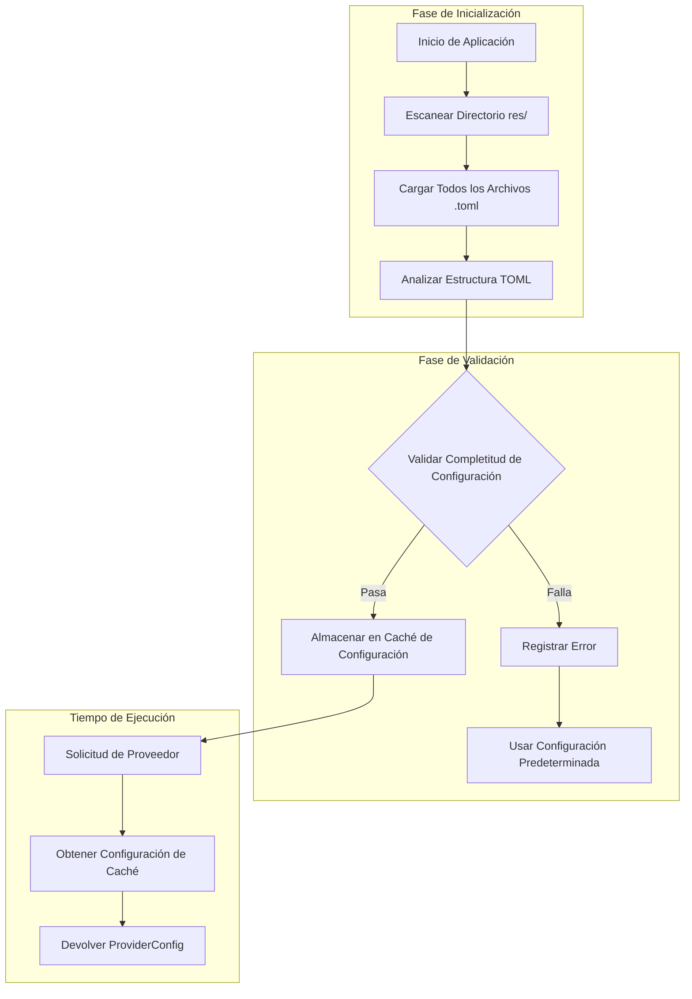

### Jerarquía de Configuración

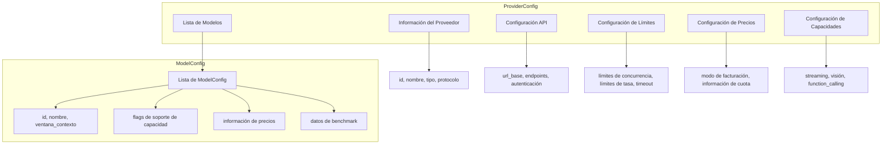

## Prioridad de Configuración

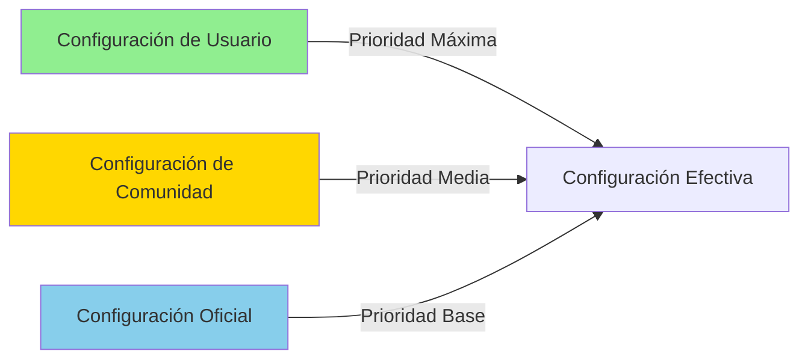

### Reglas de Fusión por Prioridad

| Capa | Origen | Descripción |
| --- | --- | --- |
| 1 | Configuración Oficial | Datos de documentación oficial del proveedor, como valores predeterminados base |
| 2 | Configuración de Comunidad | Configuración optimizada contribuida por la comunidad, anula datos oficiales |
| 3 | Configuración de Usuario | Configuración definida por el usuario, máxima prioridad |

## Modelos de Precios

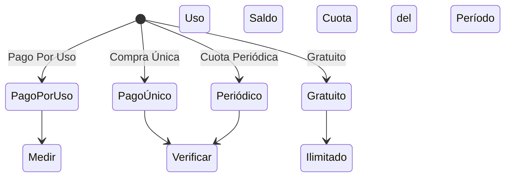

### Comparación de Modelos de Precios

| Modelo | Escenarios Aplicables | Características |
| --- | --- | --- |
| PagoPorUso | OpenAI, Anthropic | Pago por token, deducción en tiempo real |
| PagoÚnico | Paquetes prepagados | Compra previa de cuota, usar hasta agotar |
| Periódico | GLM China, etc. | Reinicio de cuota periódica |
| Gratuito | Modelos locales Ollama | Sin límites de coste |

## Clasificación de Tipos de Proveedor

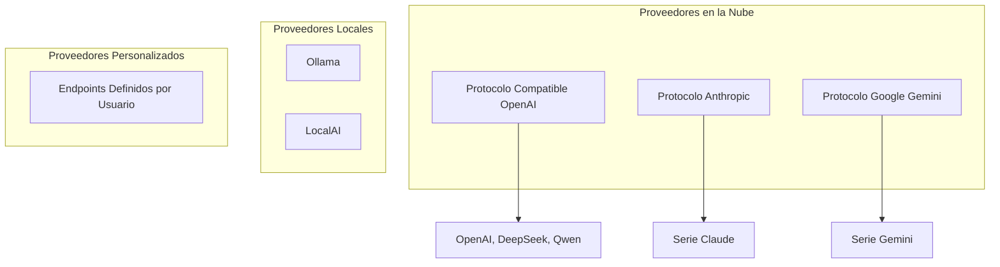

## Mecanismo de Recarga en Caliente

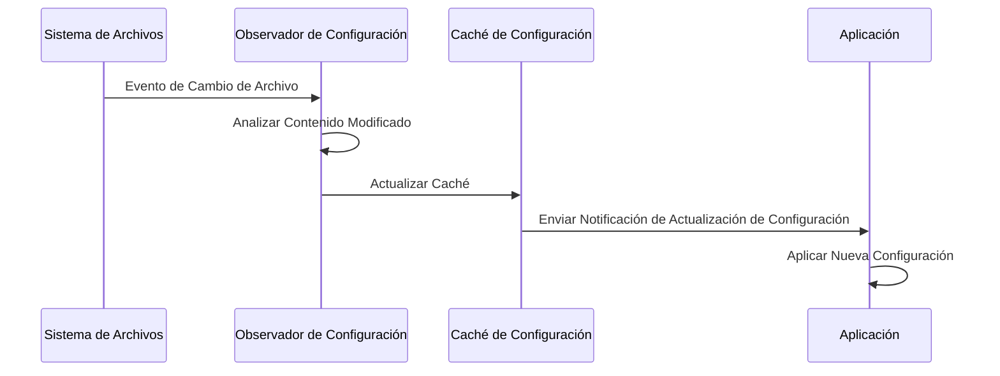

## Estrategia de Manejo de Errores

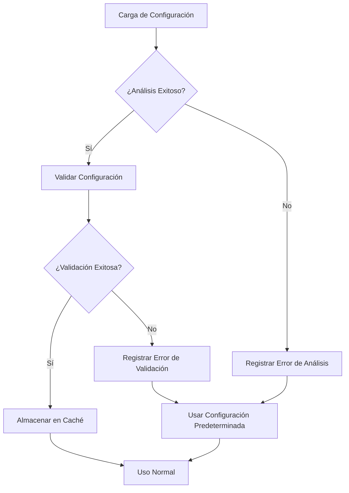

## Diseño de Extensibilidad

### Añadir Nuevo Proveedor

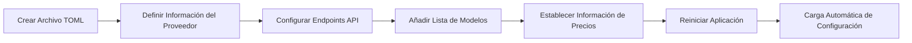

### Reglas de Validación de Configuración

| Campo | Regla de Validación | Manejo de Error |
| --- | --- | --- |
| provider.id | No vacío, único | Rechazar carga, registrar error |
| api.base_url | Formato URL válido | Usar valor predeterminado |
| models[].id | No vacío | Omitir ese modelo |
| pricing.model | Verificación de valor enum | Predeterminado PagoPorUso |

## Consideraciones de Seguridad

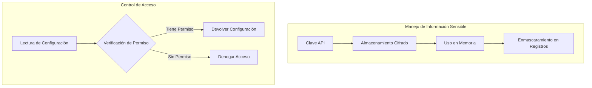

## Extensiones Futuras

| Característica | Descripción | Prioridad |
| --- | --- | --- |
| Recarga en Caliente de Configuración | Cargar archivos de configuración externos en tiempo de ejecución | Alta |
| Validación de Configuración | Validar completitud de configuración al inicio | Alta |
| Fusión de Configuración | Configuración de usuario anula configuración predeterminada | Media |
| Importar/Exportar Configuración | Soporte para importar/exportar archivos de configuración | Media |
| Actualización de Agente | Auto-actualizar configuración desde documentos oficiales | Baja |

# Diseño de Gestión de Metadatos de Proveedores

## Descripción General

El sistema de Gestión de Metadatos de Proveedores es responsable de obtener dinámicamente información de configuración de la documentación oficial de Proveedores LLM, permitiendo actualizaciones automatizadas y validación de datos de configuración.

## Problema Principal

La implementación actual contiene estadísticas de uso hardcodeadas y carece de soporte dinámico de datos de Proveedores. Es necesario establecer un mecanismo automatizado de adquisición y gestión de metadatos.

## Diseño de Arquitectura

### Arquitectura de Flujo de Datos

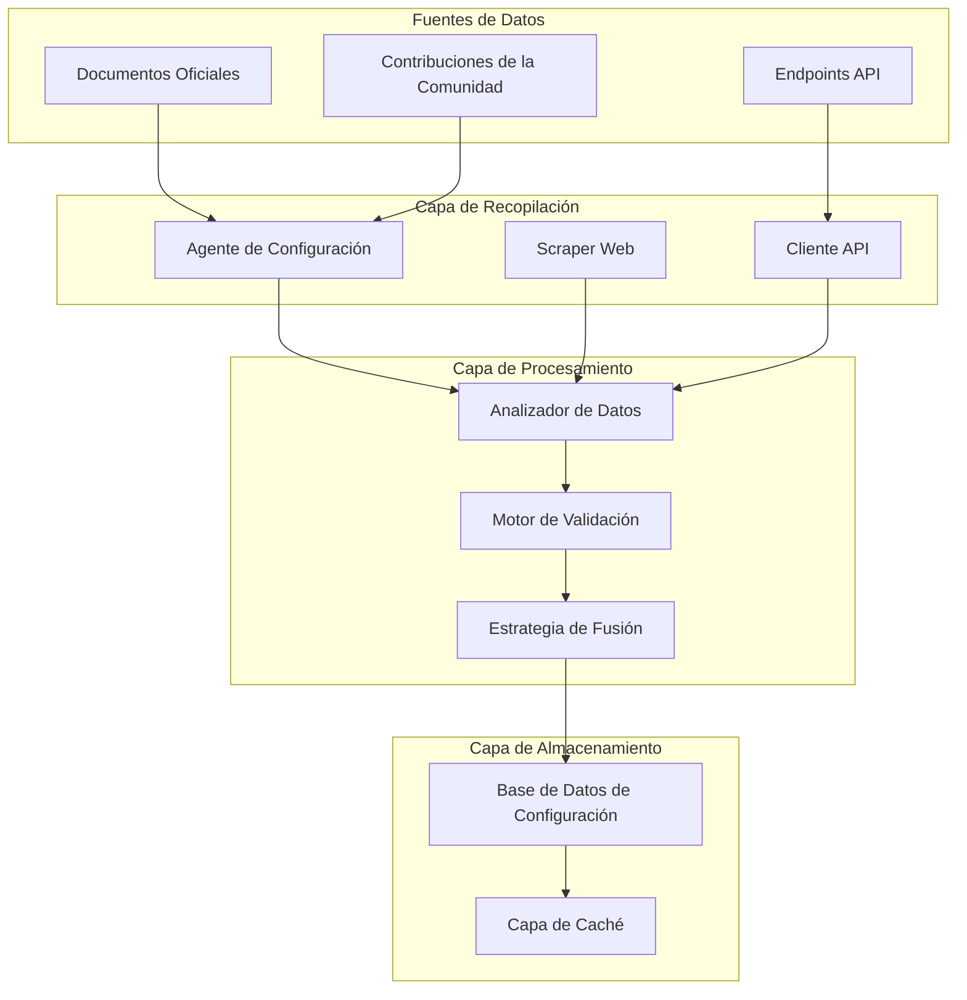

### Modelo de Prioridad de Configuración

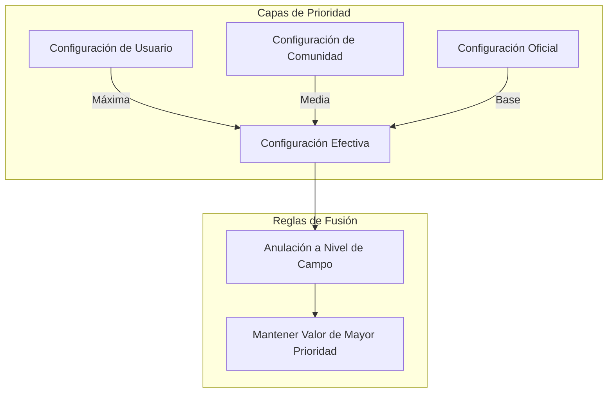

## Estructura de Metadatos

### Jerarquía de Configuración del Proveedor

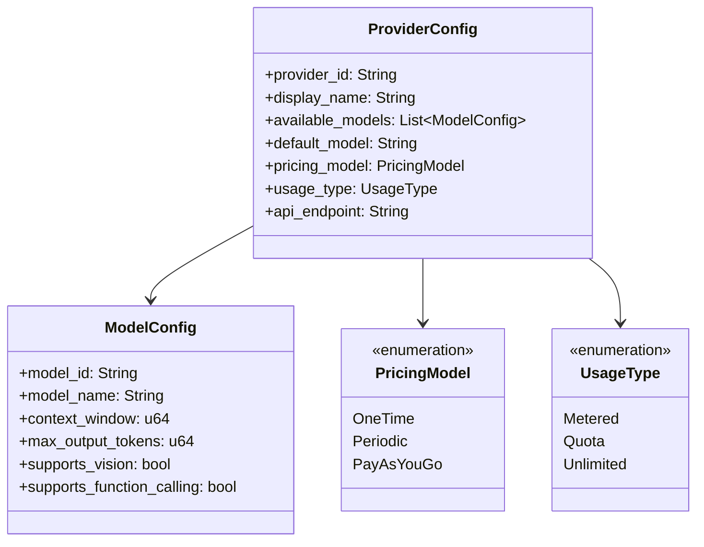

### Clasificación de Origen de Configuración

| Tipo de Origen | Descripción | Fiabilidad | Frecuencia de Actualización |
| --- | --- | --- | --- |
| Oficial | Documentación oficial del proveedor | Alta | Periódica automática |
| Comunidad | Datos contribuidos por la comunidad | Media | Actualización manual |
| Anulación de Usuario | Personalizado por el usuario | Máxima | Tiempo real |

## Sistema de Recopilación por Agentes

### Proceso de Recopilación

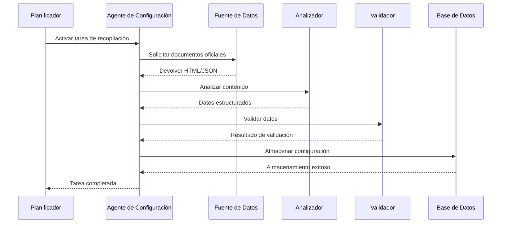

### Responsabilidades del Agente de Proveedor

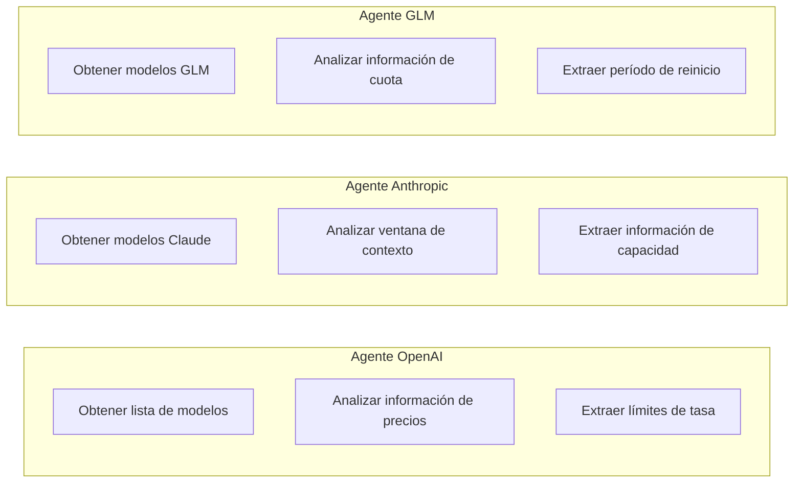

## Mecanismo de Validación de Datos

### Proceso de Validación

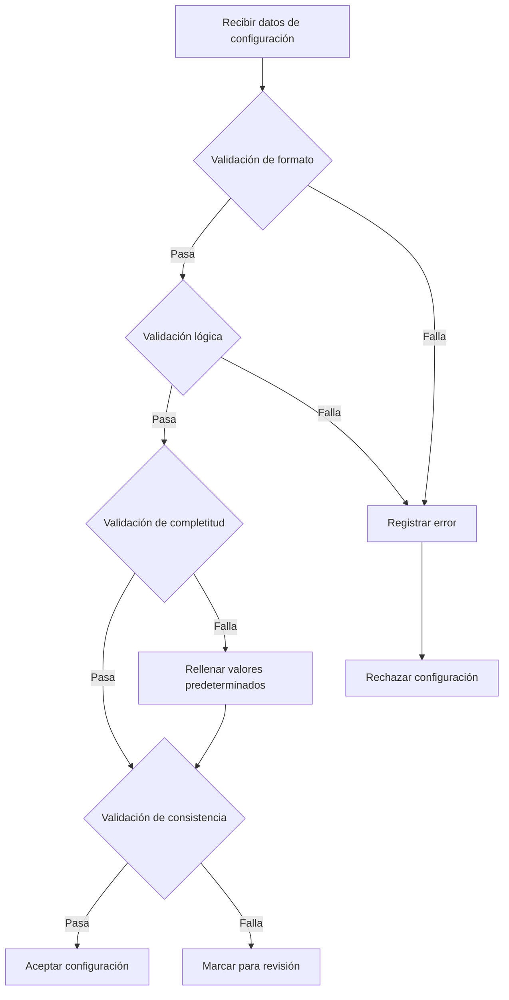

### Reglas de Validación

| Tipo de Validación | Contenido Verificado | Manejo de Fallo |
| --- | --- | --- |
| Validación de formato | Tipos de datos, formatos de campo | Rechazar y registrar |
| Validación lógica | Rangos de valores, valores enum | Usar valores predeterminados |
| Validación de completitud | Campos requeridos existen | Rellenar valores predeterminados |
| Validación de consistencia | Relaciones entre campos correctas | Marcar para revisión |

## Estrategia de Fusión de Configuración

### Fusión a Nivel de Campo

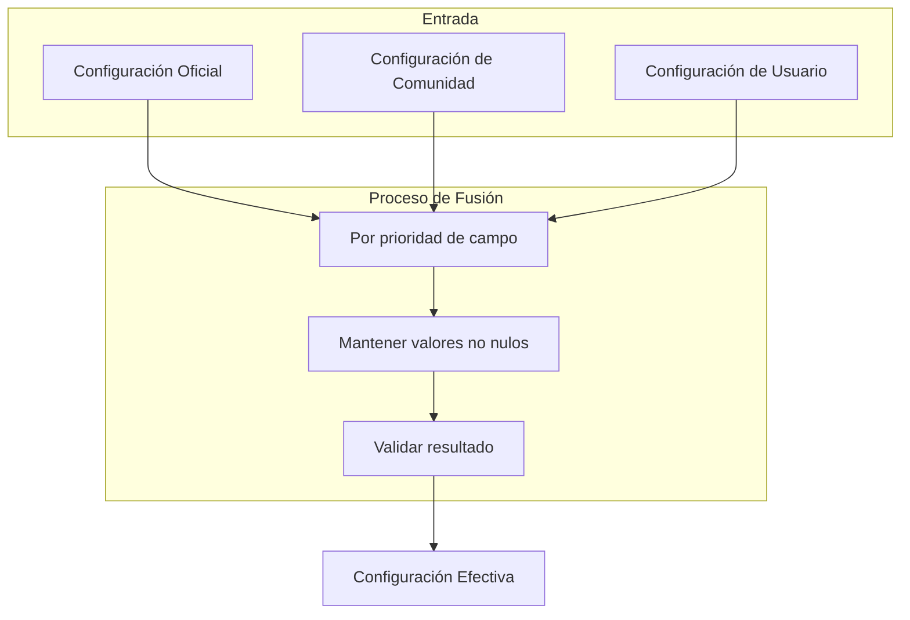

### Ejemplo de Fusión

| Campo | Valor Oficial | Valor Comunidad | Valor Usuario | Valor Final |
| --- | --- | --- | --- | --- |
| context_window | 128000 | - | 64000 | 64000 |
| max_concurrent | 100 | 50 | - | 50 |
| pricing_model | PagoPorUso | - | - | PagoPorUso |

## Interfaz de Configuración de Usuario

### Estructura del Archivo de Configuración

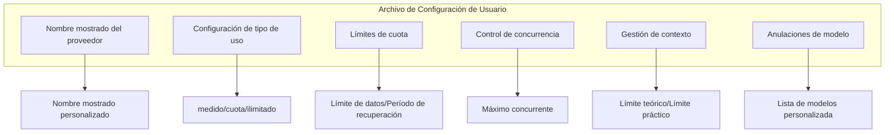

## Mecanismo de Actualización Programada

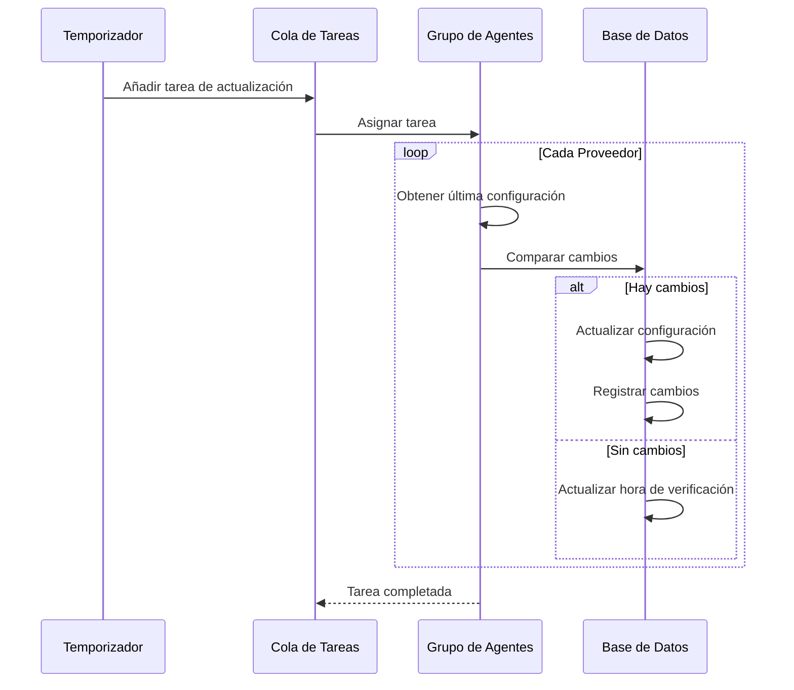

## Manejo de Errores

### Manejo de Fallo de Recopilación

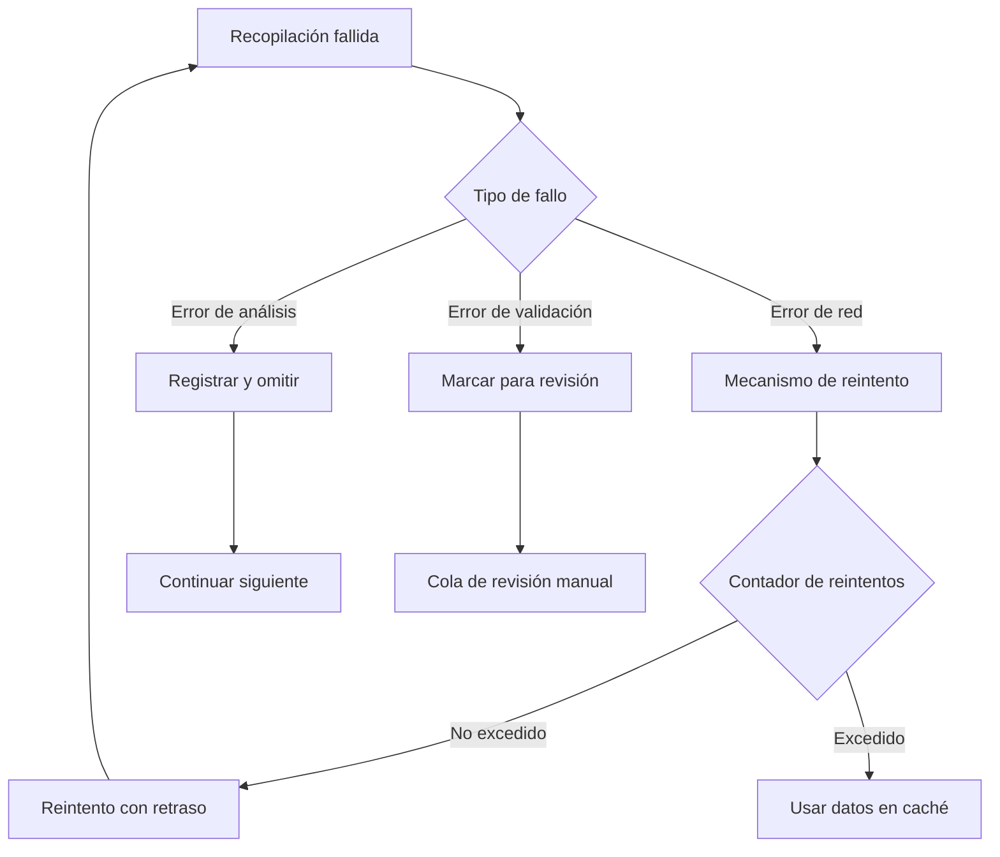

## Diseño de Extensibilidad

### Añadir Nuevo Proveedor

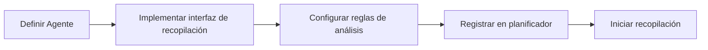

### Puntos de Extensión

| Tipo de Extensión | Descripción | Implementación |
| --- | --- | --- |
| Nuevo Proveedor | Añadir nueva fuente de configuración | Implementar interfaz de Agente de Proveedor |
| Nuevo campo | Extender estructura de configuración | Actualizar modelo de datos y reglas de validación |
| Nueva regla de validación | Añadir lógica de validación | Añadir implementación de validador |

## Implementación de Agente de Capa 3

### Agente ProviderScratch

`ProviderScratch` es el primer Agente oficial de Capa 3, sirviendo como implementación de ejemplo de instalaciones de scraping.

```mermaid
flowchart TB
    subgraph Agente ProviderScratch
        A[Entrada del Agente] --> B{Modo de Ejecución}
        B -->|Modo TUI| C[Interfaz Interactiva]
        B -->|Modo CI| D[Ejecución Automatizada]

        C --> E[Seleccionar Proveedor]
        D --> F[Leer variables de entorno]

        E --> G[Llamar Habilidad]
        F --> G

        G --> H[Scrapear documentos]
        H --> I[Analizar datos]
        I --> J[Generar TOML]

        J --> K{¿Confirmar commit?}
        K -->|Sí| L[Escribir en espacio de trabajo]
        K -->|No| M[Descartar cambios]

        L --> N[Solicitar commit al usuario]
    end
```

### Arquitectura de Habilidades

Cada Proveedor corresponde a una Habilidad independiente:

```mermaid
graph LR
    subgraph Habilidades
        A[openai]
        B[anthropic]
        C[glm]
        D[deepseek]
        E[qwen]
        F[gemini]
    end

    subgraph Componentes Compartidos
        G[Scraper de Documentos]
        H[Analizador de Datos]
        I[Generador TOML]
    end

    A --> G
    B --> G
    C --> G
    D --> G
    E --> G
    F --> G

    G --> H
    H --> I
```

### Estructura de Directorios

```mermaid
flowchart LR
    Root[".amphoreus/provider_scratch/"]
    AT["agent.toml"]
    OV["overview/"]
    SK["skills/"]
    Root --> AT
    Root --> OV
    Root --> SK
    OV --> ZH["zhs.md"]
    SK --> OA["openai/"]
    SK --> AN["anthropic/"]
    SK --> GL["glm/"]
    SK --> DS["deepseek/"]
    SK --> QW["qwen/"]
    SK --> GE["gemini/"]
    OA --> OAP["prompt.md"]
    AN --> ANP["prompt.md"]
    GL --> GLP["prompt.md"]
    DS --> DSP["prompt.md"]
    QW --> QWP["prompt.md"]
    GE --> GEP["prompt.md"]
```

### Automatización CI

```mermaid
flowchart LR
    A[Disparador programado] --> B[Checkout de código]
    B --> C[Ejecutar ProviderScratch]
    C --> D{Detectar cambios}
    D -->|Hay cambios| E[Crear rama]
    E --> F[Commitear cambios]
    F --> G[Crear PR]
    G --> H[Esperar revisión]
    D -->|Sin cambios| I[Completar]
```

### Variables de Entorno

| Nombre de Variable | Descripción |
| --- | --- |
| `AMPHOREUS_PROVIDER_SCRATCH_PROVIDERS` | Lista de proveedores a scrapear |
| `AMPHOREUS_PROVIDER_SCRATCH_OUTPUT_DIR` | Ruta del directorio de salida |
| `AMPHOREUS_PROVIDER_SCRATCH_GIT_BRANCH` | Rama Git objetivo |
| `AMPHOREUS_PROVIDER_SCRATCH_DRY_RUN` | Solo simulación |

## Planes Futuros

| Característica | Descripción | Prioridad |
| --- | --- | --- |
| Control de versiones de configuración | Rastrear historial de cambios de configuración | Alta |
| Notificación de cambios | Notificar a usuarios sobre actualizaciones de configuración | Media |
| Reversión de configuración | Soporte para revertir a versiones históricas | Media |
| Recomendaciones inteligentes | Recomendar configuraciones basadas en patrones de uso | Baja |
| Agente GitHub巡回 | Auto-crear PRs para actualizar configuraciones | Alta |
