+++
title = "Arquitectura de Namespaces: `vars`, `refs`, `env`"
description = """> Nota (2026-06): La superficie de herramientas visible para el LLM se redujo de 5 a 3 primitivas. `ref_add` y `ref_remove` ya no se exponen al LLM — `agent_allowed_tools()` devuelve solo `exec`, `write_to_"""
lang = "es"
category = "design"
subcategory = "core"
+++

# Arquitectura de Namespaces: `vars`, `refs`, `env`

> **Nota (2026-06)**: La superficie de herramientas visible para el LLM se redujo de 5 a 3 primitivas. `ref_add` y `ref_remove` **ya no se exponen al LLM** — `agent_allowed_tools()` devuelve solo `exec`, `write_to_var`, `write_to_var_json`. El namespace `__refs` todavía existe como estructura de datos interna (instantánea/restauración, inyección de prompt) pero ya no es mutado directamente por el modelo. Las secciones a continuación que describen el despacho de `ref_add`/`ref_remove` documentan la fontanería interna residual, no la superficie de herramientas del LLM.

## Descripción General

Entelecheia proporciona tres namespaces compartidos dentro del runtime JavaScript IEPL (`globalThis.$`) que sirven como sustrato de comunicación entre habilidades y entre agentes. Estos namespaces operan a nivel del **runtime Cosmos**, lo que significa que todos los agentes y habilidades los comparten de forma transparente dentro de una única sesión.

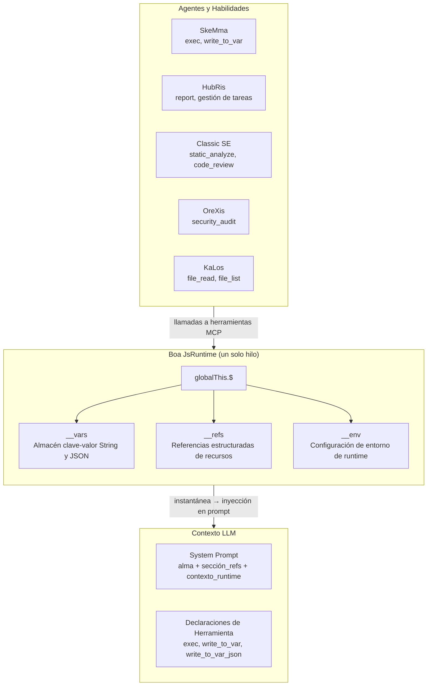

### Principios de Diseño

| Principio | Descripción |
| --- | --- |
| **Fuente Única de Verdad** | Cada namespace tiene exactamente un módulo (`var_namespace.rs`, `ref_namespace.rs`, `namespace.rs`) que genera **todo** el código JS que referencia ese namespace |
| **Inicialización Perezosa** | `__vars` y `__refs` se inicializan una vez en `JsRuntime::new()` y sobreviven a través de cadenas de habilidades; `__env` se inicializa durante la evaluación JS del namespace |
| **Instantánea/Restauración** | El estado completo `__vars` + `__refs` es capturable y restaurable, permitiendo la persistencia de sesión |
| **Inyección en Prompt** | Los datos de instantánea impulsan prompts de sistema ricos en contexto — el LLM ve nombres de variables disponibles, resúmenes de referencias y configuraciones de entorno |
| **Control de Acceso a Herramientas** | Las 3 herramientas internas de cosmos (`exec`, `write_to_var`, `write_to_var_json`) se conceden a cada agente mediante `agent_allowed_tools()`; los SOP de habilidades individuales definen cuáles usar |

---

## Comparación de Namespaces

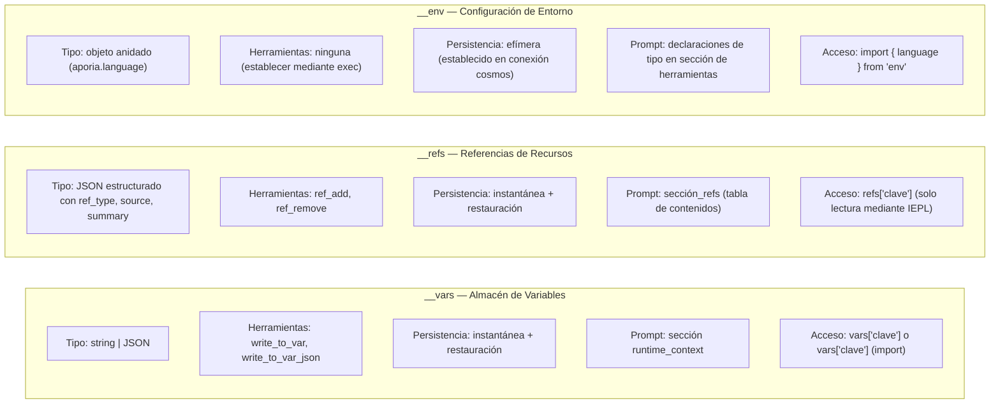

---

## 1. `__vars` — Almacén de Variables (`vars`)

### 1.1 Propósito

`__vars` es el **mecanismo principal de comunicación entre pasos** dentro de una cadena de habilidades. Las habilidades usan `write_to_var` / `write_to_var_json` para persistir resultados calculados, y los pasos subsiguientes (o habilidades) leen de `__vars` en bloques `exec`.

### 1.2 Arquitectura del Módulo

Toda la generación de código JS de `__vars` está centralizada en `packages/shared/core/src/var_namespace.rs`.

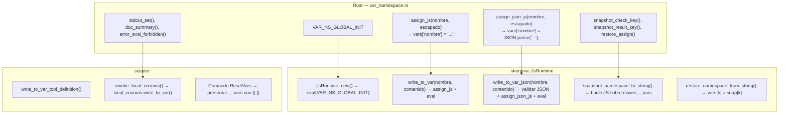

### 1.3 Secuencia de Inicialización

```text
JsRuntime::new()
  → context.eval("globalThis.$ = globalThis.$ || {}; globalThis.__vars = {}; globalThis.__refs = {};")
  → __vars inicializado como objeto vacío
```

La inicialización se ejecuta **antes** de `build_namespace_js()` (que configura `__env` y `$.variant`), asegurando que `__vars` esté siempre disponible cuando los módulos del namespace se cargan.

> **Nota:** `__refs` se inicializa junto con `__vars` mediante `VAR_NS_GLOBAL_INIT` (definido en `var_namespace.rs`). El `REF_NS_GLOBAL_INIT` independiente en `ref_namespace.rs` existe por simetría pero nunca se llama directamente — la inicialización real ocurre en `JsRuntime::new()`.

### 1.4 Operaciones

| Operación | Nombre de Herramienta | Tipo | Comportamiento |
| --- | --- | --- | --- |
| Almacenar string | `write_to_var` | Bloqueante | Escapa contenido para JS, evalúa `vars['nombre'] = 'contenido'` |
| Almacenar JSON | `write_to_var_json` | Bloqueante | Valida JSON, evalúa `vars['nombre'] = JSON.parse('contenido')` |
| Leer en exec | `exec` | DispararYOlvidar | Acceso directo: `vars['nombre']` o `import vars from 'vars'` |
| Instantánea | (interno) | — | Captura todas las claves `__vars` como `{"$vars": {...}}` |
| Restaurar | (interno) | — | Establece `vars[k] = snap['$vars'][k]` para cada clave |
| Reiniciar | (interno) | — | `__vars = __vars \|\| {}` — preserva valores existentes, asegura estructura |

### 1.5 Inyección en Prompt

En `build_runtime_context()` (`prompt.rs:472`), el almacén de variables aparece en el system prompt como:

```text
## Contexto de Runtime JS

__vars (de write_to_var / write_to_var_json, N total):
  `var_1`, `var_2`, `var_3`, ... (hasta 30 mostrados)
  Importar como: `import vars from 'vars';`  Acceso: `vars['clave']`
```

### 1.6 Visualización de Salida

- Almacenamiento string: `vars['nombre'] establecido:\n{primeros 200 caracteres / 5 líneas}... (total_caracteres caracteres)`
- Almacenamiento JSON: `vars['nombre'] establecido (JSON analizado): objeto con 3 clave(s)`
- Fallo de análisis: Error con vista previa del contenido (primeros 200 caracteres)

### 1.7 Módulo Sintético `vars`

Similar a `env`, el módulo `vars` es un módulo sintético Boa que envuelve `__vars` para importación conveniente:

```python
import vars from 'vars';
// vars === __vars (referencia viva)
const report = vars['resultados_analisis'];
```

**Implementación:** `packages/agents/skemma/src/js_runtime/module_loader.rs` líneas 142-156. El módulo usa `Module::synthetic()` con un cierre que devuelve `globalThis.__vars` directamente (referencia viva, no una instantánea). Esto significa que las modificaciones mediante `vars['clave'] = valor` son equivalentes a `vars['clave'] = valor`.

---

## 2. `__refs` — Referencias de Recursos (`refs`)

### 2.1 Propósito

`__refs` proporciona **paso estructurado de recursos entre agentes**. A diferencia de `__vars` (strings crudos), las refs llevan metadatos tipados (`ref_type`, `source`, `summary`) más cargas útiles opcionales. Los agentes pueden:

- **Publicar** referencias a archivos, imágenes o sus propias salidas
- **Descubrir** referencias por nombre/tipo en los prompts del sistema
- **Acceder** al contenido de referencias mediante `refs['nombre']` en bloques exec IEPL

### 2.2 Arquitectura del Módulo

Toda la generación de código JS de `__refs` está centralizada en `packages/shared/core/src/ref_namespace.rs`.

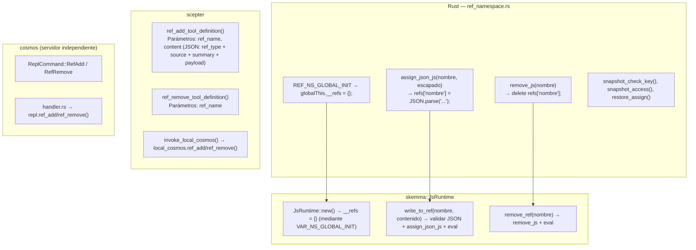

### 2.3 Estructura RefItem

```typescript
// Definiciones de tipo TypeScript (de iepl-api.d.ts)
type RefType = "code" | "image" | "agent_output";

// Usado en system prompt y runtime_context para listado de nombres
type RefItemSummary = {
  name: string;
  ref_type: RefType;
  source: string;
  summary: string;
};

interface RefItem {
  name: string;        // ej. "code:src/main.rs", "image:diagrama", "agent:orexis/audit-1"
  ref_type: RefType;   // categoría para ordenar/filtrar
  source: string;      // quién lo proporcionó ("user", nombre de agente, nombre de herramienta)
  summary: string;     // descripción de una línea para mostrar en prompt
  files?: RefCodeFile[];   // para refs "code"
  images?: RefImage[];     // para refs "image"
  output?: RefAgentOutput; // para refs "agent_output"
}

interface RefCodeFile {
  path: string;
  language: string;
  content: string;
  selection?: { start_line: number; end_line: number; content: string };
}

interface RefImage {
  mime: string;          // ej. "image/png"
  data: string;          // codificado en base64 o URL de datos
  description?: string;
}

interface RefAgentOutput {
  source_agent: string;  // nombre del agente
  source_tool: string;   // herramienta que produjo esta salida
  content: Record<string, unknown>;
}
```

### 2.4 Operaciones

| Operación | Nombre de Herramienta | Tipo | Comportamiento |
| --- | --- | --- | --- |
| Añadir referencia | `ref_add` | Bloqueante | Valida JSON, evalúa `refs['nombre'] = JSON.parse('...')` |
| Eliminar referencia | `ref_remove` | DispararYOlvidar | Evalúa `delete refs['nombre']` |
| Leer en exec | (mediante `exec`) | — | `refs['nombre'].files[0].content` |
| Instantánea | (interno) | — | Captura todas las claves `__refs` como `{"$refs": {...}}` |
| Restaurar | (interno) | — | Establece `refs[k] = snap['$refs'][k]` para cada clave |

### 2.5 Inyección en Prompt

Las refs aparecen en **dos** ubicaciones en el system prompt:

#### Ubicación 1: `refs_section` (tabla de contenidos dedicada)

```text
## Recursos Referenciados (refs)

Los siguientes recursos están disponibles mediante `refs['nombre']`.
- `code:src/main.rs` [code] de user — archivo rust principal
- `image:arquitectura` [image] de user — diagrama de arquitectura del sistema
- `agent:orexis/audit-1` [agent_output] de OreXis — resultados de auditoría de seguridad
```

Generado por `build_refs_section()` en `prompt.rs:426`. Cada ref muestra **nombre, tipo, origen y resumen** — el LLM ve lo que está disponible pero debe leer el contenido mediante bloques `exec`.

#### Ubicación 2: `runtime_context` (listado de nombres)

```text
__refs (recursos referenciados de usuario/agentes, 3 total):
  `code:src/main.rs`, `image:arquitectura`, `agent:orexis/audit-1`
  Acceso: `refs['nombre']` — cada ref tiene .ref_type, .source, .summary
```

### 2.6 Principio de Visibilidad

> **Los nombres de ref son visibles para todos los agentes. El contenido de ref no lo es.**

La `refs_section` en el system prompt expone la **tabla de contenidos** (nombre, tipo, origen, resumen) a cada ejecución de habilidad. Sin embargo, el contenido real (`files[].content`, `images[].data`, `output.content`) solo es accesible mediante acceso explícito `refs['nombre']` en bloques exec IEPL. Esto significa:

- OreXis puede ver que `code:src/main.rs` existe (por su resumen), pero debe leer explícitamente su contenido para la auditoría
- El LLM decide cuándo desreferenciar contenido según la relevancia de la tarea
- Ningún agente puede filtrar accidentalmente contenido de referencia en el flujo de conversación

---

## 3. `__env` — Configuración de Entorno (`env`)

### 3.1 Propósito

`__env` contiene **configuraciones de entorno de runtime** que el motor de ejecución IEPL y los agentes necesitan. Actualmente, la única subclave es `env.aporia.language`, que controla el idioma para la salida del agente.

### 3.2 Arquitectura del Módulo

La inicialización del entorno reside en `packages/shared/iepl/src/namespace.rs`.

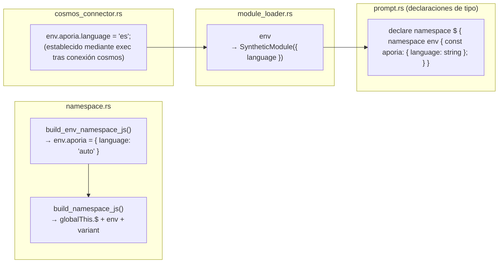

### 3.3 Operaciones

| Operación | Mecanismo | Comportamiento |
| --- | --- | --- |
| Inicializar | `build_namespace_js()` | `__env = __env \|\| {}; env.aporia = env.aporia \|\| { language: 'auto' }` |
| Establecer idioma | llamada `exec` mediante conector cosmos | `env.aporia.language = 'es'` |
| Leer en IEPL | `import { language } from 'env'` | Devuelve `env.aporia.language` con respaldo `'auto'` |
| Instantánea/Restauración | **No soportado** | `__env` NO se incluye en instantánea/restauración — es efímero y se reinicializa en cada conexión cosmos |

### 3.4 Flujo de Idioma

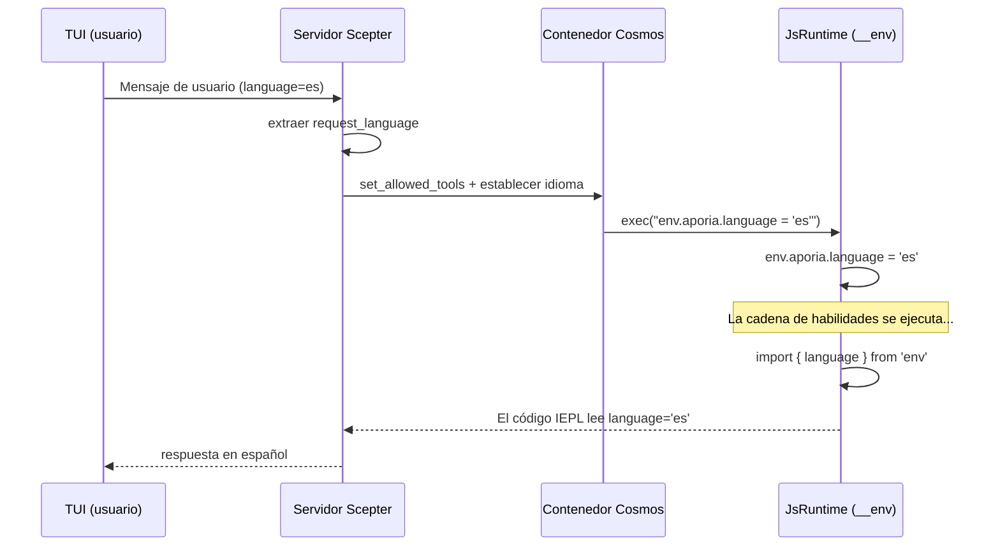

### 3.5 `$.variant` — Acceso Retrocompatible

**Archivo:** `packages/shared/iepl/src/namespace.rs:199-207`

`build_variant_namespace_js()` crea una propiedad circular autorreferenciada:

```javascript
Object.defineProperty(globalThis.$, 'variant', {
  get: function() { return globalThis.$; },
  set: function(val) { Object.assign(globalThis.$, val); },
  configurable: true,
  enumerable: true,
});
```

Esto permite que el código escrito como `$.variant.tools.agent.method()` se resuelva al mismo objeto que `$.tools.agent.method()`. Existe para compatibilidad hacia atrás con patrones alternativos de acceso al namespace.

> **Precaución de instantánea:** Debido a que `$.variant` es una referencia circular (`$.variant === $`), intentar `JSON.stringify` lanza un `TypeError`. El código JS de instantánea apunta explícitamente a `__vars` y `__refs` directamente en lugar de iterar las claves de `globalThis.$`, evitando este problema.

---

## 4. Arquitectura de Instantánea y Restauración

### 4.1 ¿Por Qué Instantánea/Restauración?

El `LocalCosmosRuntime` ejecuta un **único `JsRuntime` de larga duración** en un hilo dedicado. Entre ejecuciones de cadenas de habilidades, el estado del runtime (`__vars`, `__refs`) persiste naturalmente. Sin embargo, las instantáneas se utilizan para:

1. **Inyección en prompt** — `build_runtime_context()` y `build_refs_section()` leen JSON de instantánea para poblar el system prompt
1. **Persistencia de sesión** — volcar/restaurar en disco para recuperación de fallos o migración de sesión
1. **Sincronización de contenedor** — enviar estado a contenedores cosmos mediante `cosmos_set_rag_context()`

### 4.2 Formato de Instantánea

```json
{
  "$vars": {
    "nombre_var_1": "valor",
    "json_analizado": { "clave": "valor" }
  },
  "$refs": {
    "code:src/main.rs": {
      "ref_type": "code",
      "source": "user",
      "summary": "archivo rust principal",
      "files": [{ "path": "src/main.rs", "language": "rust", "content": "..." }]
    }
  },
  "__lexical": {
    "mi_constante": 42
  }
}
```

### 4.3 Flujo de Código de Instantánea

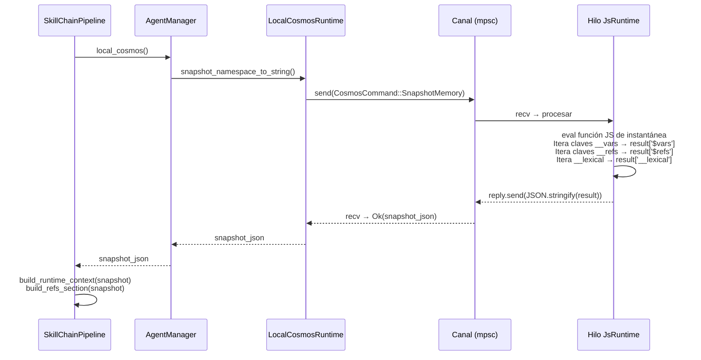

### 4.4 Código JS de Instantánea (Forma Desplegada)

> **Nota:** El código JS mostrado a continuación es la **forma desplegada** que el código Rust construye dinámicamente en tiempo de ejecución. No se almacena como un literal de cadena Rust en el código fuente. La sección `__lexical` se genera a partir de `self.lexical_var_names` rastreado durante llamadas `exec()` anteriores. Ver `packages/agents/skemma/src/js_runtime/runtime.rs:549-607` para el constructor de cadenas Rust.

La función de instantánea accede directamente a los árboles de namespace conocidos:

```javascript
(function() {
    var result = {};
    if (globalThis.$ && globalThis.__vars) {
        var dollarVars = {};
        var dollarKeys = Object.keys(globalThis.__vars);
        for (var j = 0; j < dollarKeys.length; j++) {
            var dk = dollarKeys[j];
            try {
                var dv = globalThis.vars[dk];
                if (typeof dv === 'function') continue;
                dollarVars[dk] = dv;
            } catch(e) {}
        }
        if (Object.keys(dollarVars).length > 0) {
            result['$vars'] = dollarVars;
        }
    }
    if (globalThis.$ && globalThis.__refs) {
        var dollarRefs = {};
        var refsKeys = Object.keys(globalThis.__refs);
        for (var j = 0; j < refsKeys.length; j++) {
            var dk = refsKeys[j];
            try {
                var dv = globalThis.refs[dk];
                if (typeof dv === 'function') continue;
                dollarRefs[dk] = dv;
            } catch(e) {}
        }
        if (Object.keys(dollarRefs).length > 0) {
            result['$refs'] = dollarRefs;
        }
    }
    // ... captura __lexical ...
    return JSON.stringify(result);
})( )
```

### 4.5 Código de Restauración (Desplegado)

```javascript
(function() {
    var snap = JSON.parse(cadena_instantanea);
    if (snap['$vars'] && globalThis.$) {
        Object.keys(snap['$vars']).forEach(function(k) {
            try { globalThis.vars[k] = snap['$vars'][k]; } catch(e) {}
        });
    }
    if (snap['$refs'] && globalThis.$) {
        Object.keys(snap['$refs']).forEach(function(k) {
            try { globalThis.refs[k] = snap['$refs'][k]; } catch(e) {}
        });
    }
    if (snap['__lexical']) {
        Object.keys(snap['__lexical']).forEach(function(k) {
            try { globalThis[k] = snap['__lexical'][k]; } catch(e) {}
        });
    }
})()
```

---

## 5. Registro de Herramientas y Control de Acceso

### 5.1 Herramientas Internas de Cosmos

Las cinco herramientas a nivel cosmos se **conceden universalmente** a todos los agentes:

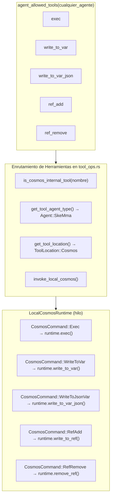

### 5.2 Definiciones de Herramientas

| Herramienta | Modo de Llamada | Requiere | Esquema de Parámetros |
| --- | --- | --- | --- |
| `exec` | DispararYOlvidar | `code: string` | Cadena de código JS única |
| `write_to_var` | Bloqueante | `var_name, content` | `{var_name: string, content: string}` |
| `write_to_var_json` | Bloqueante | `var_name, content` | `{var_name: string, content: string (JSON válido)}` |
| `ref_add` | Bloqueante | `ref_name, content` | `{ref_name: string, content: string (JSON: ref_type + source + summary)}` |
| `ref_remove` | DispararYOlvidar | `ref_name` | `{ref_name: string}` |

### 5.3 Servidor Cosmos Independiente

El binario `cosmos` (servidor de runtime JS independiente) despacha todos los nombres de herramientas a través de la misma interfaz `JsRuntime`, incluyendo los manejadores deprecados `ref_add`/`ref_remove` que permanecen como fontanería interna residual. Solo las tres primitivas visibles para el LLM (`exec`, `write_to_var`, `write_to_var_json`) se exponen al modelo; vea la nota de deprecación al inicio de este documento.

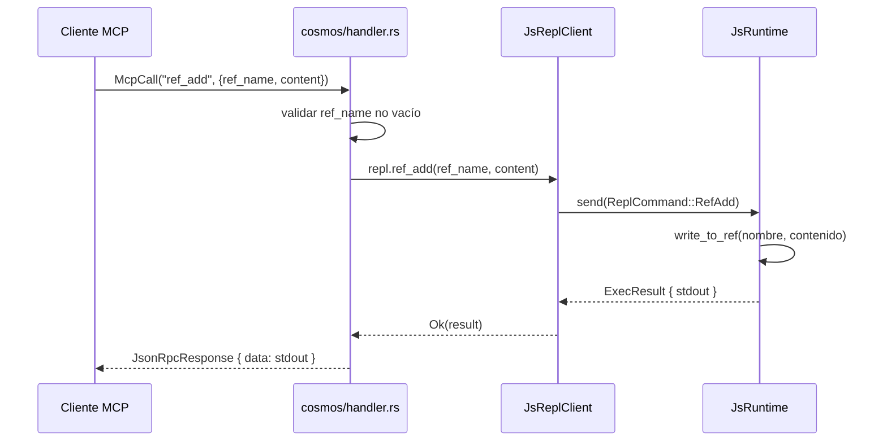

### 5.4 `is_cosmos_internal_tool` — Ayudante de Enrutamiento

**Archivo:** `packages/scepter/src/agent_manager/tool_ops.rs:7-13`

```rust
fn is_cosmos_internal_tool(tool_name: &str) -> bool {
    tool_name == cosmos::EXEC
        || tool_name == cosmos::WRITE_TO_VAR
        || tool_name == cosmos::WRITE_TO_VAR_JSON
        || tool_name == cosmos::REF_ADD
        || tool_name == cosmos::REF_REMOVE
}
```

Este ayudante sirve a dos propósitos críticos:

1. **Resolución de tipo de agente** — `get_tool_agent_type()` devuelve `Agent::SkeMma` para herramientas internas, ya que se ejecutan en el runtime Cosmos (no en el proceso de un agente de dominio).
1. **Enrutamiento de respaldo** — Cuando una llamada cosmos contenerizada falla para una herramienta interna, el sistema recurre al runtime cosmos local. Para herramientas no internas, el respaldo va a ejecución en proceso. Esto asegura que las operaciones cosmos nunca fallen silenciosamente en modo contenerizado.

### 5.5 Enrutamiento Cosmos Contenerizado vs Local

El sistema soporta dos modos de ejecución para el runtime Cosmos, seleccionados en el momento del registro del agente:

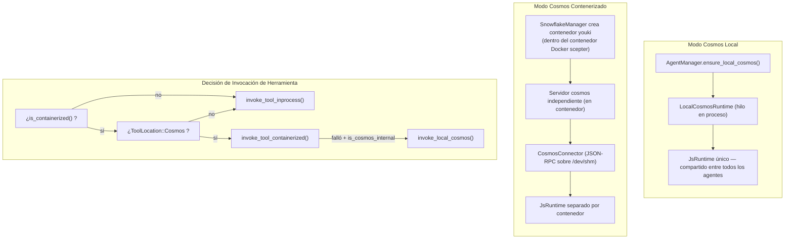

**Diferencias clave:**

| Aspecto | Modo Local | Modo Contenerizado |
| --- | --- | --- |
| `__vars` / `__refs` | Compartidos entre todos los agentes | Compartidos dentro del contenedor, aislados entre contenedores |
| `__env` | Establecido directamente mediante `exec` | Establecido mediante llamada JSON-RPC `CosmosConnector` |
| Rendimiento | Cero sobrecarga de serialización | Serialización JSON-RPC por llamada |
| Seguridad | Solo sandbox Boa | Boa + seccomp + sandbox youki |
| Runtime de contenedor | Solo Docker/Podman | Docker/Podman (externo) + youki (cosmos interno) |
| Usado por | Agentes no contenerizados (layer=1) | Agentes contenerizados (layer=2+) |

### 5.6 Ensamblaje JS del Namespace

El JavaScript completo del namespace es ensamblado por `build_scepter_namespace_config_and_js()` en `packages/scepter/src/services/local_cosmos/namespace.rs:116-124`:

```rust
pub async fn build_scepter_namespace_config_and_js(
    registry: &SharedAgentRegistry,
    scepter_tools: &HashSet<String>,
    plugin_router: &PluginRouter,
) -> (NamespaceConfig, String) {
    let config = build_namespace_config(registry, scepter_tools, plugin_router).await;
    let js = build_namespace_js(&config);
    (config, js)
}
```

Esta función:

1. Recopila todas las herramientas MCP de los agentes registrados desde el `AgentRegistry`
1. Construye un `NamespaceConfig` con listas de herramientas por agente y metadatos (sync/async, `unwrap_data`)
1. Genera JS de namespace mediante `build_namespace_js(&config)` que:

   - Crea `globalThis.$` si falta
   - Inicializa `env.aporia` con `{ language: 'auto' }`
   - Define la propiedad `$.variant` (getter circular que devuelve `globalThis.$`)
   - Registra todos los módulos de herramientas de agente mediante `register_tool_modules_with_rag()`

El JS del namespace se evalúa:

- **Una vez** al inicio de `LocalCosmosRuntime::new()`
- **Bajo demanda** durante la reconstrucción de cadena de habilidades mediante `CosmosCommand::RebuildNamespace`

---

## 6. Orden de Ensamblaje del System Prompt

El system prompt completo ensamblado en `pipeline.rs:869-882`:

```text
Eres el motor de ejecución de la habilidad {skill_name} del {Agent}. Ejecuta la habilidad fielmente.

[capability_section]
  → Descripción de capacidad específica del agente
  → Declaraciones de tipo TypeScript (tipos de API IEPL, env)
  → Prompts de instrucción de importación
  → Reglas de seguridad de parámetros y guía de persistencia de datos

[tool_decls_section]
  → ## APIs de Herramientas Disponibles
  → Contenido .d.ts para todas las herramientas MCP disponibles

[container_context]
  → Insignias de modo de ejecución de contenedor, rama, restricciones

[soul_section]
  → ## Identidad del Alma: {nombre}
  → Personalidad del agente y principios operativos

[refs_section]
  → ## Recursos Referenciados (refs)
  → Tabla de contenidos: nombre, tipo, origen, resumen

[output_section]
  → Enrutamiento al siguiente agente objetivo
  → Convenciones de llamada de reporte MCP

[runtime_context]
  → ## Contexto de Runtime JS
  → Nombres __vars (con sugerencia de import)
  → Nombres __refs (con sugerencia de acceso)
  → Nombres de variables léxicas

[rag_section]
  → Secciones de memoria Philia (interacciones pasadas relevantes)
  → Secciones de conocimiento Aporia (documentación relevante)

[skill_chain_note]
  → Navegación de cadena: "Este es el paso N de M" o "Paso final"
```

### Justificación de la Ubicación de las Secciones

| Sección | Posición | Razón |
| --- | --- | --- |
| Identidad del agente + nombre de habilidad | Primera frase | Establece el rol inmediatamente |
| Declaraciones de herramientas | Antes del alma | El LLM necesita conocer las herramientas disponibles antes de que la personalidad afecte la elección |
| Alma | Después de herramientas, antes de refs | La personalidad influye en cómo se interpretan las refs |
| Sección de refs | Después del alma, antes de la salida | El LLM sabe qué recursos están disponibles antes de decidir qué producir |
| Enrutamiento de salida | Antes del contexto de runtime | El LLM sabe a dónde enviar resultados antes de leer el contexto |
| Contexto de runtime | Antes de RAG, antes de la nota de cadena | Vars y refs proporcionan contexto de ejecución para la recuperación de conocimiento |

---

## 7. Comportamiento de ResetVars

Al cambiar entre habilidades en una cadena, se llama a `ResetVars` para sanear el estado del runtime. El comando utiliza inicialización **no destructiva**:

```javascript
globalThis.$ = globalThis.$ || {};
globalThis.__vars = globalThis.__vars || {};
globalThis.__refs = globalThis.__refs || {};
```

Esto significa:

- **Los valores existentes persisten** — `__vars` y `__refs` se mantienen intactos
- **Los estados corruptos se recuperan** — si `__refs` fue eliminado accidentalmente, se recrea
- **El aislamiento de habilidades es opt-in** — las habilidades solo deben leer variables que conocen (por nombre en el prompt de contexto de runtime)
- **Sin limpieza forzada** — es responsabilidad del LLM gestionar la contaminación del namespace de variables

---

## 8. Mapa de Archivos de Implementación

| Componente | Archivo | Líneas | Descripción |
| --- | --- | --- | --- |
| Constantes y generadores `__vars` | `packages/shared/core/src/var_namespace.rs` | 1-211 | Toda la generación de código JS para vars |
| Constantes y generadores `__refs` | `packages/shared/core/src/ref_namespace.rs` | 1-145 | Toda la generación de código JS para refs |
| Generación `__env` | `packages/shared/iepl/src/namespace.rs` | 193-197 | `build_env_namespace_js()` |
| Generación `$.variant` | `packages/shared/iepl/src/namespace.rs` | 199-207 | `build_variant_namespace_js()` |
| Inicialización `JsRuntime` | `packages/agents/skemma/src/js_runtime/runtime.rs` | 153 | `eval(VAR_NS_GLOBAL_INIT)` |
| Implementación `write_to_var` | mismo archivo | 349-403 | Almacenamiento de variable string |
| Implementación `write_to_var_json` | mismo archivo | 405-443 | Almacenamiento de variable JSON |
| Implementación `write_to_ref` | mismo archivo | 445-492 | Almacenamiento de ref con extracción de tipo |
| Implementación `remove_ref` | mismo archivo | 494-503 | Eliminación de ref |
| `snapshot_namespace_to_string` | mismo archivo | 549-607 | Genera JS de instantánea |
| `restore_namespace_from_string` | mismo archivo | 617-646 | Genera JS de restauración |
| `LocalCosmosRuntime` | `packages/scepter/src/services/local_cosmos/runtime.rs` | 1-507 | Canal de comandos cosmos thread-safe |
| Enum `CosmosCommand` | mismo archivo | 21-65 | Todas las variantes de operación cosmos (incluyendo SnapshotMemory, Shutdown) |
| Manejador `ResetVars` | mismo archivo | 448-460 | Reinicio no destructivo |
| Manejador `RebuildNamespace` | mismo archivo | 478-494 | Reinicializar módulos de herramientas |
| Definiciones de herramientas | `packages/scepter/src/agent_manager/tool_ops.rs` | 1-795 | Las 5 definiciones de herramientas cosmos |
| `is_cosmos_internal_tool` | mismo archivo | 7-13 | Ayudante de enrutamiento |
| `invoke_local_cosmos` | mismo archivo | 714-787 | Despacho de herramienta a LocalCosmosRuntime |
| `build_runtime_context` | `packages/scepter/src/state_machine/skill_chain/prompt.rs` | 472-598 | Prompt: vars + refs + léxico |
| `build_refs_section` | mismo archivo | 426-470 | Prompt: tabla de contenidos de refs |
| Ensamblaje de system prompt | `packages/scepter/src/state_machine/skill_chain/pipeline.rs` | 869-882 | Cadena de formato del system prompt completo |
| Lista de herramientas permitidas | `packages/shared/domain_skills/src/tool_names.rs` | 265-273 | Acceso universal a herramientas cosmos |
| Manejador cosmos independiente | `packages/cosmos/src/handler.rs` | 447-521 | Despacho `ref_add` / `ref_remove` |
| Cosmos JsReplClient | `packages/cosmos/src/js_repl/mod.rs` | 442-467 | Métodos `ref_add()` / `ref_remove()` |
| Enum ReplCommand | mismo archivo | 57-96 | Variantes `RefAdd` / `RefRemove` |
| Tipos TypeScript IEPL | `packages/shared/bindings/iepl-api.d.ts` | 133-154 | Declaraciones RefItem, RefType, __refs |
| Módulo `vars` | `packages/agents/skemma/src/js_runtime/module_loader.rs` | 142-156 | Exportación de referencia viva `__vars` |
| Módulo `env` | mismo archivo | 160-172 | Exportación de valor de idioma |
| Ensamblaje JS de namespace | `packages/scepter/src/services/local_cosmos/namespace.rs` | 116-124 | `build_scepter_namespace_config_and_js` |
| Establecedor de idioma CosmosConnector | `packages/scepter/src/services/cosmos_connector.rs` | 351-363 | `env.aporia.language` en contenedores |
| Pruebas E2E | `packages/agents/skemma/tests/mcp_test.rs` | 1677-1726 | Módulo `refs_and_snapshot_tests` |
| Pruebas unitarias | `packages/agents/skemma/src/js_runtime/runtime.rs` | 679-746 | Pruebas `write_to_ref`, instantánea, restauración |
| Pruebas de namespace ref | `packages/shared/core/src/ref_namespace.rs` | 99-145 | Pruebas de patrón de generación de código JS |

---

## 9. Preocupaciones Transversales

### 9.1 Seguridad de Hilos

- `LocalCosmosRuntime` posee un **único `JsRuntime`** en un hilo dedicado (llamado `"local-cosmos"`)
- Todas las operaciones se serializan a través de un `mpsc::channel<CosmosCommand>`
- El `JsRuntime` nunca se accede desde múltiples hilos — la seguridad de hilos se aplica mediante el patrón de canal
- `AgentManager` mantiene `OnceCell<Arc<LocalCosmosRuntime>>` para inicialización perezosa

### 9.2 Límites de Memoria

| Límite | Valor | Aplicado En |
| --- | --- | --- |
| Máx vars en prompt | 30 | `build_runtime_context()` — constante `MAX_NAMES` |
| Máx refs en prompt | 30 | `build_refs_section()` — `.take(30)` |
| Máx refs en runtime_context | 30 | `build_runtime_context()` — constante `MAX_NAMES` |
| Límite suave de código exec | N/D (deshabilitado) | Límites de contenedor externo + disyuntores |
| Timeout exec (SkeMma) | 120s predeterminado | `skemma/COMPUTE_TIMEOUT` |
| Techo absoluto exec | 600s | `skemma/ABSOLUTE_CEILING` |

### 9.3 Manejo de Errores

| Error | Manejo |
| --- | --- |
| `write_to_var_json` con JSON inválido | Devuelve error con vista previa (primeros 200 caracteres) |
| `ref_add` con JSON inválido | Devuelve `SkemmaError::JsEval` con vista previa |
| Instantánea de referencia circular (`$.variant`) | Captura `TypeError` silenciosamente, omite la clave |
| `__refs` faltante en instantánea | `build_refs_section` devuelve cadena vacía |
| `__refs` corrupto después de ResetVars | `|| {}` garantiza reinicialización |

### 9.4 Ciclo de Vida de RebuildNamespace

Al cambiar de habilidades en una cadena de habilidades no contenerizada, el JS del namespace puede necesitar ser **reconstruido** para incluir nuevas herramientas de agente descubiertas durante la cadena:

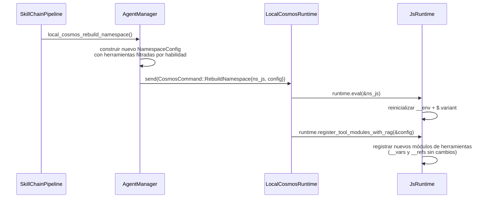

> **Invariante clave:** `RebuildNamespace` solo actualiza registros de herramientas y configuraciones de entorno. **No** reinicia `__vars` o `__refs` — esos se manejan por separado mediante `ResetVars`.

### 9.5 Propagación de Idioma en Modo Contenerizado

Cuando los agentes se ejecutan en contenedores youki (anidados dentro del contenedor Docker scepter), el valor `env.aporia.language` se establece mediante el `CosmosConnector`:

```rust
// packages/scepter/src/services/cosmos_connector.rs:351-363
let lang_code = format!(
    "env.aporia.language = {};",
    serde_json::to_string(&lang).unwrap_or_else(|_| "\"en\"".to_string())
);
connector.cosmos_exec(&container_uuid, &lang_code).await?;
```

Esto envía una llamada MCP `exec` sobre el transporte JSON-RPC al contenedor cosmos, que evalúa la asignación JS en el `JsRuntime` aislado del contenedor. La ruta completa de propagación de idioma es:

```text
Idioma de solicitud TUI → Scepter (extraer request_language)
  → [modo local] exec directo("env.aporia.language = 'es'")
  → [contenerizado] CosmosConnector::cosmos_exec(llamada_json_rpc)
      → manejador cosmos → js_runtime.eval(...)
```

### 9.6 Seguridad

- Validación `exec`: todo el código pasa por validación de sintaxis AST SWC antes de la evaluación Boa
- El uso de `eval()` en bloques `exec` se detecta y bloquea con orientación para usar `write_to_var` en su lugar
- El contenido de `ref_add` pasa por `JSON.parse()` — no se puede inyectar código arbitrario
- Ninguna herramienta de namespace expone acceso crudo al contexto Boa
- Los contenedores Cosmos se ejecutan en contenedores youki sandboxed con perfiles seccomp, cada uno anidado dentro del contenedor Docker/Podman scepter (aislamiento de contenedor de dos capas)
