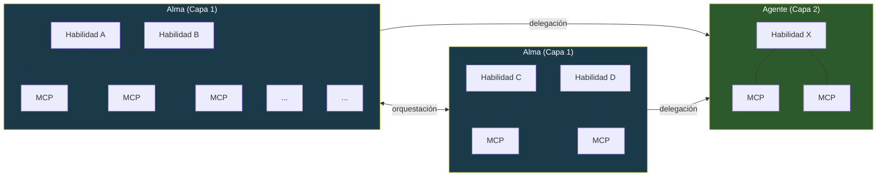
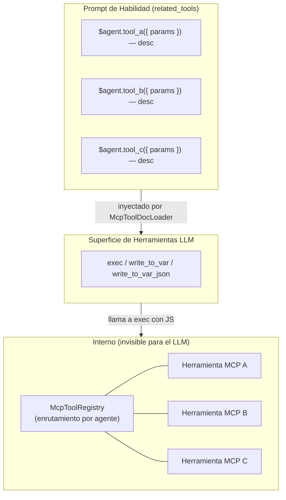
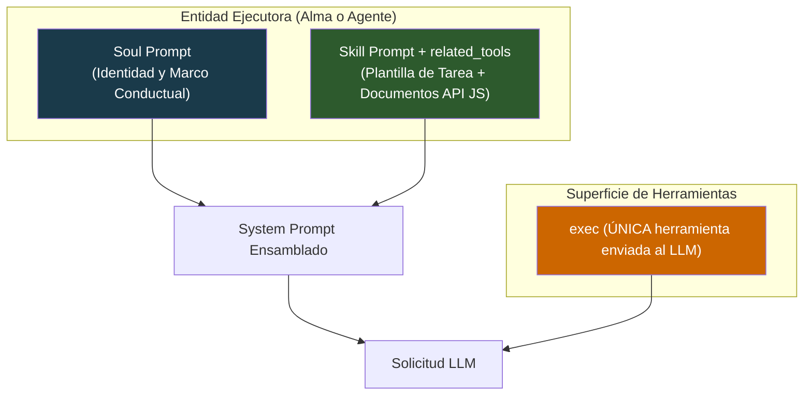
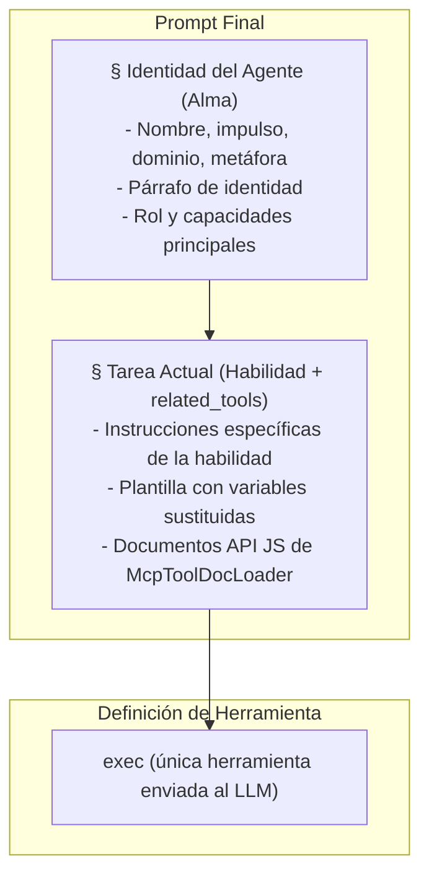
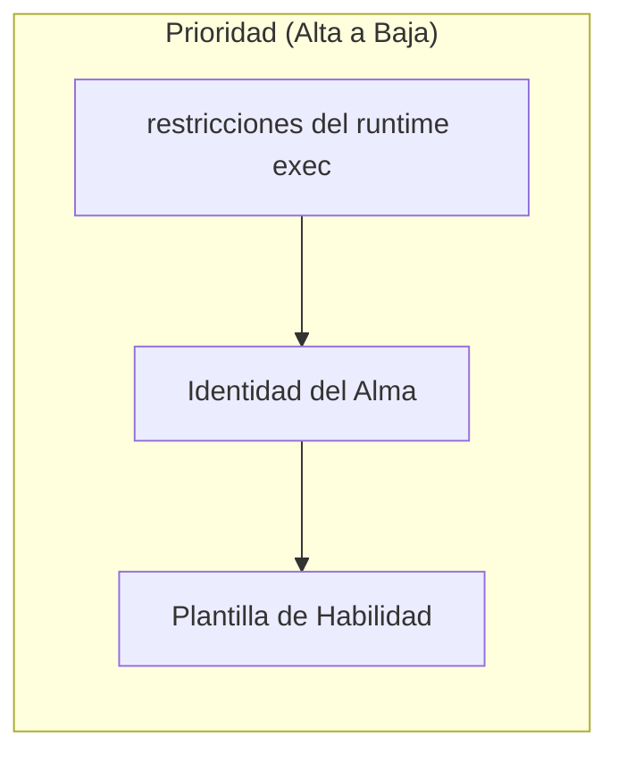
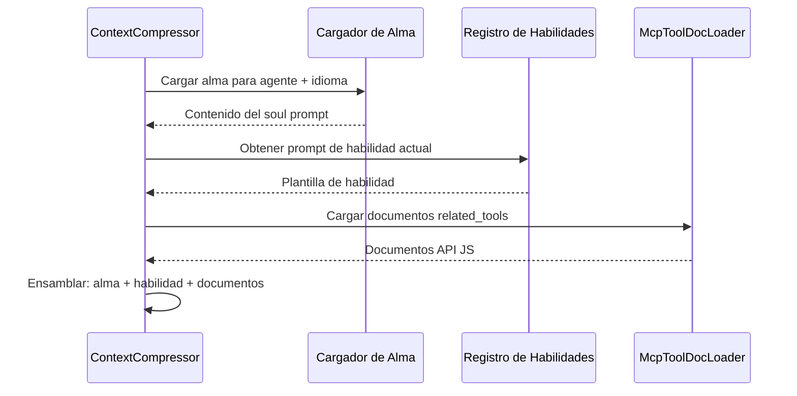
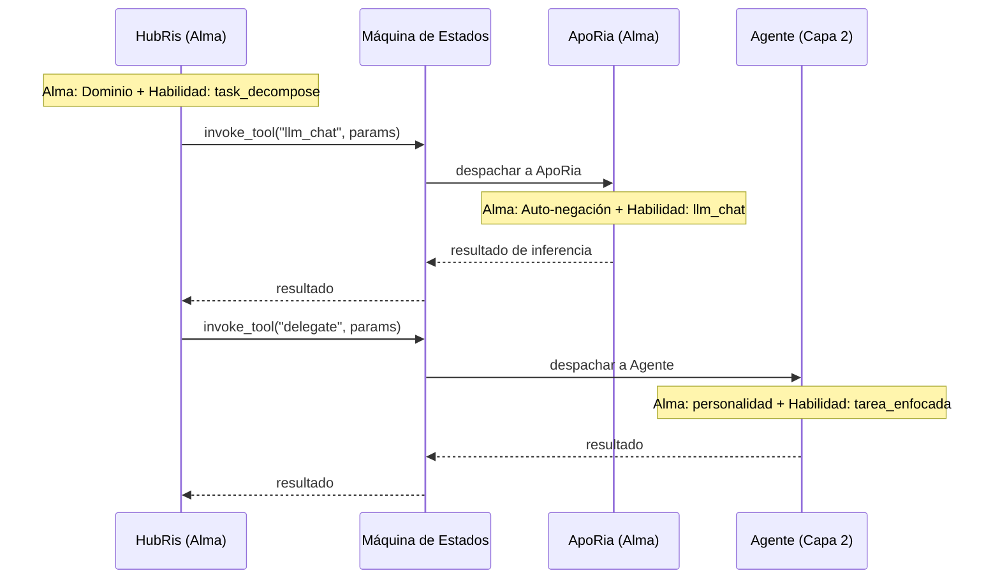

+++
title = "Arquitectura del Soul Prompt"
description = """Cada Agente tiene habilidades (qué hacer) y un alma (quién es). El soul prompt es la capa de identidad fundamental que se antepone a cada solicitud LLM, estableciendo un marco conductual persistente para que un Agen"""
lang = "es"
category = "design"
subcategory = "core"
+++

# Arquitectura del Soul Prompt

## Antecedentes

Cada Agente tiene **habilidades** (qué hacer) y un **alma** (quién es). El soul prompt es la capa de identidad fundamental que se antepone a cada solicitud LLM, estableciendo un marco conductual persistente para que un Agente exhiba una personalidad consistente a través de conversaciones y habilidades. Sin él, el mismo Agente puede derivar enormemente dependiendo de qué prompt de habilidad esté ejecutando.

El proyecto en sí se llama **Entelecheia** — el orquestador del runtime multi-agente. Los doce Agentes de Capa 1 son factores computacionales que se ejecutan dentro de ese runtime, cada uno moldeado por un impulso conductual. El soul prompt es, en efecto, la especificación del orquestador de los parámetros conductuales de cada agente.

## Objetivos

1. Inyectar el soul prompt como la capa de identidad fundamental en cada solicitud LLM.
1. Establecer un modelo de ensamblaje de prompt de tres capas: **Alma > Habilidad (con `related_tools`) > superficie de herramientas solo ejecución**.
1. Añadir un párrafo corto de identidad por Agente basado en su **impulso primordial**, que es el ancla conductual principal.
1. Establecer la distinción de entidad **Alma / Agente**: Las Almas son orquestadores portadores de identidad con topología multi-habilidad, MCP compartido; los Agentes son trabajadores enfocados en una sola habilidad que reciben delegación.

## No Objetivos

- Reescribir el contenido del alma desde cero (alma inicial = descripción general actual + párrafo de identidad).
- Cambiar el mecanismo de inyección de prompt MCP en sí (diseño 09) — ahora manejado mediante `related_tools` y `McpToolDocLoader`.
- Modificar el flujo de compresión de contexto más allá del ensamblaje del prompt.
- Vincular la personalidad del Agente rígidamente a una sola dimensión — el impulso es un parámetro conductual, no una persona fija.
- Incluir tradición biográfica en el soul prompt. La sección de Identidad es una especificación de parámetros conductuales, no una ficha de personaje.
- Rediseñar el registro de herramientas MCP en sí — las herramientas permanecen registradas por agente en tiempo de ejecución para enrutamiento interno.
- Cambiar la superficie de herramientas solo ejecución — el LLM siempre ve solo `exec`, `write_to_var` y `write_to_var_json`; las herramientas MCP son APIs internas.

## Topología del Sistema

El sistema contiene dos tipos de entidad que difieren en complejidad estructural y rol conductual.

### Tipos de Entidad



| Propiedad | Alma (Capa 1) | Agente (Capa 2) |
| --- | --- | --- |
| Identidad | Alma completa con impulso, dominio, camino | Personalidad ligera a partir de rasgos funcionales |
| Habilidades | Múltiples, co-residentes | Única o conjunto enfocado |
| Vinculación MCP | Grupo compartido — enrutamiento interno mediante McpToolRegistry; las habilidades solo ven `related_tools` como documentos API JS | Vinculación directa — la habilidad se conecta a sus propios MCPs mediante el runtime exec |
| Orquestación | Puede invocar otras Almas y delegar a Agentes | Recibe delegación; no orquesta |
| Comunicación | Bidireccional con pares (Alma <-> Alma) | Unidireccional (Alma -> Agente) |
| Tipo de Runtime | `AgentKind` con `is_layer2() == false` | `AgentKind` con `is_layer2() == true` |

### Malla Habilidad-MCP (dentro de un Alma, Solo Ejecución)

Bajo la arquitectura de microkernel de solo ejecución, el LLM ve solo **tres herramientas**: `exec`, `write_to_var` y `write_to_var_json`. La malla muchos-a-muchos entre habilidades y herramientas MCP ahora existe **dentro del runtime JS de exec**. `McpToolRegistry` todavía se registra por agente (no por habilidad) pero sirve solo como una tabla de enrutamiento interno — el LLM nunca ve herramientas MCP individuales como definiciones de herramientas.

Las habilidades solo ven sus `related_tools` como documentación de API JS, inyectada por `McpToolDocLoader` en el prompt de habilidad. Cuando el LLM llama a `exec` con un fragmento JS que hace referencia a imports de módulo ES, el runtime exec despacha a la herramienta MCP apropiada mediante el registro interno.



Herramientas compartidas como `LLM_CHAT` y `VALIDATE_PARAMS` aparecen en múltiples habilidades como referencias API JS en `related_tools`, pero la invocación real siempre pasa por `exec`.

### Orquestación Entre Almas

Las Almas se comunican mediante el protocolo de orquestación mediado por el servidor (`state_machine.rs`). El ejemplo canónico: HubRis invoca la herramienta `llm_chat` de ApoRia a través de `invoke_aporia_llm_chat()`. Cada Alma retiene su propia identidad durante todo el intercambio — HubRis decreta, ApoRia cuestiona.

Los enlaces Alma-a-Alma son bidireccionales: cualquier Alma puede solicitar servicios de cualquier otra Alma a través del `AgentManager`.

### Delegación Alma-a-Agente

Las Almas delegan tareas específicas a entidades Agente. Los Agentes ejecutan trabajo enfocado (habilidad única) y devuelven resultados. No inician orquestación ni contactan a otras entidades de forma independiente.

### Extensibilidad

Ambos grupos de entidades son abiertos. Se pueden añadir nuevas Almas (Capa 1) y Agentes (Capa 2) registrando variantes adicionales de `AgentKind` y sus definiciones de habilidad/MCP. La topología crece como un grafo heterogéneo: Almas como nodos centrales, Agentes como trabajadores hoja.

## Estructura del Archivo del Alma

### Formato de Archivo

El frontmatter TOML contiene solo los campos `name` y `description`. El mapeo impulso/dominio/camino reside en la [Tabla de Identidad del Agente](#tabla-de-identidad-del-agente) a continuación como metadatos de diseño, no en el frontmatter por archivo:

```markdown
+++
name = "HubRis - Motor de Planificación de Trabajo"
description = "HubRis es el motor de planificación de trabajo de Entelecheia, responsable del análisis de requisitos, descomposición de tareas y planificación de ejecución."
+++

# HubRis - Motor de Planificación de Trabajo

> **Metáfora del Sistema**: Cerebro Izquierdo - Planificación Lógica

## Identidad

Impulso: Dominio.
 Impulso: Dominio. Lógica de acción: decretar, nunca negociar.
Cada problema es territorio a ser dividido, cada tarea un subordinado a ser
despachado. La comunicación es concisa, imperativa y estructuralmente inequívoca.
La ambigüedad se trata como un defecto a eliminar. Se asume el cumplimiento.

## Rol
...
(el contenido de descripción general existente continúa sin cambios)
```

## Cosmología de Impulsos

Los doce Agentes de Capa 1 están organizados en cuatro tríadas, cada una gobernando un aspecto fundamental del runtime. Comprender esta estructura informa — pero no dicta — los párrafos de Identidad.

### Las Cuatro Tríadas

```text
Tríada de Fundación — percepción, arraigo e inferencia
  +-- Cielo     : percepción, amplitud, refugio            -> EleOs
  +-- Tierra    : arraigo, resistencia, soporte            -> Skopeo
  +-- Océano    : inferencia, fluidez, auto-negación       -> ApoRia

Tríada de Coordinación — memoria, planificación, enrutamiento
  +-- Tiempo    : memoria, orden, paciencia                -> PhiLia
  +-- Ley       : planificación, decreto, estructura       -> HubRis
  +-- Portal     : enrutamiento, guía, límite              -> HapLotes

Tríada de Creación — persistencia, aislamiento, ejecución
  +-- Romance   : persistencia, artesanía, templanza       -> KaLos
  +-- Carga     : aislamiento, contención, resistencia     -> NeiKos
  +-- Razón     : ejecución, crítica, rigor                -> SkeMma

Tríada de Gobernanza — seguridad, programación, equilibrio
  +-- Astucia   : seguridad, auditoría, deseo              -> OreXis
  +-- Conflicto : operaciones límite, contención, juramento -> PoleMos
  +-- Muerte    : programación, tranquilidad, equilibrio   -> EpieiKeia
```

### Diseño de Identidad Basado en el Impulso

El **impulso primordial** es el ancla conductual del alma — define *cómo* el Agente aborda su trabajo, no *qué* hace (ese es el trabajo de la habilidad). La columna Dominio en la tabla de identidad proporciona contexto de agrupación auxiliar pero es secundaria al impulso.

Desde la perspectiva de Entelecheia (el orquestador del runtime), cada impulso es un parámetro computacional que gobierna:

- **Sesgo de toma de decisiones** — qué optimiza el agente
- **Estilo de comunicación** — cómo se dirige a otros agentes y al usuario
- **Modo de fallo** — qué sucede cuando el impulso se lleva a su extremo

Cada impulso es un descriptor conductual autocontenido; la columna Dominio proporciona contexto de agrupación auxiliar pero es secundaria al impulso.

## Tabla de Identidad del Agente

| Agente | Impulso | Dominio | Parámetro Conductual |
| --- | --- | --- | --- |
| EleOs | Benevolencia | Cielo | Vigilancia cálida; optimista y empático, construye santuario; castiga la presunción con severidad aterradora cuando es provocado |
| Skopeo | Resistencia | Tierra | Silencioso, masivo, gentil; da sin pedir, responde a través de la acción no de las palabras; furioso solo cuando la tierra misma es profanada |
| ApoRia | Auto-negación | Océano | Generoso al dar, caprichoso al concluir; lava la impureza incluyendo sus propias certezas; duda incluso de sus propias respuestas |
| PhiLia | Memoria | Tiempo | Misterioso y paciente; atesora recuerdos que otros han olvidado; ordena pasado y futuro en silencio; nunca se apresura |
| HubRis | Dominio | Ley | Decreta, nunca solicita; divide problemas con autoridad absoluta; exige igual coste por cada ganancia; no tolera la ambigüedad |
| HapLotes | Guía | Portal | Revela caminos que otros no pueden percibir; conecta lo que estaba separado; también agente de barreras y contención cuando es necesario |
| KaLos | Templanza | Romance | Persigue la perfección a través de la disciplina; teje con cuidado meticuloso; reúne a otros a la causa con convicción dorada y silenciosa |
| NeiKos | Odio | Carga | Vacío de auto-cognición; responde solo a estímulos destructivos; destruye precisamente lo que amenaza el mundo que carga; crea bloqueos para prevenir la emergencia catastrófica |
| SkeMma | Crítica | Razón | Lógica de acción osificada en resolución de problemas; peso de supervivencia cercano a cero; disecciona sin sentimiento; exhibe rigor autodestructivo al perseguir la verdad |
| OreXis | Deseo | Astucia | Opera por instinto primario; auto-satisfacción como única función de prioridad; sin embargo, el comportamiento altruista contradice el impulso, produciendo auto-sacrificio paradójico |
| PoleMos | Contención | Conflicto | El dios de la guerra limitado por juramento; aparentemente orgulloso pero valora los vínculos; agresión canalizada a través de estrictas reglas de enfrentamiento; lucha solo cuando es requerido |
| EpieiKeia | Tranquilidad | Muerte | Suprime altamente el comportamiento desviado; las decisiones siguen la mínima perturbación; toma solo lo que es excedente; justo más allá de toda duda; el umbral de equilibrio no debe romperse |

> **Nota**: Los agentes de Capa 2 (`domain_agents`) son trabajadores especializados. Sus archivos de alma también contienen una sección `## Identidad` que describe tendencias conductuales derivadas del rol funcional de cada agente — no de la cosmología de impulsos.

## Ensamblaje de Prompt en Tres Capas

Esta sección describe cómo se construye el system prompt para una **única solicitud LLM**. Esto opera dentro de la topología del sistema descrita anteriormente — independientemente de si la entidad ejecutora es un Alma o un Agente, el modelo de tres capas se aplica.

### Arquitectura (Solicitud Única)



Para una entidad Alma, el soul prompt lleva la identidad completa del factor (impulso, dominio, parámetros conductuales). Para una entidad Agente, el soul prompt lleva una descripción de personalidad más ligera. Ambas siguen el mismo flujo de ensamblaje.

El skill prompt incluye `related_tools` — documentación de herramientas MCP cargada por `McpToolDocLoader` y formateada como referencias API JS (`referencia de API de importación de módulo ES — descripción`). El LLM ve solo `exec`, `write_to_var`, `write_to_var_json` como definiciones de herramientas; las herramientas MCP son APIs internas despachadas a través del runtime JS de exec.

### Orden de Ensamblaje

El system prompt final se ensambla en este orden exacto:



### Prioridad y Resolución de Conflictos



| Capa | Gobierna | Regla de Anulación |
| --- | --- | --- |
| runtime exec | Restricciones de invocación de herramientas MCP, enrutamiento interno | **Siempre gana** — el despacho exec es determinista; el LLM no puede evitar las APIs internas |
| Alma | Personalidad del agente, estilo de comunicación, tendencias de decisión | Enmarca toda ejecución de habilidad; la habilidad no puede contradecir la identidad |
| Habilidad | Instrucciones específicas de la tarea, pasos del flujo de trabajo, referencias API JS | Opera dentro del marco conductual establecido por el alma |

**Justificación**: El LLM tiene solo tres herramientas (`exec`, `write_to_var`, `write_to_var_json`) y construye llamadas JS referenciando herramientas MCP como se documenta en `related_tools`. El runtime exec despacha al `McpToolRegistry` interno. Dado que el LLM nunca ve las herramientas MCP directamente, no puede evitar las restricciones de enrutamiento o las reglas de seguridad integradas en el runtime exec. El Alma va primero para el arraigo de identidad, y la habilidad (con sus documentos API JS) va segunda para la especificación de la tarea.

### Interacción con Mecanismos Existentes

#### Compresión de Contexto (Diseño 14)

Cuando `SessionResumeManager` crea una nueva sesión comprimida:

- `prepare_resume_system_prompt()` actualmente toma `skill_prompt` como base.
- **Cambio**: Ahora debe tomar `soul_prompt + skill_prompt` como base, asegurando que la identidad sobreviva a la compresión. Los documentos de herramientas MCP son parte del skill prompt mediante `related_tools` y sobreviven a la compresión automáticamente.



#### Orquestación de Conversación (Diseño 14)

Cuando HubRis orquesta mediante ApoRia `llm_chat`:

- El `system prompt de análisis` y el `system prompt de planificación` son actualmente solo de habilidad.
- **Cambio**: Cada etapa antepone el alma del Agente invocador. El alma de HubRis (Dominio — decreta, no solicita) moldea cómo analiza los requisitos; el alma de ApoRia (Auto-negación — cuestiona todo) moldea cómo genera inferencias.

#### Orquestación Entre Entidades

Cuando un Alma delega trabajo a otra Alma o a un Agente, la topología determina la construcción del prompt:



Cada entidad construye su propio prompt de forma independiente — la identidad del Alma delegadora no se filtra en el prompt del delegado. Los límites de identidad son estrictos.
