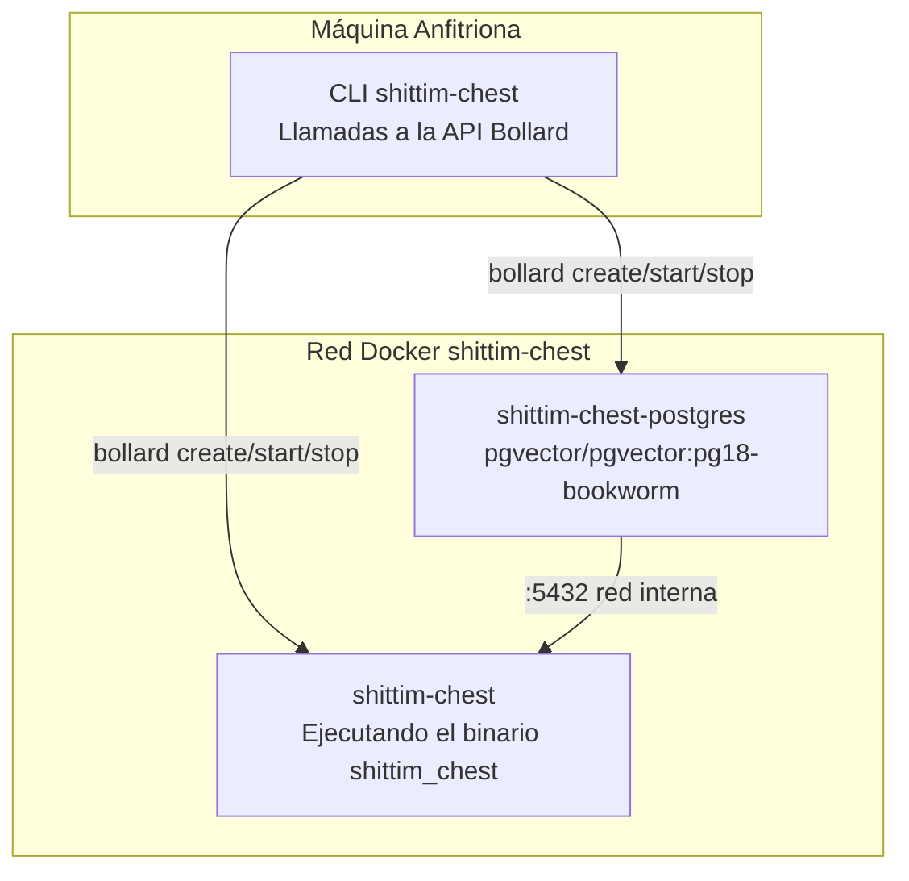

+++
title = "Arquitectura del CLI Wrapper: Orquestación Docker basada en Bollard"
description = """`packages/cli/` es un binario Rust que gestiona los ciclos de vida de los contenedores directamente a través de la API Docker de Bollard, reemplazando completamente docker-compose y los scripts de shell. El CLI se ejecuta en"""
lang = "es"
category = "design"
subcategory = "webui"
+++

# Arquitectura del CLI Wrapper: Orquestación Docker basada en Bollard

## Resumen

`packages/cli/` es un binario Rust que gestiona los ciclos de vida de los contenedores directamente a través de la API Docker de Bollard, reemplazando completamente docker-compose y los scripts de shell. El CLI se ejecuta en la máquina anfitriona, mientras que el binario del servidor (`shittim_chest`) se ejecuta dentro de los contenedores.

## Por qué no docker-compose

| Dimensión | docker-compose | bollard (enfoque actual) |
| --- | --- | --- |
| Dependencia | Requiere instalación independiente de docker-compose | Reutiliza la API del Docker Engine |
| Programabilidad | Declarativo YAML, lógica limitada | Rust nativo, flujo de control arbitrario |
| Health checks | depends_on + condition basado en eventos | Sondeo activo; detección de muerte sin timeouts |
| Manejo de errores | Salida del contenedor = fallo | Reintentos + recolección de logs + información detallada de error |
| Limpieza de recursos | `down -v` todo o nada | Limpieza granular por contenedor/red/volumen |
| Integración | Herramienta externa | Embebido como biblioteca, extensible con más lógica |

## Topología de Contenedores



## Nombres de Contenedores y Recursos

| Constante | Valor | Propósito |
| --- | --- | --- |
| `NET` | `shittim-chest` | Red puente Docker |
| `PG` | `shittim-chest-postgres` | Nombre del contenedor PostgreSQL |
| `APP` | `shittim-chest` | Nombre del contenedor de la aplicación |
| `VOL` | `shittim-chest-pgdata` | Volumen de datos PG |
| `PG_IMG` | `pgvector/pgvector:pg18-bookworm` | Imagen PG |
| `RUNTIME_IMG` | `debian:bookworm-slim` | Imagen de runtime en modo dev |
| `BUILD_IMG` | `shittim-chest` | Imagen de build en modo release |

## Mapeo de Comandos

| Comando | Comportamiento |
| --- | --- |
| `dev [--clean]` | Inicio único: env → red → volumen → PG → cargo build → migrar → lanzar → logs en streaming |
| `up` | Modo release: docker build imagen → migrar → lanzamiento en segundo plano (restart=unless-stopped) |
| `down [--clean]` | Detener contenedores (limpieza opcional de volumen + red) |
| `migrate` | Ejecutar db-migrate en un contenedor de un solo uso (reintenta hasta 5 veces, intervalo 2s) |
| `logs` | Seguir en streaming los logs del contenedor de la aplicación |
| `status` | Verificar estado de ejecución de PG y contenedor de la app + estado del health check |
| `build` | Construir la imagen Docker completa (`docker build -t shittim-chest`) |

## Propagación de Variables de Entorno

```text
archivo .env → dotenvy::from_path_iter → HashMap<String, String>
→ Fusionar SHITTIM_CHEST_HOST / PORT / DATABASE_URL
→ Vec<String> = ["CLAVE=VALOR", ...]
→ bollard Config::env()
```

El CLI no lee su propia configuración de `.env` — solo pasa el contenido completo de `.env` al proceso `shittim_chest` dentro del contenedor. Las contraseñas y puertos se leen mediante las dos claves específicas `SHITTIM_CHEST_DB_PASSWORD` y `SHITTIM_CHEST_PORT`.

## Convenciones de Logging

Los logs del CLI se emiten directamente a stderr, usando el mismo formato que entelecheia:

- `tracing-subscriber` + `ShortTimer` (formato HH:MM:SS)
- `.compact()` modo compacto
- `.with_target(false)` ocultar rutas de módulos
- `--log-level` parámetro del CLI (por defecto `info`)

## Principios de Diseño

1. **El CLI no ejecuta lógica de negocio**: Toda la lógica de negocio reside en el binario `shittim_chest` dentro del contenedor
1. **Los contenedores son unidades inmutables**: El CLI crea/destruye contenedores, nunca modifica los que están en ejecución
1. **Aislamiento de red**: El puerto PG no se expone al anfitrión, solo es accesible dentro de la red Docker interna
1. **Sondeo pasivo para health checks**: No depende de eventos Docker (no fiables); sondea directamente los resultados de inspect
