+++
title = "Rutas de Despliegue de Modo Dual: Dev vs Release"
description = """shittim-chest soporta dos modos de despliegue: Dev (iteración rápida local, sin Node, sin build de imagen) y Release (imagen Docker completa con archivos estáticos del frontend incrustados). Ambos modos comparten la misma topo"""
lang = "es"
category = "design"
subcategory = "webui"
+++

# Rutas de Despliegue de Modo Dual: Dev vs Release

## Resumen

shittim-chest soporta dos modos de despliegue: Dev (iteración rápida local, sin Node, sin build de imagen) y Release (imagen Docker completa con archivos estáticos del frontend incrustados). Ambos modos comparten la misma topología de contenedores y red.

## Motivación del Diseño

Construir una imagen Docker completa (build del frontend Node + compilación Rust + `embedded-frontend`) toma más de 30 segundos, inadecuado para la iteración diaria de desarrollo. El modo Dev aprovecha la caché de compilación incremental de Rust de la máquina anfitriona, montando el binario en un contenedor de runtime mínimo para tiempos de reinicio inferiores a un segundo.

## Comparación de Rutas

```mermaid
flowchart TB
    subgraph Dev[Ruta Dev]
        D1[cargo build -p shittim_chest] --> D2[Binario: target/debug/shittim_chest]
        D2 --> D3[bind mount en debian:bookworm-slim]
        D3 --> D4[Contenedor en ejecución]
    end
    subgraph Release[Ruta Release]
        R1[docker build -t shittim-chest] --> R2[Build multi-etapa]
        R2 --> R3[Node:22-slim build frontend]
        R3 --> R4[Rust:1.85-slim compilar + embedded-frontend]
        R4 --> R5[debian:bookworm-slim runtime]
        R5 --> R6[Contenedor en ejecución]
    end
```



| Dimensión | Modo Dev (`just dev`) | Modo Release (`just up`) |
| --- | --- | --- |
| Frontend | Construido por Vite, servido por el backend mediante `just dev` | Incrustado en el binario (feature `embedded-frontend`) |
| Requiere Node | Sí (para build de Vite) | Sí (dentro de Docker) |
| Origen del binario | `cargo build` local | Compilado dentro de Docker |
| Imagen base del contenedor | `debian:bookworm-slim` | `debian:bookworm-slim` (resultado de build multi-etapa) |
| Velocidad de reinicio | < 5s (después de compilación incremental) | 30-60s (build completo) |
| Caso de uso | Desarrollo diario, depuración | Despliegue CI/producción |
| Método de lanzamiento del contenedor | `Config.cmd = ["shittim_chest"]` | La imagen incluye ENTRYPOINT |

## Detalles de Implementación del Modo Dev

### Compilación Local

```rust
async fn cargo_build() -> Result<()> {
    Command::new("cargo")
        .args(["build", "-p", "shittim_chest"])
        .status().await?;
}
```

La ruta de salida de compilación se fija en `$PWD/target/debug/shittim_chest` (perfil debug, símbolos de depuración preservados).

### Lanzamiento con Bind Mount

```rust
let config = Config::<String> {
    image: Some("debian:bookworm-slim".into()),   // runtime mínimo
    cmd: Some(vec!["shittim_chest".to_string()]),
    host_config: Some(HostConfig {
        binds: Some(vec![
            format!("{bin_path}:/usr/local/bin/shittim_chest:ro")
        ]),
        network_mode: Some(NET.into()),
        port_bindings: ...,
        ..
    }),
    env: Some(container_env(password, port)),
    ..
};
```

Puntos clave:

- El binario se monta en solo lectura (`:ro`) para evitar modificaciones accidentales dentro del contenedor
- La ubicación del binario es `/usr/local/bin/shittim_chest`, ejecutado directamente dentro del contenedor
- La imagen base `debian:bookworm-slim` proporciona el runtime glibc requerido

### Ejecución de Migraciones

Las migraciones se ejecutan mediante un contenedor de un solo uso:

```bash
docker run --rm --network shittim-chest \
  -v $PWD/target/debug/shittim_chest:/usr/local/bin/shittim_chest:ro \
  -e SHITTIM_CHEST_DATABASE_URL=... \
  debian:bookworm-slim \
  shittim_chest db-migrate
```

Reintenta automáticamente hasta 5 veces (intervalo de 2 segundos) para manejar el caso en que PG aún no esté completamente listo.

## Detalles de Implementación del Modo Release

### Dockerfile Multi-Etapa

```dockerfile
# Etapa 1: frontend → Node:22-slim + pnpm → pnpm build:all → /app/dist/
# Etapa 2: builder  → Rust:1.85-slim + COPY dist/ → cargo build --features embedded-frontend
# Etapa 3: runtime  → debian:bookworm-slim + ca-certificates + COPY binary
```

### Feature embedded-frontend

```rust
# [cfg(feature = "embedded-frontend")]
{
    static FRONTEND_DIR: Dir<'_> = include_dir!("$CARGO_MANIFEST_DIR/../dist");
    // Montado en el Router Axum en las rutas /static/*
}
```

Esta feature usa el macro `include_dir!` para incrustar los artefactos de build del frontend en el binario en tiempo de compilación. En modo Release, se puede servir una SPA completa sin un proxy inverso adicional.

## Nombrado de Funciones de Migración y Lanzamiento

Para evitar confusión, el código distingue explícitamente dos conjuntos de funciones:

| Ruta Dev | Ruta Release |
| --- | --- |
| `run_migrate_dev()` | `run_migrate_release()` |
| `start_app_dev()` | `start_app_release()` |
| `cargo_build()` | `build_image()` |

## Desarrollo del Frontend

En modo Dev, `dev.py` reconstruye los activos del frontend ante cambios de archivos. El backend sirve tanto archivos estáticos como API en el mismo puerto (:3000 para dev, :80 para producción).
