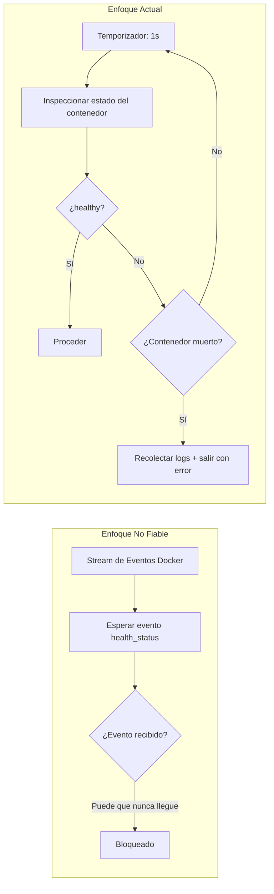

+++
title = "Estrategia de Health Check de PostgreSQL"
description = """El CLI wrapper debe asegurar que PostgreSQL esté listo antes de iniciar el contenedor de la aplicación. Este documento define las decisiones de diseño detrás de la estrategia de health check por sondeo pasivo — rechazando los eve"""
lang = "es"
category = "design"
subcategory = "webui"
+++

# Estrategia de Health Check de PostgreSQL

## Resumen

El CLI wrapper debe asegurar que PostgreSQL esté listo antes de iniciar el contenedor de la aplicación. Este documento define las decisiones de diseño detrás de la estrategia de health check por sondeo pasivo — rechazando los eventos Docker (no fiables) y los timeouts fijos (inflexibles).

## Por qué no los Eventos Docker



En los streams de eventos Docker, el filtro `container` no es fiable para eventos `health_status` — especialmente después de reiniciar un contenedor PG. En la práctica, los eventos pueden no dispararse nunca, causando que el CLI espere indefinidamente.

## Estrategia de Sondeo

```text
while true:
    sleep 1s
    state = docker.inspect_container(PG)
    if state.health.status == HEALTHY:
        break
    if !state.running:
        bail!(collect_logs(PG))
```

| Parámetro | Valor | Justificación |
| --- | --- | --- |
| Intervalo de sondeo | 1s | Suficientemente rápido, sin sobrecarga de inspect |
| Timeout | Ninguno | Sin timeout fijo; PG puede tener inicio en frío |
| Detección de muerte | Cada sondeo | Contenedor ausente → inmediatamente error y volcar últimas 50 líneas de logs |

## Configuración de Health del Contenedor PostgreSQL

```rust
HealthConfig {
    test:        ["CMD-SHELL", "pg_isready -U shittim_chest"],
    interval:    5_000_000_000,   // 5s (nanosegundos)
    timeout:     5_000_000_000,   // 5s
    retries:     10,
    start_period: 30_000_000_000, // 30s de período de gracia inicial
}
```

| Parámetro | Valor | Justificación |
| --- | --- | --- |
| `pg_isready` | Nivel de usuario | Más fiable que la detección de puerto TCP; asegura que PG acepta completamente conexiones |
| `interval: 5s` | Moderado | Evita reintentos frecuentes y ruido en los logs |
| `retries: 10` | Alto | La migración e initdb pueden consumir tiempo; reintentos amplios |
| `start_period: 30s` | Largo | El primer inicio de initdb de pg18 puede ser lento |

## Ruta de Montaje del Volumen de Datos

```rust
Mount {
    target: "/var/lib/postgresql",     // nueva ruta de pg18
    source: "shittim-chest-pgdata",
    typ: MountTypeEnum::VOLUME,
}
```

pg18 cambió el directorio de datos de `/var/lib/postgresql/data` a `/var/lib/postgresql`. Usar la ruta incorrecta causa que PG no encuentre los datos después del inicio.

## Reintentos de Migración

Las migraciones de base de datos tienen una lógica independiente de 5 reintentos:

```text
for retry in 0..5:
    execute docker run --rm ... shittim_chest db-migrate
    if success: break
    sleep 2s
```

Incluso después de que `wait_healthy` retorne, las migraciones pueden fallar porque PG aún está terminando la recuperación. Los reintentos cortos manejan esta ventana crítica.

## Recolección de Logs

Cuando un contenedor falla, las últimas 50 líneas de logs se recolectan automáticamente:

```rust
async fn collect_logs(docker: &Docker, name: &str) -> String {
    docker.logs(name, LogsOptions { tail: "50", stdout: true, stderr: true, .. })
}
```

Esto es crucial para depurar fallos de inicio de PG — errores de initdb, problemas de permisos, conflictos de puertos, etc. solo son visibles en los logs del contenedor.
