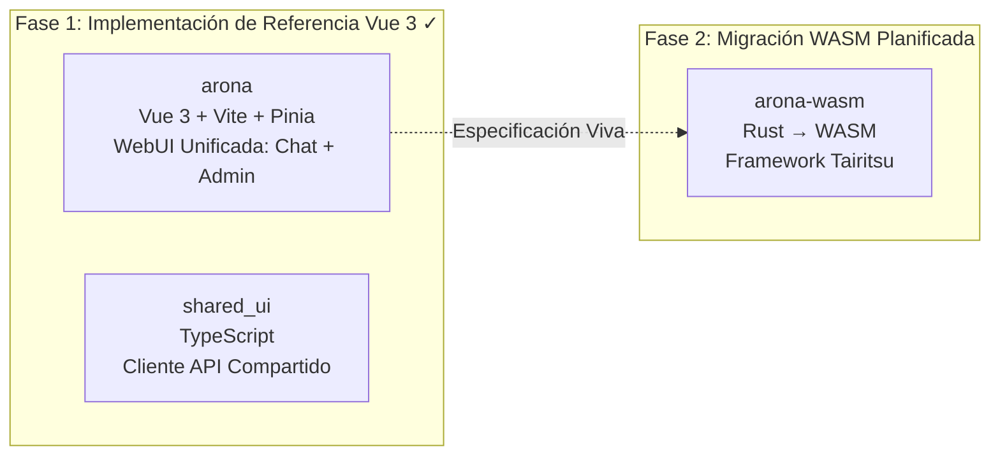
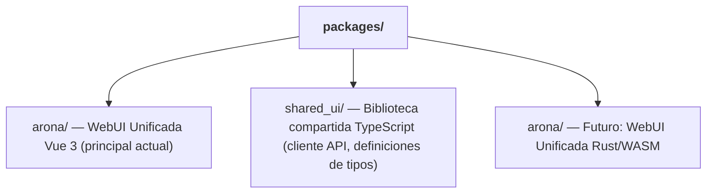

+++
title = "Estrategia de Migración WASM de Frontend Dual"
description = """shittim-chest emplea una estrategia de frontend en dos fases "Vue 3 primero, WASM después". La versión Vue 3 se entrega primero como una implementación de referencia de grado de producción, con la versión Rust/WASM migrando cu"""
lang = "es"
category = "design"
subcategory = "webui"
+++

# Estrategia de Migración WASM de Frontend Dual

## Resumen

shittim-chest emplea una estrategia de frontend en dos fases "Vue 3 primero, WASM después". La versión Vue 3 se entrega primero como una implementación de referencia de grado de producción, con la versión Rust/WASM migrando cuando las condiciones sean maduras. Durante el período en que ambas versiones se ejecuten en paralelo, interacciones de usuario idénticas deben producir resultados idénticos.

## Desglose de Fases



## Comparación de Stack Tecnológico

| Dimensión | Fase 1 (Vue 3) | Fase 2 (WASM) |
| --- | --- | --- |
| Lenguaje | TypeScript / Vue 3 SFC | Rust |
| Framework | Vite + Pinia + Vue Router | Tairitsu (desarrollo propio) |
| Artefacto de build | Bundle JS/CSS | Binario WASM |
| Tamaño del bundle | Mayor | Significativamente menor |
| Rendimiento en runtime | Bueno | Excelente (velocidad casi nativa) |
| Experiencia de desarrollo | HMR instantáneo | Espera de compilación |
| Madurez del ecosistema | Maduro | Etapa temprana |

## El Principio de "Especificación Viva"

La versión Vue 3 no es meramente una implementación temporal; sirve como la **especificación ejecutable** para la migración WASM:

1. **Completitud de características**: Cada característica en la versión WASM debe comportarse idénticamente a la versión Vue 3
1. **Contrato API**: Ambas versiones usan la misma API REST y protocolo WebSocket
1. **Consistencia visual**: Ambas versiones renderizan la misma UI en estados idénticos
1. **Reemplazo progresivo**: Las características de chat y admin de arona pueden migrarse a WASM independientemente

## Umbrales de Decisión para la Migración WASM

La migración a WASM no comenzará antes de que las condiciones sean maduras. Umbrales de decisión:

| Condición | Descripción |
| --- | --- |
| Madurez del framework Tairitsu | Biblioteca de componentes, enrutamiento, gestión de estado, i18n y otra infraestructura deben estar completas |
| Cobertura del ecosistema WASM | `web-sys` / `wasm-bindgen` deben soportar las APIs Web requeridas |
| Ancho de banda de desarrollo | Personal suficiente para mantener ambas versiones mientras se avanza en la migración |
| Requisitos de rendimiento | La versión Vue 3 encuentra cuellos de botella de rendimiento en escenarios del mundo real |

## Estructura de Paquetes del Frontend



`shared_ui/` contiene código de frontend compartido:

- Cliente API (autenticación, chat, gestión de proveedores, etc.)
- Utilidades de autenticación (almacenamiento JWT, refresco, interceptores)
- Definiciones de tipos (enums de dominio, tipos de solicitud/respuesta)

## Comandos de Desarrollo del Frontend

```bash
just build-frontend  # Construir ambos frontends (pnpm build:all)
dev.py               # Vigilar + reconstrucción automática ante cambios de archivos
```

En modo Dev, `dev.py` vigila los archivos fuente y ejecuta `pnpm build` ante cambios. El backend sirve tanto activos estáticos como endpoints API en el mismo puerto — no se necesita un servidor dev o proxy separado.

## Principios de Diseño

1. **Vue 3 entrega características primero**: No esperar a WASM. Los usuarios pueden usar una interfaz de chat y admin completamente funcional hoy.
1. **WASM es mejora, no reemplazo**: La migración no afecta a los usuarios existentes — ambas versiones usan la misma API backend.
1. **Backend independiente del framework**: El backend `shittim_chest` no conoce la implementación del frontend. Cualquier cliente HTTP/WS puede integrarse.
1. **Tairitsu es una dependencia, no un desarrollo interno**: El inicio de la migración WASM depende de la madurez del framework externo Tairitsu.
