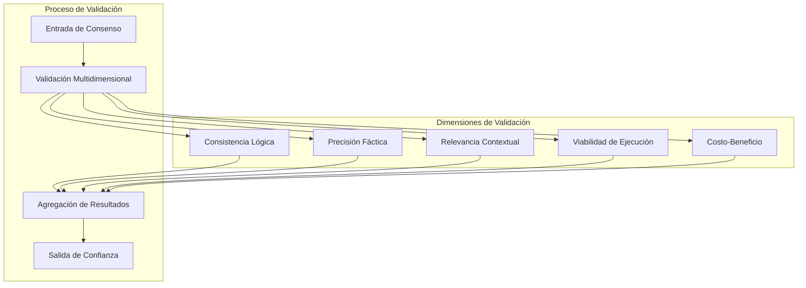
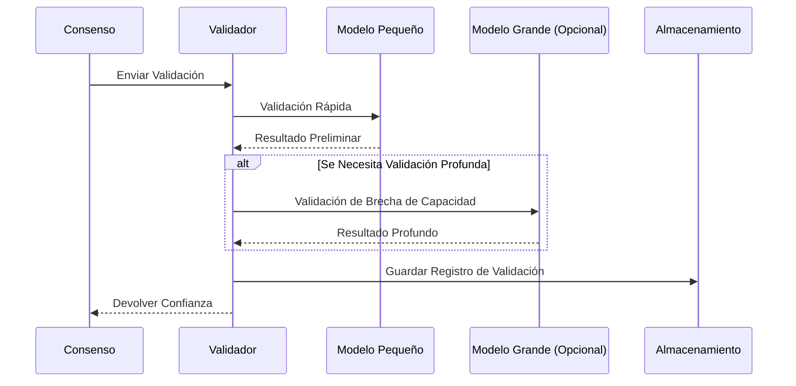
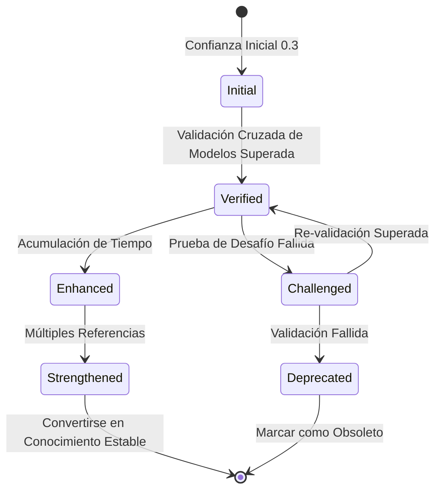
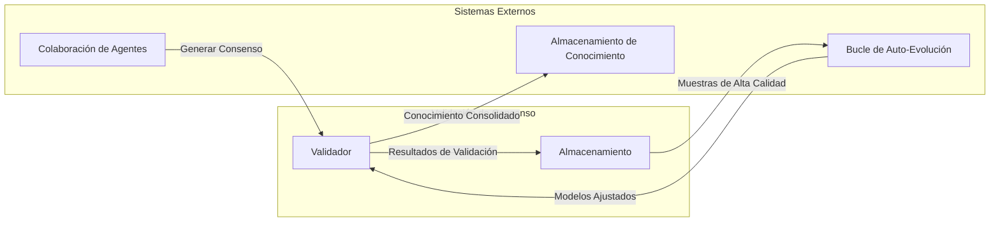

# Mecanismo de Validación de Consenso

## Descripción General

El Mecanismo de Validación de Consenso es un componente central del sistema de colaboración multi-Agente, utilizado para validar y evaluar la fiabilidad y precisión del consenso formado por múltiples Agentes, asegurando la calidad de salida del sistema.

## Principios Fundamentales

### Marco de Validación Multidimensional

El sistema realiza una validación integral a través de cinco dimensiones:

### Descripción de Dimensiones de Validación

| Dimensión | Objetivo de Validación | Indicadores Clave |
| --- | --- | --- |
| Consistencia Lógica | ¿Es el consenso autoconsistente? | Sin contradicciones, razonamiento completo |
| Precisión Fáctica | ¿Son correctas las afirmaciones fácticas? | Consistente con el conocimiento conocido |
| Relevancia Contextual | ¿Es relevante para la tarea actual? | Puntuación de relevancia |
| Viabilidad de Ejecución | ¿Es ejecutable el plan? | Evaluación de operabilidad |
| Costo-Beneficio | ¿Es razonable el costo-beneficio? | Evaluación de ROI |

## Diseño de Arquitectura

### Proceso de Validación Progresiva

### Mecanismo de Acumulación de Confianza

## Integración con Otros Sistemas

## Consideraciones de Diseño

### Control de Costos

- Priorizar modelos pequeños para validación
- Habilitar modelos grandes solo cuando sea necesario
- Caché y reutilización de resultados de validación

### Garantía de Calidad

- Validación cruzada multidimensional
- La acumulación de tiempo mejora la credibilidad
- Las pruebas de desafío descubren problemas potenciales

### Trazabilidad

- Registros completos de historial de validación
- Soporte para auditoría y retroceso
- Soporte para análisis estadístico
