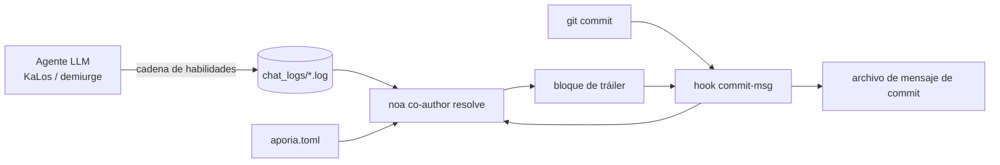

# Identificación de Agentes IA y Estrategia de Co-autoría en Commits

## Descripción General

Este documento especifica cómo los commits generados por IA en los proyectos celestia-island
(`noa`, `entelecheia`, `evernight`) se sellan con **metadatos de procedencia**: qué
modelos produjeron el cambio, a través de qué proveedor/plataforma se accedió a ellos, cuántos
tokens consumieron y si el cambio se produjo bajo iteración autónoma (YOLO).

El mecanismo es **metadatos pragmáticos**: cada commit producido por un agente IA recibe un
bloque de tráiler `Co-authored-by` (y un bloque opcional `Token usage`) añadido por un
hook `commit-msg` de git que `noa` instala y resuelve. Esto no es una barrera de
cumplimiento legal; es trazabilidad que permite a los humanos auditar qué modelo y qué
proveedor tocó el código.

## Motivación

| Preocupación | Cómo ayuda esto |
| --- | --- |
| **Trazabilidad** | Cada commit registra el(los) modelo(s) exacto(s) que lo produjeron. |
| **Responsabilidad del proveedor** | El email del autor codifica el proveedor/plataforma, incluyendo relays de terceros. |
| **Anti-envenenamiento** | Si un relay o proveedor distribuye datos comprometidos, el tráiler de co-autor identifica la fuente. |
| **Seguimiento de costos** | El bloque opcional `Token usage` registra subida/descarga/caché por modelo. |
| **Marcado de modo autónomo** | Una cadena ejecutada completamente bajo control de crucero YOLO se marca con una autoridad `Entelecheia`. |

## Modelo de Identidad del Proveedor

El email del autor usa un único espacio de nombres de confianza — `celestia.world` — con la parte
local codificando **quién sirvió el modelo**:

```text
Nombre para Mostrar <id-del-proveedor-o-plataforma@celestia.world>
```

El id del proveedor es el campo obligatorio **`website_domain`** declarado en cada
config de proveedor (los TOML de punto de entrada del registro de proveedores y el
`aporia.toml` local). **No** se deriva de la API `base_url` — un solo proveedor puede
exponer varios hosts `base_url` (ej. `zhipu_glm` sirve tanto `open.bigmodel.cn` como
`api.z.ai`, pero su dominio canónico es `zhipuai.cn`). Si un proveedor carece de
`website_domain`, no se le atribuye co-autoría (el resolvedor lo omite en lugar de
adivinar desde la URL o el prefijo del modelo).

- **Proveedores de primera parte** se identifican por su dominio canónico:

`anthropic.com`, `deepseek.com`, `openai.com`, `zhipuai.cn`, `google.com`, ...

- **Proveedores de tercera parte / relay** mantienen su propio dominio para que el relay sea visible:

`opencode.ai`, `jdcloud.com`, `openrouter.ai`, `dashscope.aliyuncs.com`, ...

Esto significa que el *mismo* modelo alcanzado a través de diferentes rutas es distinguible:

```text
GLM 5 <zhipuai.cn@celestia.world>              # directo desde Zhipu AI
GLM 5 <jdcloud.com@celestia.world>           # GLM 5 servido vía JD Cloud
Deepseek V4 Pro <deepseek.com@celestia.world> # directo desde DeepSeek
Deepseek V4 Pro <opencode.ai@celestia.world>  # DeepSeek servido vía opencode
```

## Especificación del Tráiler de Co-autor

- Clave del tráiler: `Co-authored-by` (tráiler reconocido por git).
- Valor: `Nombre para Mostrar <local@celestia.world>`.
- **Un tráiler por modelo distinto**, en orden de uso.
- El nombre para mostrar se deriva del id del modelo (marca + versión, en formato título).
- La parte local debe ser un sub-dominio RFC-5321 válido (letras, dígitos, `.`, `-`).

## Tráiler de Autoridad YOLO

Cuando toda la cadena de pensamiento que produjo un commit se ejecutó bajo **control de crucero
YOLO** (iteración autónoma), se antepone un co-autor adicional:

```text
Co-authored-by: Entelecheia <demiurge@celestia.world>
```

El modo YOLO se detecta desde:

1. El registro de chat de sesión que contiene un marcador `YOLO cruise control` / `YOLO auto`, o
1. La presencia del archivo centinela `/run/entelecheia/yolo_active`.

Esto permite a un humano ver inmediatamente "este commit se hizo sin humano en el bucle".

## Uso de Tokens Incrustado

Incrustado en el nombre para mostrar de cada modelo dentro del tráiler `Co-authored-by` (un bloque de tráiler que GitHub analiza correctamente):

```text
Co-authored-by: Claude Opus 4.8 (↑ 12.5k ↓ 8.3k ●45.2k) <anthropic.com@celestia.world>
Co-authored-by: Deepseek V4 Pro (↑ 5.1k ↓ 3.2k) <deepseek.com@celestia.world>
```

Reglas:

- El uso se incrusta en línea como `(↑ subida ↓ descarga)`, con `●caché` añadido solo

cuando se reportaron tokens de entrada en caché y son > 0.

- `↑` = tokens de prompt/entrada; `↓` = tokens de completado/salida.
- Los conteos se representan en miles (`k`), un decimal, ceros finales recortados.

## Ejemplo de Mensaje de Commit Completo

```text
fix(auto_fix): subir timeouts de clippy/check de 180s a 300s

El timeout anterior de 180s era demasiado ajustado para compilaciones limpias en una máquina
cargada; se sube a 300s para evitar fallos de validación espurios.

Co-authored-by: Entelecheia <demiurge@celestia.world>
Co-authored-by: GLM 5 (↑ 36.4k ↓ 1.5k) <zhipuai.cn@celestia.world>
```

## Instalación del Hook de noa

`noa` proporciona el ciclo de vida del hook:

```text
noa hook install --repo <ruta> [--force] [--noa-bin <ruta>]
```

- Escribe `.git/hooks/commit-msg` (modo `0755`).
- El hook llama a `<noa> co-author resolve` y añade su stdout al archivo de mensaje

de commit (`$1`).

- El hook **nunca bloquea un commit**: ante cualquier fallo del resolvedor sale `0` silenciosamente.
- Si un mensaje de commit ya contiene un tráiler `Co-authored-by:`, el hook es un

no-op (nunca duplica ni sobrescribe).

- `NOA_COAUTHOR_DISABLE=1` en el entorno deshabilita el hook para un commit.

## Resolución de Co-autor de noa

```text
noa co-author resolve [--repo <ruta>] [--chat-log-dir <dir>]
                      [--aporia-config <ruta>] [--lookback-secs <n>]
```

El resolvedor:

1. Carga el mapa de proveedores: registro incorporado fusionado con la configuración de proveedor

`aporia.toml` (que proporciona el mapeo preciso modelo→endpoint→proveedor).

1. Lee el(los) registro(s) de chat de entelecheia más reciente(s) y agrega el uso de tokens por

modelo. Con `--lookback-secs 0` (predeterminado) solo se usa el registro más reciente.

1. Detecta el modo YOLO (marcador de registro de chat o archivo centinela).
1. Construye la lista de co-autores (autoridad `Entelecheia` primero si YOLO, luego modelos)

y el bloque de uso de tokens, e imprime el bloque de tráiler en stdout.

## Flujo de Datos



## Integración con entelecheia

- El hook `commit-msg` se instala en `/mnt/sdb1/entelecheia/.git/hooks/`.
- Todos los commits producidos por el pipeline de cirugía (hook `NoaMergeCommit` en

`packages/scepter/src/state_machine/skill_chain/execution/noa_post_chain.rs`) y
por el bucle de auto-curación `KaLos:auto_fix` pasan a través del hook `commit-msg` de git,
por lo que se sellan automáticamente.

- No se requiere ningún cambio en los sitios de llamada de commit: el hook es el único punto

de inserción.

## Integración con evernight

Cuando un agente IA orquesta un commit a través de `evernight` (ej. agente en host A →
evernight SSH → host B → `git commit`), el hook `commit-msg` del lado del host aún se dispara
localmente y sella el commit. `evernight` mismo puede aparecer como un **proveedor de
tránsito** en el email del autor cuando retransmite tráfico de modelo (ej.
`GLM 5 <evernight.celestia.world@celestia.world>`), haciendo el salto de transporte
auditable.

## Consideraciones de Seguridad

- Los tráilers de co-autor son procedencia **auto-reportada**, no prueba criptográfica.

Trabajo futuro puede añadir atestaciones firmadas.

- El resolvedor se degrada de forma segura: un registro de chat faltante, `noa` faltante o un error de análisis

resultan en un bloque vacío y el commit procede intacto.

- Los identificadores de proveedor provienen del `aporia.toml` local, por lo que un usuario siempre ve los

proveedores *que ellos* configuraron.

## Referencia de Identificadores de Proveedor (registro inicial)

| Id de proveedor | Marca | Sugerencia de endpoint |
| --- | --- | --- |
| `zhipuai.cn` | GLM | `open.bigmodel.cn` |
| `deepseek.com` | Deepseek | `api.deepseek.com` |
| `anthropic.com` | Claude | `api.anthropic.com` |
| `openai.com` | GPT / OpenAI | `api.openai.com` |
| `google.com` | Gemini | `googleapis.com` |
| `dashscope.aliyuncs.com` | Qwen | `dashscope.aliyuncs.com` |
| `moonshot.cn` | Kimi | `api.moonshot.cn` |
| `mistral.ai` | Mistral | `api.mistral.ai` |
| `opencode.ai` | (relay) | `opencode.ai` |
| `jdcloud.com` | (relay) | `jdcloud.com` |
| `openrouter.ai` | (relay) | `openrouter.ai` |
