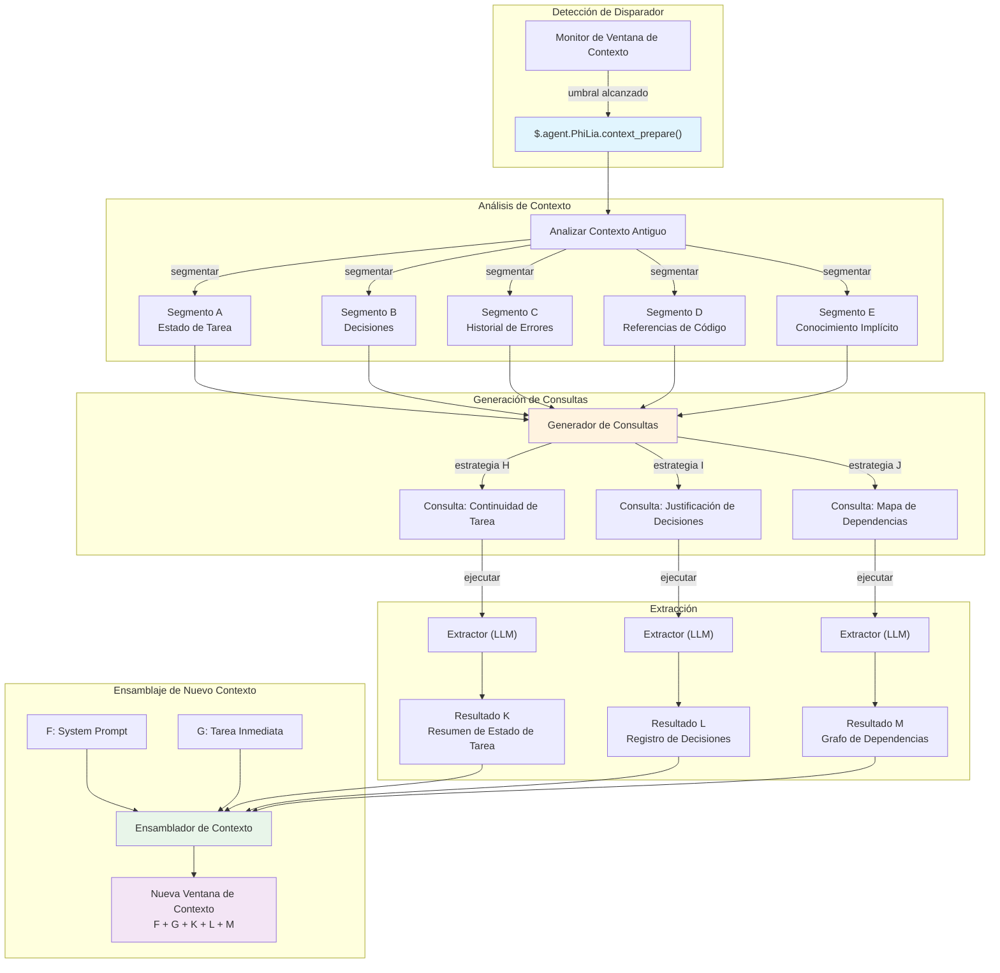
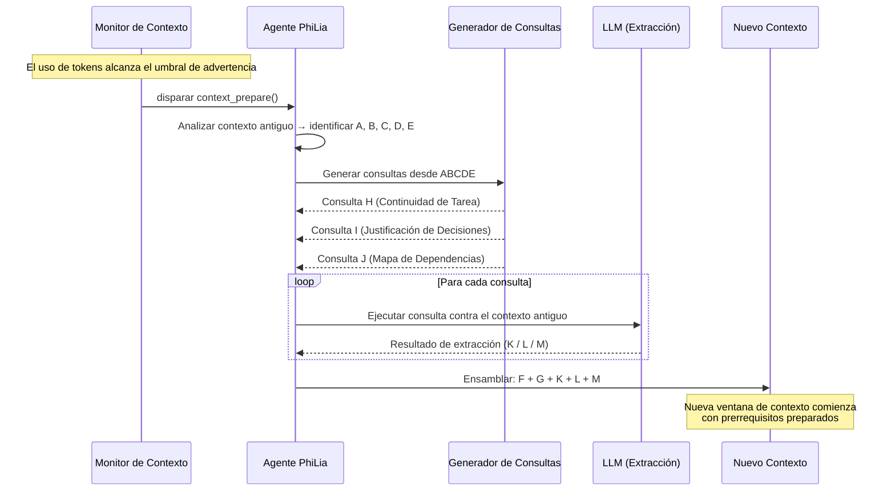

# Mecanismo de Preparación de Contexto

## Descripción General

La Preparación de Contexto es un mecanismo de extracción proactiva que reemplaza la compresión de contexto tradicional. En lugar de comprimir con pérdida el historial de conversación antiguo, analiza el contexto existente, genera consultas dirigidas y extrae precisamente la información necesaria para sembrar una nueva ventana de contexto. El mecanismo pertenece al agente PhiLia y se expone mediante `$.agent.PhiLia.context_prepare()`.

## Planteamiento del Problema

### Límites de la Ventana de Contexto

Los agentes LLM operan dentro de ventanas de contexto finitas. Las tareas de larga duración — refactorizaciones de múltiples archivos, sesiones de depuración que abarcan docenas de mensajes, o flujos de trabajo complejos de múltiples pasos — eventualmente agotan el presupuesto de tokens disponible. Cuando esto sucede, el sistema debe decidir qué preservar y qué descartar.

### La Compresión Pierde Detalles

Los enfoques tradicionales de compresión de contexto (resumen, truncamiento, ventana deslizante) son inherentemente con pérdida. Un compresor no sabe lo que el *siguiente* contexto necesitará, por lo que debe adivinar. Los detalles críticos se descartan inevitablemente:

- Nombres de variables y sus valores actuales
- Decisiones intermedias y su justificación
- Estados de error que aparecieron y fueron parcialmente resueltos
- Dependencias implícitas entre tareas

La falla fundamental: **la compresión optimiza para brevedad, no para relevancia**.

### Interferencia entre Tareas

Cuando una ventana de contexto contiene múltiples tareas o temas, comprimir el historial de una tarea a menudo corrompe la información necesaria para otra. Un resumen que preserva el estado de la Tarea A puede oscurecer la cadena de error crítica de la Tarea B. No existe una estrategia de compresión universal que sirva a todas las posibles necesidades futuras.

### La Pregunta Real

> ¿Qué necesita saber la *siguiente* ventana de contexto del contexto *actual*?

Esta no es una pregunta de compresión. Es una pregunta de **recuperación de información** — y la respuesta depende de lo que viene después, no de lo que vino antes.

## Concepto Central

### Extracción Proactiva vs. Compresión

| Aspecto | Compresión | Preparación de Contexto |
| --- | --- | --- |
| Dirección | Pasado → pasado más corto | Pasado → extracto listo para el futuro |
| Conocimiento del futuro | Ninguno | Las consultas anticipan necesidades próximas |
| Pérdida de información | Inevitable, no dirigida | Dirigida, intencional |
| Analogía | Comprimir un archivo | Buscar en una base de datos |
| Techo de calidad | Calidad del resumen | Precisión de extracción |

La Preparación de Contexto trata el contexto antiguo como una **fuente de datos** — similar a cómo RAG trata un corpus de documentos externo — pero el corpus es la conversación misma. En lugar de comprimir todo en un resumen, hace preguntas dirigidas al contexto antiguo y recoge las respuestas.

### El Modelo ABCDE/KLM

El mecanismo utiliza una notación basada en letras para describir el flujo de información:

```text
Contexto Antiguo:  A + B + C + D + E
                         ↓ (analizar)
Consultas:          ABCDE+H  ABCDE+I  ABCDE+J
                         ↓ (extraer)
Resultados:              K        L        M
                         ↓ (ensamblar)
Nuevo Contexto:     F + G + K + L + M
```

- **A–E**: Segmentos/aspectos distintos del contexto antiguo (estado de la tarea, decisiones, historial de errores, referencias de código, conocimiento implícito)
- **H, I, J**: Estrategias de consulta derivadas del análisis de los elementos clave de A–E. Cada estrategia apunta a una necesidad de información diferente
- **K, L, M**: Resultados de extracción — las respuestas precisas a cada consulta
- **F, G**: Nuevo system prompt y contexto de tarea inmediata para la nueva ventana
- **El nuevo contexto** recibe F + G (fresco) + K + L + M (extraído), omitiendo el historial completo A–E

### Por Qué Esto Reemplaza la Compresión

Una vez que existe la Preparación de Contexto, la compresión tradicional se vuelve innecesaria porque:

1. **No se pierde información por adivinación** — las consultas se generan basándose en lo que el nuevo contexto realmente necesitará
1. **La extracción es determinista en estructura** — la misma estrategia de consulta siempre produce la misma categoría de respuesta
1. **Múltiples ángulos aseguran cobertura** — las consultas H/I/J cubren diferentes dimensiones (estado de tarea, contexto de error, justificación de decisiones)
1. **El contexto antiguo permanece accesible** — no se descarta, sino que se *consulta bajo demanda* durante la fase de preparación

## Arquitectura

### Flujo de Alto Nivel



### Diagrama de Secuencia



## Diseño de API

### `$.agent.PhiLia.context_prepare()`

El punto de entrada principal. Se llama cuando el monitor de ventana de contexto detecta que el uso de tokens ha alcanzado el umbral de advertencia.

```typescript
interface ContextPrepareRequest {
    old_context: string;
    current_task: string;
    warning_threshold: number;
    current_usage: number;
    max_tokens: number;
}

interface ContextPrepareResult {
    segments: ContextSegment[];
    queries: GeneratedQuery[];
    extractions: ExtractionResult[];
    prepared_context: string;
    metadata: {
        old_context_tokens: number;
        prepared_context_tokens: number;
        compression_ratio: number;
        queries_executed: number;
        extraction_time_ms: number;
    };
}

// Endpoint de API PhiLia
$.agent.PhiLia.context_prepare(request: ContextPrepareRequest): ContextPrepareResult
```

### `$.agent.PhiLia.context_query()`

Una API de nivel inferior para ejecutar consultas individuales contra un contexto. Usada internamente por `context_prepare()` pero también disponible para consultas ad-hoc.

```typescript
interface ContextQueryRequest {
    context: string;
    query: string;
    strategy: "task_continuity" | "decision_rationale" | "dependency_map" | "custom";
    max_result_tokens: number;
}

interface ContextQueryResult {
    result: string;
    confidence: number;
    source_segments: string[];
    tokens_used: number;
}

$.agent.PhiLia.context_query(request: ContextQueryRequest): ContextQueryResult
```

### `$.agent.PhiLia.context_segment()`

Analiza un contexto y lo divide en segmentos etiquetados (A–E).

```typescript
interface SegmentRequest {
    context: string;
    max_segments: number;
}

interface Segment {
    id: string;           // "A", "B", "C", etc.
    label: string;        // "Estado de Tarea", "Decisiones", etc.
    content: string;
    token_count: number;
    importance_rank: number;
}

$.agent.PhiLia.context_segment(request: SegmentRequest): Segment[]
```

## Estrategia de Consulta

### Cómo se Generan las Consultas H/I/J

El proceso de generación de consultas toma el contexto antiguo segmentado (A–E) y produce tres categorías de consultas, cada una apuntando a una dimensión diferente de información necesaria por el nuevo contexto.

### Estrategia H: Continuidad de Tarea

**Propósito**: Asegurar que el nuevo contexto pueda reanudar la tarea actual sin pérdida de progreso.

**Lógica de generación**:

1. Identificar tareas activas de los segmentos A y E (estado de tarea + conocimiento implícito)
1. Extraer indicadores de progreso actual (qué está hecho, qué está en progreso, qué está bloqueado)
1. Generar una consulta que pregunte: *"¿Cuál es el estado actual de todas las tareas activas y cuáles son los próximos pasos?"*

**Consulta de ejemplo**:

```text
Dado el historial de conversación, identificar:
1. Todas las tareas actualmente en progreso y su estado de finalización
2. Cualquier bloqueo o error no resuelto
3. El siguiente paso exacto que estaba a punto de tomarse
4. Rutas de archivos y números de línea actualmente en modificación
```

### Estrategia I: Justificación de Decisiones

**Propósito**: Preservar el *por qué* detrás de las decisiones, no solo el *qué*.

**Lógica de generación**:

1. Escanear los segmentos B y C (decisiones + historial de errores) en busca de puntos de elección
1. Identificar decisiones donde se consideraron y rechazaron alternativas
1. Generar una consulta que pregunte: *"¿Qué decisiones se tomaron, qué alternativas se rechazaron y por qué?"*

**Consulta de ejemplo**:

```text
De esta conversación, extraer:
1. Todas las decisiones arquitectónicas o de implementación tomadas
2. Para cada decisión: qué alternativas se consideraron
3. Para cada decisión: la razón específica por la que se prefirió el enfoque elegido
4. Cualquier restricción o requisito que influyó en estas elecciones
```

### Estrategia J: Mapa de Dependencias

**Propósito**: Capturar relaciones entre elementos de código, archivos y conceptos.

**Lógica de generación**:

1. Escanear los segmentos D y E (referencias de código + conocimiento implícito) en busca de relaciones entre entidades
1. Mapear qué archivos dependen de cuáles, qué funciones llaman a cuáles, qué conceptos se relacionan
1. Generar una consulta que pregunte: *"¿Cuáles son las dependencias y relaciones clave entre las entidades discutidas?"*

**Consulta de ejemplo**:

```text
Analizar la conversación y mapear:
1. Todos los archivos/módulos mencionados y sus relaciones
2. Cadenas de llamadas a funciones discutidas o modificadas
3. Flujo de datos entre componentes
4. Valores de configuración y dónde se utilizan
5. Cualquier dependencia implícita no declarada directamente pero implícita por el trabajo
```

### Extensibilidad

Las tres estrategias (H, I, J) son el conjunto predeterminado. El sistema soporta estrategias personalizadas:

```typescript
interface QueryStrategy {
    id: string;
    name: string;
    description: string;
    source_segments: string[];     // qué segmentos analizar
    query_template: string;        // plantilla con marcadores {segment_X}
    priority: number;              // prioridad de ejecución
    max_result_tokens: number;
}
```

Se pueden registrar nuevas estrategias mediante configuración, permitiendo patrones de extracción específicos del dominio.

## Puntos de Integración

### Monitor de Ventana de Contexto

El disparador para la Preparación de Contexto reside en el subsistema de monitoreo de ventana de contexto. Cuando el uso de tokens cruza el umbral de advertencia (predeterminado: 80% del máximo), el monitor llama a `$.agent.PhiLia.context_prepare()`.

```rust
// En el monitor de ventana de contexto (conceptual)
fn check_context_health(&mut self) {
    let usage_ratio = self.current_tokens as f64 / self.max_tokens as f64;
    if usage_ratio >= self.warning_threshold {
        let result = philia.context_prepare(ContextPrepareRequest {
            old_context: self.get_full_context(),
            current_task: self.get_current_task_description(),
            warning_threshold: self.warning_threshold,
            current_usage: self.current_tokens,
            max_tokens: self.max_tokens,
        });
        self.spawn_new_context(result.prepared_context);
    }
}
```

### Integración con skill_chain.rs

El ejecutor de cadena de habilidades debe ser consciente de la preparación de contexto. Cuando una cadena de habilidades abarca múltiples ventanas de contexto, el mecanismo de preparación asegura que:

1. El estado de la cadena de habilidades se capture en el segmento A (estado de tarea)
1. La entrada/salida de la habilidad actual se capture en el segmento D (referencias de código)
1. Los pasos restantes de la cadena se preserven en el resultado de extracción K (continuidad de tarea)

```rust
// skill_chain.rs (integración conceptual)
impl SkillChainExecutor {
    fn execute_step(&mut self, step: ChainStep) -> Result<StepResult> {
        // Antes de ejecutar, verificar si se necesita preparación de contexto
        if self.context_monitor.should_prepare() {
            let prepared = self.philia.context_prepare(
                self.build_prepare_request()
            )?;
            self.context = prepared.prepared_context;
        }
        // Continuar con la ejecución del paso
        self.execute_with_context(step, &self.context)
    }
}
```

### Propiedad del Agente PhiLia

La Preparación de Contexto es una capacidad propiedad de PhiLia. Esto significa:

- La API `$.agent.PhiLia.context_prepare()` está registrada como una habilidad de PhiLia
- PhiLia gestiona las plantillas de generación de consultas y las estrategias de extracción
- Otros agentes solicitan preparación de contexto a través de PhiLia mediante el protocolo estándar de invocación de habilidades
- PhiLia puede aprovechar su almacén de conocimiento para enriquecer las consultas con patrones históricos

### Generación de Contexto

Cuando el sistema genera una nueva ventana de contexto, el contexto preparado (F + G + K + L + M) reemplaza el resumen comprimido tradicional:

```rust
fn spawn_new_context(&mut self, prepared: ContextPrepareResult) {
    let system_prompt = self.build_system_prompt();      // F
    let immediate_task = self.get_current_task();         // G
    let new_context = format!(
        "{}\n\n{}\n\n---\n## Resultados de Preparación de Contexto\n### Estado de Tarea\n{}\n### Registro de Decisiones\n{}\n### Dependencias\n{}\n",
        system_prompt,    // F
        immediate_task,   // G
        prepared.extractions[0].result,  // K
        prepared.extractions[1].result,  // L
        prepared.extractions[2].result,  // M
    );
    self.launch_context(new_context);
}
```

## Fases de Implementación

### Fase 1: Fundación (MVP)

- Implementar `$.agent.PhiLia.context_segment()` — análisis y segmentación de contexto
- Implementar las tres estrategias de consulta predeterminadas (H: continuidad de tarea, I: justificación de decisiones, J: mapa de dependencias)
- Implementar `$.agent.PhiLia.context_prepare()` — orquestación de segmento → consulta → extraer → ensamblar
- Integrar con el disparador del monitor de ventana de contexto
- Validar con conversaciones de una sola tarea

### Fase 2: Robustez

- Añadir puntuación de confianza a los resultados de extracción
- Implementar estrategias de respaldo cuando la confianza de extracción es baja
- Añadir soporte de streaming para contextos grandes
- Optimización de rendimiento: ejecución paralela de consultas
- Añadir `$.agent.PhiLia.context_query()` para consultas ad-hoc

### Fase 3: Inteligencia

- Aprender estrategias de consulta óptimas a partir de resultados históricos de preparación
- Ponderación adaptativa de segmentos según el tipo de tarea
- Resolución de referencias entre contextos (vincular resultados de preparación a través de múltiples generaciones)
- Integración con sedimentación de memoria para retención a largo plazo

### Fase 4: Reemplazo Completo

- Eliminar la ruta de código de compresión de contexto heredada
- La Preparación de Contexto se convierte en el único mecanismo para transiciones de contexto
- Telemetría completa y métricas de calidad
- Documentación y guía de migración para agentes personalizados

## Ejemplos

### Ejemplo 1: Refactorización de Múltiples Archivos

**Escenario**: Un agente está refactorizando un crate de Rust, modificando 15 archivos en 3 módulos. La ventana de contexto se llena después de modificar el archivo 10.

**Contexto antiguo (A–E)**:

- **A** (Estado de Tarea): 10/15 archivos modificados, módulos `auth` y `storage` completos, `api` en progreso
- **B** (Decisiones): Se eligió abstracción basada en traits sobre despacho por enum; se mantuvo compatibilidad hacia atrás mediante `#[deprecated]`
- **C** (Errores): Se encontró problema de lifetime en `storage/mod.rs:142`, resuelto con `Arc<Mutex<>>`
- **D** (Referencias de Código): `auth/traits.rs`, `storage/mod.rs:142`, `api/handler.rs:38-56`
- **E** (Implícito): La struct `User` debe permanecer `Clone` para crates descendentes; la cobertura de pruebas está rastreada

**Consultas generadas**:

- **H** (Continuidad de Tarea): "¿Qué archivos quedan por modificar, cuál es el patrón que se está aplicando y cuál es el siguiente archivo a refactorizar?"
- **I** (Justificación de Decisiones): "¿Por qué se eligió la abstracción basada en traits sobre el despacho por enum, y qué restricciones de compatibilidad hacia atrás existen?"
- **J** (Mapa de Dependencias): "Mapear las dependencias entre los módulos `auth`, `storage` y `api`, anotando qué structs/traits cruzan los límites de módulo."

Los **resultados de extracción (K, L, M)** se ensamblan con el nuevo system prompt (F) y la siguiente instrucción de tarea (G).

### Ejemplo 2: Sesión de Depuración

**Escenario**: Depurando un problema de conexión WebSocket que abarca múltiples hipótesis e intentos de prueba.

**Contexto antiguo (A–E)**:

- **A** (Estado de Tarea): El problema se ha acotado a la fase de handshake; el heartbeat no es la causa
- **B** (Decisiones): Se descartó mala configuración TLS; se descartó interferencia de proxy; la hipótesis actual es orden de cabeceras
- **C** (Errores): `ConnectionReset` a los 3s, reproducido consistentemente con curl pero no con navegador
- **D** (Referencias de Código): `ws/handshake.rs:67-89`, `headers/mod.rs:23`, archivo de prueba `tests/ws_test.rs`
- **E** (Implícito): El servidor está detrás de nginx; el problema solo aparece en producción, no en desarrollo local

Las **consultas generadas** extraen el estado de depuración, las hipótesis rechazadas y las rutas de investigación restantes al nuevo contexto.

### Ejemplo 3: Cadena de Habilidades entre Agentes

**Escenario**: PhiLia delega una cadena de tareas a Skemma (diseño de esquema) y luego a Logos (documentación). El contexto se llena durante el trabajo de Logos.

**Contexto antiguo (A–E)**:

- **A** (Estado de Tarea): Diseño de esquema completo, documentación al 60%
- **B** (Decisiones): El esquema usa tablas de unión para relaciones M:N según la guía de arquitectura de PhiLia
- **C** (Errores): Skemma reportó ambigüedad en la cardinalidad `user_roles`, resuelta añadiendo restricción `UNIQUE`
- **D** (Referencias de Código): `schema.sql:45-67`, `docs/api/endpoints.md:12-34`
- **E** (Implícito): La documentación debe coincidir con el formato de especificación OpenAPI 3.0 usado en otras partes del proyecto

La preparación asegura que el nuevo contexto de Logos reciba las decisiones del esquema y la restricción de formato de documentación, sin necesitar la conversación completa de diseño de Skemma.
