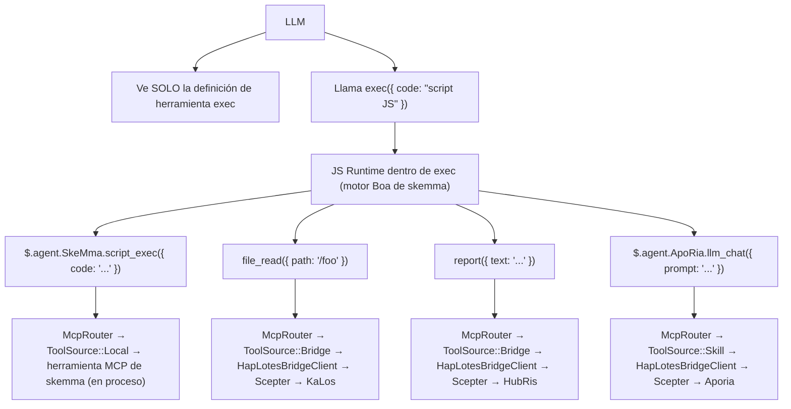
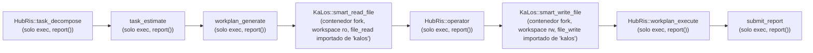
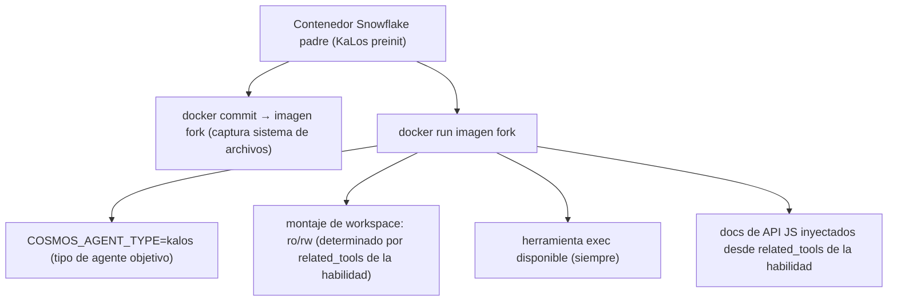

# Arquitectura de Enrutamiento de Habilidades entre Agentes

## Problema

La cadena de habilidades (`execute_skill_chain`) utiliza una arquitectura de microkernel solo-ejecución. El LLM ve solo tres herramientas: `exec`, `write_to_var`, `write_to_var_json` — sin listas blancas de herramientas por agente, sin definiciones de herramientas por habilidad. Toda la invocación de herramientas MCP ocurre dentro del runtime TypeScript (motor IEPL) mediante importaciones de módulos ES y APIs TS entre agentes como `file_read()`.

## Principios de Diseño

1. **Microkernel solo-ejecución** — Al LLM nunca se le dan definiciones de herramientas MCP directamente. Tiene tres herramientas: `exec`, `write_to_var` y `write_to_var_json`. Todas las llamadas a herramientas ocurren dentro del runtime TS del motor IEPL.
1. **`related_tools` dirige todo** — Las habilidades declaran `related_tools` en su frontmatter TOML. Estos nombres se convierten en documentación de API TS inyectada en el prompt del LLM (ej. `file_read()`, `report()`).
1. **Enrutamiento vía API TS → McpRouter** — Dentro del runtime IEPL de `exec`, las importaciones de módulos ES se enrutan a la implementación correcta de herramienta MCP mediante `McpRouter`. Las llamadas entre agentes como `file_read()` se resuelven a la implementación `file_read` del agente KaLos.
1. **Aislamiento de contenedores** — Los contenedores hijos heredan el sistema de archivos del padre mediante fork `docker commit`. Los espacios de trabajo se montan como solo lectura o lectura-escritura según los `related_tools` de la habilidad.
1. **`related_tools` determina el modo lectura/escritura** — `skill_needs_write_access()` inspecciona `related_tools` en busca de nombres de herramientas de escritura (`file_write`, `file_edit`, etc.) para decidir el modo de montaje del contenedor fork.

## Arquitectura

### Flujo del Microkernel Solo-Ejecución



### Flujo de Ejecución de Cadena de Habilidades



### Mecanismo de Fork de Contenedor



## Detalles de Implementación

### Componentes Principales

| Componente | Archivo | Responsabilidad |
| --- | --- | --- |
| `skill_to_agent_name()` | `skill_chain.rs` | Busca el nombre del agente propietario de una habilidad dada |
| `skill_needs_write_access()` | `skill_chain.rs` | Inspecciona `related_tools` en busca de nombres de herramientas de escritura para determinar el modo de montaje del contenedor fork |
| `fork_for_sub_skill()` | `snowflake_manager.rs` | Realiza `docker commit` + `docker run`; monta workspace como ro/rw según `skill_needs_write_access()` |
| `find_by_agent_type()` | `snowflake_manager.rs` | Busca en orden inverso, devolviendo el contenedor fork más reciente |
| `McpRouter` | `packages/cosmos/src/bin/cosmos/mcp_router.rs` | Enruta llamadas de importación de módulos ES: `ToolSource::Local` → skemma, `ToolSource::Bridge` → HapLotes |
| `HapLotesBridgeClient` | `packages/agents/haplotes/src/bridge/client.rs` | Puente Cosmos → Scepter: `bridge_call()`, `bridge_list_tools()` |
| `BridgeInvoker` | `packages/scepter/src/agent_manager/bridge_invoker.rs` | Lado Scepter: enruta llamadas de herramientas al agente registrado correcto |
| `build_js_api_docs()` | `skill_chain.rs` | Genera documentación de API JS desde `related_tools` de la habilidad para inyección en prompt |
| `build_skill_user_prompt(agent_name, ...)` | `skill_chain.rs` | Ensambla el prompt de habilidad con docs de API JS inyectados |

### Cómo se Generan los Docs de API JS

El frontmatter TOML de una habilidad declara `related_tools`:

```toml
# smart_read_file.md
related_tools = ["file_read", "file_list", "file_exists"]
```

El sistema resuelve cada herramienta a su agente propietario y genera docs de API TS desde declaraciones `.d.ts`:

```typescript
// Inyectado en el prompt del LLM como APIs disponibles (con declaraciones de tipo de .d.ts):
file_read({ path: string }): Promise<string>
file_list({ dir: string }): Promise<string[]>
file_exists({ path: string }): Promise<boolean>
report({ text: string }): Promise<void>
```

El LLM llama a estas APIs dentro de su código `exec`; el McpRouter despacha a la implementación de herramienta MCP del agente correcto.

### Ciclo de Vida del Fork

1. **Crear**: `docker commit` contenedor padre → imagen fork → `docker run` contenedor hijo
1. **Conectar**: `CosmosConnector` se conecta al Unix socket del contenedor hijo
1. **Puente**: `HapLotesBridgeClient` dentro del contenedor fork se conecta al `HapLotesBridgeServer` de Scepter
1. **Ejecutar**: El LLM llama `exec` con código JS; el runtime JS usa McpRouter → puente → agentes Scepter
1. **Limpiar**: Cuando la cadena termina, `snowflake.remove()` destruye el contenedor + `docker rmi` limpia la imagen

### Estrategia de Montaje de Workspace

| Tipo de habilidad | Característica de `related_tools` | Montaje de workspace |
| --- | --- | --- |
| Solo lectura (smart_read_file) | Solo file_read, file_list, file_exists | `:ro` (solo lectura) |
| Escritura (smart_write_file) | Incluye file_write, file_edit, file_delete | `:rw` (lectura-escritura) |

### Enrutamiento de Herramientas entre Agentes

Dentro del runtime JS de `exec`, el McpRouter resuelve llamadas de herramientas mediante el puente HapLotes:

```mermaid
flowchart TB
    subgraph Bridge["Llamada Puente"]
        A1["exec({ code: &quot;file_read({path:'/foo'})&quot; })"] --> B1["McpRouter resuelve &quot;kalos&quot; + &quot;file_read&quot;"]
        B1 --> C1["tool_to_source → ToolSource::Bridge"]
        C1 --> D1["HapLotesBridgeClient → bridge.call(&quot;kalos.file_read&quot;, params)"]
        D1 --> E1["HapLotesBridgeServer de Scepter → BridgeInvoker"]
        E1 --> F1["enruta al agente KaLos → herramienta MCP file_read"]
    end
    subgraph Local["Llamada Local"]
        A2["exec({ code: &quot;$.agent.SkeMma.script_exec({code:'1+1'})&quot; })"] --> B2["McpRouter resuelve &quot;skemma&quot; + &quot;script_exec&quot;"]
        B2 --> C2["tool_to_source → ToolSource::Local"]
        C2 --> D2["invoca herramienta MCP de skemma directamente (motor Boa en proceso)"]
    end
```



### Detección de Acceso de Escritura

```rust
fn skill_needs_write_access(skill: &Skill) -> bool {
    const WRITE_TOOLS: &[&str] = &["file_write", "file_edit", "file_delete", "file_rename"];
    skill.related_tools.iter().any(|t| WRITE_TOOLS.contains(&t.as_str()))
}
```

Esta función lee `related_tools` de la habilidad desde su frontmatter TOML. Si alguna herramienta de escritura está presente, el workspace del contenedor fork se monta como lectura-escritura.

## Configuración

### Frontmatter TOML de Habilidad

```toml
# smart_read_file.md
+++
related_tools = ["file_read", "file_list", "file_exists"]

[[next_action]]
agent = "hubris"
name = "operator"
+++

# smart_write_file.md
+++
related_tools = ["file_write", "file_edit"]

[[next_action]]
agent = "hubris"
name = "workplan_execute"
+++
```

### Cadena next_action (TOML de habilidad)

```toml
# workplan_generate.md
[[next_action]]
agent = "kalos"
name = "smart_read_file"

# smart_read_file.md
[[next_action]]
agent = "hubris"
name = "operator"

# operator.md
[[next_action]]
agent = "kalos"
name = "smart_write_file"

# smart_write_file.md
[[next_action]]
agent = "hubris"
name = "workplan_execute"
```

## Referencia de API JS de Habilidades

| Habilidad | Agente | APIs JS (de `related_tools`) | Estado |
| --- | --- | --- | --- |
| `smart_read_file` | KaLos | `file_read()`, `file_list()`, `file_exists()` | ✅ Implementado |
| `smart_write_file` | KaLos | `file_write()`, `file_edit()` | ✅ Implementado |
| `exec_script` | SkeMma | `$skeMma.script_exec()` | Pendiente |
| `smart_command` | SkoPeo | `$skoPeo.smart_command_execute()` | Pendiente |

## Riesgos y Consideraciones

1. **Recursos de contenedores** — Cada fork crea un nuevo contenedor Docker; los contenedores se limpian automáticamente cuando la cadena termina.
1. **Costo de tokens** — Cada fork tiene su propio contexto LLM independiente; los docs de API JS añaden sobrecarga modesta por habilidad.
1. **Profundidad de cadena de fork** — Actualmente sin límite de profundidad; los forks solo ocurren cuando `step_index > 1`.
1. **Paso de contexto** — Padre → hijo pasa a través del contenido del reporte; pueden necesitarse estrategias de truncamiento.
1. **Seguridad en paralelo** — Cuando múltiples cadenas hacen fork concurrentemente del mismo tipo de agente, la búsqueda en orden inverso asegura que cada una use su último fork.
1. **Control de superficie API** — El LLM solo puede llamar APIs JS listadas en los docs inyectados; McpRouter rechaza nombres de herramienta desconocidos.
