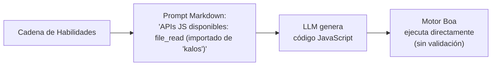
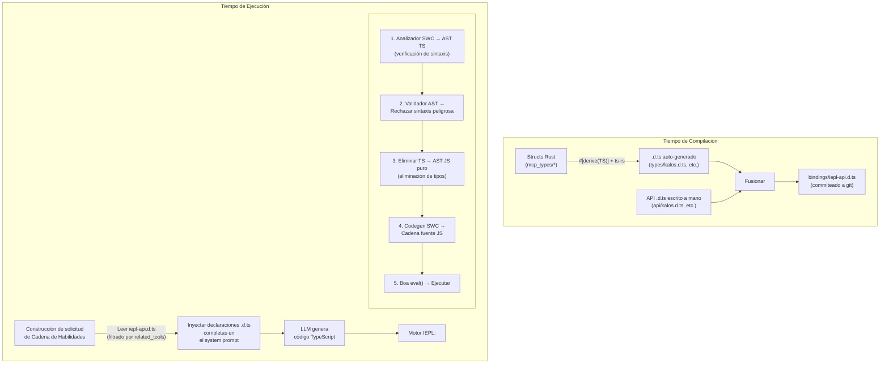
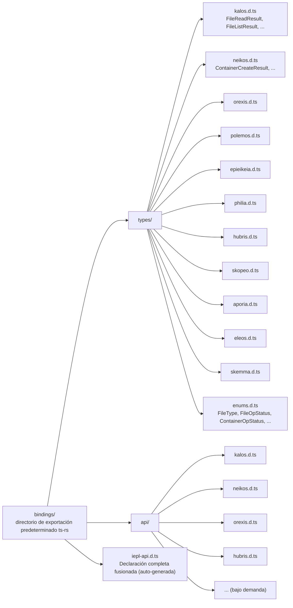
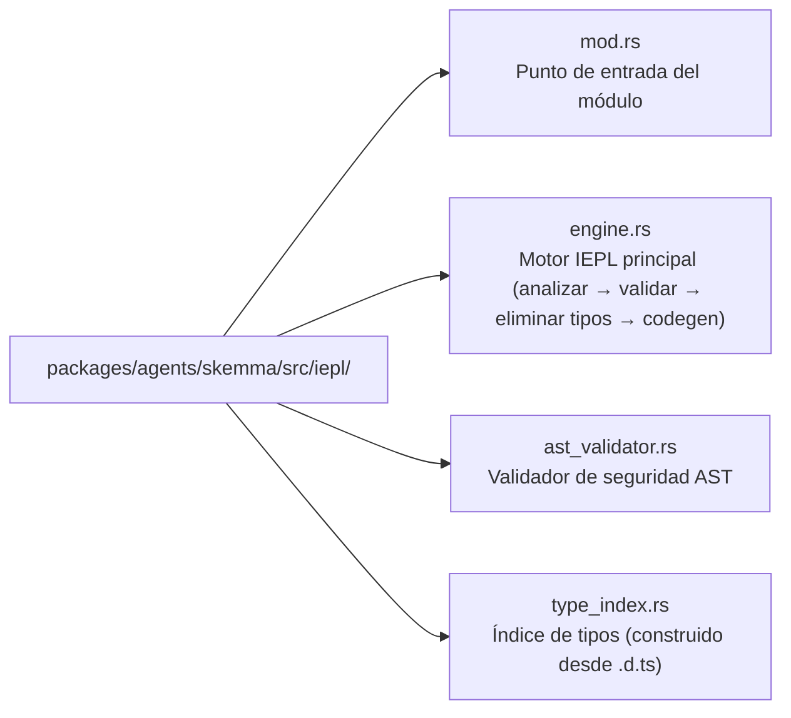

# 22 — Diseño del Motor de Ejecución TypeScript IEPL

## Descripción General

El Motor de Ejecución IEPL (In-Execution Prompt Language) es una actualización arquitectónica del runtime JS existente de Cosmos/SkeMma, mejorando el código de ejecución generado por LLM de JavaScript a TypeScript. Los cambios principales incluyen:

1. **Crate SWC integrado**: Verificación estricta de sintaxis, eliminación de tipos y transpilación de TypeScript generado por LLM
1. **Generación de tipos Rust derive → TypeScript**: Auto-exportación de structs Rust a archivos de declaración `.d.ts` mediante `ts-rs`
1. **Skill Prompt con seguridad de tipos**: Inyectar declaraciones `.d.ts` completas en lugar de listas de funciones hardcodeadas, mejorando significativamente la robustez

## Estado Actual y Problemas

### Flujo de Ejecución Actual



### Problemas Existentes

| Problema | Descripción |
| --- | --- |
| **Sin restricciones de tipo** | El código JS generado por LLM tiene cero información de tipo estático; los errores tipográficos en parámetros solo se detectan en tiempo de ejecución |
| **Descripciones de interfaz frágiles** | `build_report_tool_instruction()` hardcodea listas de texto como `- file_read (importado de 'kalos')`, incapaz de expresar tipos de parámetros o estructuras de valor de retorno |
| **Sin pre-validación** | El código LLM va directamente a `eval()` de Boa; los errores de sintaxis solo se descubren en tiempo de ejecución |
| **Esquema y prompt desacoplados** | `McpSchemaWriter` genera archivos de esquema JSON pero nunca se usan para inyección de prompt |
| **Parámetros de herramienta sin tipo** | Los parámetros de herramienta actuales se pasan como `serde_json::Value`, extraídos manualmente mediante `get("field")`, sin garantías de seguridad de tipos |

### Archivos Clave Involucrados

| Archivo | Responsabilidad Actual |
| --- | --- |
| `packages/agents/skemma/src/js_runtime/runtime.rs` | Runtime Boa JS, `exec()` llama directamente a `eval()` |
| `packages/agents/skemma/src/mcp/tools/script_exec.rs` | Solo acepta lenguaje `"javascript"` |
| `packages/cosmos/src/bin/cosmos/js_repl/js_commands.rs` | Genera dinámicamente `globalThis.$agent.tool = (...) => ...` |
| `packages/scepter/src/state_machine/skill_chain/prompt.rs:51` | `build_report_tool_instruction()` hardcodea la lista de API |
| `packages/shared/src/mcp_types/*.rs` | Todas las definiciones de tipo de resultado de herramienta MCP (solo serde, sin exportación TS) |
| `packages/shared/src/mcp_types/schema.rs` | `McpSchemaWriter` genera esquema JSON (no usado por el prompt) |

## Arquitectura Objetivo



## Selección de Tecnología

### 1. Generación de Tipos Rust → TypeScript: `ts-rs`

| Atributo | Valor |
| --- | --- |
| Crate | `ts-rs` (Aleph-Alpha/ts-rs) |
| Versión | ≥ 12.0 |
| Estrellas | 1.772 |
| Descargas | ~7.3M |
| Licencia | MIT |

**Justificación:**

- Profundamente compatible con el ecosistema `serde` existente del proyecto (la característica `serde-compat` reconoce automáticamente `rename`/`rename_all`/`skip`, etc.)
- `#[derive(TS)]` no es intrusivo, no cambia las definiciones de struct existentes
- Soporta `#[ts(export)]` para auto-exportar al directorio `bindings/` durante `cargo test`
- Genera alias `type` de TypeScript estándar, directamente utilizables en `.d.ts`
- Soporta imports entre archivos, genéricos, tipos unión
- Rica integración con el ecosistema: `chrono-impl`, `uuid-impl`, `serde-json-impl`

**Alternativas Excluidas:**

| Crate | Razón de Exclusión |
| --- | --- |
| `specta` | Sesgado hacia el ecosistema Tauri/rspc; la exportación de tipos de función no es necesaria en este escenario |
| `typeshare` | Dirigido por CLI, inconveniente para integración CI; genera `interface` en lugar de `type` (sin diferencia práctica para prompts LLM) |
| `tsify` | Vinculado a `wasm-bindgen`; este proyecto no es un flujo de trabajo WASM |

### 2. Análisis y Transpilación TypeScript: SWC

| Crate | Propósito |
| --- | --- |
| `swc_core` (feature: `ecma_parser`) | Analizar fuente TS a AST |
| `swc_core` (feature: `ecma_ast`) | Tipos de nodo AST |
| `swc_core` (feature: `ecma_visit`) | Recorrido/transformación AST |
| `swc_core` (feature: `ecma_transforms_typescript`) | Eliminación de tipos TS → JS |
| `swc_core` (feature: `ecma_codegen`) | AST → generación de código fuente |

**Capacidades Clave:**

- Soporte completo de sintaxis TypeScript (genéricos, tipos condicionales, tipos mapeados, decoradores, etc.)
- Implementación nativa Rust de alto rendimiento (20–70x más rápido que tsc)
- La eliminación de tipos (`strip`) convierte AST TS a AST JS
- Informes de error a nivel de sintaxis (corchetes no cerrados, tokens inválidos, etc.)

**Limitaciones:**

- SWC **no realiza verificación completa de tipos** (sin equivalente de `tsc --noEmit`). Esto significa que no puede detectar errores semánticos como "llamar a una propiedad no existente"
- Para este escenario esto es aceptable: el código generado por LLM necesita principalmente garantías de corrección sintáctica; el motor Boa proporciona seguridad de tipos dinámica en tiempo de ejecución
- Si se necesita verificación completa de tipos en el futuro, se puede introducir validación personalizada a nivel AST (ver "Validador AST" a continuación)

## Diseño Detallado

### Fase 1: Infraestructura de Exportación de Tipos ts-rs

#### 1.1 Nueva Dependencia del Workspace

```toml
# Cargo.toml (workspace)
[workspace.dependencies]
ts-rs = { version = "12", features = ["serde-compat", "format"] }
```

#### 1.2 Añadir `#[derive(TS)]` a los Tipos MCP

Todas las structs bajo `packages/shared/src/mcp_types/` obtienen derive `ts-rs`:

```rust
// packages/shared/src/mcp_types/kalos.rs
use ts_rs::TS;

# [derive(Debug, Clone, Serialize, Deserialize, TS)]
# [ts(export)]
pub struct FileReadResult {
    pub path: String,
    pub size_bytes: u64,
    pub content: String,
}

# [derive(Debug, Clone, Serialize, Deserialize, TS)]
# [ts(export)]
pub struct FileListResult {
    pub path: String,
    pub total_count: usize,
    pub entries: Vec<FileEntry>,
}

// ... otros tipos similarmente
```

Los enums necesitan adaptación de la macro `str_enum!`:

```rust
// packages/shared/src/mcp_types/enums.rs
// Los enums existentes generados por la macro str_enum! necesitan derive TS adicional

# [derive(Debug, Clone, Copy, PartialEq, Eq, Serialize, Deserialize, TS)]
pub enum FileType {
    File,
    Directory,
}
// Nota: la macro str_enum! necesita extensión para también derivar TS
// o añadir individualmente #[derive(TS)] a los enums existentes generados por macro
```

#### 1.3 Diseño de Archivos `.d.ts`



#### 1.4 Ejemplo de API `.d.ts` Escrita a Mano

```typescript
// bindings/api/kalos.d.ts

import type {
  FileReadResult,
  FileListResult,
  FileWriteResult,
  FileEditResult,
  FileDeleteResult,
  FileExistsResult,
  MkDirResult,
  FileInfoResult,
} from "../types/kalos";

export interface KalosApi {
  /**
   * Leer contenido de archivo
   * @param params.path - Ruta del archivo (ruta absoluta)
   */
  file_read(params: { path: string }): Promise<FileReadResult>;

  /**
   * Escribir en archivo
   * @param params.path - Ruta del archivo
   * @param params.content - Contenido del archivo
   */
  file_write(params: { path: string; content: string }): Promise<FileWriteResult>;

  /**
   * Editar archivo (buscar y reemplazar)
   * @param params.path - Ruta del archivo
   * @param params.old_string - Cadena original a reemplazar
   * @param params.new_string - Cadena de reemplazo
   */
  file_edit(params: {
    path: string;
    old_string: string;
    new_string: string;
  }): Promise<FileEditResult>;

  file_delete(params: { path: string }): Promise<FileDeleteResult>;
  file_exists(params: { path: string }): Promise<FileExistsResult>;
  file_list(params: { path: string }): Promise<FileListResult>;
  file_get_info(params: { path: string }): Promise<FileInfoResult>;
  file_create_dir(params: { path: string }): Promise<MkDirResult>;
}
```

#### 1.5 Script de Fusión en Tiempo de Compilación

En `packages/shared/build.rs` o un `xtask` independiente:

```rust
// xtask/src/bin/iepl_codegen.rs
// 1. Ejecutar cargo test para activar la exportación ts-rs
// 2. Leer bindings/types/*.d.ts + bindings/api/*.d.ts
// 3. Agrupar y fusionar por agente, generar iepl-api.d.ts final
// 4. Salida a bindings/iepl-api.d.ts
```

O más simplemente, añadir un módulo `iepl_codegen` en `packages/shared/src/mcp_types/` que active la exportación y fusión durante las pruebas.

**Principio clave: Una vez generados, los archivos `.d.ts` se commitean a git y se convierten en parte permanente del árbol fuente.** Los cambios posteriores en tipos Rust regeneran y commitean actualizaciones.

### Fase 2: Motor de Ejecución IEPL

#### 2.1 Nuevas Dependencias SWC

```toml
# Cargo.toml (workspace)
[workspace.dependencies]
swc_core = { version = "65", features = [
    "ecma_parser",
    "ecma_ast",
    "ecma_visit",
    "ecma_transforms_base",
    "ecma_transforms_typescript",
    "ecma_codegen",
    "common",
] }
```

#### 2.2 Núcleo del Motor IEPL

Nuevo módulo `iepl/` bajo `packages/agents/skemma/src/`:



##### engine.rs — Flujo de Transpilación Principal

```rust
use anyhow::{anyhow, Result};
use swc_core::{
    common::{errors::ColorConfig, SourceFile, SourceMap, GLOBALS},
    ecma::{
        ast::Program,
        codegen::{text_writer::JsWriter, Emitter},
        parser::{lexer::Lexer, Parser, StringInput, Syntax, TsSyntax},
        transforms::{
            base::fixer::fixer,
            typescript::strip,
        },
        visit::FoldWith,
    },
};

pub struct IeplEngine {
    cm: Arc<SourceMap>,
}

pub struct TranspileResult {
    pub js_code: String,
    pub parse_errors: Vec<String>,
}

impl IeplEngine {
    pub fn new() -> Self {
        Self {
            cm: Arc::new(SourceMap::default()),
        }
    }

    /// Transpilar código TypeScript a JavaScript
    pub fn transpile(&self, ts_code: &str) -> Result<TranspileResult> {
        let fm = self.cm.new_source_file(
            swc_core::common::FileName::Custom("iepl-input".into()),
            ts_code.into(),
        );

        // 1. Analizar TS → AST
        let mut parse_errors = Vec::new();
        let module = self.parse_ts(&fm, &mut parse_errors)?;

        if !parse_errors.is_empty() {
            return Err(anyhow!("Errores de análisis TypeScript:\n{}", parse_errors.join("\n")));
        }

        // 2. Validación de seguridad AST
        let validator = AstValidator::new();
        validator.validate(&module)?;

        // 3. Eliminar tipos TS → JS
        let mut transforms = swc_core::common::pass::Optional::new(
            strip::strip_typescript(swc_core::common::comments::NoComments),
            true,
        );
        let program = module.fold_with(&mut transforms);

        // 4. AST → código fuente JS
        let js_code = self.emit(program)?;

        Ok(TranspileResult {
            js_code,
            parse_errors,
        })
    }

    fn parse_ts(
        &self,
        fm: &SourceFile,
        errors: &mut Vec<String>,
    ) -> Result<Program> {
        let lexer = Lexer::new(
            Syntax::Typescript(TsSyntax {
                tsx: false,
                decorators: true,
                dts: false,
                no_early_errors: false,
                disallowAmbiguousJSXLike: true,
            }),
            Default::default(),
            StringInput::from(fm),
            None,
        );
        let mut parser = Parser::new_from(lexer);
        match parser.parse_program() {
            Ok(program) => Ok(program),
            Err(e) => {
                errors.push(format!("{:?}", e));
                Err(anyhow!("Error al analizar TypeScript"))
            }
        }
    }

    fn emit(&self, program: Program) -> Result<String> {
        let mut buf = Vec::new();
        let writer = JsWriter::new(self.cm.clone(), "\n", &mut buf, None);
        let mut emitter = Emitter {
            cfg: Default::default(),
            cm: self.cm.clone(),
            comments: None,
            wr: writer,
        };
        emitter.emit_program(&program)?;
        Ok(String::from_utf8(buf)?)
    }
}
```

##### ast_validator.rs — Validador de Seguridad

```rust
use anyhow::{anyhow, Result};
use swc_core::ecma::ast::{Module, Program};
use swc_core::ecma::visit::{Visit, VisitWith};

/// Valida que el AST no contenga patrones peligrosos
pub struct AstValidator {
    violations: Vec<String>,
}

impl AstValidator {
    pub fn new() -> Self {
        Self {
            violations: Vec::new(),
        }
    }

    pub fn validate(&self, program: &Program) -> Result<()> {
        // Implementar detección de patrones peligrosos
        // - Prohibir llamadas eval() / Function()
        // - Prohibir import() dinámico
        // - Prohibir acceso a __proto__ / constructor
        // - Prohibir sentencias with
        // - Opcional: prohibir acceso a variables globales no en la lista permitida
        if self.violations.is_empty() {
            Ok(())
        } else {
            Err(anyhow!("Violaciones de validación AST:\n{}", self.violations.join("\n")))
        }
    }
}
```

#### 2.3 Integración en script_exec

Modificar `packages/agents/skemma/src/mcp/tools/script_exec.rs`:

```rust
// Antes (línea 53):
if !matches!(language.as_str(), "javascript" | "js" | "node") {
    return McpToolResult::failure(format!(
        "Lenguaje no soportado: '{}'. Solo se soporta JavaScript.", language
    ));
}

// Después:
let executable_code = match language.as_str() {
    "typescript" | "ts" => {
        let engine = crate::iepl::IeplEngine::new();
        match engine.transpile(code) {
            Ok(result) => result.js_code,
            Err(e) => return McpToolResult::failure(format!("Error de transpilación TS: {}", e)),
        }
    }
    "javascript" | "js" | "node" => code.to_string(),
    _ => {
        return McpToolResult::failure(format!(
            "Lenguaje no soportado: '{}'. Solo se soportan TypeScript y JavaScript.",
            language
        ));
    }
};
```

#### 2.4 Integración en Cosmos JS REPL

Modificar la ruta de ejecución en `packages/cosmos/src/bin/cosmos/js_repl/mod.rs` para añadir el paso de transpilación IEPL antes de llamar a `runtime.exec()`.

### Fase 3: Inyección de Tipos en Skill Prompt

#### 3.1 Construcción Actual del Prompt

`prompt.rs:51` `build_report_tool_instruction()`:

```rust
// Actual: lista de API hardcodeada
let items: Vec<String> = available_apis
    .iter()
    .map(|a| format!("- ${}", a))
    .collect();
parts.push(format!("\nAPIs JS disponibles:\n{}", items.join("\n")));
```

Esto genera:

```text
APIs JS disponibles:
- file_read (importado de 'kalos')
- file_write (importado de 'kalos')
- report()
```

#### 3.2 Nueva Construcción del Prompt

```rust
pub(super) fn build_report_tool_instruction(
    next_targets: &[String],
    related_tools: &[RelatedTool],  // Cambiado para aceptar información completa de RelatedTool
) -> String {
    let mut parts = Vec::new();

    // Cargar .d.ts agrupados por agente desde bindings/
    let type_declarations = load_iepl_type_declarations(related_tools);
    if !type_declarations.is_empty() {
        parts.push(format!(
            "Estás escribiendo código TypeScript. Declaraciones de tipo de API disponibles:\n\n\
             ```typescript\n{}\n```",
            type_declarations
        ));
    }

    // ... next_targets y mcp_conv permanecen sin cambios
}
```

Contenido de ejemplo inyectado en el prompt:

```typescript
Estás escribiendo código TypeScript. Declaraciones de tipo de API disponibles:

```

// === Tipos (auto-generados desde Rust) ===
type `FileReadResult` = { path: string; `size_bytes`: number; content: string };
type `FileListResult` = { path: string; `total_count`: number; entries: Array<{ name: string; `file_type`: "file" | "directory" }> };
type `FileWriteResult` = { path: string; `size_bytes`: number; status: "created" | "deleted" | "edited" | "written" };

// === API (escrita a mano) ===
interface KalosApi {
`file_read`(params: { path: string }): Promise<`FileReadResult`>;
`file_write`(params: { path: string; content: string }): Promise<`FileWriteResult`>;
`file_list`(params: { path: string }): Promise<`FileListResult`>;
// ...
}

declare const $kalos: KalosApi;

```text

#### 3.3 Cargador de .d.ts

```

// packages/shared/src/iepl/decl_loader.rs

use `include_dir`::{Dir, `include_dir`};

static IEPL_BINDINGS: Dir = `include_dir`!("$CARGO_MANIFEST_DIR/../../../bindings");

pub struct `IeplDeclLoader`;

impl `IeplDeclLoader` {
/// Cargar las declaraciones .d.ts requeridas filtradas por `related_tools`
pub fn `load_for_tools`(`related_tools`: &[`RelatedTool`]) -> String {
let mut declarations = Vec::new();

// Recopilar el conjunto de agentes involucrados
let agents: std::collections::HashSet<&str> = `related_tools`
.iter()
.map(|t| t.agent_name.as_str())
.collect();

for agent in &agents {
// Cargar declaraciones de tipo auto-generadas
if let Some(`types_file`) = IEPL_BINDINGS.get_file(format!("types/{}.d.ts", agent)) {
if let Ok(content) = std::str::`from_utf8`(types_file.contents()) {
declarations.push(content.to_string());
}
}

// Cargar declaraciones de API escritas a mano
if let Some(`api_file`) = IEPL_BINDINGS.get_file(format!("api/{}.d.ts", agent)) {
if let Ok(content) = std::str::`from_utf8`(api_file.contents()) {
declarations.push(content.to_string());
}
}
}

declarations.join("\n\n")
}
}

```text

#### 3.4 Actualización del Constructor de Namespace JS

`js_commands.rs` `build_tool_namespace_js()` sigue generando envoltorios de funciones JavaScript sin cambios (el motor Boa solo ejecuta JS), pero las descripciones de interfaz del lado del prompt son proporcionadas por `.d.ts` en lugar de hardcoding.

## Comparación de Flujo de Datos

### Actual (JavaScript)

```

flowchart TD
Meta["Metadatos de Habilidad\`nrelated_tools`:\n- kalos.file_read\n- kalos.file_write"]
Meta --> Build["`build_report_tool_instruction`\n→ '- `file_read` (importado)'\n→ '- `file_write` (importado)'\n(texto hardcodeado)"]
Build -->|"inyectado en\nsystem prompt"| LLM1["LLM genera JavaScript\`nfile_read`({path:'x'})\n(sin verificación de tipos)"]
LLM1 --> Boa1["Boa eval() ejecución directa\n(sin pre-validación)"]

```text

### Objetivo (TypeScript + IEPL)

```

flowchart TD
Meta2["Metadatos de Habilidad\`nrelated_tools`:\n- kalos.file_read\n- kalos.file_write"]
Meta2 --> Loader["`IeplDeclLoader`\n→ types/kalos.d.ts\n→ api/kalos.d.ts\n(declaraciones de tipo completas)"]
Loader -->|"inyectado en\nsystem prompt"| LLM2["LLM genera TypeScript\nconst r: `FileReadResult` =\n  await `file_read`(\n    {path: 'x'}\n  );\n(restringido por tipos)"]
LLM2 --> IEPL["Motor IEPL\n1. SWC analizar → AST (verificación sintaxis)\n2. Validador AST (verificación seguridad)\n3. eliminar tipos → JS (eliminación de tipos)\n4. codegen → cadena JS"]
IEPL --> Boa2["Boa eval() ejecución"]

```text

## Análisis de Mejora de Robustez

### Comparación: Actual vs IEPL

| Dimensión | Actual (JS + lista hardcodeada) | IEPL (TS + .d.ts) |
|-----------|------------------------------|-------------------|
| **Comprensión LLM de interfaces** | Ve `- file_read (importado de 'kalos')` | Ve `file_read(params: {path: string}): Promise<FileReadResult>` completo |
| **Errores de parámetros** | El LLM adivina nombres de parámetros | El LLM conoce los tipos exactos de parámetros |
| **Uso de valores de retorno** | No sabe qué campos se devuelven | Conoce la estructura completa de `FileReadResult` |
| **Errores de sintaxis** | Solo se descubren en tiempo de ejecución | Rechazados por SWC antes de la transpilación |
| **Cambios de interfaz** | Requiere actualización manual de texto hardcodeado | Modificar struct Rust → regenerar .d.ts → reflejado automáticamente en el prompt |
| **Incorporación de nuevas herramientas** | Modificar lógica de prompt.rs | Añadir derive ts-rs + api .d.ts escrito a mano |
| **Mantenimiento de exportación de tipos** | Ninguno | .d.ts en git con diffs rastreables |

### Mejora de Calidad del Prompt LLM

Fragmento de prompt actual que ve el LLM:

```

APIs JS disponibles:

- `file_read` (importado de 'kalos')
- `file_write` (importado de 'kalos')
- report()

```text

Fragmento de prompt que ve el LLM bajo IEPL:

```

declare const $kalos: {
`file_read`(params: { path: string }): Promise<{ path: string; `size_bytes`: number; content: string }>;
`file_write`(params: { path: string; content: string }): Promise<{ path: string; `size_bytes`: number; status: "created" | "deleted" | "edited" | "written" }>;
`file_list`(params: { path: string }): Promise<{ path: string; `total_count`: number; entries: Array<{ name: string; `file_type`: "file" | "directory" }> }>;
};
// herramientas hubris disponibles mediante import de módulo ES: import { report } from 'hubris'
report(params: { summary: string }): Promise<{ summary: string }>;
};

```text

Esto último proporciona:
- Nombres y tipos de parámetros precisos
- Estructura completa del valor de retorno
- Literales de tipo unión (ej., `"file" | "directory"`)
- `Promise<>` nativo de TypeScript expresando semántica asíncrona

## Resumen de Nuevas Dependencias del Workspace

```

# Nuevas

ts-rs = { version = "12", features = ["serde-compat", "format"] }
`swc_core` = { version = "65", features = [
"`ecma_parser`",
"`ecma_ast`",
"`ecma_visit`",
"`ecma_transforms_base`",
"`ecma_transforms_typescript`",
"`ecma_codegen`",
"common",
] }

```text

## Nueva Estructura de Crates

```

flowchart LR
SkemmaIepl["packages/agents/skemma/src/iepl/"] --> SM1["mod.rs\npub mod engine; pub mod `ast_validator`;"]
SkemmaIepl --> SM2["engine.rs\`nIeplEngine`: transpile(`ts_code`) -> Result&lt;`TranspileResult`&gt;"]
SkemmaIepl --> SM3["ast_validator.rs\`nAstValidator`: detección de patrones de seguridad"]
SharedIepl["packages/shared/src/iepl/"] --> SH1["mod.rs\npub mod `decl_loader`;"]
SharedIepl --> SH2["decl_loader.rs\`nIeplDeclLoader`: cargar .d.ts filtrado por `related_tools`"]
Bindings["bindings/\`nArtefactos` generados, rastreados en git"] --> BTypes["types/\nts-rs auto-exportación"]
Bindings --> BApi["api/\nEscrito a mano y mantenido"]
Bindings --> BIepl["iepl-api.d.ts\nArtefacto fusionado (opcional)"]
BTypes --> BT1["kalos.d.ts"]
BTypes --> BT2["neikos.d.ts"]
BTypes --> BT3["..."]
BApi --> BA1["kalos.d.ts"]
BApi --> BA2["neikos.d.ts"]
BApi --> BA3["..."]

```text

## Ruta de Implementación

### Fase 1: Infraestructura ts-rs (~2–3 días)

1. Añadir dependencia `ts-rs` al workspace
2. Añadir `#[derive(TS)]` a todas las structs `mcp_types/*.rs`
3. Extender la macro `str_enum!` para ser compatible con derive `ts-rs`
4. Ejecutar `cargo test` para generar `bindings/types/*.d.ts`
5. Escribir a mano `bindings/api/*.d.ts` (un archivo por agente)
6. Escribir script de fusión para generar `bindings/iepl-api.d.ts`
7. Commitear todos los `.d.ts` a git

### Fase 2: Motor de Ejecución IEPL (~3–5 días)

1. Añadir dependencia `swc_core` al workspace
2. Implementar `iepl/engine.rs`: analizar → eliminar tipos → codegen
3. Implementar `iepl/ast_validator.rs`: detección de patrones peligrosos
4. Modificar `script_exec.rs` para soportar lenguaje TypeScript
5. Integrar en la ruta de ejecución de Cosmos JS REPL
6. Prueba end-to-end: código TS → SWC → JS → Boa

### Fase 3: Inyección de Tipos en Prompt (~2–3 días)

1. Implementar `IeplDeclLoader`
2. Modificar `build_report_tool_instruction()` para usar .d.ts
3. Actualizar la lógica de construcción de system prompt en `execution_steps.rs`
4. Verificar la mejora de calidad del código TS generado por LLM

### Fase 4: Limpieza y Optimización (~1–2 días)

1. Eliminar o deprecar `McpSchemaWriter` (reemplazado por el sistema .d.ts)
2. Añadir paso CI: después de `cargo test`, verificar cambios no commiteados en `bindings/`
3. Actualizaciones de documentación

## Riesgos y Mitigaciones

| Riesgo | Mitigación |
|------|-----------|
| Aumento del tiempo de compilación SWC | `swc_core` características bajo demanda, minimizar imports |
| Conflictos de macro `str_enum!` con `ts-rs` | Extensión de macro o implementar trait `TS` para enums individualmente |
| `.d.ts` demasiado grande, excediendo límite de tokens del prompt | Filtrado preciso por `related_tools`, solo inyectar tipos necesarios para la habilidad actual |
| Boa no soporta `async/await` | SWC puede configurarse para degradar a estilo callback (o soporte en versión futura de Boa) |
| Versión de ts-rs incompatible con versión de serde | Bloquear versiones del workspace, verificación CI |

## Posibilidades de Extensión

1. **Verificación de tipos a nivel AST**: Implementar verificación de tipos ligera en AST SWC (verificar que las llamadas de import de módulo ES usen parámetros declarados)
2. **Gestión de versiones .d.ts**: Añadir números de versión a las cabeceras de archivos .d.ts, incluir información de versión en prompts LLM
3. **Actualizaciones incrementales**: Cuando los tipos Rust cambian, CI auto-detecta diff en `bindings/` y alerta para actualizaciones
4. **Ejecución multi-lenguaje**: El framework IEPL es extensible para soportar otros lenguajes (Python mediante RustPython, etc.)
5. **Validación de tipos en tiempo de ejecución**: Añadir validación serde antes/después de Boa exec para asegurar que los parámetros y valores de retorno usados por LLM se ajustan a las definiciones de tipo
