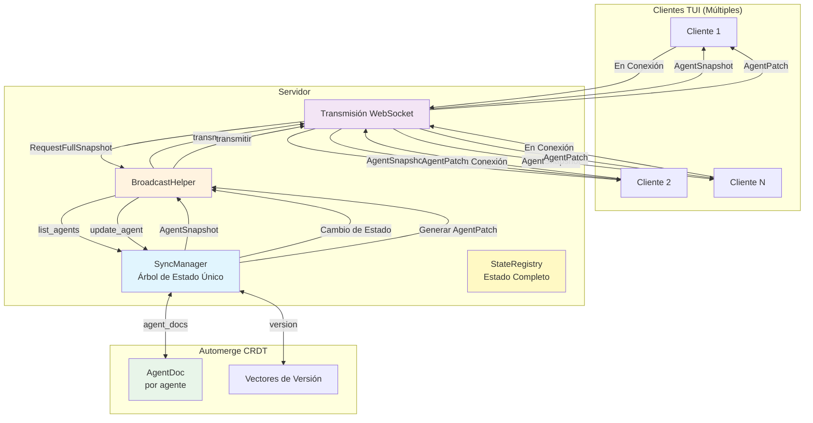
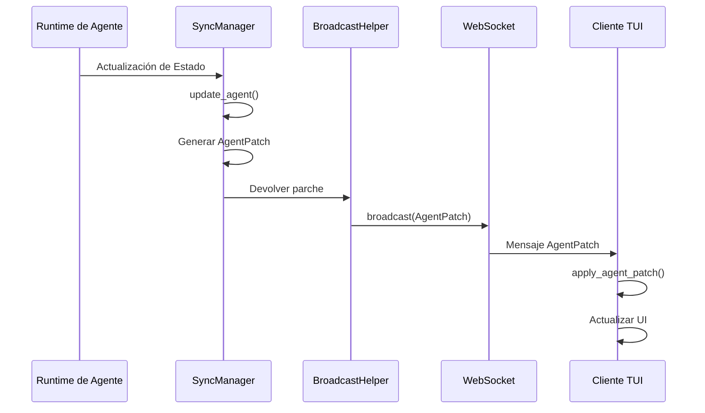
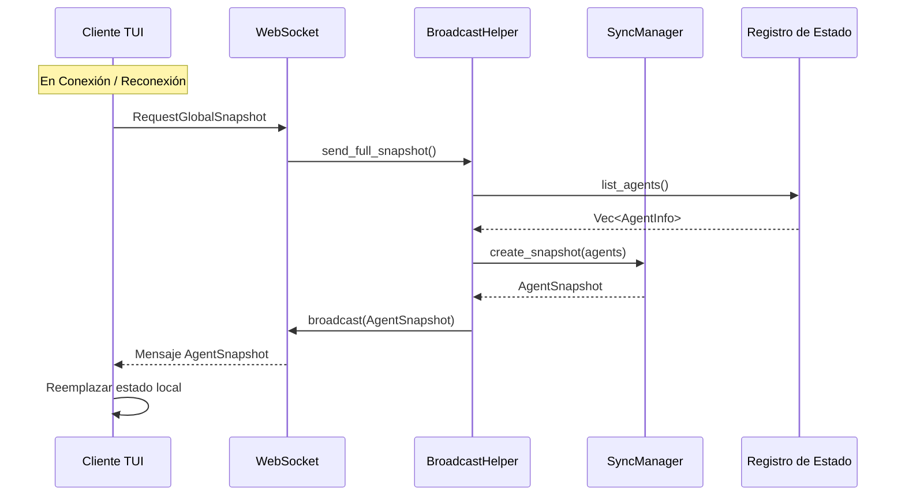
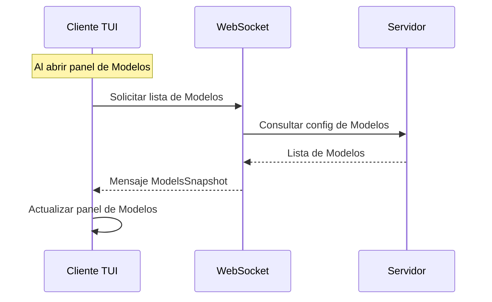
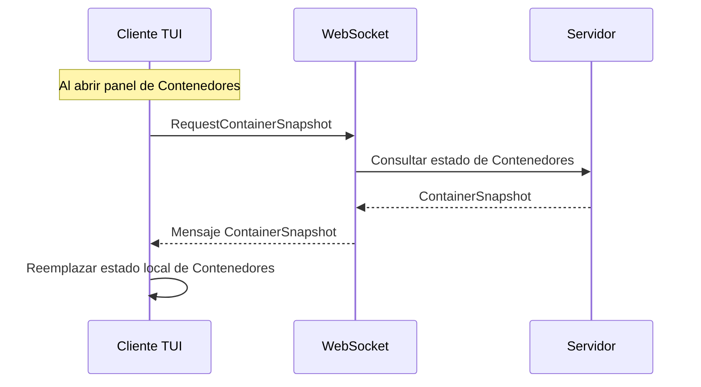
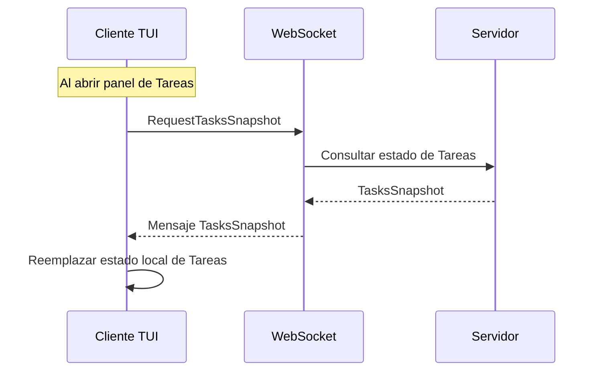

# Arquitectura de Sincronización Incremental

## Descripción General

Un mecanismo de sincronización incremental de estado multi-cliente basado en Automerge CRDT, soportando actualizaciones incrementales en tiempo real y sincronización completa en conexión/reconexión, cubriendo todos los paneles TUI.

## Diagrama de Arquitectura



## Matriz de Estrategia de Sincronización

| Panel | Método de Sincronización | Disparador | Frecuencia | Tipos de Mensaje |
| --- | --- | --- | --- | --- |
| **Línea de Tiempo de Agentes** | Incremental + Completa | Sincronizar en Conexión + Push en Tiempo Real | En Conexión / Tiempo Real | `AgentPatch` / `GlobalSnapshot` |
| **Contenedores** | Incremental + Completa | Sincronizar en Conexión + Push en Tiempo Real | En Conexión / Tiempo Real | `ContainerPatch` / `GlobalSnapshot` |
| **Tareas** | Incremental + Completa | Sincronizar en Conexión + Push en Tiempo Real | En Conexión / Tiempo Real | `TaskPatch` / `GlobalSnapshot` |
| **Lista de Modelos** | Completa | Solicitud Activa del Cliente | Al Abrir Panel | `ModelsSnapshot` |
| **Config de Proveedores** | Completa | Solicitud Activa del Cliente | Al Abrir Panel | `ProvidersSnapshot` |

## Flujo de Mensajes

### Flujo de Actualización Incremental (Agentes)



### Flujo de Sincronización Completa



### Flujo de Sincronización de Lista de Modelos



### Flujo de Sincronización Completa de Contenedores



### Flujo de Sincronización Completa de Tareas



## Estructuras de Datos

### AgentPatch (Actualización Incremental)

```rust
pub struct AgentPatch {
    pub agent_id: String,
    pub version: u64,
    pub llm_working_changed: Option<bool>,
    pub work_status: Option<String>,
    pub current_model: Option<String>,
    pub token_usage_delta: Option<(u32, u32)>,
    pub token_usage_absolute: Option<(u32, u32)>,
    pub request_state: Option<RequestState>,
    pub cpu_usage: Option<f64>,
    pub memory_mb: Option<u64>,
}
```

### AgentSnapshot (Instantánea Completa)

```rust
pub struct AgentSnapshot {
    pub version: u64,
    pub timestamp: i64,
    pub agents: Vec<TuiAgentInfo>,
}
```

### GlobalSnapshot (Instantánea Global)

```rust
pub struct GlobalSnapshot {
    pub version: u64,
    pub timestamp: i64,
    pub agents: Vec<TuiAgentInfo>,
    pub models: Vec<ModelInfo>,
    pub providers: Vec<ProviderInfo>,
    pub active_tasks: Vec<TaskInfo>,
}
```

### ModelsSnapshot (Lista de Modelos)

```rust
pub struct ModelsSnapshot {
    pub models: Vec<ModelInfo>,
}
```

### ContainerPatch (Estado de Contenedor Incremental)

```rust
pub struct ContainerPatch {
    pub container_id: String,
    pub version: u64,
    pub status_changed: Option<String>,
    pub cpu_usage_changed: Option<f64>,
    pub memory_usage_changed: Option<u64>,
}
```

### ContainerSnapshot (Estado de Contenedor Completo)

```rust
pub struct ContainerSnapshot {
    pub version: u64,
    pub timestamp: i64,
    pub containers: Vec<ContainerInfo>,
}
```

### TaskPatch (Estado de Tarea Incremental)

```rust
pub struct TaskPatch {
    pub task_id: Uuid,
    pub version: u64,
    pub status_changed: Option<String>,
    pub progress_changed: Option<u8>,
}
```

### TasksSnapshot (Estado de Tareas Completo)

```rust
pub struct TasksSnapshot {
    pub version: u64,
    pub timestamp: i64,
    pub tasks: Vec<TaskInfo>,
}
```

## Estrategia de Sincronización

| Tipo | Dirección | Disparador | Frecuencia |
| --- | --- | --- | --- |
| Actualización Incremental de Agente | Servidor → Cliente | Cambio de Estado | Tiempo Real |
| Sincronización Completa de Agente | Servidor → Cliente | En Conexión | En Conexión / Reconexión |
| Incremental de Contenedores | Servidor → Cliente | Cambio de Estado | Tiempo Real |
| Sincronización Completa de Contenedores | Servidor → Cliente | En Conexión | En Conexión / Reconexión |
| Incremental de Tareas | Servidor → Cliente | Cambio de Estado | Tiempo Real |
| Sincronización Completa de Tareas | Servidor → Cliente | En Conexión | En Conexión / Reconexión |
| Lista de Modelos | Cliente → Servidor | Solicitud Activa | Al abrir panel |
| Config de Proveedores | Cliente → Servidor | Solicitud Activa | Al abrir panel |

## Características Clave

- **Árbol de Estado Único**: El servidor mantiene un `SyncManager`, todos los clientes reciben las mismas actualizaciones de estado
- **Resolución de Conflictos CRDT**: Resolución automática de conflictos basada en Automerge
- **Actualizaciones Incrementales**: Solo se transmiten los campos modificados para reducir el tráfico de red
- **Consistencia Eventual**: La sincronización completa en la conexión garantiza la consistencia eventual
- **Pull Bajo Demanda**: Modelos y Proveedores se solicitan bajo demanda al abrir sus paneles para evitar transmisión de red innecesaria
- **Sincronización de Página de Inicio**: Agentes, Contenedores y Tareas se sincronizan en la conexión ya que son visibles en la página de inicio

## Estado de Implementación

- ✅ Sincronización incremental/completa de Agentes
- ✅ Sincronización de lista de Modelos
- ✅ Sincronización de config de Proveedores
- ✅ Sincronización incremental/completa de Contenedores
- ✅ Sincronización incremental/completa de Tareas
- ✅ Persistencia de estado (almacenamiento /tmp, recarga al reiniciar)
