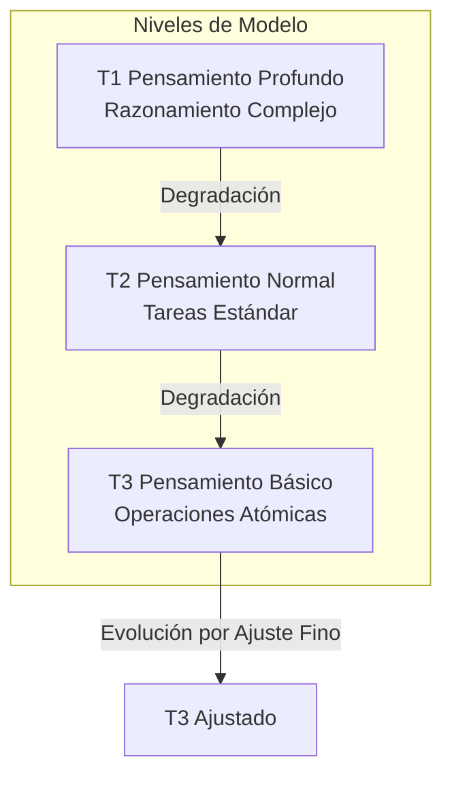
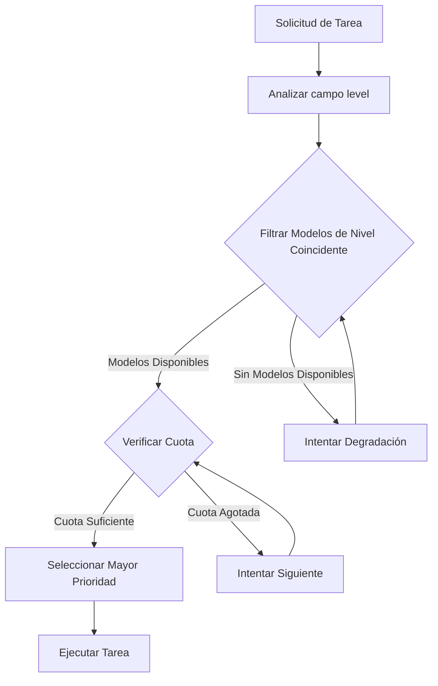
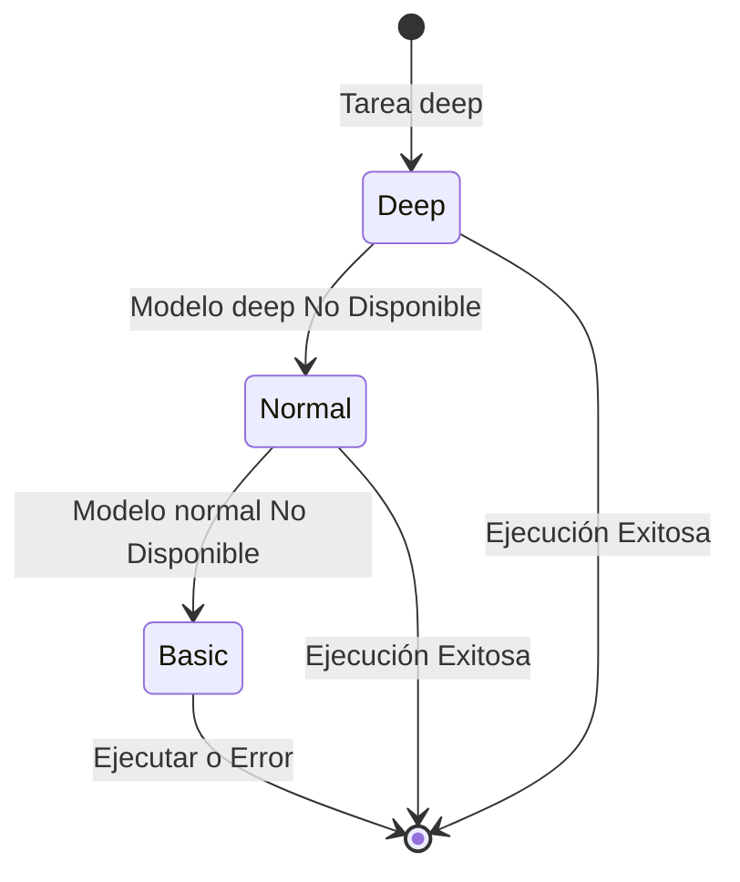
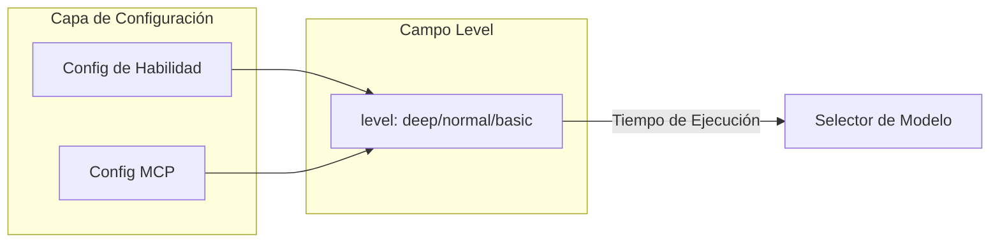
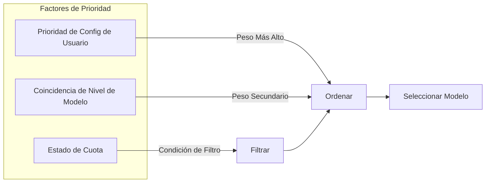
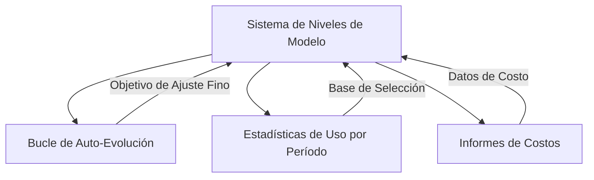

# Diseño del Sistema de Niveles de Modelo

## Descripción General

El Sistema de Niveles de Modelo es un mecanismo inteligente de selección de modelos que asigna niveles de modelo apropiados basados en la complejidad de la tarea, maximizando la utilización de recursos mientras se asegura la calidad.

> **Documento Relacionado**: El sistema de modelo de tres niveles definido en este documento es la base del [Sistema de Bucle de Auto-Evolución](04-self-evolution-loop.md).

## Principios Fundamentales

### Sistema de Modelo de Tres Niveles

### Comparación de Niveles

| Nivel | Posicionamiento | Costo | Escenarios Típicos |
| --- | --- | --- | --- |
| T1 (profundo) | Razonamiento complejo, decisiones | Más alto | Diseño de arquitectura, análisis de problemas |
| T2 (normal) | Tareas estándar | Medio | Escritura de código, generación de documentos |
| T3 (básico) | Operaciones atómicas | Más bajo | Lectura de archivos, conversión de formato |

## Mecanismo de Selección de Modelo

### Proceso de Selección

### Estrategia de Degradación

## Mecanismo de Configuración

### Anotación de Nivel de Habilidad/MCP

Cada herramienta de Habilidad y MCP declara el nivel de modelo requerido a través del campo `level`:

### Control de Prioridad

## Relación con Otros Módulos

## Consideraciones de Diseño

### Optimización de Costos

- Priorizar modelos de nivel inferior
- La degradación automática evita el fallo de tareas
- Alertas de monitoreo de cuota

### Garantía de Calidad

- Las tareas complejas requieren nivel alto
- La degradación requiere validación de viabilidad
- Reintento automático en caso de fallo

### Extensibilidad

- Soporte para niveles personalizados
- Configuración de prioridad flexible
- Estrategias de selección conectables
