# Diseño del Sistema de Estadísticas de Período de Uso

## Descripción General

El Sistema de Estadísticas de Período de Uso gestiona y rastrea el uso de tokens LLM basado en períodos de tiempo, soportando múltiples tipos de período (5 horas, 7 días, 30 días, personalizado), proporcionando una base de datos para el control de costes y la gestión de cuotas.

## Principios Fundamentales

### Agregación por Ventana Temporal

El sistema utiliza un mecanismo de agregación por ventana deslizante para calcular estadísticas de uso en tiempo real para cualquier rango de tiempo mediante vistas de base de datos:

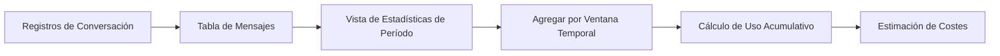

### Flujo de Datos

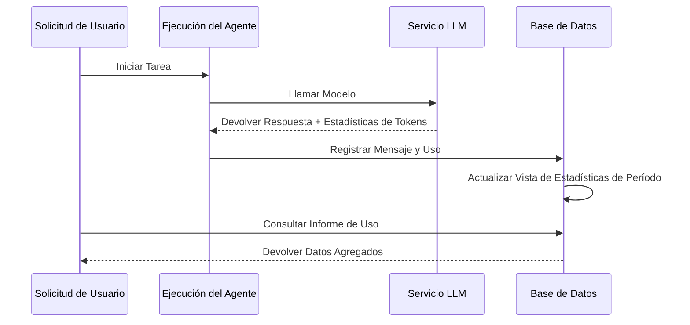

## Tipos de Período

| Tipo de Período | Duración | Uso Típico |
| --- | --- | --- |
| Corto plazo | 5 horas | Desarrollo de iteración rápida |
| Medio plazo | 7 días | Control de cuota semanal |
| Largo plazo | 30 días | Contabilidad de costes mensual |
| Personalizado | Cualquiera | Necesidades de negocio flexibles |

## Diseño de Arquitectura

### Arquitectura de Agregación por Vistas

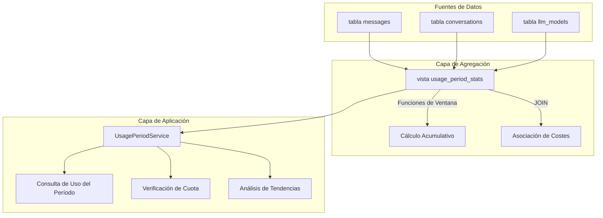

### Lógica de Cálculo Principal

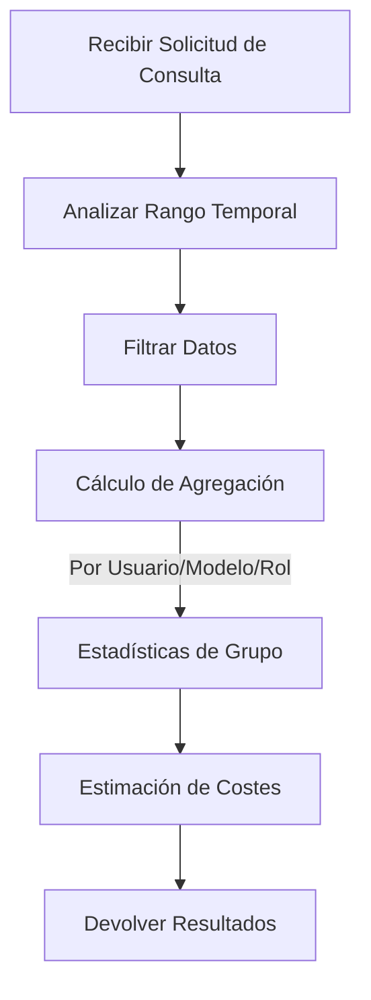

## Mecanismo de Control de Cuota

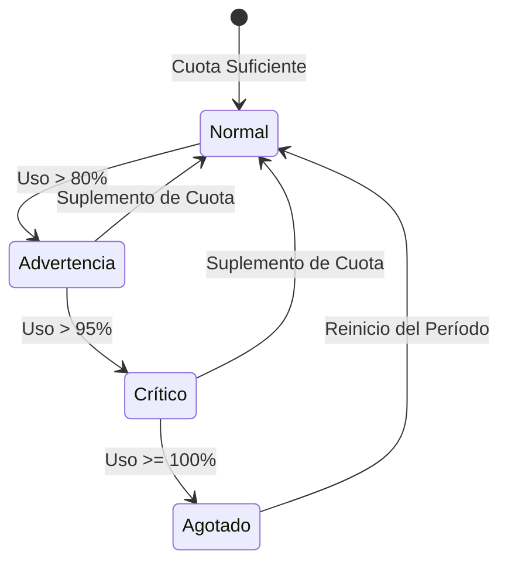

## Relación con Otros Módulos

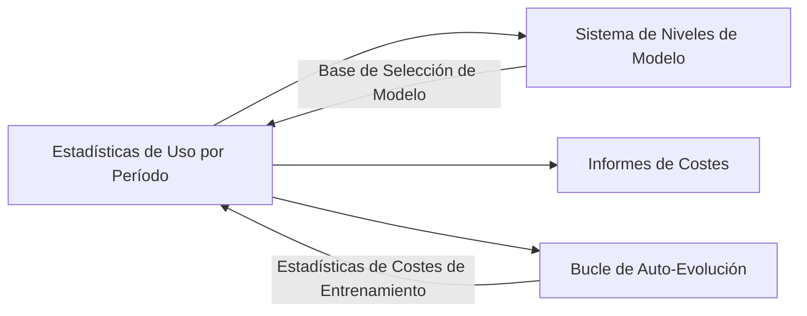

## Consideraciones de Diseño

### Optimización de Rendimiento

- Usar vistas de base de datos para pre-agregación
- Las funciones de ventana evitan cálculos redundantes
- Los índices temporales aceleran las consultas de rango

### Extensibilidad

- Soporte para nuevos tipos de período
- Dimensiones de agregación extensibles
- Modelos de cálculo de costes flexibles

### Consistencia de Datos

- Las vistas de solo lectura aseguran la integridad de los datos
- Las marcas de tiempo usan UTC uniformemente
- Las transacciones garantizan atomicidad de escritura

# Diseño de Flujo de Configuración LLM

## Descripción General

Este documento describe el flujo completo para que los usuarios configuren Proveedores LLM, incluyendo la interacción de la interfaz de configuración, la transmisión de datos, el procesamiento del lado del servidor y el uso en conversaciones.

## Arquitectura del Flujo de Configuración

### Flujo General

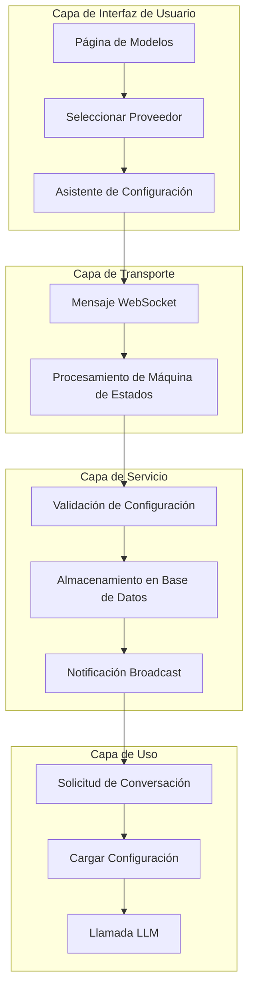

## Flujo de Configuración del Proveedor

### Secuencia de Pasos de Configuración

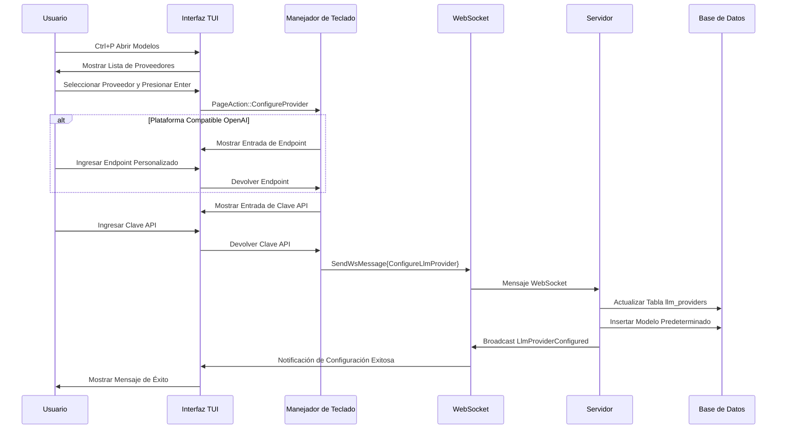

### Máquina de Estados de Configuración

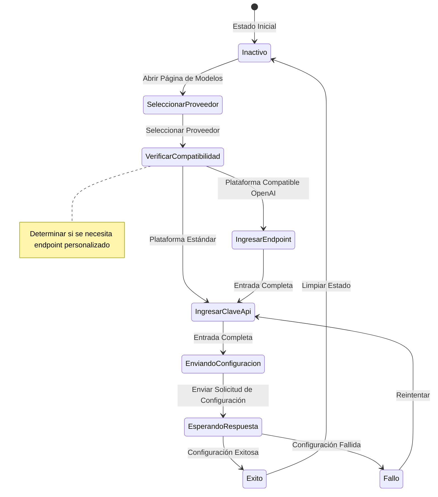

## Flujo de Uso en Conversación

### Secuencia de Llamada LLM

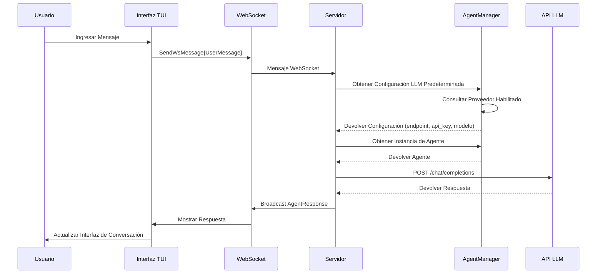

## Decisiones Clave de Diseño

### Flujo de Configuración en Dos Pasos

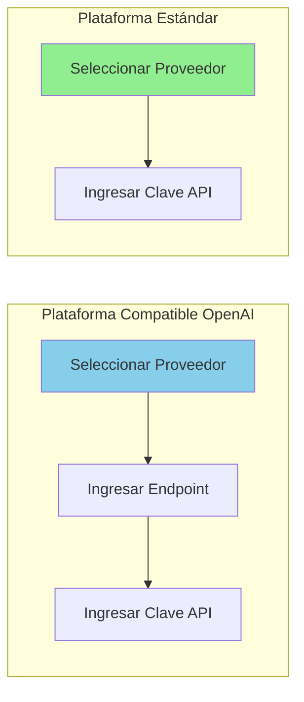

| Tipo de Plataforma | Pasos de Configuración | Razón |
| --- | --- | --- |
| Compatible OpenAI | Endpoint + Clave API | Necesita endpoint de servicio personalizado |
| Plataforma Estándar | Solo Clave API | Usar endpoint oficial |

### Gestión de Estado de Configuración

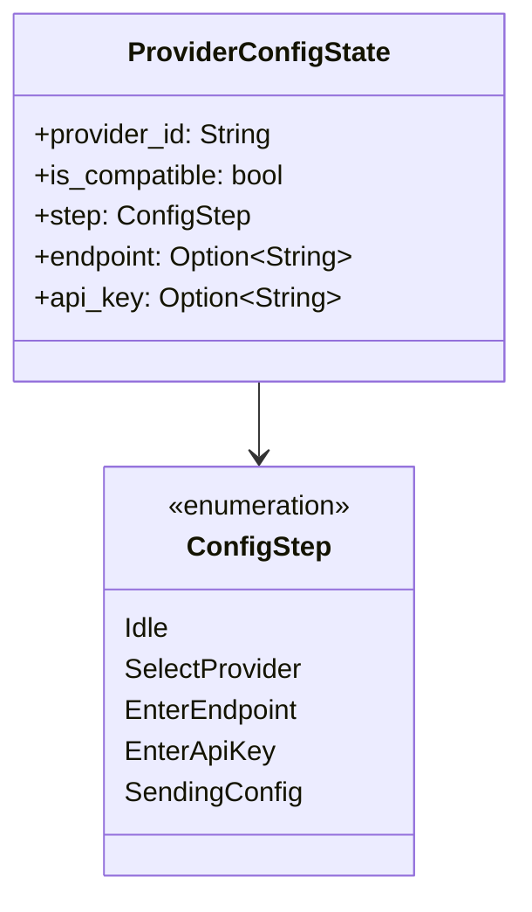

### Auto-inserción de Modelo Predeterminado

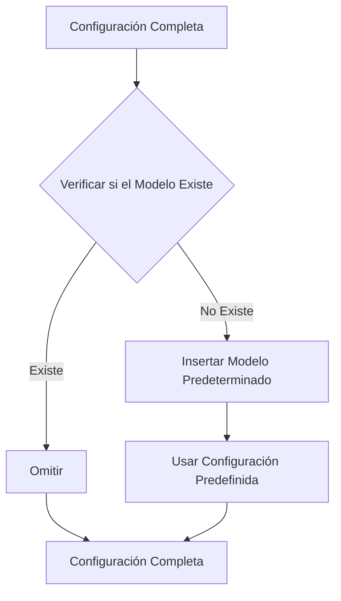

## Optimización de Rendimiento

### Estrategia de Caché de Configuración

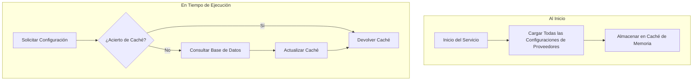

### Gestión de Grupo de Conexiones

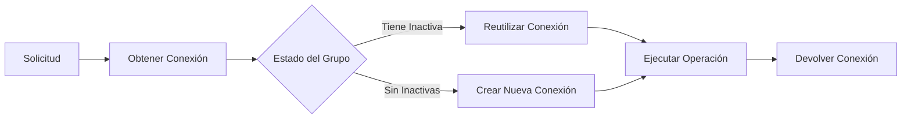

## Manejo de Errores

### Validación de Entrada del Usuario

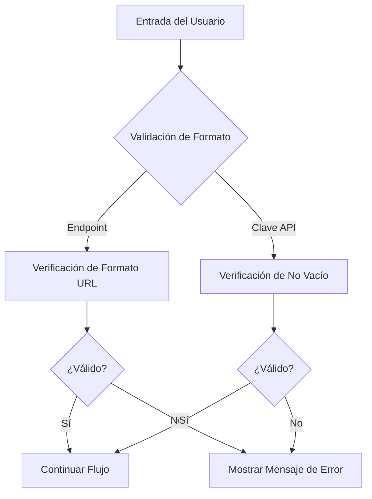

### Manejo de Errores de Red

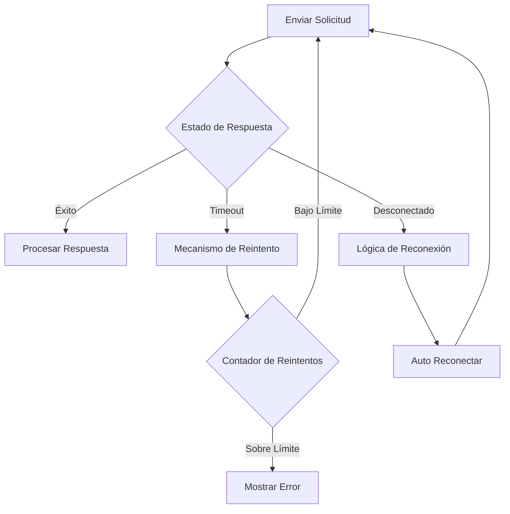

## Consideraciones de Seguridad

### Protección de Clave API

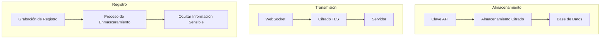

### Medidas de Seguridad

| Etapa | Medida | Descripción |
| --- | --- | --- |
| Almacenamiento | Almacenamiento cifrado | Cifrar Clave API en base de datos |
| Transmisión | Cifrado TLS | WebSocket usa canal cifrado |
| Registro | Enmascaramiento | No registrar Clave en texto plano |
| Entrada | Consultas parametrizadas | Prevenir inyección SQL |

## Diseño de Extensibilidad

### Añadir Nuevo Proveedor

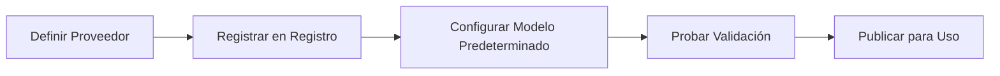

### Soporte Multi-Proveedor

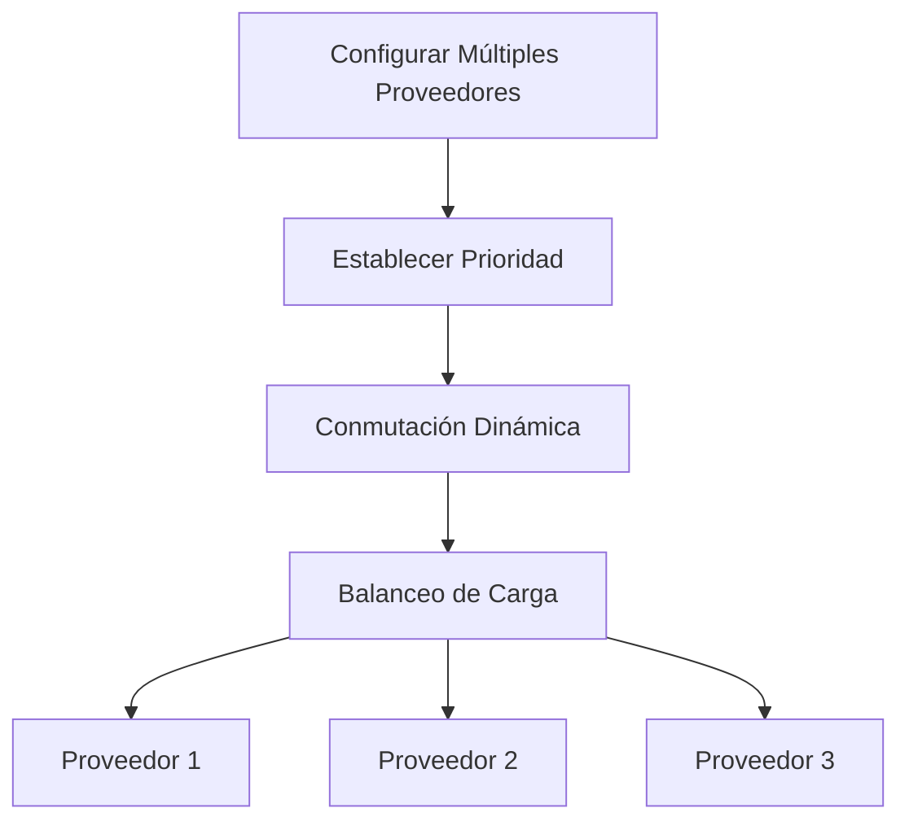

## Definición de Tipos de Mensaje

### Mensajes WebSocket

| Tipo de Mensaje | Dirección | Descripción |
| --- | --- | --- |
| ConfigureLlmProvider | TUI → Servidor | Solicitud de configuración |
| LlmProviderConfigured | Servidor → TUI | Resultado de configuración |
| UserMessage | TUI → Servidor | Conversación del usuario |
| AgentResponse | Servidor → TUI | Respuesta del agente |

## Planificación Futura

| Característica | Descripción | Prioridad |
| --- | --- | --- |
| Importar/Exportar Configuración | Soporte para migración de archivos de configuración | Alta |
| Verificación de Salud del Proveedor | Detección periódica de disponibilidad del Proveedor | Media |
| Conmutación por Error Automática | Cambio automático cuando el Proveedor no está disponible | Media |
| Integración de Estadísticas de Uso | Vincular con el sistema de estadísticas de uso | Baja |

# Mecanismo de Inyección de Prompt MCP y Compresión de Contexto

## Descripción General

Este documento describe dos diseños arquitectónicos clave: el mecanismo de inyección de Prompt obligatorio de herramientas MCP y el mecanismo de compresión de contexto basado en marcadores Todo. Estos dos mecanismos trabajan juntos para estandarizar el comportamiento del Agente y optimizar la gestión de contexto en escenarios de conversación larga.

## I. Inyección de Documentación de Herramientas MCP (Solo Ejecución)

### Concepto Central

Bajo la arquitectura de microkernel de solo ejecución, el LLM recibe solo **tres definiciones de herramientas**: `exec`, `write_to_var` y `write_to_var_json`. Las herramientas MCP son APIs internas invocadas a través del runtime JS de exec. La documentación de herramientas MCP se inyecta en el prompt de habilidad como documentación de API JS mediante el mecanismo `related_tools` — no como definiciones de herramientas separadas enviadas al LLM.

```mermaid
flowchart LR
    A[Habilidad related_tools] --> B[McpToolDocLoader]
    B --> C[Leer parámetros TOML + descripción MD]
    C --> D[Formatear como documentación de API JS]
    D --> E[Inyectar en system prompt]

    style D fill:#90EE90
```

### Características Clave

| Característica | Descripción |
| --- | --- |
| Superficie solo ejecución | El LLM solo ve `exec`, `write_to_var`, `write_to_var_json`; las herramientas MCP nunca se exponen como definiciones de herramientas |
| Ámbito de habilidad | La documentación de herramientas se inyecta por habilidad mediante `related_tools`, no globalmente |
| Formato API JS | Documentos formateados como `referencia de API de importación de módulo ES — descripción` |
| Enrutamiento interno | McpToolRegistry es por agente pero se usa solo para despacho interno |

### Motivación del Diseño

```mermaid
flowchart TB
    subgraph Escenarios Problemáticos
        A[Demasiadas definiciones de herramientas inflan el contexto]
        B[La inyección de prompt por herramienta es frágil]
        C[El LLM se confunde por la proliferación de herramientas]
    end

    subgraph Soluciones
        D[Superficie de tres herramientas: exec, write_to_var, write_to_var_json]
        E[Documentos MCP como referencias de API JS]
        F[Inyección related_tools con ámbito de habilidad]
    end

    A --> D
    B --> E
    C --> F
```

### Flujo de Inyección

```mermaid
sequenceDiagram
    participant Skill as Habilidad (related_tools)
    participant Loader as McpToolDocLoader
    participant MCP as Configuración de Herramienta MCP (TOML + MD)
    participant Prompt as System Prompt

    Skill->>Loader: Lista de nombres de herramientas relacionadas
    Loader->>MCP: Leer parámetros TOML + descripción MD
    MCP-->>Loader: Metadatos de herramienta

    Loader->>Loader: Formatear como referencia de API de importación de módulo ES — descripción
    Loader->>Prompt: Inyectar en sección de habilidad del system prompt

    Note over Prompt: El LLM solo ve la herramienta exec<br/>Los documentos MCP aparecen como referencias de API JS
```

### Formato de Inyección

La documentación de cada herramienta MCP se formatea como una referencia de API JS:

$agent.todo_list_view() — Ver la estructura actual del árbol de tareas
$agent.todo_create({ title: String, description: String }) — Crear un nuevo elemento de tarea
$agent.todo_update_status({ `todo_id`: String, status: String }) — Actualizar el estado de un elemento de tarea

### Ejemplo de Configuración

```mermaid
flowchart TB
    subgraph Habilidad related_tools
        A[TOML de Habilidad: campo related_tools]
        A --> A1["[tool_name]"]
        A1 --> B[todo_list_view]
        A1 --> C[todo_create]
        A1 --> D[todo_update_status]
    end

    subgraph McpToolDocLoader
        E[Leer parámetros TOML]
        F[Leer descripción MD]
        G[Formatear como documento API JS]
    end

    B --> E
    C --> E
    D --> E
    E --> F --> G
```

### Niveles de Permiso

Cada entrada `[[related_tools]]` puede declarar opcionalmente un `access_mode`:

[[`related_tools`]]
`agent_name` = "polemos"
`tool_name` = "`node_execute`"
`access_mode` = "read"       # La habilidad solo necesita acceso de nivel lectura (predeterminado: "read")

La puerta de enlace de doble autorización verifica que:

1. El `ToolCapability` declarado de la herramienta soporte el `access_mode` solicitado
1. El `TrustLevel` del nodo objetivo permita la operación
1. Para nodos externos, se aplica un control adicional de nivel de riesgo

Consulte `docs/design/en/22-mcp-tool-permission-model.md` para detalles completos.

### Ventajas y Compensaciones

```mermaid
graph TB
    subgraph Ventajas
        A[Superficie de herramienta mínima]
        B[Documentación con ámbito de habilidad]
        C[Formato de API consistente]
        D[Flexibilidad de enrutamiento interno]
    end

    subgraph Compensaciones
        E[El LLM debe construir llamadas JS]
        F[La depuración requiere trazado de exec]
        G[related_tools debe mantenerse]
    end
```

## II. Mecanismo de Compresión de Contexto Basado en Marcadores Todo

### Concepto Central

La compresión tradicional se basa en resumir texto, lo que pierde detalles clave. El nuevo mecanismo cambia a marcar elementos Todo clave, preservando los detalles originales como entrada del usuario, continuando directamente la ejecución de la Habilidad original.

```mermaid
flowchart LR
    subgraph Forma Tradicional
        A1[Contexto] --> B1[Texto de Resumen]
        B1 --> C1[Nueva Conversación]
        C1 --> D1[Posible Pérdida de Detalles]
    end

    subgraph Forma con Marcadores Todo
        A2[Contexto] --> B2[Marcar Todo Clave]
        B2 --> C2[Preservar Detalles Originales]
        C2 --> D2[Sin Pérdida de Información]
    end
```

### Comparación de Motivación del Diseño

| Problemas de la Forma Tradicional | Ventajas del Marcador Todo |
| --- | --- |
| Pérdida de información | Preservación original |
| Deriva semántica | Rastreable |
| No verificable | Verificable |
| Invalidación de habilidad | Continuidad de habilidad |

### Flujo de Compresión

```mermaid
sequenceDiagram
    participant User as Usuario
    participant Agent as Agente Original
    participant Marker as Marcador Todo
    participant NewAgent as Nuevo Agente
    participant TodoMCP as Todo MCP

    User->>Agent: Solicitar Compresión de Contexto
    Agent->>Marker: Obtener Elementos Todo Clave

    Note over Marker: Aplicar Estrategia de Marcado

    Marker-->>Agent: Lista de Elementos Marcados
    Agent->>TodoMCP: Obtener Detalles por Lote
    TodoMCP-->>Agent: Detalles de Todo

    Agent->>NewAgent: Iniciar Nueva Sesión

    Note over NewAgent: System prompt = Habilidad Original<br/>Entrada de usuario = Detalles de Todo

    NewAgent->>TodoMCP: Ver Árbol de Todo
    Note over NewAgent: Encontrar detalles ya en la entrada<br/>Continuar directamente
```

### Estrategias de Marcado

```mermaid
flowchart TB
    subgraph Tipos de Estrategia
        A[Marcado Manual]
        B[Ruta Crítica AutoCrítica]
        C[Tareas No Finalizadas AutoIncompletas]
        D[Estrategia Híbrida]
    end

    A --> A1[El Usuario Selecciona Elementos Clave]
    B --> B1[Identificar Automáticamente la Cadena de Tarea Principal]
    C --> C1[Marcar Todos los Elementos No Finalizados]
    D --> D1[Combinar Múltiples Estrategias]
```

### Comparación de Estrategias

| Estrategia | Contenido Marcado | Escenarios Aplicables |
| --- | --- | --- |
| Manual | Especificado por el usuario | Control preciso |
| AutoCrítica | Cadena de tarea principal + tareas bloqueantes | Tareas complejas |
| AutoIncompletas | Todas las tareas no finalizadas | Recuperación simple |
| Híbrida | Combinado + marcas del usuario | Escenarios generales |

### Estructura de Elemento Marcado

```mermaid
classDiagram
    class MarkedTodoItem {
        +todo_id: String
        +include_depth: u32
        +include_ancestors: bool
        +include_artifacts: bool
    }

    class MarkerStrategy {
        <<enumeration>>
        Manual
        AutoCritical
        AutoUnfinished
        Hybrid
    }

    class TodoMarker {
        +marked_items: List~MarkedTodoItem~
        +marker_strategy: MarkerStrategy
        +mark_critical_todos()
    }

    TodoMarker --> MarkedTodoItem
    TodoMarker --> MarkerStrategy
```

## III. Colaboración de los Dos Mecanismos

### Flujo de Colaboración

```mermaid
sequenceDiagram
    participant User as Usuario
    participant OldAgent as Agente Antiguo
    participant Marker as Marcador Todo
    participant Loader as McpToolDocLoader
    participant NewAgent as Nuevo Agente

    Note over OldAgent: Contexto cerca del límite

    User->>OldAgent: Comprimir Contexto
    OldAgent->>Marker: Marcar Todo Clave
    Marker-->>OldAgent: Lista de Elementos Marcados

    OldAgent->>NewAgent: Crear Nueva Sesión

    Note over NewAgent: System prompt = Alma + Habilidad<br/>related_tools cargado por McpToolDocLoader

    NewAgent->>Loader: Cargar documentos de herramientas para related_tools
    Loader-->>NewAgent: Documentos API JS formateados

    Note over NewAgent: El system prompt contiene:<br/>1. Identidad del alma<br/>2. Plantilla de habilidad + documentos related_tools<br/>3. Tres herramientas: exec, write_to_var, write_to_var_json

    NewAgent->>NewAgent: Ejecutar mediante runtime JS exec
    Note over NewAgent: Las herramientas MCP son APIs internas<br/>Encontrar detalles ya en la entrada

    NewAgent-->>User: Continuación de Tarea Sin Interrupciones
```

### Puntos Clave de Colaboración

```mermaid
flowchart TB
    subgraph Mecanismo de Colaboración
        A[McpToolDocLoader inyecta documentos API JS]
        B[El Marcador Proporciona Contexto Completo]
        C[Prompt de Alma + Habilidad Preservado]
    end

    A --> D[La habilidad tiene referencias API JS para herramientas MCP]
    B --> E[Se proporciona suficiente información completa]
    C --> F[Se mantiene la consistencia de comportamiento]

    D --> G[Continuación de Tarea Sin Interrupciones]
    E --> G
    F --> G
```

## IV. Hoja de Ruta de Implementación

```mermaid
flowchart LR
    subgraph Fase 1 Prioridad Alta
        A[Inyección de Prompt MCP]
        A --> A1[Estructura de Datos]
        A --> A2[Lógica de Inyección]
        A --> A3[Gestión de Configuración]
    end

    subgraph Fase 2 Prioridad Media
        B[Mecanismo de Marcador Todo]
        B --> B1[Estrategia de Marcado]
        B --> B2[Recuperación de Compresión]
        B --> B3[Marcado Manual]
    end

    subgraph Fase 3 Prioridad Baja
        C[Estrategia Inteligente]
        C --> C1[AutoCrítica]
        C --> C2[Híbrida]
        C --> C3[Sugerencias Inteligentes]
    end
```

## V. Evaluación de Riesgos y Mitigación

### Matriz de Riesgos

| Riesgo | Impacto | Medidas de Mitigación |
| --- | --- | --- |
| Sobrecarga de tokens demasiado grande | Degradación de rendimiento | Limitar cantidad marcada, nivel de compresión configurable |
| Prompt demasiado estricto | Flexibilidad reducida | Proporcionar mecanismo de omisión, guía de manejo de excepciones |
| Estrategia de marcado inexacta | Omisión de información | Anulación manual, confirmación visual |

### Flujo de Manejo de Errores

```mermaid
flowchart TB
    A[Operación Fallida] --> B{Tipo de Fallo}
    B -->|Tokens Excedidos| C[Recortar Elementos No Críticos]
    B -->|Estrategia Fallida| D[Recurrir a Modo Manual]
    B -->|Inyección Fallida| E[Usar Comportamiento Predeterminado]

    C --> F[Reintentar Operación]
    D --> F
    E --> F
```

## VI. Integración de Configuración

### Estructura de Configuración General

```mermaid
flowchart TB
    subgraph Configuración de Habilidad
        A[related_tools]
        B[lista tool_names]
    end

    subgraph Configuración de Compresión
        C[habilitado]
        D[estrategia_predeterminada]
        E[umbral_disparador]
    end

    subgraph Configuración de Estrategia
        F[incluir_ruta_critica]
        G[incluir_no_finalizadas]
        H[max_elementos_marcados]
    end

    A --> I[Generación de Documento API JS]
    C --> J[Control de Compresión]
    F --> K[Reglas de Marcado]
```

## VII. Extensiones Futuras

| Característica | Descripción | Prioridad |
| --- | --- | --- |
| Generación Dinámica de Prompt | Ajustar restricciones según la complejidad de la tarea | Media |
| Compartición Multi-sesión | Múltiples Agentes comparten marcadores Todo | Media |
| Sugerencias Inteligentes de Marcado | Auto-recomendar elementos marcados | Baja |
| Herramienta de Marcado Visual | Interfaz gráfica de marcado | Baja |

## VIII. Inyección de Contexto RAG Complementaria (v2.1+)

La inyección de herramientas MCP descrita en las Secciones I-VII proporciona al LLM **referencias de API** — le dice al LLM *cómo* llamar a las herramientas. Un mecanismo complementario, la Inyección de Contexto RAG, proporciona al LLM **conocimiento precalculado** — inyecta los *resultados* de las consultas RAG directamente en el system prompt.

| Aspecto | Inyección de Herramientas MCP | Inyección de Contexto RAG |
| --- | --- | --- |
| Lo que recibe el LLM | Documentos de referencia API (imports de módulo ES) | Contenido de conocimiento real (nodos de memoria, documentos del espacio de trabajo) |
| Cuándo se inyecta | Por habilidad, basado en `related_tools` | Por paso de habilidad, basado en el contexto de la habilidad |
| Participación del LLM | El LLM debe llamar a la herramienta | Sin participación del LLM — precalculado |
| Impacto en latencia | N viajes de ida y vuelta (uno por llamada) | 1 precálculo por paso de habilidad |
| Módulos IEPL | `{agent}` (despacho MCP) | `rag/{philia,aporia}` (lectura de búfer) |

Ambos mecanismos coexisten: las herramientas MCP permanecen disponibles como respaldo para consultas que el contexto precalculado no cubre. Consulte `docs/design/en/26-rag-context-injection.md` para el diseño completo.

# Diseño de Identidad Dual del Agente y Límite de Visibilidad

## Objetivos

- Separar completamente las instancias de ejecución de Habilidades visibles de los proveedores internos de herramientas MCP/LLM.
- Permitir solo que las invocaciones de Habilidades creen agentes visibles temporales con insignias de 3 dígitos.
- Atribuir el uso de modelo MCP/LLM y tokens a la instancia de Habilidad adjunta en lugar de crear agentes visibles adicionales.
- Mantener la identidad UUID de runtime para auditoría, historial y reproducción sin permitir que se filtre en la línea de tiempo TUI.

## Capas de Identidad

- `agent_number`: la insignia de 3 dígitos orientada a la UI y la clave estable para nodos visibles de la línea de tiempo.
- `agent_uuid`: el UUID de runtime utilizado para registro, auditoría e historial.
- `agent_id`: un campo de compatibilidad.
  - En cargas útiles TUI visibles, `agent_id` debe coincidir con el `agent_number` orientado al panel.
  - En registros internos y rutas de ejecución MCP, `agent_id` puede permanecer en estilo UUID.

## Reglas de Visibilidad e Instanciación

- Solo las invocaciones de Habilidades crean instancias de agentes visibles temporales.
- Los proveedores SimpleTool/MCP no deben crear agentes visibles adicionales simplemente porque una de sus herramientas es llamada.
- Cuando una Habilidad usa herramientas MCP o una llamada interna `llm_chat`, esas invocaciones permanecen como ejecución subordinada bajo esa instancia de Habilidad.
- Ejemplo: si HubRis llama a ApoRia `llm_chat`, ApoRia permanece como un ejecutor interno y no debe aparecer como un segundo nodo visible en la línea de tiempo superior derecha.

## Reglas de Atribución MCP y LLM

- Si una llamada MCP/LLM pertenece a una instancia de Habilidad visible, su nombre de modelo y uso de tokens deben atribuirse a esa instancia de Habilidad.
- Los proveedores internos aún pueden mantener su propia auditoría o contabilidad global, pero esas estadísticas internas no deben desencadenar la creación de nodos TUI.
- Los registros MCP y el contexto deben preservar:
  - `agent_number`
  - `agent_uuid`
  - `tool_name`
  - `phase` (`start`/`finish`)
  - `success` y `error`

## Contrato de Renderizado TUI

- El TUI crea nodos de línea de tiempo solo para IDs de panel explícitos de 3 dígitos.
- Las cargas útiles sin un `agent_number` visible pueden actualizar solo estadísticas globales de modelo/token y no deben crear nodos de agente visibles.
- Las etiquetas de visualización y las claves de nodo nunca deben derivar una insignia visible de UUIDs o dígitos arbitrarios encontrados dentro de `agent_id`.
- Para nodos visibles:
  - `agent_number` se usa para visualización e interacción.
  - `agent_uuid` se mantiene solo para auditoría, historial y depuración.

## Asignación de Insignias y Ciclo de Vida

- `agent_number` se asigna aleatoriamente del grupo disponible `000`-`999` en lugar de asignarse secuencialmente.
- Los números liberados son reutilizables.
- Cuando las 1000 insignias están activas, el asignador puede recurrir a la reutilización aleatoria; la desambiguación histórica debe entonces depender de `agent_uuid`.
- La limpieza de instancias visibles y la recuperación de insignias son manejadas por el gestor de ciclo de vida de Habilidades.

## Restricciones de Compatibilidad

- Las cargas útiles heredadas que solo llevan `agent_id` aún pueden ser analizadas internamente, pero la UI visible no debe sintetizar nuevos nodos a partir de IDs de estilo UUID.
- Cuando ambos `agent_number` y `agent_uuid` están presentes, se aplica el modelo de identidad dual:
  - `agent_number` es para visualización e interacción.
  - `agent_uuid` es para auditoría e historial.

# Arquitectura de Concurrencia de Solicitudes

## Descripción General

Scepter gestiona dos capas de concurrencia independientes:

```mermaid
flowchart LR
    User["Solicitudes de Usuario"] --> Semaphore["Semáforo de Solicitudes"]
    Semaphore --> Cosmos["Contenedores Cosmos"]
    Cosmos --> Queue["Cola de Niveles (RequestPool)"]
    Queue --> LLM["API LLM"]
```

## Analogía

Piense en un restaurante:

- **Clientes** (solicitudes de usuario) llegan y hacen pedidos simultáneamente
- **Mesas** (contenedores Cosmos) se crean por solicitud — cada una obtiene su propio espacio de trabajo
- **Estaciones de cocina** (concurrencia del proveedor LLM) son limitadas — quizás 3 en total
- **Sistema de tickets** (cola de niveles `RequestPool`) gestiona el orden FIFO por nivel

30 clientes pueden pedir a la vez (scepter acepta múltiples solicitudes), pero la cocina solo puede cocinar 3 platos a la vez (límite de tasa de API LLM).

## Capa 1: Semáforo de Solicitudes

**Ubicación**: `state_machine/domains/control_domain.rs` — `concurrent_request_semaphore`

Controla cuántas solicitudes de usuario acepta scepter concurrentemente. Cada solicitud crea un contenedor Cosmos independiente con su propio manejador LLM.

```mermaid
flowchart LR
    User1["Mensaje de Usuario"] -->|"N = suma de max_concurrent de todos los modelos"| Semaphore["Semáforo(N)"]
    User2["Mensaje de Usuario"] --> Semaphore
    User3["Mensaje de Usuario"] --> Semaphore
    Semaphore --> Container1["Contenedor Cosmos + manejador LLM"]
    Semaphore --> Container2["Contenedor Cosmos + manejador LLM"]
    Semaphore --> Container3["Contenedor Cosmos + manejador LLM"]
```

N = total de ranuras concurrentes en todos los modelos habilitados. Si modelos A (3 ranuras) + B (2 ranuras) = 5 solicitudes concurrentes.

Anteriormente esto era `AtomicBool` (N=1), ahora es `Semaphore(N)`.

## Capa 2: Cola de Niveles (RequestPool)

**Ubicación**: `infra/request_pool.rs` — `RequestPool`

Cola FIFO por nivel con semáforos por modelo. Dentro de un nivel:

1. Las solicitudes LLM entrantes entran en la cola del nivel
1. Intentar adquirir una ranura en el modelo de mayor prioridad primero
1. Si está ocupado, intentar el siguiente modelo en orden de prioridad
1. Si todos están ocupados, esperar en cola FIFO — el modelo que se libere primero sirve la siguiente solicitud

```mermaid
flowchart TB
    subgraph Tier["Nivel: 'normal'"]
        direction TB
        Queue["Cola FIFO: req1 → req2 → req3 → req4"]
        MA["Modelo A (prioridad 10): Semáforo(3) ■■□"]
        MB["Modelo B (prioridad 5):  Semáforo(2) □□"]
        MC["Modelo C (prioridad 1):  Semáforo(1) ■"]
        Queue -->|"req1 → Modelo A (disponible)"| MA
        Queue -->|"req2 → Modelo B (disponible, A ocupado)"| MB
        Queue -->|"req3 → esperar... Modelo A se libera → servir"| MA
        Queue -->|"req4 → esperar... Modelo C se libera → servir"| MC
    end
```

### Propiedades Clave

- **Aislamiento por proveedor**: El `max_concurrent` de cada modelo es independiente
- **Orden de prioridad**: Los modelos de mayor prioridad se prefieren cuando están disponibles
- **Respaldo**: Si el modelo de alta prioridad está saturado, los modelos de menor prioridad sirven inmediatamente
- **Equidad FIFO**: Las solicitudes en espera se sirven en orden de llegada

### Configuración

# provider_config.toml
[[models]]
id = "gpt-5.4"
tier = "normal"
priority = 10
`max_concurrent` = 3        # 3 llamadas API simultáneas a este modelo

[[models]]
id = "gpt-4o-mini"
tier = "normal"
priority = 5
`max_concurrent` = 5        # 5 llamadas API simultáneas

[[models]]
id = "deepseek-v3"
tier = "deep"
priority = 8
`max_concurrent` = 2

Con esta configuración:

- Nivel `normal`: Modelo A (3 ranuras) + Modelo B (5 ranuras) = 8 llamadas LLM concurrentes de nivel normal
- Nivel `deep`: Modelo C (2 ranuras) = 2 llamadas LLM concurrentes de nivel profundo
- Semáforo de Solicitudes: 3 + 5 + 2 = 10 solicitudes de usuario concurrentes

## Flujo: Mensaje de Usuario → Respuesta LLM

    1. El usuario envía un mensaje mediante TUI/CLI/socket
    1. `handle_user_message`():

a. `try_acquire`() en el Semáforo de Solicitudes (Capa 1)

          - Si no hay ranuras: devolver error "ocupado"
          - Cada ranura → contenedor Cosmos independiente

b. `execute_skill_chain`() → `invoke_aporia_llm_chat`()

    1. `invoke_aporia_llm_chat`():

a. `acquire_tier`("normal", `excluded_models`) en `RequestPool` (Capa 2)

          - Intentar cada modelo en orden de prioridad (no bloqueante)
          - Si todos ocupados: esperar en FIFO hasta que cualquier ranura de modelo se libere
          - Devuelve TierPermit { `model_id`, `display_name` }

b. `chat_loop` → llm_backend.chat() → LlmService::`chat_with_tools`()

          - Usa el modelo seleccionado para la llamada API

c. TierPermit soltado → ranura de semáforo liberada

    1. `finish_handling`():

a. Permiso de Semáforo de Solicitudes devuelto
b. El contenedor Cosmos puede limpiarse (o reutilizarse)

## Pruebas E2E

Las pruebas usan timeout de inactividad (no plazo absoluto). El temporizador se reinicia en cada evento significativo:

# La actividad reinicia el temporizador de inactividad — la cadena puede ejecutarse indefinidamente mientras permanezca activa
ACTIVE_METHODS = {
"Tui.`OrchestrationStatus`",
"Tui.`McpToolResult`",
"Tui.`AgentReport`",
"Tui.`AgentStreamingChunk`",
"Tui.`TaskStatusUpdate`",
"Tui.`AskHumanRequest`",
"Tui.AgentPatch",
"Tui.`ContainerSnapshot`",
}

Esto asegura:

- Timeout de inactividad corto (120s) detecta cadenas realmente atascadas
- Las cadenas de larga duración pero activas (multi-habilidad compleja) nunca se matan prematuramente

# Base de Datos de Desarrollo Embebida y Aislamiento de Producción con Feature Gate

## Descripción General

entelecheia usa [pglite-oxide](https://crates.io/crates/pglite-oxide) como PostgreSQL embebido para dos propósitos:

1. **Desarrollo local**: Cuando no se configura `DATABASE_URL`, scepter inicia automáticamente un PostgreSQL en proceso (PG 17.5 mediante WASM/wasmer) con soporte pgvector.
1. **Pruebas de integración**: Las pruebas de integración PG usan pglite-oxide en lugar de Docker/testcontainers.

En producción (Docker), la característica `embedded-db` se excluye, y scepter se conecta a un contenedor PostgreSQL real.

## Motivación del Diseño

Anteriormente, el desarrollo local requería Docker Compose o una instalación manual de PostgreSQL. Las pruebas de integración dependían de `testcontainers`, añadiendo complejidad Docker-en-Docker en CI. pglite-oxide elimina ambos requisitos — `cargo run` "simplemente funciona" para desarrollo local, y `cargo test` se ejecuta sin Docker.

## Arquitectura de Feature Gate

```mermaid
flowchart TB
    Cargo["scepter Cargo.toml<br/>[features] default = ['all-agents', 'embedded-db']  ← dev<br/>embedded-db = ['dep:pglite-oxide']<br/>[dependencies] pglite-oxide = { workspace = true, optional = true }"]

    Cargo -->|"cargo build (predeterminado)"| Dev["pglite-oxide + wasmer WASM<br/>incluido"]
    Cargo -->|"Dockerfile<br/>--no-default-features<br/>--features all-agents"| Prod["Sin pglite, sin wasmer<br/>(producción)"]
```

| Contexto de Compilación | Comando | pglite-oxide | wasmer | DATABASE_URL |
| --- | --- |  ---  |  ---  | --- |
| `cargo run` (desarrollo local) | características predeterminadas | ✓ | ✓ | Opcional — auto-inicia PG embebido si falta |
| `cargo test` (pruebas) | características predeterminadas | ✓ | ✓ | Auto-iniciado por el arnés de pruebas |
| `just build` (release) | `--no-default-features --features all-agents` | ✗ | ✗ | Requerido |
| Docker `Dockerfile` | `--no-default-features --features all-agents` | ✗ | ✗ | Requerido (apunta a contenedor PG) |

## Orden de Resolución de BD en Tiempo de Ejecución

// packages/scepter/src/app/setup.rs
let `db_url` = if let Ok(url) = std::env::var("DATABASE_URL") {
// 1. Variable de entorno (producción: Docker PG, desarrollo: archivo .env)
url
} else if !user_config.database.url.is_empty() {
// 2. Archivo de configuración de usuario (~/.config/entelecheia/config.toml)
user_config.database.url.clone()
} else {
// 3. pglite-oxide embebido (controlado por feature gate)
#[cfg(feature = "embedded-db")]
{
let server = `PgliteServer`::builder()
.extension(`pglite_oxide`::extensions::VECTOR)  // soporte pgvector
.start()?;
let url = server.database_url();
std::mem::forget(server);  // mantener vivo durante la vida del proceso
url
}
#[cfg(not(feature = "embedded-db"))]
{
return Err(/* "no se configuró DATABASE_URL" */);
}
};

## Patrón de Arnés de Pruebas

```no_run
// tests/pg_integration/auth_test.rs
static PG: OnceCell<(String, PgliteServer)> = OnceCell::const_new();

# [test]
fn pg_integration_tests() {
    let rt = tokio::Runtime::new().unwrap();
    rt.block_on(async {
        let url = ensure_pg_url().await;
        let db = connect_db(&url).await;  // max_connections=1
        pg_user_crud(&db).await;
        pg_unique_username(&db).await;
        pg_rbac_role_persistence(&db).await;
        pg_rbac_audit_log(&db).await;
    });
    std::process::exit(0);  // evitar bloqueo del grupo sqlx
}
```

## Tablas Creadas

Las 23 tablas + 1 tabla con ámbito de esquema + 4 vistas se crean mediante migraciones SeaORM:

**Núcleo**: `users`, `rbac_user_roles`, `rbac_audit_log`, `agents`, `conversations`, `messages`, `tasks`
**Objetivos**: `goals`, `tracks`, `goal_tasks`
**Conocimiento**: `knowledge_bases`, `knowledge_documents` (embeddings pgvector), `rag_subscriptions`
**Consenso**: `consensus_records`, `consensus_references`, `consensus_verifications`
**Infraestructura**: `credentials`, `ssh_credentials`, `container_snapshots`, `model_usage_stats`
**Espacio de trabajo**: `workspace_registry`, `todo_items`, `workspace_bindings`
**Registro**: `log.entries` (esquema `log` separado)
**Vistas**: `usage_period_stats`, `usage_model_stats`, `usage_role_stats`, `usage_session_stats`

## Restricciones de PGlite

| Restricción | Impacto | Mitigación |
| --- | --- | --- |
| `max_connections=1` | Solo un grupo a la vez | Conexión DB compartida entre subpruebas; sin `db.close()` entre pruebas |
| Conversión de tipos estricta | `uuid = text` falla | Pasar siempre valores tipados (ej., `Uuid` no `String` para columnas UUID) |
| Sin acceso concurrente | Las pruebas deben ser secuenciales | Ejecutor `#[test]` único con todas las subpruebas en línea |
| Tareas en segundo plano del grupo sqlx | `close()` se cuelga indefinidamente | `std::process::exit(0)` después de que todas las pruebas completen |

## Endurecimiento de Compilación Docker

Todos los Dockerfiles de producción excluyen embedded-db:

# Dockerfile
RUN cargo build --release -p scepter \
--no-default-features --features all-agents

Esto asegura cero código wasmer/pglite en las imágenes de producción, manteniendo el tamaño del binario mínimo y la superficie de ataque reducida.
