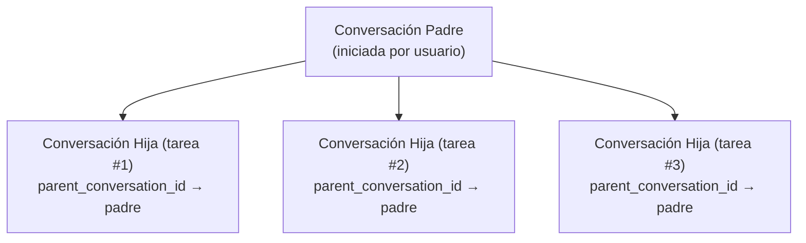

# ADR-004: Gestión del Ciclo de Vida de Almacenamiento de Sesiones

> **Estado**: Aceptado (2026-06-10)
> **Contexto**: entelecheia + shittim-chest
> **Inspirado por**: [opencode #16101](https://github.com/anomalyco/opencode/issues/16101)

## Contexto

opencode (un agente de codificación AI comparable) acumuló 9GB de BD de historial de chat en solo 2 meses con ~30B tokens consumidos. El uso de memoria excedía regularmente 30GiB con solo ~10 proyectos cargados. La causa raíz fue la falta de gestión del ciclo de vida de sesiones: sin TTL, sin limpieza automática, sin límite de almacenamiento y sin recuperación post-compactación.

entelecheia y shittim-chest enfrentan el mismo problema fundamental si no se aborda:

- **entelecheia**: Las tablas `conversations` y `messages` existían pero nunca se escribían; el chat real se almacenaba como archivos de registro TOML ilimitados; la tabla `dialogue_events` tenía código CRUD pero sin migración; los límites de configuración (`MAX_DIALOGUE_HISTORY_LEN`, `MAX_DIALOGUE_RECORDS`, `DIALOGUE_TIMEOUT_MS`) estaban definidos pero nunca se aplicaban.
- **shittim-chest**: Tiene persistencia de conversación/mensaje funcional pero sin limpieza automatizada para sesiones de autenticación expiradas, sesiones de espacio de trabajo obsoletas, historial de crucero o registros de entrega de webhooks.

## Decisión

Implementar un sistema unificado de gestión del ciclo de vida de almacenamiento con estos principios:

### 1. Las conversaciones tienen un ciclo de vida, no solo un nacimiento

- **TTL**: Las conversaciones inactivas más allá de `CONVERSATION_TTL_DAYS` (predeterminado 90 días) son elegibles para limpieza después del archivado.
- **Archivar antes de eliminar**: Las conversaciones deben ser archivadas (`is_archived = TRUE`) antes de que la limpieza TTL las elimine.
- **Sesiones hijas**: Las relaciones de conversación padre-hija se rastrean mediante `parent_conversation_id`. Las conversaciones hijas pueden archivarse independientemente y limpiarse después de `CHILD_SESSION_RETENTION_DAYS` (predeterminado 7 días).

### 2. La limpieza es automática, no manual

- **Tareas en segundo plano**: La limpieza periódica se ejecuta en intervalos configurables (`CLEANUP_INTERVAL_MINUTES`, predeterminado 60).
- **Estrategia mixta**: Escaneo al inicio + temporizador periódico. No requiere intervención del usuario.
- **Idempotente**: Las tareas de limpieza pueden ejecutarse múltiples veces de forma segura.

### 3. La compactación permite la recuperación de almacenamiento

- Los mensajes marcados como `is_compacted = TRUE` han tenido su contenido resumido. Su contenido detallado puede limpiarse después del período de retención.
- Conservador por defecto: solo limpiar el contenido del mensaje compactado, preservar metadatos (nombre de herramienta, marcas de tiempo, conteos de tokens).

### 4. La configuración está centralizada

Todos los parámetros del ciclo de vida residen en `StorageLifecycleConfig` (entelecheia) y `CleanupConfig` (shittim-chest), cargados desde variables de entorno con valores predeterminados sensatos.

### 5. Los registros basados en archivos son secundarios

- `CHAT_LOG_ENABLED` predeterminado a `false`. Los archivos de registro de chat TOML son solo para depuración.
- Cuando está habilitado, los archivos de registro se limpian después de `CHAT_LOG_RETENTION_DAYS` (predeterminado 7).

## Cambios de Esquema

### tabla conversations (entelecheia)

Columnas añadidas:

- `parent_conversation_id UUID REFERENCES conversations(conversation_id)` — seguimiento de sesiones hijas
- `is_archived BOOLEAN NOT NULL DEFAULT FALSE` — bandera de archivado
- `archived_at TIMESTAMPTZ` — cuándo se archivó
- `metadata JSONB NOT NULL DEFAULT '{}'` — metadatos extensibles

### tabla messages (entelecheia)

Columnas añadidas:

- `is_compacted BOOLEAN NOT NULL DEFAULT FALSE` — marca mensajes compactados elegibles para limpieza de contenido
- `metadata JSONB NOT NULL DEFAULT '{}'` — metadatos extensibles

### tabla dialogue_events (entelecheia)

Anteriormente tenía código CRUD pero sin migración `CREATE TABLE`. Ahora incluida en `baseline_tables.sql`.

### tabla rbac_sessions (entelecheia)

Nueva tabla para persistencia de sesiones kirino (backend SQL).

## Fases de Implementación

| Fase | Descripción | Estado |
| --- | --- | --- |
| 0.1 | Correcciones de migración de esquema (dialogue_events, actualización de conversations/messages) | Hecho |
| 1.2 | Espacio de nombres de config unificado (`StorageLifecycleConfig`) | Hecho |
| 0.2 | `ConversationStore` con métodos CRUD + limpieza | Hecho |
| 2.1 | Infraestructura genérica `CleanupScheduler` | Hecho |
| 2.2 | Tareas de limpieza de entelecheia conectadas a scepter `setup.rs` | Hecho |
| 2.3 | Tareas de limpieza de shittim-chest | Eliminado (el paquete no existe) |
| 1.3 | `PgSessionManager` de kirino (backend de sesión SQL) | Hecho |
| 3.1 | Aplicar límites de diálogo existentes (`max_dialogue_records`, `enforce_max_conversations`) | Hecho |
| 3.2 | Archivo de registro de chat desactivado por defecto + limpieza TTL | Hecho |
| 4.1 | Comandos de gestión CLI (`session stats`, `session purge`) | Hecho |
| 5 | Cascada de sesiones hijas + ciclo de vida de huérfanas | Hecho |

## Consecuencias

### Positivas

- Previene el crecimiento de almacenamiento ilimitado que afectó a opencode
- Las conversaciones tienen un ciclo de vida explícito: activo → archivado → limpiado
- La limpieza en segundo plano no requiere intervención del usuario
- Basado en configuración con valores predeterminados sensatos
- PostgreSQL VACUUM recupera espacio en disco después de la eliminación (a diferencia de SQLite que usa opencode)

### Negativas

- Las tareas adicionales en segundo plano consumen CPU/memoria mínima
- Las conversaciones archivadas pierden contenido detallado después del TTL (por diseño)
- Requiere monitoreo para asegurar que las tareas de limpieza se están ejecutando

### Riesgos mitigados

- **Pérdida de datos**: Archivar antes de eliminar proporciona un período de gracia. La limpieza solo elimina conversaciones ya archivadas.
- **Impacto en el rendimiento**: La limpieza se ejecuta en intervalos configurables, usa consultas indexadas en `updated_at`/`created_at`.
- **Abandono de sesiones hijas**: `parent_conversation_id` rastrea relaciones; el TTL de huérfanas es más corto (30 días vs 90 días).

## Diseño del Ciclo de Vida de Sesiones Hijas (Fase 5)

### Problema

El issue #16101 de opencode reveló que el 86% de las sesiones son sesiones hijas generadas por `task()`, representando el 75% del almacenamiento. Estas sesiones hijas se acumulan sin gestión independiente del ciclo de vida.

### Arquitectura



### Reglas del Ciclo de Vida

1. **Creación**: Cuando una cadena de habilidades genera una sub-tarea, se crea una nueva conversación con `parent_conversation_id` establecido al `conversation_id` del padre.

1. **Archivado independiente**: Las hijas pueden archivarse independientemente del padre. Cuando una tarea hija se completa, se archiva automáticamente después de `CHILD_SESSION_RETENTION_DAYS` (predeterminado 7 días).

1. **Cascada al archivar padre**: Cuando un padre se archiva, todas las hijas se archivan. Cuando un padre se elimina, todas las hijas se eliminan.

1. **Manejo de huérfanas**: Las conversaciones con `parent_conversation_id` apuntando a un padre eliminado/inexistente se tratan como huérfanas y se limpian después de `ORPHAN_CONVERSATION_TTL_DAYS` (predeterminado 30 días).

1. **Elegibilidad de compactación**: Las conversaciones hijas son elegibles para compactación de mensajes inmediatamente después del archivado (sin período de gracia), ya que el padre retiene el resumen.

### Consultas de Limpieza

```sql
-- Archivar hijas cuyo padre está archivado
UPDATE conversations SET is_archived = TRUE, archived_at = NOW()
WHERE parent_conversation_id IN (
    SELECT conversation_id FROM conversations WHERE is_archived = TRUE
) AND is_archived = FALSE;

-- Eliminar hijas cuyo padre está eliminado
DELETE FROM conversations WHERE parent_conversation_id IS NOT NULL
    AND parent_conversation_id NOT IN (SELECT conversation_id FROM conversations);

-- Eliminar hijas archivadas más antiguas que la retención
DELETE FROM conversations WHERE is_archived = TRUE
    AND archived_at < NOW() - (CHILD_SESSION_RETENTION_DAYS || ' days')::interval
    AND parent_conversation_id IS NOT NULL;
```

### Estado de Implementación

- La columna `parent_conversation_id` existe en la tabla `conversations` (Fase 0.1)
- `ConversationStore.cleanup_expired_conversations()` maneja la limpieza basada en TTL (Fase 0.2)
- `StorageLifecycleConfig.child_session_retention_days` y `orphan_conversation_ttl_days` configurados (Fase 1.2)
- Consultas en cascada implementadas en `ConversationStore`:
  - `cascade_archive_children()` — archiva hijas cuando el padre se archiva
  - `cascade_delete_orphaned_children()` — elimina hijas cuyo padre fue eliminado
  - `cleanup_expired_child_conversations()` — limpieza basada en TTL para hijas archivadas
  - `cleanup_orphan_conversations()` — limpieza de hijas con padre faltante
  - `enforce_max_dialogue_records()` — límite estricto en conteo de `dialogue_events`
  - `enforce_max_conversations()` — límite estricto en conteo de conversaciones activas
- Todas registradas como tareas de limpieza periódicas en scepter `setup.rs`
