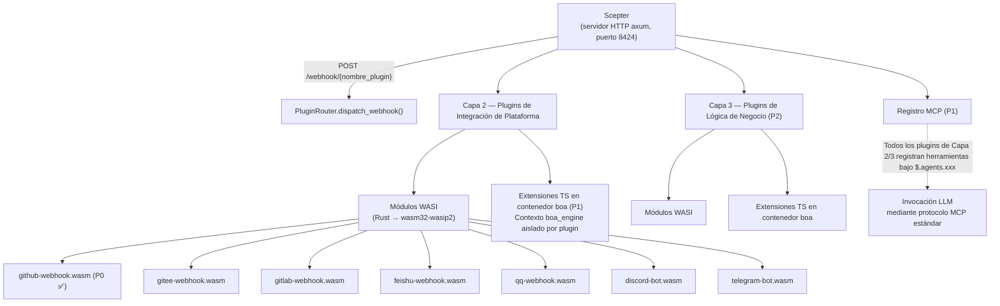
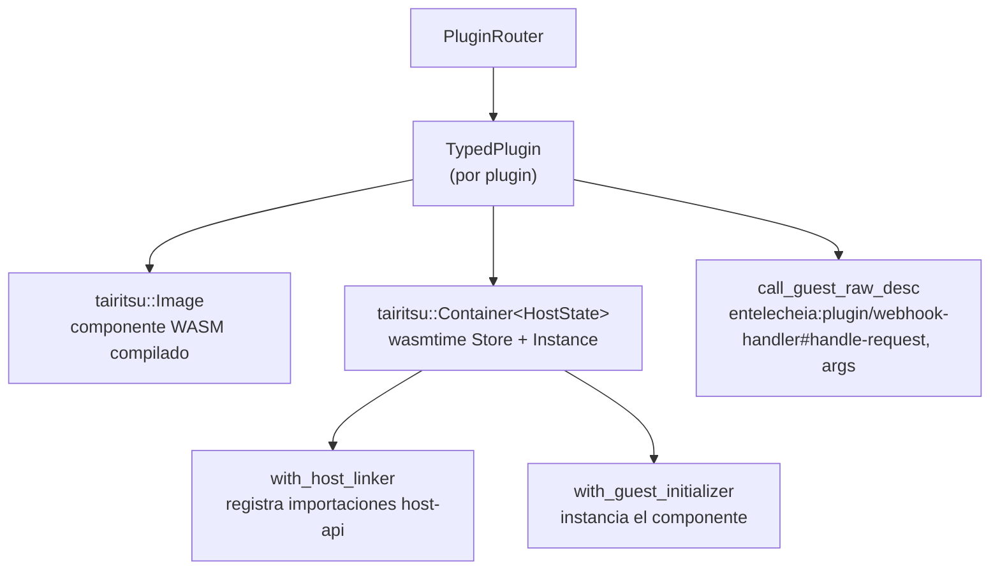

# 25 — Diseño del Sistema de Plugins WASI

## Descripción General

El Sistema de Plugins WASI reemplaza el andamiaje anterior de webhooks Python/TypeScript con plugins del **modelo de componentes WASM**, proporcionando integraciones de plataforma en sandbox e independientes del lenguaje (Capa 2) y extensiones de lógica de negocio (Capa 3). Objetivos clave de diseño:

1. **Mecanismo de extensión dual**: Capa 2 (integración de plataforma) y Capa 3 (lógica de negocio) ambas soportan módulos WASI y extensiones boa TS.
1. **Registro MCP unificado**: Todos los plugins registran herramientas bajo `$.agents.xxx` independientemente del lenguaje de implementación.
1. **E/S gestionada por el host**: El host (servidor axum Scepter) maneja el enrutamiento HTTP, WebSocket y conexiones de larga duración; los plugins solo procesan lógica.
1. **Sandboxing fuerte**: Los módulos WASM se ejecutan bajo wasmtime con límites de combustible e interrupción por época.

## Arquitectura



## Definiciones de Interfaz WIT

Ubicadas en `packages/shared/plugin_host/wit/plugin.wit`:

```wit
package entelecheia:plugin;

interface host-api {
    http-request:  func(method: string, url: string, headers: string, body: string) -> result<string, string>;
    forward-event: func(event-json: string) -> result<_, string>;
    query-ai:      func(message: string, context: option<string>) -> result<string, string>;
    log:           func(level: string, message: string);
    config-get:    func(key: string) -> option<string>;
    kv-get:        func(key: string) -> option<string>;
    kv-set:        func(key: string, value: string) -> result<_, string>;
    register-mcp-tool: func(tool-name: string, description: string, schema: string) -> result<_, string>;
}

interface webhook-handler {
    name: func() -> string;
    handle-request: func(method: string, path: string, headers: string, body: string) -> result<string, string>;
}

interface bot-handler {
    name: func() -> string;
    on-message: func(platform: string, message: string) -> result<option<string>, string>;
}

world layer2-plugin {
    import host-api;
    export webhook-handler;
}

world layer2-bot {
    import host-api;
    export bot-handler;
}
```

### Registro de API del Lado del Host

El host registra todas las funciones `host-api` usando `component::Linker::func_wrap` de wasmtime antes de la instanciación del componente:

```rust
let mut instance = linker.root().instance("entelecheia:plugin/host-api")?;

instance.func_wrap("http-request",
    |_: StoreContextMut<'_, HostState>,
     (method, url, headers, body): (String, String, String, String)| {
        Ok::<(Result<String, String>,), wasmtime::Error>(
            (api.http_request(method, url, headers, body),)
        )
    }
)?;
```

### Bindings del Lado del Guest

Los plugins usan `wit_bindgen::generate!()` para generar bindings del lado del guest:

```rust
wit_bindgen::generate!({
    path: "wit",
    world: "layer2-plugin",
});

struct GithubWebhookPlugin;
impl exports::entelecheia::plugin::webhook_handler::Guest for GithubWebhookPlugin {
    fn name() -> String { "github-webhook".to_string() }
    fn handle_request(method: String, path: String, headers: String, body: String)
        -> Result<String, String> { /* ... */ }
}
export!(GithubWebhookPlugin);
```

## Arquitectura del Host de Plugins

### Crate: `_shared_plugin_host` (`packages/shared/plugin_host/`)

| Módulo | Rol |
| --- | --- |
| `plugin_state.rs` | `HostFunctions` — implementa todas las funciones `host-api` (HTTP, KV, config, eventos) |
| `plugin_loader.rs` | `TypedPlugin` — construye contenedores wasmtime, registra importaciones del host, llama a exportaciones del guest mediante `call_guest_raw_desc` dinámico |
| `plugin_router.rs` | `PluginRouter` — gestiona plugins cargados, despacha solicitudes webhook/bot, auto-escanear directorio `plugins/` |
| `host_functions.rs` | Re-exporta `HostFunctions` y el trait `HostApiProvider` |

### Pila de Runtime



### Nombres de Exportación del Guest

Dado que `wit_bindgen::generate!` en el lado del guest exporta funciones bajo el nombre de la interfaz WIT, el host usa nombres completamente calificados para la invocación dinámica:

```text
entelecheia:plugin/webhook-handler#name
entelecheia:plugin/webhook-handler#handle-request
entelecheia:plugin/webhook-handler#on-message
```

### Puente Asíncrono

Las funciones del host son síncronas (requisito de wasmtime) pero las implementaciones necesitan async (HTTP, base de datos). El puente usa `tokio::task::block_in_place` + `Handle::block_on`:

```rust
instance.func_wrap("kv-get",
    move |_: StoreContextMut<'_, HostState>, (key,): (String,)| {
        let result = tokio::task::block_in_place(|| {
            let handle = tokio::runtime::Handle::current();
            handle.block_on(api.kv_get(&key))
        });
        Ok::<(Option<String>,), wasmtime::Error>((result,))
    }
)?;
```

El manejador de webhook de Scepter usa `tokio::task::spawn_blocking` para llamar métodos WASM síncronos desde manejadores axum asíncronos.

## Integración con Scepter

### Registro de Rutas

`packages/scepter/src/app/setup.rs` — añadido al router axum:

```rust
.merge(crate::api::plugin_webhook::create_plugin_webhook_routes())
```

### Manejador de Webhook

`packages/scepter/src/api/plugin_webhook.rs`:

- `POST /webhook/{nombre_plugin}` — extrae ruta, cabeceras, cuerpo
- Llama a `PluginRouter::dispatch_webhook()` dentro de `tokio::task::spawn_blocking`
- Devuelve la respuesta del plugin o un error

### Auto-carga de Plugins

Al inicio, Scepter crea un `PluginRouter` y escanea `plugins/` (o `$PLUGIN_DIR`) en busca de archivos `.wasm`:

```rust
let plugin_dir = std::path::PathBuf::from(
    std::env::var("PLUGIN_DIR").unwrap_or_else(|_| "plugins".to_string()),
);
router.scan_and_load_dir(&plugin_dir)?;
```

## Guía de Desarrollo de Plugins

### Crear un Plugin WASI

1. Inicializar un nuevo crate bajo `plugins/`:

```toml
# plugins/mi-plataforma/Cargo.toml
[package]
name = "plugin-mi-plataforma"
version = "0.1.0"
edition = "2024"

[lib]
crate-type = ["cdylib", "rlib"]

[dependencies]
wit-bindgen = "0.57"
serde = { version = "1", features = ["derive"] }
serde_json = "1"
```

1. Copiar el archivo WIT:

```text
plugins/mi-plataforma/wit/plugin.wit  ← enlace simbólico o copia desde packages/shared/plugin_host/wit/
```

1. Implementar el trait `Guest`:

```rust
// plugins/mi-plataforma/src/lib.rs
wit_bindgen::generate!({ path: "wit", world: "layer2-plugin" });

use exports::entelecheia::plugin::webhook_handler::Guest;

struct MiPlataformaPlugin;

impl Guest for MiPlataformaPlugin {
    fn name() -> String { "mi-plataforma".to_string() }
    fn handle_request(method: String, path: String, headers: String, body: String)
        -> Result<String, String> {
        log("info", &format!("recibida solicitud {}", method));
        Ok(r#"{"status":"ok"}"#.to_string())
    }
}

export!(MiPlataformaPlugin);
```

1. Configurar `.cargo/config.toml`:

```toml
[target.wasm32-wasip2]
rustflags = ["--cfg=unstable_wasi_extension", "--cfg=unstable_wasi_export_wasi_reactor"]
```

1. Compilar:

```bash
cargo build --target wasm32-wasip2 --release -p plugin-mi-plataforma --lib
```

1. Desplegar: copiar el archivo `.wasm` al directorio `plugins/` (o establecer `PLUGIN_DIR`).

## Referencia de Funciones del Host

| Función | Firma | Descripción |
| --- | --- | --- |
| `http-request` | `(method, url, headers, body) → result<string, string>` | Realizar solicitudes HTTP (para responder a plataformas externas) |
| `forward-event` | `(event-json) → result<_, string>` | Reenviar eventos estructurados a Scepter |
| `query-ai` | `(message, context?) → result<string, string>` | Consultar el pipeline de IA (aún no conectado) |
| `log` | `(level, message)` | Emitir registro estructurado a través del tracing de Scepter |
| `config-get` | `(key) → option<string>` | Leer configuración del plugin |
| `kv-get` | `(key) → option<string>` | Almacén KV persistente (tokens OAuth, etc.) |
| `kv-set` | `(key, value) → result<_, string>` | Escribir en almacén KV persistente |
| `register-mcp-tool` | `(name, description, schema) → result<_, string>` | Registrar una herramienta MCP (P1) |

## Modelo de Seguridad

| Mecanismo | Implementación |
| --- | --- |
| **Sandbox** | Sandbox del modelo de componentes wasmtime — sin sistema de archivos, sin acceso de red por defecto |
| **Límites de recursos** | Medición de combustible (contabilidad por instrucción) + interrupción por época (timeout) mediante el constructor tairitsu Container |
| **Solo E/S del host** | Toda la E/S pasa por funciones del host; los plugins no pueden abrir sockets ni archivos |
| **Aislamiento de plugins** | Cada plugin es una instancia wasmtime separada con su propia memoria, sin compartición entre plugins |
| **Sandbox TS (P1)** | Contexto boa_engine con COMPUTE_TIMEOUT (120s) / ABSOLUTE_CEILING (600s) de skemma |

## Estado de Implementación

| Fase | Componente | Estado |
| --- | --- | --- |
| **P0** | Plugin WASI de webhook GitHub | ✅ Hecho |
| **P0** | PluginRouter + integración Scepter | ✅ Hecho |
| **P0** | HostFunctions (las 8 funciones host-api) | ✅ Hecho |
| **P1** | Infraestructura de extensión boa TS | No iniciado |
| **P1** | Registro de herramientas MCP mediante `$.agents.xxx` | No iniciado |
| **P2** | Plugins de plataforma restantes (Gitee, GitLab, Feishu, QQ, Discord, Telegram) | No iniciado |
| **P2** | Plugins de lógica de negocio de Capa 3 | No iniciado |

## Archivos Clave

| Archivo | Propósito |
| --- | --- |
| `packages/shared/plugin_host/Cargo.toml` | wasmtime 43, runtime tairitsu, reqwest |
| `packages/shared/plugin_host/wit/plugin.wit` | Definición de interfaz WIT canónica |
| `packages/shared/plugin_host/src/plugin_state.rs` | HostFunctions, trait HostApiProvider |
| `packages/shared/plugin_host/src/plugin_loader.rs` | TypedPlugin, registro de funciones del host |
| `packages/shared/plugin_host/src/plugin_router.rs` | PluginRouter, dispatch, scan_and_load_dir |
| `packages/scepter/src/api/plugin_webhook.rs` | Manejador de ruta webhook axum |
| `packages/scepter/src/app/setup.rs` | Registro de rutas + init de PluginRouter |
| `plugins/github-webhook/` | Implementación de referencia |
| `plugins/github-webhook/src/lib.rs` | Plugin webhook GitHub (issues, PR, push, comment) |
