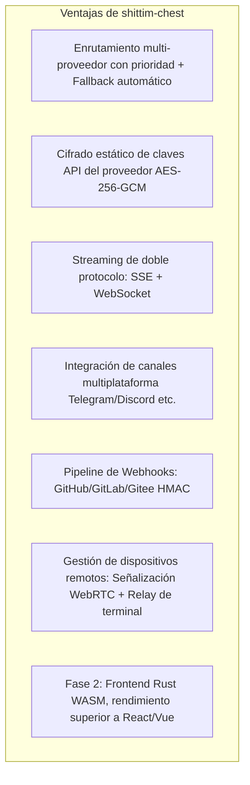

# Posicionamiento del Producto y Panorama Competitivo

## Resumen

shittim-chest es una plataforma WebUI LLM débilmente acoplada, con competidores directos como Open WebUI, LobeChat y similares. Su integración con entelecheia es una característica opcional, no un prerrequisito arquitectónico.

## Posicionamiento Central

| Dimensión | Descripción |
| --- | --- |
| Esencia | Una WebUI de chat LLM multi-proveedor independiente |
| Competidores | Open WebUI, LobeChat, NextChat |
| Relación con entelecheia | Débilmente acoplada: integración opcional puenteada mediante proxy JWT |
| Independencia | Proporciona una experiencia de chat completa sin entelecheia |

## Diferenciación frente a Open WebUI

## Frontera con entelecheia

| shittim-chest | entelecheia |
| --- | --- |
| Autenticación de usuario (argon2 + JWT) | Identidad de usuario + Permisos (RBAC) |
| Gestión de sesiones | Orquestación de agentes (scepter) |
| Datos de chat (conversaciones/mensajes) | Runtime de contenedores Cosmos |
| Gestión de proveedores LLM + Cifrado de claves | Motor de ejecución TypeScript IEPL |
| Ingreso de Webhooks (Verificación HMAC + Reenvío) | Invocación de herramientas de agentes |
| Renderizado del frontend (arona) | Canal WebSocket de agentes |
| Sesiones de dispositivos remotos + Relay de señalización | Agente de dispositivos polemos |
| Configuración de canales multiplataforma | — |

**Principio clave**: shittim-chest solo mantiene datos del "lado del usuario"; entelecheia solo mantiene datos del "lado del Agente". Los dos se comunican mediante HTTP/WebSocket autenticado con JWT, sin acceder nunca a las bases de datos del otro.

## Hoja de Ruta de Evolución de la Arquitectura

| Fase | Estado | Contenido |
| --- | --- | --- |
| P1-P6 | Completado | Chat independiente, autenticación, gestión de proveedores, Webhooks, puenteo proxy, gestión de dispositivos |
| P7 | Planificado | Entrada/salida de voz (contenedor Docker STT + proxy TTS) |
| P8 | Planificado | PWA móvil + Tauri Mobile |
| P9 | Planificado | Migración del frontend a Rust WASM (arona → Tairitsu) |

## Filosofía de Diseño

1. **Primero independiente**: Todas las características principales no dependen de entelecheia. Las variables de entorno `LLM_DEFAULT_PROVIDER_*` bastan para lanzar el chat de forma independiente.
1. **Integración débilmente acoplada**: La integración con entelecheia es una capa proxy opcional. Los usuarios pueden elegir usar solo el chat LLM, o habilitar la orquestación de agentes mediante entelecheia.
1. **WASM progresivo**: El frontend Vue 3 se entrega primero como una "especificación viva"; la migración a WASM tiene umbrales de decisión claros (madurez del framework, cobertura del ecosistema, ancho de banda de desarrollo).
1. **Nativo Docker**: Todos los componentes del lado del servidor se gestionan mediante la API Docker de bollard, sin dependencia de docker-compose.
