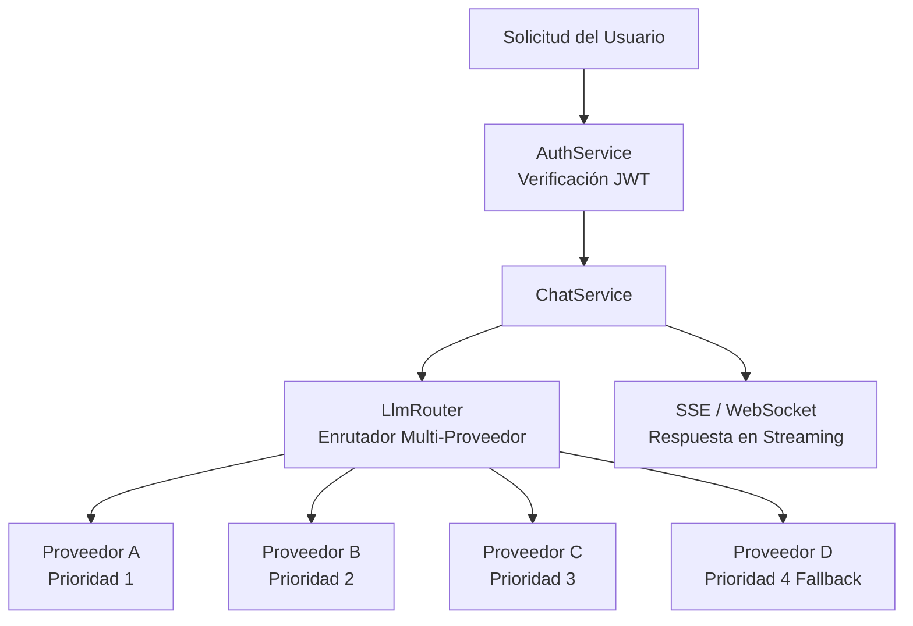
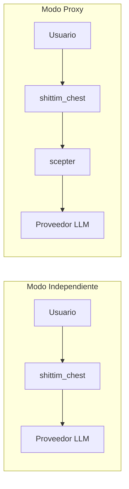

# Arquitectura LLM Independiente

## Resumen

shittim-chest tiene una capa de enrutamiento LLM completamente independiente que no depende de entelecheia. Los usuarios pueden configurar múltiples proveedores LLM, y el enrutador integrado selecciona automáticamente basándose en la prioridad y disponibilidad. Esta es la capacidad diferenciadora central de shittim-chest frente a Open WebUI.

## Arquitectura



## Capacidades Principales

### 1. Enrutamiento Multi-Proveedor con Prioridad

```text
Cada Proveedor tiene un campo de prioridad (número menor = mayor prioridad).
Las solicitudes se intentan de mayor a menor prioridad:
  → Proveedor A (prioridad=1) disponible → usar
  → No disponible → Proveedor B (prioridad=2) disponible → usar
  → No disponible → ... → devolver error
```

### 2. Fallback Automático

Cuando un Proveedor de mayor prioridad devuelve un error (timeout, límite de tasa, inalcanzable), el enrutador cambia automáticamente al siguiente Proveedor disponible, de forma transparente para el usuario.

### 3. Almacenamiento Cifrado de Claves API

Todas las Claves API de los Proveedores se cifran estáticamente con AES-256-GCM y se almacenan en `shittim_chest_db`. La clave de cifrado se proporciona mediante la variable de entorno `ENCRYPTION_KEY`. Incluso si la base de datos se ve comprometida, las Claves API permanecen ilegibles.

### 4. Streaming de Doble Protocolo

| Protocolo | Endpoint | Caso de Uso |
| --- | --- | --- |
| SSE | `/api/chat/stream` | Streaming HTTP simple, compatible con proxy, soporte nativo del navegador |
| WebSocket | `/ws/chat/stream` | Comunicación bidireccional, soporta cancelación e interacción en tiempo real |

### 5. Compatibilidad con OpenAI

Todas las interfaces de Proveedor siguen el formato `/v1/chat/completions` de OpenAI, permitiendo la integración con cualquier servicio compatible con la API de OpenAI (DeepSeek, OpenAI, Ollama/LM Studio local, etc.).

## Gestión de Proveedores

### Fuentes de Configuración

| Método | Caso de Uso |
| --- | --- |
| Variables de entorno (`LLM_DEFAULT_PROVIDER_*`) | Inicio rápido, escenarios de un solo Proveedor |
| CRUD en base de datos (`/api/providers/*`) | Múltiples Proveedores, gestión dinámica |
| Panel de administración de arona | Gestión gráfica |

### Proveedor Semilla

En el primer inicio, si las variables de entorno `LLM_DEFAULT_PROVIDER_*` están configuradas, `db-init` crea automáticamente un Proveedor semilla. Se pueden añadir Proveedores adicionales posteriormente mediante el panel de administración de arona.

## Modo Independiente vs Modo Proxy



| Modo | Condición | Comportamiento |
| --- | --- | --- |
| Independiente | scepter no configurado (o `Proxy: disabled`) | Llama al Proveedor LLM directamente |
| Proxy | URL de scepter configurada | Reenvía a través de la capa proxy al procesamiento de Agentes de entelecheia |

El modo independiente ofrece completamente una experiencia de chat completa: gestión de conversaciones, persistencia de mensajes, búsqueda, exportación. El modo proxy añade capacidades de orquestación de Agentes.

## Implementación Técnica

- **Enrutador**: `packages/shittim_chest/src/llm/router.rs`, soporta selección por prioridad + fallback
- **Cliente**: `packages/shittim_chest/src/llm/client.rs`, basado en `reqwest` + `rustls` (sin dependencia de OpenSSL)
- **CRUD de Proveedores**: `packages/shittim_chest/src/api/providers.rs`, endpoints REST estándar
- **Cifrado**: crate `aes-gcm`, variable de entorno `ENCRYPTION_KEY`
