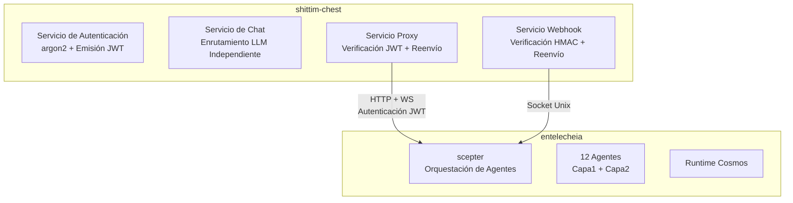

# Acoplamiento Débil con entelecheia

## Resumen

La integración entre shittim-chest y entelecheia se basa en un puente proxy HTTP/WebSocket autenticado con JWT. Este diseño permite que shittim-chest se ejecute de forma completamente independiente sin entelecheia, mientras habilita capacidades de orquestación de Agentes bajo demanda cuando sea necesario.

## Diseño de la Frontera



## Propiedad de los Datos

| shittim_chest_db | entelecheia_db |
| --- | --- |
| auth_users (hashes de contraseñas) | user_identities (user_id) |
| sessions (sesiones activas) | groups |
| refresh_tokens | group_memberships |
| oauth_connections | role_assignments |
| api_keys (Claves de Proveedor cifradas) | group_permissions (cuotas de Proveedor) |
| conversations | agent_configs |
| messages | cosmos_state |
| llm_providers (configuraciones de Proveedor) | iepl_state |
| remote_devices (registros de dispositivos) | |
| device_sessions | |
| channel_configs | |
| webhook_logs (registros de entrega) | |

**Principio**: shittim-chest mantiene datos del "lado del usuario"; entelecheia mantiene datos del "lado del Agente". `user_id` es la clave de vinculación entre ambos lados.

## Protocolo de Autenticación JWT

### Compartición de Clave

shittim-chest y scepter comparten la clave de firma JWT mediante la misma variable de entorno `JWT_SECRET`. Ambos lados pueden verificar independientemente los JWT emitidos por el otro.

### Estructura del Token

```json
{
  "sub": "user-uuid",
  "groups": ["admin", "developer"],
  "exp": 1710000000,
  "iat": 1709996400
}
```

| Campo | Descripción |
| --- | --- |
| `sub` | UUID del usuario (compartido entre ambas bases de datos) |
| `groups` | Lista de grupos a los que pertenece el usuario |
| `exp` | Tiempo de expiración (por defecto 1 hora) |
| `iat` | Tiempo de emisión |

### Flujo de Inicio de Sesión

```text
Usuario → shittim_chest: POST /api/auth/login
shittim_chest: Verificar contraseña argon2
shittim_chest → scepter: GET /api/user/{id}/permissions
scepter → entelecheia_db: Consultar grupos y permisos
scepter → shittim_chest: { groups, permissions }
shittim_chest: Emitir JWT (access + refresh)
shittim_chest → Usuario: tokens
```

## Puenteo Proxy

### Proxy HTTP

```text
Navegador → shittim_chest:80/api/proxy/chat (JWT en Header)
shittim_chest: Verificar JWT
shittim_chest → scepter:8424/api/chat (Reenviar JWT)
scepter → Agente → LLM → scepter → shittim_chest → Navegador
```

### Proxy WebSocket

```text
Navegador → shittim_chest:80/api/proxy/ws (JWT en Header)
shittim_chest: Verificar JWT
shittim_chest ↔ scepter:8424/ws (Reenvío bidireccional + JWT)
Navegador ↔ scepter: Interacción Full-duplex con Agentes
```

### Limitación de Tasa y Monitorización

En la capa proxy, shittim-chest es responsable de:

- Limitación de tasa (por usuario / por IP)
- Registro de uso
- Gestión del ciclo de vida de la conexión
- Reconexión ante desconexiones anormales

## Pipeline de Webhooks

```text
GitHub/GitLab/Gitee → POST /api/webhook/{source} → Verificación HMAC → Parsear evento → Socket Unix → scepter
```

shittim-chest maneja la verificación HMAC y el parseo de eventos; scepter dispara acciones de Agentes basadas en eventos (ej. revisión de código automatizada).

## Modo de Operación Independiente

Cuando la URL de scepter no está configurada en las variables de entorno o `SHITTIM_CHEST_SCEPTER_PROXY` está establecido en `disabled`:

- Los endpoints `/api/proxy/*` devuelven 503 (Servicio No Disponible)
- Los endpoints `/api/devices/*` devuelven 503
- El chat usa completamente el LlmRouter integrado
- Todas las demás características (autenticación, chat, gestión de Proveedores, ingreso de webhooks) funcionan normalmente

Esto permite que shittim-chest se despliegue como una WebUI LLM independiente completa sin entelecheia.
