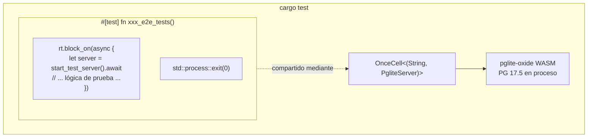

# Base de Datos de Prueba Incrustada (pglite-oxide)

## Resumen

shittim-chest usa [pglite-oxide](https://crates.io/crates/pglite-oxide) como PostgreSQL incrustado para todas las pruebas de integración y E2E. No se necesita Postgres externo, Docker ni `testcontainers` — las pruebas se ejecutan con un solo comando `cargo test` en cualquier máquina.

## Motivación del Diseño

Anteriormente, las pruebas de integración dependían de `postgresql_embedded`, que descarga un binario PostgreSQL completo (~100 MB) en tiempo de ejecución. Esto causaba inicio lento, fallos específicos de plataforma e inestabilidad en CI. pglite-oxide empaqueta PostgreSQL 17.5 como un módulo WASM mediante el runtime wasmer — en proceso, portable y rápido (~96 ms de inicio en frío).

## Arquitectura



## Decisiones Clave

| Decisión | Justificación |
| --- | --- |
| `pglite-oxide` (WASM) sobre `postgresql_embedded` (binario nativo) | Sin descarga de ~100 MB, sin binario PG específico de plataforma, ~96 ms de inicio |
| `pglite-oxide` sobre `pglite-rust-bindings` | Publicado en crates.io (v0.5.0), inicio más rápido, API builder madura con soporte de extensiones |
| `tower::ServiceExt::oneshot` sobre `reqwest` | Evita el deadlock del runtime tokio entre las tareas en segundo plano del pool sqlx y el servidor HTTP hyper |
| Un solo `#[test]` runner con `std::process::exit(0)` | sqlx `PgPool` genera tareas en segundo plano persistentes (idle reaper, health checks) que mantienen vivo el runtime tokio. `exit(0)` evita este bloqueo |
| `max_connections=1` | Limitación fundamental de PGlite — solo una conexión |
| `OnceCell<(String, PgliteServer)>` | Instancia PG compartida entre sub-pruebas en la misma ejecución del binario; `PgliteServer` debe permanecer vivo (no droppearse) |
| `pglite-oxide` solo en `[dev-dependencies]` | El runtime wasmer NO debe filtrarse en builds de producción |

## Patrón del Test Harness

```rust
// tests/common/mod.rs
static PG: OnceCell<(String, PgliteServer)> = OnceCell::const_new();

async fn ensure_pg_url() -> String {
    PG.get_or_init(|| async {
        let server = PgliteServer::builder()
            .start()
            .expect("Fallo al iniciar pglite-oxide");
        let url = server.database_url();
        // conectar, ejecutar migraciones, cerrar conexión inicial
        (url, server)
    }).await.0.clone()
}

pub async fn start_test_server() -> TestServer {
    let db_url = ensure_pg_url().await;
    let db = Database::connect(/* max_connections=1 */).await;
    // construir AppState, Router, devolver TestServer envolviendo tower oneshot
}
```

```rust
// tests/xxx_tests.rs
# [test]
fn xxx_e2e_tests() {
    let rt = tokio::runtime::Runtime::new().unwrap();
    rt.block_on(async {
        let mut server = common::start_test_server().await;
        // ... todas las sub-pruebas usando server.request() ...
    });
    std::process::exit(0);
}
```

## Tablas Creadas

Las 13 tablas se crean mediante migraciones SeaORM durante la configuración de prueba:

`auth_users`, `sessions`, `api_keys`, `oauth_connections`, `channel_configs`, `channel_messages`, `channel_pairings`, `conversations`, `messages`, `llm_providers`, `remote_devices`, `device_sessions`, `system_settings`, `workspace_sessions`

## Limitaciones de PGlite

1. **Conexión única**: `max_connections` debe ser 1. Múltiples pools a la misma instancia PGlite se bloquearán.
1. **Casting de tipos estricto**: PGlite es más estricto que PostgreSQL estándar. Consultas como `uuid_column = text_value` fallarán — siempre hacer cast explícito.
1. **Sin runners de prueba concurrentes**: Todas las pruebas asíncronas que comparten una instancia PGlite deben ejecutarse secuencialmente dentro de una sola función `#[test]`.
1. **Bloqueo del pool al droppear**: `sqlx::PgPool::close()` puede bloquearse indefinidamente. Usar `std::process::exit(0)` para terminar el proceso de prueba.
