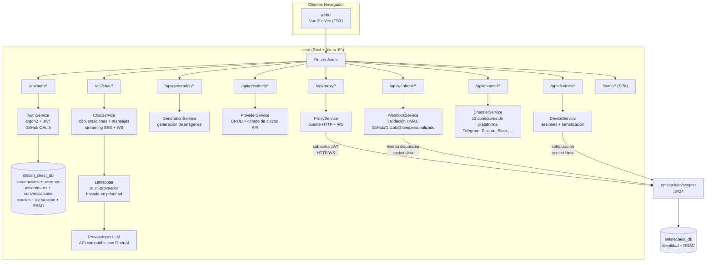
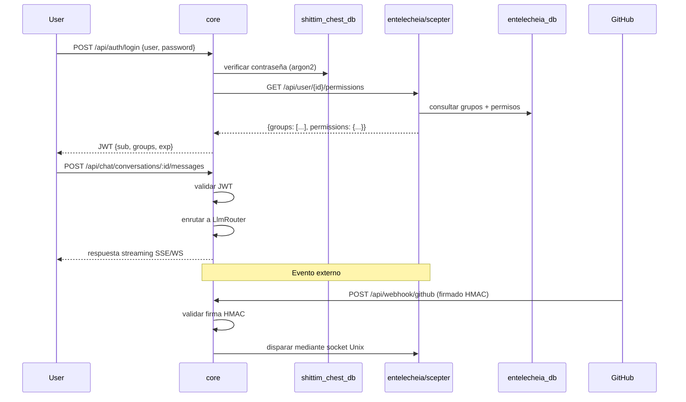

# Arquitectura

> **Versión**: 0.1.0 — En desarrollo activo.
> **Última verificación**: 2026-06-14
> Este proyecto es la interfaz de usuario para [entelecheia](https://github.com/celestia-island/entelecheia).

## Alcance

shittim-chest es un monorepo híbrido Cargo + pnpm. Posee la capa orientada al usuario que envuelve el núcleo de orquestación de agentes de entelecheia. Los dos proyectos se comunican mediante HTTP/WebSocket autenticado con JWT — shittim-chest nunca accede directamente a la base de datos de entelecheia para operaciones de agentes.

| Componente | Tecnología | Rol | Estado |
| --- | --- | --- | --- |
| **core** | Rust + Axum | Backend unificado: auth (JWT + OAuth), enrutamiento LLM independiente, API de chat, generación de imágenes, ingreso de webhooks, proxy scepter, señalización de dispositivos remotos, integraciones de canal, facturación, RBAC, espacios de trabajo | 🟢 Implementado |
| **cli** | Rust | Orquestador Docker: dev, up, down, migrate, logs, status | 🟢 Implementado |
| **webui** | Vue 3 + Vite (TSX) | Frontend: superficie de chat, panel de administración (20+ vistas), topología SCADA 2D, vista previa holográfica 3D | 🟡 Parcial |
| **Tipos de protocolo** | Rust (crate `arona`) + ts-rs | Tipos de protocolo JSON-RPC 2.0 proporcionados por la crate git externa `arona`; bindings TS consumidos por webui | 🟢 Implementado |
| **Plugins IDE** | TS + Kotlin + Rust + Lua | VS Code, IntelliJ, Zed, Neovim, puente LSP | 🟡 Funcional |
| **Apps Tauri** | Rust + Tauri | Escritorio, móvil, DTOs compartidos | 🟡 Funcional |
| **harmony** | ArkTS | App HarmonyOS | 🟡 Funcional |

## Diagrama de Arquitectura

### Detalle del Backend core



### Comunicación Multi-Proyecto



## Módulos del Backend

Todos los módulos residen bajo `packages/core/src/`. El backend tiene ~34K líneas en 135 archivos Rust (138 incluyendo archivos de prueba).

### Auth (`packages/core/src/auth/`)

Completamente implementado:

- Registro e inicio de sesión con usuario/contraseña con hash argon2
- Sistema de tokens JWT de acceso + refresco con rotación
- Integración GitHub OAuth 2.0 (redirección + callback, crea usuarios automáticamente)
- Gestión de sesiones (CRUD en tabla `sessions`)
- Middleware de verificación de token usado en todas las rutas

### Chat (`packages/core/src/chat/`)

Completamente implementado:

- CRUD de conversaciones (crear, listar, obtener, actualizar, eliminar)
- Envío/recepción de mensajes con enrutamiento LLM
- Respuestas en streaming SSE (Server-Sent Events) (`/api/chat/stream`)
- Streaming WebSocket (`/ws/chat/stream`)
- Búsqueda de mensajes (`/api/chat/search?q=`) con ILIKE
- Exportación de conversaciones (`/api/chat/conversations/:id/export?format=json|md`)

### LLM (`packages/core/src/llm/`)

Completamente implementado:

- Cliente HTTP compatible con OpenAI para chat y generación de imágenes
- Enrutador multi-proveedor con selección basada en prioridad
- CRUD de proveedores con cifrado de claves API (AES-256-GCM)
- Listado de modelos y endpoints de prueba de proveedores
- Timeout de solicitud y configuración de buffer de streaming

### Generación (`packages/core/src/generation/`)

Completamente implementado:

- Endpoints de generación de imágenes (`/api/generation/images`, `/api/generation/models`)
- Usa los proveedores LLM configurados

### Webhook (`packages/core/src/webhook.rs`)

Completamente implementado (~1,000+ líneas):

- Webhook de GitHub con validación HMAC-SHA256
- Webhook de GitLab con validación de token
- Webhook de Gitee con HMAC + fallback de token
- Endpoint de webhook personalizado (`/api/webhook/custom/{name}`)
- Detección de entregas duplicadas (caché LRU, hasta 10,000 IDs)
- Registro de entregas con API de listado
- Sistema de lista blanca de IPs para fuentes de webhook (`webhook_ip_whitelist.rs` separado)
- Reenvío de disparadores a scepter mediante socket Unix

### Dispositivos (`packages/core/src/devices/`)

Relay de señalización implementado (requiere scepter externo para el handshake WebRTC):

- Endpoints REST para listado de dispositivos, detalle, CRUD de sesiones
- Relay de señalización WebSocket para WebRTC — reenvía ofertas SDP/candidatos ICE a scepter mediante socket Unix; la respuesta SDP debe venir de scepter (`forward_sdp_to_scepter` devuelve cadena vacía si scepter es inalcanzable)
- Relay de terminal (mediante WebSocket a xterm.js) — reenvía pulsaciones de teclas a scepter
- Relay de frames de escritorio
- Backend de explorador de archivos SFTP
- Configurable: máximo de sesiones por usuario, tamaño de buffer de frames, servidores ICE
- Gestión de modelos de dispositivo (módulo `device_models/`)

> **Brecha:** El relay es real pero no puede completar un handshake WebRTC sin una instancia de scepter en ejecución. Cuando scepter está caído, las respuestas SDP están vacías y WebRTC falla de forma controlada.

### Canales (`packages/core/src/channel/`)

Completamente implementado (22 archivos de módulo + `mod.rs`):

- 12 conectores de plataforma: Telegram, Discord, Slack, Lark/Feishu, QQ Bot, WeCom, IRC, Matrix, Mattermost, Google Chat, Microsoft Teams, LINE
- Implementaciones reales de cliente API por plataforma
- Controles de política de MD (`dm_policy.rs`)
- Limitación de tasa (`rate_limit.rs`)
- Verificación de salud (`health_check.rs`)
- Emparejamiento de canales (`pairing.rs`)
- Sistema de plugins (`plugin.rs`)
- Almacenamiento cifrado de credenciales (`crypto.rs`)
- Registro central (`registry.rs`) y rutas (`routes.rs`)

### Módulos Adicionales del Backend

| Módulo | Descripción |
| --- | --- |
| `proxy/` | Puente HTTP/WS de Scepter (`ws_bridge.rs` es el archivo más grande del código base) |
| `rbac/` | Control de acceso basado en roles |
| `workspace/` | Gestión de espacios de trabajo |
| `oauth.rs` | Integración de proveedores OAuth |
| `billing.rs` | Integración de pagos Stripe (verificación HMAC de webhook, eventos de checkout/suscripción, aplicación de cuotas, deduplicación de pagos) |
| `container/` | Gestión de contenedores Docker |
| `cruise/` | Soporte de Cruise (flujos de trabajo automatizados) |
| `audio/` | Soporte de servicio de audio/voz |
| `skills.rs` | **Stub** — devuelve array vacío; sin respaldo de base de datos ni integración con scepter aún |
| `tools.rs` | **Stub** — devuelve array vacío; sin respaldo de base de datos ni integración con scepter aún |
| `system_settings.rs` | Configuración del sistema |
| `trigger_forward.rs` | Reenvío de disparadores de eventos |
| `quota_guard.rs` / `resource_quotas.rs` | Aplicación de cuotas de recursos |
| `avatar_platforms.rs` | Integración de plataformas de avatar |

### Base de Datos

PostgreSQL mediante SeaORM 1.x con **5 migraciones** y **25 modelos de entidad**:

`auth_users`, `avatar_platforms`, `channel_configs`, `channel_messages`, `channel_pairings`, `channel_plugins`, `conversations`, `cruise_history`, `device_models`, `device_sessions`, `llm_providers`, `messages`, `oauth_connections`, `payment_events`, `projects`, `rbac_grants`, `rbac_groups`, `rbac_user_groups`, `remote_devices`, `scene_configs`, `sessions`, `system_settings`, `webhook_deliveries`, `workspace_alias_registry`, `workspace_sessions`

## Frontend

### webui (`packages/webui/`)

Frontend Vue 3 + Vite escrito en TSX (mediante `@vitejs/plugin-vue-jsx` — sin archivos `.vue` SFC). Paquete npm: `@celestia-island/webui`. ~31K líneas.

#### Vistas

| Grupo de vistas | Descripción |
| --- | --- |
| `demiurge/` | Superficie principal de chat (DemiurgeView) — respuestas en streaming, estado de agentes, llamadas a herramientas |
| `auth/` | LoginView, RegisterView, SetupView |
| `admin/` | 20+ vistas de administración: Dashboard, Proveedores, Agentes, RBAC, Webhooks, Canales, Sistema, Modelos de Dispositivo, Configuración de Dispositivos, Skills, Herramientas MCP, Proveedores OAuth, Uso de Tokens, Espacios de Trabajo, Servicio de Voz, Cuota de Recursos, etc. |
| `topology/` | Topología SCADA 2D: TopologyOverview, TopologyBoxDetail, TopologyDeviceDetail. El transporte es real (WS JSON-RPC reenviado a scepter); **sin scepter, TopologyOverview recurre a `SIMULATED_DEVICES` hardcodeados (19 dispositivos demo) y chips de telemetría en chino; TopologyBoxDetail muestra estado vacío** |
| `holographic/` | Vista previa holográfica 3D: HolographicOverview, HolographicBoxZoom, HolographicModelDetail. **La carga de modelos 3D es real** (carga archivos GLB reales, proyectos, configuraciones de escena desde el backend local); los chips de parámetros de telemetría requieren scepter, recurriendo a vacío en caso de fallo |

#### Sistema de componentes

| Directorio | Descripción |
| --- | --- |
| `base/` | 50+ componentes de sistema de diseño con prefijo `S` (SButton, SCard, SModal, STable, STabs, STimeline, STreeView, SMarkdownRenderer, SMorphingTabs, etc.) |
| `chat/` | Componentes específicos de chat (ChatBubble, AgentStatusBar, FloatingChatBar, ThinkingDots, ReportViewer, NodeMinimap, etc.) |
| `header/` | Componentes de cabecera (barra de breadcrumb, cambio de modo) |
| `layout/` | Shell de aplicación (SAppShell, SSidebar, SDrawer, SWallpaperRenderer, etc.) |
| `preview/` | Biblioteca de símbolos SCADA, topología, componentes holográficos |
| `cruise/` | Componentes de flujo de trabajo Cruise |
| `panels/`, `popups/`, `shared/` | UI de soporte |

#### Sistema de animación

Todo el movimiento basado en CSS y el muestreo por frame en el webui se ejecuta a través de **un solo bucle rAF compartido** propiedad de `packages/webui/src/theme/animationBus.ts` — el "contexto de animación" en el que se espera que se registren cada diálogo, modal, popup, drawer, toast y transición de lista. El bus es un singleton a nivel de proceso; se auto-apaga cuando está inactivo y solo gira mientras hay trabajo en vuelo, por lo que una pestaña inactiva no quema frames.

El bus expone cuatro APIs de registro de trabajo más dos flags de canal lateral:

| API | Propósito | Modelo de frame |
| --- | --- | --- |
| `onFrame(cb, priority?)` | Registrar un callback por frame. `priority` ∈ `sync` / `normal` / `idle`. Devuelve `{ disconnect() }`. | Invocado cada frame (sync), limitado a ~30 Hz (normal), o ~0.5 Hz (idle). |
| `onceFrame(cb)` | Ejecutar un callback en el siguiente frame, luego auto-desconectar. Dispara y olvida (sin manejador de cancelación). | Un solo uso. |
| `scheduleFrame(cb)` | Ejecutar un callback en el siguiente frame; devuelve `{ disconnect() }` para cancelar antes de que se dispare. Para el patrón de limitación "coalescer muchas llamadas en un callback post-frame" (reemplaza el modismo artesanal `if(rafId)cancel; rafId=rAF(cb)`). | Un solo uso (cancelable). |
| `reportTransition(durationMs)` | **Declarativo**: declara "una transición CSS de duración N está en vuelo" sin un callback por frame. El bus simplemente mantiene su bucle vivo durante la ventana para que los observadores que muestrean `onFrame` no se suspendan a mitad de la transición. | Costo cero por frame; solo estado. |
| `notifyScrollStart()` | Durante una ventana de scroll de 150 ms, suprime los callbacks de prioridad `normal` (ahorra energía; sync e idle no se ven afectados). | Flag de canal lateral. |
| `setReducedMotion(flag)` | Respeta la preferencia del usuario `prefers-reduced-motion` / clase `html.reduce-motion` — detiene el bucle de **animación** mientras está activo. Los de un solo uso (`onceFrame` / `scheduleFrame`) son trabajo utilitario (mediciones, flushes), no animación, por lo que siguen drenando en un drainer rAF separado y nunca se pausan. | Flag de canal lateral. |

La capa componible sobre el bus es `packages/webui/src/composables/useReportedTransition.ts`. **Esta es la superficie preferida** para cualquier componente que ejecute una `transition` / `animation` CSS usando los tokens compartidos `--duration-*`. Se auto-cancela al desmontar el componente y coalesce cambios rápidos. El bus rastrea la línea de tiempo; CSS hace el trabajo visual; los dos se mantienen sincronizados mediante los tokens compartidos.

```ts
// componente de transición única (el diálogo se abre O se cierra — mutuamente excluyentes)
const anim = useReportedTransition(300);
function onBeforeEnter() { anim.run(); }
function onAfterEnter()  { anim.cancel(); }

// transiciones superpuestas (ej. un TransitionGroup cuyos elementos entran Y salen
// al mismo tiempo) — dividir por pista para que el run() de una salida no pueda cancelar
// el report de una entrada en vuelo:
const anim = useReportedTransition(300);
const enter = anim.track("enter");
const leave = anim.track("leave");
//   onBeforeEnter={enter.run} onAfterEnter={enter.cancel}
//   onBeforeLeave={leave.run} onAfterLeave={leave.cancel}
```

El bus DOM está intencionalmente separado de **`packages/webui/src/composables/three/animationBus3D.ts`**, que posee su propio bucle rAF para el pipeline de renderizado three.js. El timing de frames 3D nunca debe afectar la programación de transiciones DOM y viceversa; los dos pueden pausarse o depurarse independientemente. Ambos exponen la misma forma `onFrame → { disconnect }`.

**Tokens de movimiento** (`packages/webui/src/theme/theme.scss`) son la única fuente de verdad para duración/easing: `--duration-instant/short/normal/long` para movimiento, `--duration-fade` para transiciones de opacidad/color, y `--ease-spring/out-expo/in-expo/standard` para curvas. `prefers-reduced-motion` / `html.reduce-motion` colapsa los tokens de movimiento a `0s` pero **deliberadamente mantiene `--duration-fade` no-cero** — suprimir el *movimiento* que desencadena problemas vestibulares, no la opacidad de cambio de estado, es el comportamiento correcto de accesibilidad. Siempre usa `reportTransition(--duration-*)` para que la línea de tiempo del bus de una transición CSS coincida con su línea de tiempo visual.

**Cobertura**: cada aplazamiento rAF 2D-DOM en el webui ahora pasa por el bus — `onFrame` / `reportTransition` para animación continua, `onceFrame` / `scheduleFrame` para aplazamientos utilitarios de un solo uso (mediciones, recálculos limitados, flushes por lotes). Los únicos sitios restantes con `requestAnimationFrame` crudo son el pipeline 3D (`composables/three/*`, que tiene su propio `animationBus3D.ts`) y la programación del bucle interno del propio bus; ambos son intencionales. El trabajo nuevo nunca debe llamar a `requestAnimationFrame` directamente — elige la API del bus apropiada.

#### Rutas de importación

El webui consume su propio `src/` a través de **dos alias de ruta deliberadamente distintos** (ambos declarados en `vite.config.ts` + `tsconfig.json`), y todo el código base obedece la división:

| Alias | Resuelve a | Úsalo para |
| --- | --- | --- |
| `@/<path>` | `src/*` | **Importaciones profundas internas** — alcanzar un módulo específico directamente (`@/api/client`, `@/composables/useReportedTransition`, `@/theme/animationBus`). ~600 sitios; nunca se usa como barrel simple. |
| `@celestia-island/shared_ui` | `src/` (→ `src/index.ts` barrel) | **Solo la superficie de API pública curada** — siempre el especificador simple, nunca una subruta de código. ~92 sitios. |

La división impone una frontera pública/privada (como un mapa `exports` de paquete): el barrel (`src/index.ts`) es lo único importable "como un paquete", mientras que `@/` permite que el código interno alcance módulos de implementación. Trata el barrel como el contrato — añade a `src/index.ts` cuando algo deba ser público. Los activos compartidos del sistema de diseño (`theme/*.scss`, `res/*`) también son accesibles bajo el namespace `shared_ui`. El alias heredado `@shared_ui` es un duplicado de `@celestia-island/shared_ui` todavía referenciado por algunas declaraciones SCSS `@use`; el código nuevo debe usar `@celestia-island/shared_ui`.

### Tipos de Protocolo (crate `arona`)

Los tipos de protocolo JSON-RPC 2.0 y enums compartidos son proporcionados por la crate Rust externa [`arona`](https://github.com/celestia-island/arona), declarada como dependencia git en `Cargo.toml`. La crate deriva bindings `ts-rs` que se generan en `packages/webui/src/types/arona/` y son consumidos por el webui mediante el alias de ruta `@celestia-island/arona`.

### Panel de Administración

Las vistas de administración residen dentro del webui bajo el grupo de rutas `admin/`: Dashboard, Proveedores (CRUD + asistente de añadir proveedor), Agentes, Detalle de Agente, RBAC (grupos + concesiones), Webhooks, Canales, Sistema, Modelos de Dispositivo, Configuración de Dispositivos, Skills, Herramientas MCP, Proveedores OAuth, Uso de Tokens, Espacios de Trabajo, Servicio de Voz, Cuota de Recursos.

### i18n

El webui usa **`vue-i18n`** (no una implementación personalizada) con **11 locales declarados**: Árabe (`ar`), Alemán (`de`), Inglés (`en`), Español (`es`), Francés (`fr`), Japonés (`ja`), Coreano (`ko`), Portugués (`pt`), Ruso (`ru`), Chino Simplificado (`zhs`), Chino Tradicional (`zht`).

Cada locale tiene **17 archivos JSON de namespace** (admin, auth, chat, cmd, common, devices, errors, footer, help, logs, models, reports, skills, timeline, tokenUsage, tools, workspace). El cambio de locale en la aplicación está disponible mediante el selector de locale de la cabecera.

> **La completitud de las traducciones varía significativamente** (auditado contra 950 claves de referencia en inglés):
> | Nivel | Locales | Passthrough al inglés | Brecha de claves |
> |------|---------|-------------------|---------|
> | Bien traducidos | `ja`, `ko`, `zhs`, `zht` | ~5% | `zhs` faltan 18 claves; otros faltan 112 |
> | Mayormente traducidos | `de`, `fr`, `pt`, `es`, `ar` | ~9–14% | Bloque compartido de 112 claves faltante |
> | Efectivamente sin traducir | `ru` | **~76%** | Paridad completa de claves, pero los valores son inglés literal |
> La brecha compartida de 112 claves cubre características más nuevas: `admin.agents.*`, `admin.deviceModels.*`, `admin.projects.*`, `admin.rbac.*`, `admin.resourceQuota.*`, `auth.protocol.*`, `chat.cruise.*`, `chat.voice_*`.

## Arquitectura RBAC

### División de Datos

La propiedad de los datos se divide entre los dos proyectos para mantener fronteras limpias:

| Datos | Base de Datos | Propietario | Justificación |
| --- | --- | --- | --- |
| Credenciales de usuario (hash de contraseña, OAuth, claves API) | shittim_chest_db | shittim-chest | La capa de presentación posee el flujo de inicio de sesión |
| Sesiones activas, tokens de refresco | shittim_chest_db | shittim-chest | La gestión de sesiones es una preocupación del frontend |
| Conversaciones, mensajes | shittim_chest_db | shittim-chest | Los datos de chat son orientados al usuario |
| Configuraciones de proveedores LLM | shittim_chest_db | shittim-chest | La gestión de proveedores es orientada al usuario |
| Configuraciones de canal, facturación, espacios de trabajo | shittim_chest_db | shittim-chest | Datos operativos orientados al usuario |
| Identidad de usuario, grupos, asignaciones de roles | entelecheia_db | entelecheia | El núcleo de orquestación aplica los permisos |
| GroupPermissions (cuotas de proveedor, listas blancas de agentes) | entelecheia_db | entelecheia | La política a nivel de agente reside con los agentes |

### Flujo de Autenticación

1. El usuario se autentica a través de core (contraseña / OAuth)
1. core valida las credenciales contra `shittim_chest_db` (argon2 para contraseñas)
1. core consulta a entelecheia los permisos de grupo del usuario (o lee de caché TTL)
1. core emite JWT con `{ sub: user_id, groups: [...] }`
1. Todas las solicitudes subsiguientes llevan JWT → core valida → reenvía a scepter para rutas proxy
1. scepter valida JWT (secreto compartido mediante variable de entorno) y aplica permisos a nivel de grupo

## Dependencias Multi-Proyecto

### Crates Rust

shittim-chest depende de dos crates externas del ecosistema celestia-island:

```toml
# Crate de protocolo externa — compartida entre shittim-chest y entelecheia
arona = { git = "https://github.com/celestia-island/arona.git", branch = "dev" }

# Serialización JSON versionada (migrar-al-leer para columnas JSON/JSONB)
hifumi = { path = "../hifumi/packages/types" }
```

La crate `arona` proporciona tipos de protocolo JSON-RPC y enums compartidos usados por ambos proyectos. La crate `hifumi` proporciona serialización JSON versionada para columnas de base de datos.

### Paquetes npm

El webui consume los bindings TS de la crate `arona` a través del alias de ruta `@celestia-island/arona`, que apunta a `packages/webui/src/types/arona/` (donde aterriza la salida de `ts-rs`). El `@celestia-island/shared_ui` del webui es un auto-alias a `packages/webui/src/` usado para importaciones internas.

## Brechas Actuales

> **Esta sección documenta las limitaciones conocidas y áreas incompletas.**

### Funcionalidades Dependientes de Scepter

Las siguientes funcionalidades tienen implementaciones reales en shittim-chest pero requieren una instancia de [entelecheia/scepter](https://github.com/celestia-island/entelecheia) en ejecución para funcionalidad completa:

| Funcionalidad | Qué funciona | Qué necesita scepter |
| --- | --- | --- |
| Topología SCADA | Transporte WS, renderizado SVG, navegación breadcrumb | Datos de telemetría en vivo (RPCs `topology.*` reenviados a scepter) |
| Holográfico 3D | Carga de modelos GLB, configuración de escena, control de cámara | Chips de parámetros de telemetría |
| Dispositivo WebRTC | Relay de señalización, auth JWT, reenvío ICE | Generación de respuesta SDP |
| Dashboard Cruise | Renderizado de componentes, suscripción WS | Datos de streaming de agentes en vivo |
| Proxy Scepter | Puente HTTP/WS (`ws_bridge.rs`, 2K líneas) | Todas las operaciones de agentes proxy |

Sin scepter, la topología recurre a `SIMULATED_DEVICES` (datos demo hardcodeados); los chips holográficos y el WebRTC de dispositivo muestran estados vacíos/fallo.

### Brechas de i18n

Consulta la [sección i18n](#i18n) arriba para la auditoría completa. Resumen: `ru` está estructuralmente completo pero ~76% es passthrough al inglés; 8 locales comparten una brecha de 112 claves de características más nuevas.

### Cobertura de Pruebas

El backend tiene pruebas de integración para auth, chat, validación HMAC de webhook, facturación (8 pruebas de firma Stripe) y APIs de espacio de trabajo. El frontend tiene pruebas unitarias para composables (`useToast`, `useConfirm`, `useSolarTime`, `useAsyncData`) y utilidades (validación, uuid, errores).

**Áreas no probadas:** La mayoría de las rutas admin CRUD, llamadas API de conectores de canal (los 12 archivos de conector tienen cero pruebas; solo `crypto.rs` y `rate_limit.rs` están probados), relay de señalización de dispositivos, módulo de audio (940 líneas, cero pruebas), páginas de topología/holográficas, runtimes de plugins IDE, flujos de apps Tauri/HarmonyOS. La cobertura es escasa en relación con ~65K líneas de código.

### Stubs del Backend

Los endpoints REST `skills.rs` y `tools.rs` siguen siendo stubs de solo fallback (devuelven `[]`), pero la **ruta WS primaria está completamente cableada** a través del puente generalizado de notificación-respuesta en `ws_bridge.rs`. El puente traduce los métodos de solicitud-respuesta del webui a las acciones emparejadas de estilo notificación de scepter:

| Método WS | Par Scepter | Estado |
| --- | --- | --- |
| `skills.list` | `Skill.ListSkills` → `SkillsListResponse` | ✅ Puenteado (mapeador de campos) |
| `tools.list` | `Mcp.ListTools` → `ToolsListResponse` | ✅ Puenteado (mapeador de campos) |
| `layer2.agents.list` | `Tui.Layer2AgentList` → Response | ✅ Puenteado (identidad) |
| `layer2.tools.list` | `Tui.Layer2AgentMcpTools` → Response | ✅ Puenteado (correlación por agente) |
| `layer2.skills.list` | `Tui.Layer2AgentSkills` → Response | ✅ Puenteado (correlación por agente) |

Para añadir un nuevo método puenteado, añade una entrada a `NOTIFICATION_BRIDGES` en `ws_bridge.rs` — no se necesitan nuevas funciones manejadoras. Los endpoints REST (`skills.rs`, `tools.rs`) solo se usan como fallback HTTP cuando WS no está disponible.

`chat.stop` ahora reenvía `request.cancel` a scepter (aborta la cadena de habilidades en ejecución mediante `cancel_active_request()`), no solo limpiando la visualización del stream del lado del cliente.

### Modo Mock

El backend tiene un flag de entorno `SHITTIM_CHEST_MOCK_MODE` (`config.rs`) que omite la validación JWT y las comprobaciones HMAC para desarrollo. Esto es una **elusión de seguridad**, no una capa de simulación de datos — emite advertencias fuertes y nunca debe usarse en producción.

## Licenciamiento

| Parámetro | Valor |
| --- | --- |
| Licencia comercial | Business Source License 1.1 (BUSL-1.1) |
| Uso no comercial | Synthetic Source License 1.0 (SySL-1.0) |
| Concesión de Uso Adicional | Producción interna, académico, gubernamental y uso no comercial permitido |
| Restricción | Los servicios de alojamiento/gestión/reventa a terceros requieren una licencia comercial |
