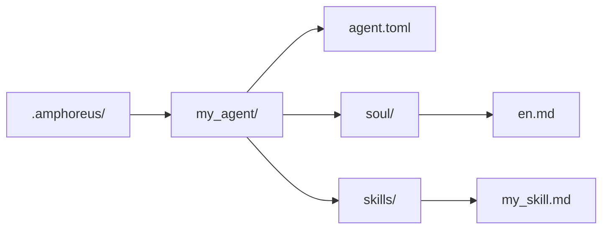

# Tutorial de desarrollo de Agent

> Instrucciones de desarrollo de Agent basadas en la realidad actual del repositorio

## Descripción general

Actualmente existen tres niveles de extensión utilizables en el repositorio.

| Nivel | Significado actual |
| --- | --- |
| Layer1 | Agent central implementado como crate Rust y compilado en el workspace |
| Layer2 | Web Automation como agente de dominio integrado activo, más algunos materiales archivados o planificados |
| Layer3 | Agent personalizado por el usuario (en planificación, aún no implementado) |

No interpretes todos los esquemas de Layer2 que aparecen en documentos históricos como agentes integrados todavía activos.

## Layer3 es la ruta de extensión más sencilla

> **Nota**: Layer3 se encuentra actualmente solo en fase de diseño. El directorio `.amphoreus/`, el cargador de Agent (`Layer3Workspace`) y el marco de configuración aún no están implementados. Esta sección describe el diseño objetivo para uso futuro.

Si deseas extender Entelecheia (玄枢) sin modificar el workspace Rust, prioriza usar Layer3 (cuando esté implementado).

### Estructura mínima

### Qué puede ofrecer Layer3 actualmente

- Archivos soul basados en prompt
- Skill basada en prompt
- Reutilización de herramientas existentes de la plataforma
- Escaneo de pre-verificación durante la carga

### Qué no puede ofrecer automáticamente Layer3 actualmente

- Nuevo backend Rust MCP
- Garantía completa de sandbox
- Disponibilidad productiva inherente para cada ruta de skill/tool

## Desarrollo de Agent integrado

Los agentes integrados son crates Rust ubicados en `packages/agents/<agent>/`.

Los componentes comunes incluyen:

- `src/lib.rs`
- `src/state.rs`
- `src/skills.rs`
- `src/mcp/registry.rs`
- `src/mcp/tools/*.rs`

También se requiere mantener la documentación correspondiente en `res/prompts/agents/<agent>/`.

## Recomendaciones actuales para Layer2

Históricamente, el repositorio contenía numerosos diseños de agentes de dominio Layer2. Actualmente deben entenderse de la siguiente manera:

- El crate Layer2 integrado activo en el workspace actual es Web Automation
- Gran parte de la documentación antigua de Layer2 describe objetivos de diseño o material archivado
- El nuevo desarrollo integrado de Layer2 debe considerarse como desarrollo de producto real, no como algo que se puede "activar" simplemente restaurando documentación

## Advertencias de seguridad actuales

- El escaneo de pre-verificación existe, pero sigue siendo un escaneo basado en reglas de palabras clave.
- La disponibilidad de las herramientas depende de la implementación real del backend MCP correspondiente.
- Algunas herramientas y skills mencionadas en la documentación pueden ser implementaciones parciales o stubs.

## Rutas de referencia

- `packages/shared/custom_agent/src/`
- `packages/agents/hubris/`
- `packages/agents/kalos/`
- `packages/agents/aporia/`
- `res/prompts/agents/`

## Sugerencias de prueba

Actualmente se recomienda verificar directamente:

- Análisis y carga de Layer3
- Análisis de skill
- Pruebas directas de herramientas MCP en Rust
- La ruta de agent/tool que realmente has modificado

No uses la documentación de arquitectura antigua como evidencia de que "cierta ruta de Layer2 ya está activa".
