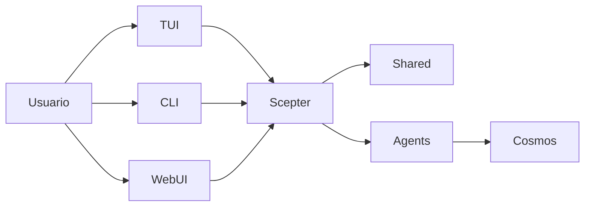

# Arquitectura

> Basada en la estructura actual de tiempo de ejecución, no en una visión imaginaria del estado objetivo

## Descripción general del tiempo de ejecución

El núcleo de la plataforma actual son `packages/scepter`, `packages/shared` y `packages/tui`.

## Partes más maduras actualmente

- Orquestación del servidor Scepter
- Configuración, nombres de herramientas, prompts y tipos de estado en Shared
- Flujo de usuario de TUI
- Ruta de ejecución basada en contenedores

## Partes con implementación parcial actualmente

- Cobertura de comandos CLI
- Integración avanzada de memory / RAG
- La mayoría de los esquemas de dominio Layer2

## Estructura de Agent activa actual

### Layer1

El workspace compila actualmente 12 agentes Layer1 que cubren enrutamiento de mensajes, planificación, archivos, contenedores, scripts, conocimiento, búsqueda, programación, seguridad, memoria y capacidades relacionadas con dispositivos.

### Layer2

El workspace actual tiene dos crates Layer2 integrados activos: **Web Automation** (automatización de navegador) y **Ingeniería de software clásica** (análisis estático, revisión de código, métricas de calidad, refactorización, diagnóstico/símbolos/refactorización LSP). Los 11 agentes especializados listados en la documentación antigua describen contenido archivado o planificado aparte de estos dos.

### Layer3

Layer3 sigue siendo un punto de extensión de Agent personalizado basado en `.amphoreus/` (en fase de diseño, aún no implementado).

## Modelo de ejecución

### Herramientas visibles para el modelo

El modelo generalmente solo ve:

- `exec`
- `write_to_var`
- `write_to_var_json`

Las herramientas MCP internas se invocan indirectamente a través del tiempo de ejecución.

### Rutas en proceso y en contenedor

Parte de la lógica se ejecuta dentro del proceso Scepter, mientras que otro trabajo se completa a través de rutas en contenedor y módulos auxiliares de tiempo de ejecución.

### WebUI / IDE / Tauri

La Web UI (arona), el panel de administración (malkuth), el complemento IDE y la aplicación Tauri se han migrado al proyecto hermano **shittim-chest** y se han eliminado de este repositorio. La interfaz preferida de este repositorio es **TUI**; la capa Web/IDE reside en shittim-chest, comunicándose con Scepter a través de JWT + WebSocket/HTTP.

## Capacidades de Memory y conocimiento

RAG y memory son más maduros de lo que describían las descripciones generales antiguas, pero aún queda algo de código de integración pendiente:

- Se han implementado tres backends de embedding: API (compatible con OpenAI), inferencia local ONNX (`FastEmbeddingService`, predeterminado BGE-M3), respaldo de hash SHA-256
- Tanto documentos vectoriales en memoria como almacenamiento **PgVector** (índice HNSW) están disponibles
- El recorrido de grafos y la búsqueda híbrida (fusión RRF) están disponibles
- El cableado automático de embedding→RAG y la sincronización de suscripción RAG aún están pendientes de integración
