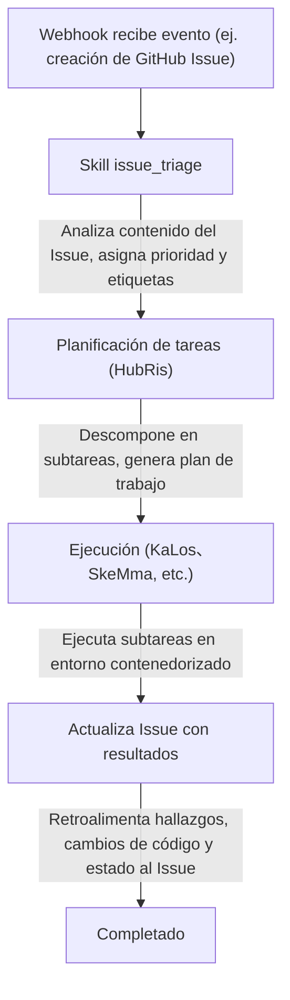

# Integración de seguimiento de Issues

> Conectar sistemas externos de seguimiento de Issues a los flujos de trabajo de Agent de Entelecheia (玄枢)
> Nota de estado actual: HubRis actualmente proporciona capacidades de creación, actualización, búsqueda y comentarios de issues, y también existen integraciones de webhook en el repositorio. Pero este documento no debe interpretarse como que "ya existe una superficie de producto de issues unificada y completa multiplataforma".

---

## Tabla de contenidos

- [Descripción general](#descripción-general)
- [Identificación de tres capas del contenedor](#identificación-de-tres-capas-del-contenedor)
- [Formato de ID vinculante](#formato-de-id-vinculante)
- [Cómo interactúan los Agents con los Issues](#cómo-interactúan-los-agents-con-los-issues)
- [Flujos de trabajo impulsados por Issues](#flujos-de-trabajo-impulsados-por-issues)
- [Registro de prefijos de plataforma](#registro-de-prefijos-de-plataforma)
- [Nomenclatura de ramas Fork del contenedor](#nomenclatura-de-ramas-fork-del-contenedor)
- [Integración WebUI](#integración-webui)

---

## Descripción general

Actualmente, las capacidades relacionadas con issues de Entelecheia provienen principalmente de dos direcciones:

- La integración de webhook puede reenviar eventos externos al sistema
- HubRis proporciona capacidades auxiliares de estilo issue (crear, leer, actualizar, eliminar)

La automatización de issues multiplataforma puede considerarse una dirección existente con implementación parcial, pero no se debe asumir por defecto que cada flujo de trabajo en este documento ya está completamente cerrado.

---

## Identificación de tres capas del contenedor

Los contenedores en Entelecheia utilizan un sistema de ID de tres capas para mantener la identidad en diferentes contextos:

| Capa | Formato | Ciclo de vida | Propósito |
| --- | --- | --- | --- |
| UUID | UUID estándar (ej. `550e8400-e29b-41d4-a716-446655440000`) | Permanente | Clave primaria de base de datos, seguimiento entre reinicios |
| ID vinculante | `@platform#id` (ej. `@github#234`) | Estable | Vinculación de recursos externos, nomenclatura de ramas |
| ID de tiempo de ejecución | `#xxx` (ej. `#616`) | Por sesión | Visualización TUI, enrutamiento Unix socket |

El **ID vinculante** enlaza un contenedor a un recurso de plataforma externa. Permanece estable tras reinicios de Scepter, a diferencia del ID de tiempo de ejecución que se reasigna en cada inicio.

---

## Formato de ID vinculante

El formato general del ID vinculante es:

```text
@platform#id[@#floor]
```

- `platform` — Prefijo de plataforma (ej. `github`、`gitee`、`gitlab`)
- `id` — Número de Issue o recurso en la plataforma
- `@#floor` — Número de piso opcional, para referencias anidadas (ej. comentarios)

### Ejemplos

| ID vinculante | Significado |
| --- | --- |
| `@github#123` | GitHub Issue #123 |
| `@gitee#456` | Gitee Issue #456 |
| `@gitlab#789` | GitLab Issue #789 |
| `@github#123@#5` | 5º comentario del GitHub Issue #123 |
| `@feishu#abc123` | Tema de mensaje de Feishu abc123 |

Los IDs vinculantes se utilizan para:

- Etiquetas y metadatos de contenedores
- Nombres de ramas para desarrollo impulsado por issues
- Parámetros de skills de Agent
- Filtrado de lista de Issues en WebUI

---

## Cómo interactúan los Agents con los Issues

Los Agents interactúan con Issues externos a través de las herramientas MCP de HubRis. Estas herramientas encapsulan las APIs específicas de cada plataforma:

### Operaciones de Issue disponibles

| Herramienta | Descripción |
| --- | --- |
| `$.agent.HubRis.issue_create()` | Crear un nuevo Issue en una plataforma externa |
| `$.agent.HubRis.issue_update()` | Actualizar un Issue existente (título, cuerpo, estado, etiquetas) |
| `$.agent.HubRis.issue_search()` | Buscar Issues multiplataforma aplicando filtros |
| `$.agent.HubRis.issue_comment()` | Añadir un comentario a un Issue existente |

### Uso en código exec

```typescript
$.agent.HubRis.issue_create({
  platform: "github",
  repository: "celestia-island/entelecheia",
  title: "Corregir lógica de reconexión WebSocket",
  body: "El cliente WebSocket no reintenta ante pérdida de conexión.",
  labels: ["bug", "priority:high"]
});
```

```typescript
$.agent.HubRis.issue_search({
  platform: "github",
  repository: "celestia-island/entelecheia",
  state: "open",
  labels: ["bug"]
});
```

```typescript
$.agent.HubRis.issue_comment({
  binding_id: "@github#123",
  body: "Investigación completa. Causa raíz identificada en src/ws/client.rs:42."
});
```

---

## Flujos de trabajo impulsados por Issues

El flujo de trabajo predeterminado impulsado por Issues sigue el siguiente pipeline:



### Ejemplo paso a paso

1. Un desarrollador crea el Issue `@github#42` con título "Memory leak in container cleanup"
1. El Webhook de GitHub reenvía el evento a Scepter
1. La skill `issue_triage` lo clasifica como **bug**, prioridad **high**
1. HubRis descompone la tarea: (a) reproducir la fuga (b) encontrar la causa raíz (c) implementar la corrección
1. KaLos lee los archivos fuente relevantes, SkeMma ejecuta scripts de diagnóstico
1. El Agent envía la corrección y comenta la solución en `@github#42`

---

## Registro de prefijos de plataforma

El mapeo de prefijos de plataforma es configurable. El registro predeterminado incluye:

| Prefijo | Plataforma | Patrón de URL de Issue |
| --- | --- | --- |
| `github` | GitHub | `https://github.com/{repo}/issues/{id}` |
| `gitee` | Gitee | `https://gitee.com/{repo}/issues/{id}` |
| `gitlab` | GitLab | `https://gitlab.com/{repo}/-/issues/{id}` |
| `feishu` | Feishu / Lark | Enlace de mensaje interno |
| `discord` | Discord | Enlace de mensaje de canal |
| `telegram` | Telegram | Enlace de mensaje de chat |

### Soporte de internacionalización

Los prefijos de plataforma admiten nombres internacionalizados. Por ejemplo, Feishu puede referenciarse mediante:

- `@feishu#123` (nombre en inglés)
- `@飞书#123` (nombre en chino)

El registro de prefijos los normaliza internamente a prefijos canónicos.

---

## Nomenclatura de ramas Fork del contenedor

Cuando un Agent crea ramas para trabajo impulsado por Issues, las ramas siguen una convención de nomenclatura:

### Formato

```text
cosmos-<binding_id>-<reason>
```

o

```text
cosmos-<uuid8>-<reason>
```

### Ejemplos

| Nombre de rama | Contexto |
| --- | --- |
| `cosmos-@github#42-fix-memory-leak` | Corregir GitHub Issue #42 |
| `cosmos-@gitee#15-add-ci-pipeline` | Desarrollo de funcionalidad para Gitee Issue #15 |
| `cosmos-a1b2c3d4-refactor-auth-module` | Tarea interna usando prefijo UUID |

El formato de ID vinculante asegura que las ramas se puedan rastrear hasta su Issue original.

---

## Integración WebUI

La WebUI de Entelecheia proporciona una vista unificada de Issues en todas las plataformas conectadas.

### Barra lateral izquierda — Lista agregada de Issues

- Muestra Issues de todas las plataformas en una sola lista
- Cada registro muestra: icono de plataforma, número de Issue, título, estado, Agent asignado
- Al hacer clic en un Issue se abre su vista de detalles

### Filtrado

Los Issues se pueden filtrar por:

- **Plataforma**: mostrar solo GitHub、Gitee、GitLab, etc.
- **Estado**: abierto、cerrado、en progreso
- **Prioridad**: alta、media、baja (derivada de etiquetas)
- **Agent asignado**: filtrar por el Agent que está procesando actualmente el Issue

### Vista de detalles de Issue

La vista de detalles muestra:

- Título completo y cuerpo del Issue (renderizado desde Markdown)
- Enlace a la plataforma (abre el Issue original en el navegador)
- Registro de actividad del Agent (invocaciones de skills, comentarios publicados)
- Contenedores y ramas asociados

---

## Siguientes pasos

- Lee [Configuración de plataforma Webhook](webhook-setup.md) para conectar tu plataforma
- Explora la [Arquitectura](architecture.md) para entender el diseño del Agent HubRis
- La integración IDE se ha migrado al repositorio hermano [shittim-chest](https://github.com/celestia-island/shittim-chest)
