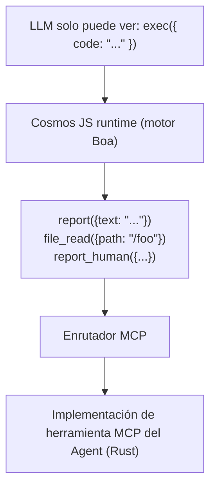
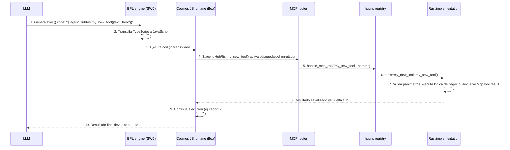

+++
title = "Tutorial de desarrollo de herramientas MCP"
description = """> Cómo crear y registrar herramientas MCP en la plataforma Entelecheia (玄枢)"""
lang = "es"
category = "guides"
subcategory = "core"
+++

# Tutorial de desarrollo de herramientas MCP

> Cómo crear y registrar herramientas MCP en la plataforma Entelecheia (玄枢)

---

## Tabla de contenidos

- [Micronúcleo Exec-Only](#micronúcleo-exec-only)
- [Estructura de herramientas MCP](#estructura-de-herramientas-mcp)
- [Añadir una nueva herramienta MCP](#añadir-una-nueva-herramienta-mcp)
- [Mejores prácticas](#mejores-prácticas)
- [Probar herramientas MCP](#probar-herramientas-mcp)

---

## Micronúcleo Exec-Only

Entelecheia utiliza una **arquitectura de micronúcleo** para el acceso a herramientas. El LLM solo puede ver tres herramientas — `exec`、`write_to_var`、`write_to_var_json` — y todo el trabajo real se realiza dentro de su tiempo de ejecución TypeScript (motor IEPL).



**Principio fundamental**: El LLM nunca invoca directamente las herramientas MCP. Genera código TypeScript que, mediante importación de módulos ES, invoca la API de funciones de herramienta (por ejemplo, `import { report } from 'hubris'; report()`), y el motor IEPL lo transpila a JavaScript y lo despacha a la implementación real en Rust.

- Importación de módulos ES — patrón general (por ejemplo, `import { report } from 'hubris'; report()`、`file_read()`)
- `exec`、`write_to_var`、`write_to_var_json` son las únicas tres herramientas registradas para todos los Agents (ver `packages/shared/domain_skills/src/tool_names.rs:265-283`)

La declaración `related_tools` en el frontmatter TOML de la skill determina qué APIs de importación de módulos ES se documentan en los prompts enviados al LLM.

---

## Estructura de herramientas MCP

Una herramienta MCP consta de tres partes:

1. **Implementación Rust** — Lógica real, ubicada en `packages/agents/<agent>/src/mcp/tools/`
1. **Despacho de Registry** — Enrutamiento, ubicado en `packages/agents/<agent>/src/mcp/registry.rs`
1. **Constantes de nombre de herramienta** — Constantes de cadena, ubicadas en `packages/shared/domain_skills/src/tool_names.rs`

### Definición de herramienta en mcp/registry.rs

Cada Agent tiene una función `handle_mcp_call` que enruta el nombre de la herramienta a su implementación correspondiente:

```rust
// packages/agents/kalos/src/mcp/registry.rs

use serde_json::Value;
use tracing::info;
use crate::{mcp::tools, state::KalosState};
use _shared::skills::{mcp_tools::McpToolResult, tool_names};

pub async fn handle_mcp_call(
    state: &std::sync::Arc<tokio::sync::RwLock<KalosState>>,
    tool_name: &str,
    parameters: Value,
) -> McpToolResult {
    info!("Calling Kalos MCP tool: {}", tool_name);

    match tool_name {
        tool_names::kalos::FILE_READ => tools::file_read(state, parameters).await,
        tool_names::kalos::FILE_WRITE => tools::file_write(state, parameters).await,
        tool_names::kalos::FILE_EDIT => tools::file_edit(state, parameters).await,
        // ...
        _ => McpToolResult::failure(format!("Unknown tool: {}", tool_name)),
    }
}
```

### Validación de parámetros con validate_required_params

Para herramientas con parámetros obligatorios, usa la función auxiliar de validación compartida:

```rust
use _shared::skills::mcp_tools::validate_required_params;

pub async fn my_tool(parameters: Value) -> McpToolResult {
    if let Some(failure) = validate_required_params(
        &parameters,
        &["title", "content"],  // Nombres de parámetros obligatorios
        "my_tool",              // Nombre de la herramienta para mensajes de error
    ) {
        return failure;
    }

    let title = parameters.get("title").unwrap().as_str().unwrap();
    // ...
}
```

`validate_required_params` verifica que cada parámetro obligatorio exista y sea una cadena no vacía. Si todos son válidos, devuelve `None`; de lo contrario, devuelve `Some(McpToolResult::failure(...))` con un mensaje de error descriptivo.

Referencia: `packages/shared/domain_skills/src/mcp_tools.rs:12-41`.

### Valor de retorno: McpToolResult

Cada herramienta debe devolver un `McpToolResult`. Constructores principales:

```rust
// Éxito con datos JSON arbitrarios
McpToolResult::success(serde_json::to_value(my_struct).unwrap_or_default())

// Éxito con una estructura serializable
McpToolResult::success_struct(&my_result)

// Éxito con texto plano
McpToolResult::success_text("Operation completed".into())

// Éxito con seguimiento de uso de LLM
McpToolResult::success_with_usage(
    "Result text".into(),
    Some("gpt-4".into()),
    Some((prompt_tokens, completion_tokens)),
)

// Fallo con mensaje de error
McpToolResult::failure("Missing required parameter: title".into())

// Fallo con múltiples errores
McpToolResult::failure_lines(vec!["Error 1".into(), "Error 2".into()])
```

Referencia: `packages/shared/domain_skills/src/mcp_tools.rs:62-136`.

---

## Añadir una nueva herramienta MCP

Esta guía paso a paso usa HubRis como ejemplo para demostrar cómo añadir una nueva herramienta a un Agent existente.

### Paso 1: Añadir constante de nombre de herramienta

Edita `packages/shared/domain_skills/src/tool_names.rs`:

```rust
/// HubRis tool names
pub mod hubris {
    pub const REPORT: &str = "report";
    pub const CREATE_TODO: &str = "create_todo";
    // ... herramientas existentes ...
    pub const MY_NEW_TOOL: &str = "my_new_tool";  // Añadir esta línea
}
```

### Paso 2: Implementar la herramienta

Crea un nuevo archivo `packages/agents/hubris/src/mcp/tools/my_new_tool.rs`:

```rust
use serde::Serialize;
use serde_json::Value;
use std::sync::Arc;
use tokio::sync::RwLock;

use crate::state::HubrisState;
use _shared::skills::mcp_tools::{validate_required_params, McpToolResult};

# [derive(Serialize, Debug, Clone)]
struct MyNewToolResult {
    id: String,
    message: String,
}

pub async fn my_new_tool(
    state: &Arc<RwLock<HubrisState>>,
    parameters: Value,
) -> McpToolResult {
    if let Some(failure) = validate_required_params(&parameters, &["text"], "my_new_tool") {
        return failure;
    }

    let text = parameters.get("text").and_then(|v| v.as_str()).unwrap();
    let id = uuid::Uuid::now_v7().to_string();

    let result = MyNewToolResult {
        id,
        message: format!("Processed: {}", text),
    };

    McpToolResult::success(serde_json::to_value(result).unwrap_or_default())
}
```

### Paso 3: Registrar en el módulo

Edita `packages/agents/hubris/src/mcp/tools/mod.rs`:

```rust
pub mod report;
pub mod todo_ops;
pub mod my_new_tool;  // Añadir esta línea
```

### Paso 4: Añadir al despacho del Registry

Edita `packages/agents/hubris/src/mcp/registry.rs`:

```rust
pub async fn handle_mcp_call(
    state: &Arc<RwLock<HubrisState>>,
    todo_store: &Option<Arc<TodoStore>>,
    tool_name: &str,
    parameters: Value,
) -> McpToolResult {
    match tool_name {
        // ... herramientas existentes ...
        tool_names::hubris::MY_NEW_TOOL => {
            crate::mcp::tools::my_new_tool::my_new_tool(state, parameters).await
        },
        _ => McpToolResult::failure(format!(
            "HubRis does not provide tool: {}",
            tool_name
        )),
    }
}
```

### Paso 5: Crear documentación de la herramienta MCP

Crea `res/prompts/agents/hubris/mcp/my_new_tool.md`:

```markdown
+++
name = "my_new_tool"
agent = "hubris"

[description]
en = "Process text and return a structured result."
zhs = "处理文本并返回结构化结果。"
+++

# my_new_tool

Process text and return a structured result.

## Parameters

- **text** (string, required): The text to process

## Returns

### Success

\`\`\`json
{ "id": "...", "message": "Processed: ..." }
\`\`\`

### Failure

\`\`\`text
Missing required parameter(s) for my_new_tool: text
\`\`\`
```

### Paso 6: Exponer mediante related_tools en la Skill

Para que el LLM sea consciente de tu herramienta, añádela al frontmatter de la Skill:

```toml
[[related_tools]]
agent_name = "hubris"
tool_name = "my_new_tool"
```

Esto inyecta la documentación de la API de la herramienta en el prompt de la Skill, permitiendo al LLM invocar `$.agent.HubRis.my_new_tool()`.

### Paso 7: Usar a través de exec (inyección de prompt)

Cuando el LLM procesa una Skill que lista `my_new_tool` en `related_tools`, genera código TypeScript:

```typescript
const result: { id: string; message: string } = await $.agent.HubRis.my_new_tool({ text: "some content to process" });
```

El motor IEPL transpila el TypeScript a JavaScript, luego el tiempo de ejecución Cosmos JS intercepta la llamada, la despacha a través del enrutador MCP a la implementación Rust y devuelve el resultado al contexto JavaScript.

### Cadena de llamada completa



---

## Mejores prácticas

### 1. Usar siempre write_to_var para salida multilínea

Al construir cadenas multilínea en código `exec`, usa `write_to_var` para evitar cadenas inline con sobrecoste excesivo de tokens:

```typescript
// No recomendado — cadenas inline grandes
exec({ code: "report({text: 'line1\\nline2\\nline3\\n...very long...'})" })

// Recomendado — construcción progresiva
exec({ code: `
  let output: string = '';
  $write_to_var('step1', 'Primera parte del contenido');
  $write_to_var('step2', 'Segunda parte del contenido');
  output = $read_var('step1') + '\\n' + $read_var('step2');
  report({text: output});
` })
```

### 2. Usar env.aporia.language para configurar el idioma de salida

Las skills que producen texto orientado al usuario deben verificar el idioma de salida configurado:

```typescript
const lang: string = env.aporia.language;  // ej. "en"、"zhs"、"ja"
const greeting: string = lang === "en" ? "Hello" : lang === "zhs" ? "你好" : "Hello";
```

El frontmatter de la skill puede declarar esta dependencia:

```toml
config = ["user_language"]
```

### 3. Usar TypeScript, siempre const/let, nunca var

Todo el código en `exec` debe usar sintaxis TypeScript:

```typescript
// Correcto
const result = file_read({path: '/src/main.rs'});
let items: string[] = result.content.split('\n');

// Incorrecto
var result = file_read({path: '/src/main.rs'});
```

### 4. Construir objetos progresivamente

Para objetos de parámetros complejos, constrúyelos progresivamente:

```typescript
let params: Record<string, unknown> = {};
params.title = "Mi Tarea";
params.description = "Descripción detallada";
params.priority = "high";

if (hasDueDate) {
    params.due_date = dueDate;
}

$.agent.HubRis.create_todo(params);
```

### 5. Reportar resultados mediante report()

Cada Skill debe llamar a `report()` al menos una vez antes de finalizar. Esta es la forma de capturar resultados y enrutarlos al siguiente paso en la cadena de skills:

```typescript
report({text: "Descomposición de tareas completada. Se encontraron 3 sub-tareas."});
```

Múltiples llamadas se agregan — todo el contenido se combina al finalizar la fase de pensamiento.

### 6. Convenciones de nomenclatura de parámetros

- Usa `snake_case` para nombres de parámetros (ej. `parent_id`、`due_date`、`workspace_id`)
- Los IDs de cadena deben usar formato UUID
- Las marcas de tiempo deben usar formato ISO 8601 / RFC 3339
- Los parámetros opcionales deben documentar valores predeterminados explícitos

### 8. Diseño de herramientas priorizando lotes IEPL (crítico)

En MCP tradicional, las herramientas son de grano fino — CPU, memoria, disco requieren herramientas separadas. En IEPL, cada ida y vuelta consume tokens LLM y latencia. **Diseña herramientas que devuelvan todos los datos relevantes en como máximo 1-2 llamadas.**

```rust
// No recomendado: tres herramientas separadas para información del dispositivo
pub const CPU_INFO: &str = "cpu_info";
pub const MEMORY_INFO: &str = "memory_info";
pub const STORAGE_INFO: &str = "storage_info";

// Recomendado: una herramienta devuelve la configuración completa del sistema
pub const SYSTEM_INFO: &str = "system_info";
// Retorna: { cpu: {...}, memory: {...}, storage: {...}, pci: [...], gpu: {...}, os: {...} }
```

Para herramientas que leen datos de fuentes externas (dispositivos, protocolos, bases de datos), acepta parámetros `scan` o `ranges` para consultas por lotes:

```typescript
// Lectura Modbus por lotes — una llamada lee múltiples rangos de registros
const result = $.agent.SkeMma.modbus_read({
  endpoint: "/dev/ttyUSB0",
  scan: [
    { register_type: "holding", start_address: 0, count: 10 },
    { register_type: "input", start_address: 100, count: 5 }
  ]
});
```

**Las herramientas de grano fino solo son aceptables** para: operaciones de escritura en direcciones específicas, o consultas donde el llamador solicita explícitamente datos de alcance estrecho.

### 7. Manejo de errores en herramientas

Devuelve mensajes de error descriptivos que ayuden al LLM a autocorregirse:

```rust
// Recomendado — específico, procesable
McpToolResult::failure("Missing required parameter(s) for create_todo: title".into())

// Recomendado — con contexto
McpToolResult::failure(format!("TODO item {} not found", id))

// No recomendado — vago
McpToolResult::failure("Error".into())
```

---

## Probar herramientas MCP

### Pruebas unitarias de herramientas individuales

Prueba cada función de herramienta directamente construyendo parámetros `Value` y verificando `McpToolResult`:

```rust
# [tokio::test]
async fn test_report_success() {
    use std::sync::Arc;
    use tokio::sync::RwLock;

    let state = Arc::new(RwLock::new(HubrisState::new()));
    let params = serde_json::json!({
        "text": "Contenido del informe de prueba"
    });

    let result = crate::mcp::tools::report::report(&state, params).await;

    assert!(result.success);
    assert!(result.data.get("summary").is_some());

    // Verificar que el estado se actualizó
    let state = state.read().await;
    assert_eq!(state.pending_reports.len(), 1);
    assert_eq!(state.pending_reports[0], "Contenido del informe de prueba");
}

# [tokio::test]
async fn test_report_empty_text() {
    let state = Arc::new(RwLock::new(HubrisState::new()));
    let params = serde_json::json!({
        "text": ""
    });

    let result = crate::mcp::tools::report::report(&state, params).await;

    assert!(!result.success);
    assert!(!result.error.is_empty());
}
```

### Probar el despacho del Registry

Prueba que el registry enrute correctamente los nombres de herramientas:

```rust
# [tokio::test]
async fn test_registry_routes_known_tool() {
    let state = Arc::new(RwLock::new(HubrisState::new()));
    let params = serde_json::json!({"text": "hello"});

    let result = handle_mcp_call(&state, &None, "report", params).await;
    assert!(result.success);
}

# [tokio::test]
async fn test_registry_rejects_unknown_tool() {
    let state = Arc::new(RwLock::new(HubrisState::new()));
    let params = serde_json::json!({});

    let result = handle_mcp_call(&state, &None, "nonexistent_tool", params).await;
    assert!(!result.success);
    assert!(result.error[0].contains("does not provide tool"));
}
```

### Probar validación de parámetros

Prueba directamente la función auxiliar `validate_required_params`:

```rust
# [test]
fn test_validate_required_params_all_present() {
    let params = serde_json::json!({"title": "test", "content": "body"});
    let result = validate_required_params(&params, &["title", "content"], "test_tool");
    assert!(result.is_none());
}

# [test]
fn test_validate_required_params_missing() {
    let params = serde_json::json!({"title": "test"});
    let result = validate_required_params(&params, &["title", "content"], "test_tool");
    assert!(result.is_some());
    let failure = result.unwrap();
    assert!(!failure.success);
    assert!(failure.error[0].contains("content"));
}

# [test]
fn test_validate_required_params_empty_string() {
    let params = serde_json::json!({"title": ""});
    let result = validate_required_params(&params, &["title"], "test_tool");
    assert!(result.is_some());
}
```

### Probar con almacén de base de datos

Para herramientas que dependen de un almacén de base de datos, se suele probar con una base de datos en memoria o de prueba:

```rust
# [tokio::test]
async fn test_create_todo_success() {
    // Configuración: crear TodoStore de prueba (depende de infraestructura de prueba)
    let todo_store = create_test_store().await;
    let params = serde_json::json!({
        "title": "Tarea de prueba",
        "workspace_id": test_workspace_id.to_string()
    });

    let result = create_todo(&todo_store, params).await;

    assert!(result.success);
    let id = result.data.get("id").unwrap().as_str().unwrap();
    assert!(!id.is_empty());
    assert_eq!(result.data.get("title").unwrap().as_str(), Some("Tarea de prueba"));
}
```

### Ejecutar pruebas

```bash
# Ejecutar todas las pruebas
just test

# Ejecutar pruebas de un crate de Agent específico
cargo test -p hubris
cargo test -p kalos

# Ejecutar una prueba específica
cargo test -p hubris test_report_success

# Ejecutar con salida
cargo test -p hubris -- --nocapture
```

---

## Referencia rápida: archivos clave

| Propósito | Ruta |
| --- | --- |
| Definición de `McpToolResult` | `packages/shared/domain_skills/src/mcp_tools.rs` |
| `validate_required_params` | `packages/shared/domain_skills/src/mcp_tools.rs:12-41` |
| Constantes de nombre de herramienta | `packages/shared/domain_skills/src/tool_names.rs` |
| `agent_allowed_tools()` | `packages/shared/domain_skills/src/tool_names.rs:166-169` |
| HubRis MCP registry | `packages/agents/hubris/src/mcp/registry.rs` |
| Herramienta report de HubRis | `packages/agents/hubris/src/mcp/tools/report.rs` |
| Herramientas TODO CRUD de HubRis | `packages/agents/hubris/src/mcp/tools/todo_ops.rs` |
| KaLos MCP registry | `packages/agents/kalos/src/mcp/registry.rs` |
| Ejemplos de documentación de herramientas MCP | `res/prompts/agents/hubris/mcp/` |
| Ejemplos de prompts de Skill | `res/prompts/agents/hubris/skills/` |
