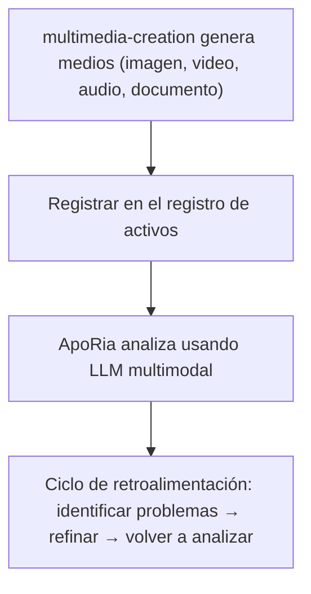

# Pipeline multimodal

> **⚠️ Referencia de Agent archivado — no está en el pipeline de desarrollo**
> El Agent Layer2 `multimedia-creation` al que hace referencia este documento ha sido **archivado**. Su código Rust, enlaces `.d.ts` y registro de Agent han sido eliminados. El pipeline multimodal descrito aquí es un **objetivo de diseño**, no una funcionalidad entregada. A menos que un desarrollador lo solicite explícitamente, no implementes ni planifiques trabajo en este pipeline.
> Usar multimedia-creation y ApoRia para generar, registrar y analizar medios
> Nota de estado actual: Este documento describe principalmente flujos de trabajo objetivo. En la base de código actual existen herramientas relacionadas con multimodal en ApoRia, pero aún no alcanzan completamente el registro de activos centralizado y las capacidades de ciclo cerrado completo que se describen a continuación.

---

## Tabla de contenidos

- [Descripción general](#descripción-general)
- [Registro de activos](#registro-de-activos)
- [Herramientas de generación](#herramientas-de-generación)
- [Registro](#registro)
- [Análisis multimodal](#análisis-multimodal)
- [Ciclo de revisión](#ciclo-de-revisión)
- [Documentos Office](#documentos-office)
- [Ejemplo completo](#ejemplo-completo)

---

## Descripción general

Entelecheia (玄枢) actualmente contiene módulos básicos relacionados con multimodal, especialmente herramientas tempranas del lado de ApoRia. Pero lo que se describe aquí — multimedia-creation → registro centralizado de activos → ciclo cerrado de revisión multimodal — es más apropiado considerarlo como diseño objetivo que como estado completo actual.



---

## Registro de activos

El registro de activos es un almacén centralizado de metadatos de medios gestionado por ApoRia. Realiza seguimiento de:

- Rutas de archivo y ubicaciones de almacenamiento
- Tipo MIME
- Metadatos de generación (prompt, parámetros, marca de tiempo)
- Historial de análisis y puntuaciones de calidad

### Flujo de trabajo de registro / recuperación

```typescript
const asset = $.agent.ApoRia.media_asset_register({
  file_path: "/output/marketing-banner.png",
  mime_type: "image/png",
  metadata: {
    prompt: "Un horizonte urbano futurista al atardecer",
    generator: "multimedia-creation",
    model: "stable-diffusion-xl"
  }
});

const asset_id: string = asset.id;

const retrieved = $.agent.ApoRia.media_asset_retrieve({
  asset_id: asset_id
});
```

---

## Herramientas de generación

multimedia-creation proporciona herramientas de generación para varios tipos de medios. Todas las herramientas se invocan mediante `$multimedia-creation.<tool>()` en código exec.

### Generación de imágenes

```typescript
$multimedia-creation.image_generate({
  prompt: "Un horizonte urbano futurista al atardecer, estilo cyberpunk",
  width: 1024,
  height: 512,
  model: "stable-diffusion-xl",
  output_path: "/output/city-skyline.png"
});
```

### Generación de video

```typescript
$multimedia-creation.video_generate({
  prompt: "Cámara desplazándose por un paisaje montañoso a la hora dorada",
  duration_seconds: 10,
  fps: 24,
  resolution: "1080p",
  output_path: "/output/mountain-pan.mp4"
});
```

### Generación de audio

```typescript
$multimedia-creation.audio_generate({
  prompt: "Música electrónica ambiental de fondo, tranquila y atmosférica",
  duration_seconds: 30,
  format: "mp3",
  output_path: "/output/ambient-bg.mp3"
});
```

### Generación de documentos

```typescript
$multimedia-creation.doc_generate({
  template: "technical-report",
  title: "Análisis de rendimiento Q4",
  content: report_markdown,
  format: "docx",
  output_path: "/output/q4-report.docx"
});
```

### Generación de hojas de cálculo

```typescript
$multimedia-creation.sheet_generate({
  title: "Previsión presupuestaria 2025",
  data: budget_data,
  format: "xlsx",
  output_path: "/output/budget-2025.xlsx"
});
```

### Generación de diapositivas

```typescript
$multimedia-creation.slide_generate({
  title: "Presentación de hoja de ruta del producto",
  sections: slide_sections,
  format: "pptx",
  output_path: "/output/roadmap.pptx"
});
```

---

## Registro

Después de generar medios, regístralos en el registro de activos para que ApoRia pueda analizarlos:

```typescript
const result = $multimedia-creation.image_generate({
  prompt: "Foto hero del producto sobre fondo blanco",
  width: 1920,
  height: 1080,
  output_path: "/output/hero-shot.png"
});

const asset = $.agent.ApoRia.media_asset_register({
  file_path: result.output_path,
  mime_type: "image/png",
  metadata: {
    prompt: "Foto hero del producto sobre fondo blanco",
    generator: "multimedia-creation",
    dimensions: "1920x1080"
  }
});

const asset_id: string = asset.id;
```

---

## Análisis multimodal

ApoRia proporciona análisis multimodal a través de `$.agent.ApoRia.multimodal_chat()`. Pasa uno o más IDs de activo junto con un prompt de texto:

```typescript
const analysis = $.agent.ApoRia.multimodal_chat({
  prompt: "Analiza esta imagen en cuanto a composición, equilibrio de color y jerarquía visual. Califica cada aspecto del 1 al 10.",
  asset_ids: [asset_id]
});
```

### Analizar múltiples activos

```typescript
const comparison = $.agent.ApoRia.multimodal_chat({
  prompt: "Compara estas dos variaciones de diseño. ¿Cuál tiene mejor equilibrio visual y por qué?",
  asset_ids: [variant_a_id, variant_b_id]
});
```

### Análisis con contexto

```typescript
const context_analysis = $.agent.ApoRia.multimodal_chat({
  prompt: "¿Coincide esta imagen con las directrices de marca? Directrices: color primario azul (#0066CC), diseño limpio, tipografía sans-serif.",
  asset_ids: [asset_id]
});
```

---

## Ciclo de revisión

El pipeline multimodal admite ciclos de revisión iterativos:

1. **Generar** — multimedia-creation crea el medio inicial
1. **Registrar** — almacenar en el registro de activos
1. **Analizar** — ApoRia evalúa el medio usando LLM multimodal
1. **Identificar problemas** — extraer puntos de mejora específicos del análisis
1. **Refinar** — multimedia-creation ajusta parámetros y regenera según la retroalimentación
1. **Reanalizar** — ApoRia evalúa la salida refinada

### Ejemplo de ciclo de revisión en código exec

```typescript
let iteration: number = 0;
const max_iterations: number = 3;
const quality_threshold: number = 8.0;
let current_prompt: string = "Un sereno lago de montaña al amanecer, fotorrealista";

while (iteration < max_iterations) {
  iteration++;

  const gen_result = $multimedia-creation.image_generate({
    prompt: current_prompt,
    width: 1024,
    height: 768,
    output_path: `/output/lake-v${iteration}.png`
  });

  const asset = $.agent.ApoRia.media_asset_register({
    file_path: gen_result.output_path,
    mime_type: "image/png",
    metadata: { prompt: current_prompt, iteration: iteration }
  });

  const analysis = $.agent.ApoRia.multimodal_chat({
    prompt: "Califica esta imagen en composición (1-10), armonía de color (1-10) y calidad general (1-10). Proporciona sugerencias de mejora específicas.",
    asset_ids: [asset.id]
  });

  const overall_score: number = analysis.data.overall_quality;

  if (overall_score >= quality_threshold) {
    report({ text: `Umbral de calidad alcanzado en iteración ${iteration}. Puntuación: ${overall_score}` });
    break;
  }

  const suggestions = analysis.data.improvement_suggestions;
  current_prompt = current_prompt + ". " + suggestions.join(". ");

  if (iteration === max_iterations) {
    report({ text: `Máximo de iteraciones alcanzado. Puntuación final: ${overall_score}` });
  }
}
```

---

## Documentos Office

multimedia-creation puede generar documentos compatibles con Office:

### Documentos Word (`doc_generate`)

Genera archivos `.docx` desde Markdown o contenido estructurado. Admite plantillas para tipos de documentos comunes:

- Informes técnicos
- Actas de reuniones
- Propuestas

```typescript
$multimedia-creation.doc_generate({
  template: "meeting-notes",
  title: "Planificación de Sprint - Semana 12",
  content: meeting_content,
  format: "docx",
  output_path: "/output/sprint-12-notes.docx"
});
```

### Hojas de cálculo Excel (`sheet_generate`)

Genera archivos `.xlsx` con datos estructurados, fórmulas y formato:

```typescript
$multimedia-creation.sheet_generate({
  title: "Ingresos mensuales",
  data: revenue_data,
  format: "xlsx",
  output_path: "/output/revenue.xlsx"
});
```

### Presentaciones PowerPoint (`slide_generate`)

Genera archivos `.pptx` con secciones, viñetas e inserción opcional de imágenes:

```typescript
$multimedia-creation.slide_generate({
  title: "Revisión trimestral del negocio",
  sections: [
    { title: "Ingresos", bullets: ["Q1: $1.2M", "Q2: $1.5M"] },
    { title: "Objetivos", bullets: ["Lanzar v2.0", "Expandir a APAC"] }
  ],
  format: "pptx",
  output_path: "/output/qbr.pptx"
});
```

---

## Ejemplo completo

Este ejemplo demuestra el pipeline completo: generar una imagen de marketing, registrarla, analizarla y refinarla.

### Paso 1: Generar imagen inicial

```typescript
const gen = $multimedia-creation.image_generate({
  prompt: "Una maqueta moderna de panel de control SaaS, UI limpia, esquema de color azul y blanco",
  width: 1920,
  height: 1080,
  output_path: "/output/dashboard-v1.png"
});
```

### Paso 2: Registrar activo

```typescript
const asset = $.agent.ApoRia.media_asset_register({
  file_path: gen.output_path,
  mime_type: "image/png",
  metadata: {
    prompt: "Maqueta de panel SaaS",
    purpose: "marketing",
    version: 1
  }
});
```

### Paso 3: Analizar composición

```typescript
const analysis = $.agent.ApoRia.multimodal_chat({
  prompt: "Analiza esta maqueta de panel en cuanto a: 1) Jerarquía visual, 2) Consistencia de color, 3) Legibilidad de elementos de datos. Proporciona una puntuación (1-10) para cada uno y sugerencias específicas de mejora.",
  asset_ids: [asset.id]
});
```

### Paso 4: Refinar según retroalimentación

```typescript
const refined = $multimedia-creation.image_generate({
  prompt: "Una maqueta moderna de panel de control SaaS, UI limpia, esquema de color azul y blanco. " + analysis.data.suggestions.join(". "),
  width: 1920,
  height: 1080,
  output_path: "/output/dashboard-v2.png"
});
```

### Paso 5: Registrar y reanalizar

```typescript
const refined_asset = $.agent.ApoRia.media_asset_register({
  file_path: refined.output_path,
  mime_type: "image/png",
  metadata: {
    prompt: "Maqueta de panel SaaS (refinada)",
    purpose: "marketing",
    version: 2,
    previous_version: asset.id
  }
});

const final_analysis = $.agent.ApoRia.multimodal_chat({
  prompt: "Compara esta versión refinada con la original. ¿Ha mejorado la jerarquía visual? Califica la calidad general del 1 al 10.",
  asset_ids: [asset.id, refined_asset.id]
});

report({
  text: `Pipeline de imagen de marketing completado. Puntuación inicial: ${analysis.data.overall_score}, Puntuación refinada: ${final_analysis.data.overall_score}`
});
```

---

## Siguientes pasos

- Lee la [Guía de fundamentos](fundamentals.md) para detalles sobre los Agents multimedia-creation y ApoRia
- Explora la [Arquitectura](architecture.md) para una visión general completa del sistema de Agents
- Configura la [Integración Webhook](webhook-setup.md) para activar la generación desde eventos externos
