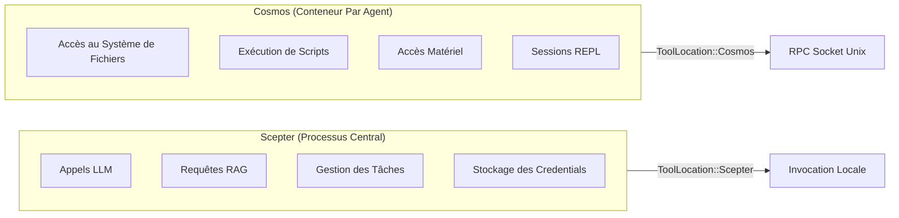
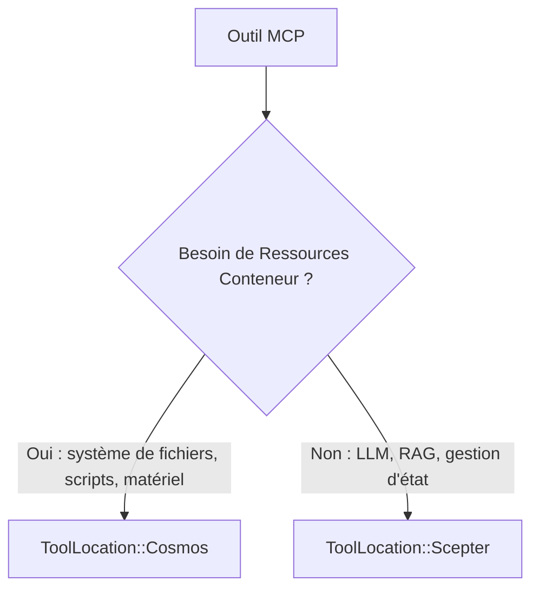
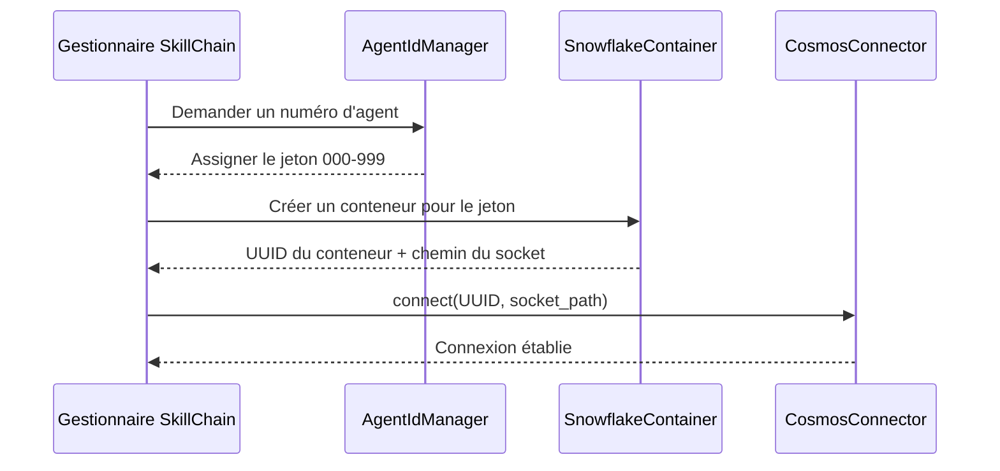
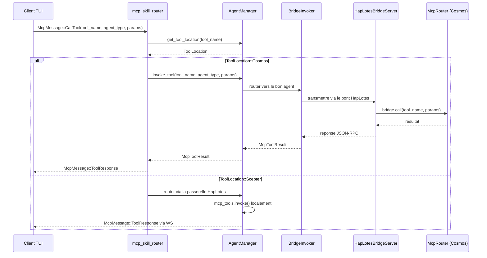
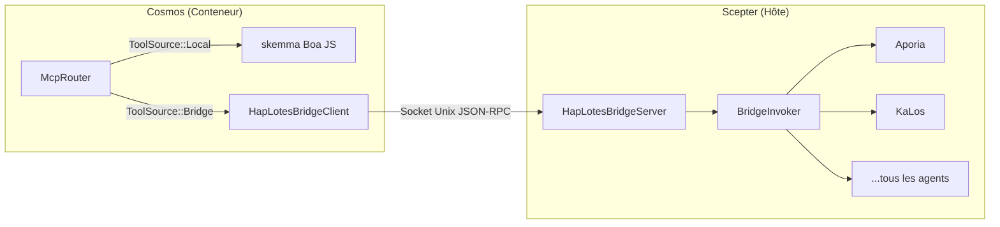
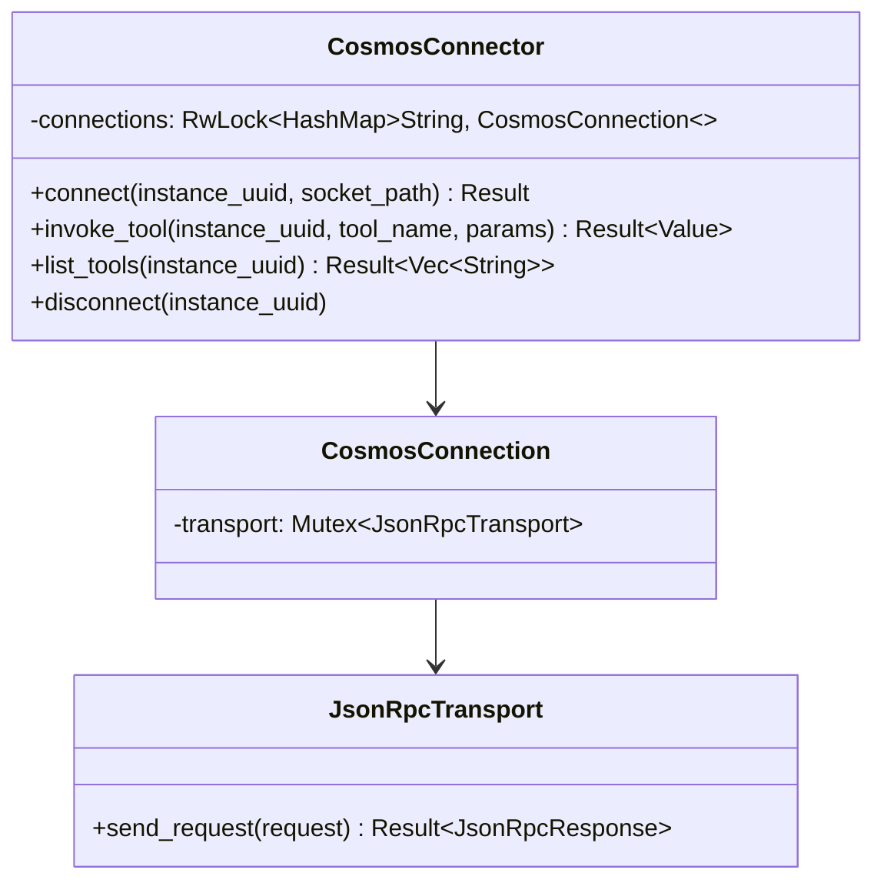
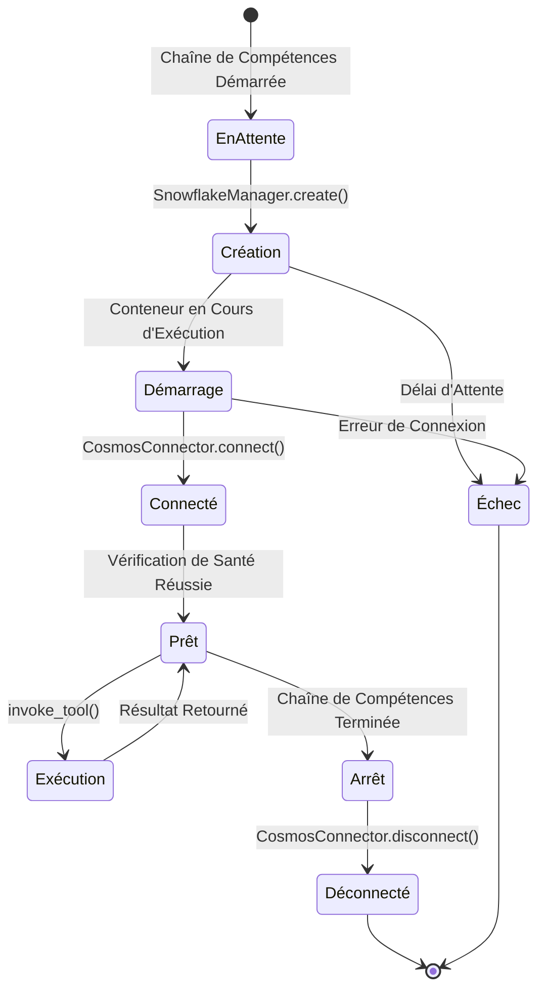
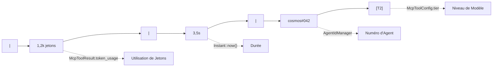
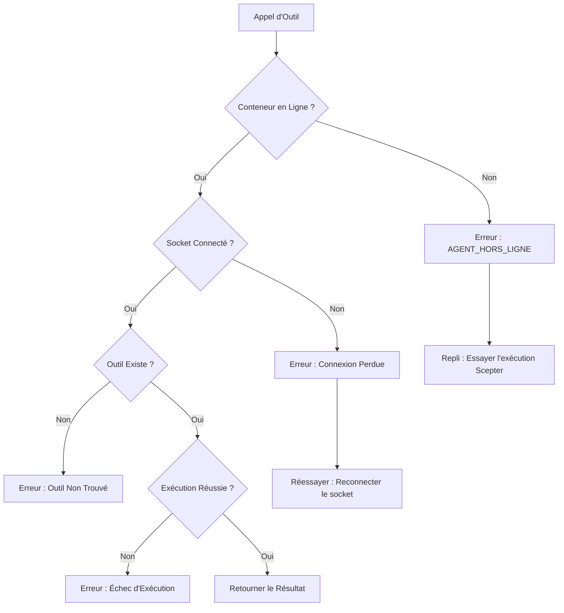

+++
title = "Conception de l'Ordonnancement de Conteneurs et du Routage de Jetons Cosmos"
description = """Ce document décrit l'architecture d'ordonnancement des conteneurs Cosmos : comment les outils MCP marqués avec `ToolLocation::Cosmos` sont routés via JSON-RPC sur socket Unix vers leurs conteneurs"""
lang = "fr"
category = "design"
subcategory = "core"
+++

# Conception de l'Ordonnancement de Conteneurs et du Routage de Jetons Cosmos

## Aperçu

Ce document décrit l'architecture d'ordonnancement des conteneurs Cosmos : comment les outils MCP marqués avec `ToolLocation::Cosmos` sont routés via JSON-RPC sur socket Unix vers leurs conteneurs correspondants, et comment le système de jetons (numéro d'agent) s'articule avec l'identité et le routage des conteneurs.

## I. Modèle de Localisation des Outils

### Double Environnement d'Exécution



### Énumération ToolLocation

| Variante | Site d'Exécution | Transport |
| --- | --- | --- |
| `Scepter` (par défaut) | En processus via `McpToolInvoker` | Appel de fonction direct |
| `Cosmos` | En conteneur via `CosmosConnector` | JSON-RPC socket Unix |

### Critères de Décision de Localisation



Les outils qui nécessitent des ressources de conteneur (système de fichiers, exécution de scripts, accès matériel) sont marqués `Cosmos`. Les services centralisés (LLM, RAG, gestion des tâches, interaction humaine) restent `Scepter`.

## II. Système de Jetons et Identité de Conteneur

### Allocation de Numéro d'Agent



### Propriétés du Jeton

| Propriété | Description |
| --- | --- |
| Format | Nombre à trois chiffres : `000`-`999` |
| Allocateur | `AgentIdManager` dans la chaîne de compétences |
| Liaison | Un jeton par panneau de chaîne de compétences |
| Affichage | Affiché dans la ligne de statistiques TUI comme `cosmos#NNN` |
| Persistance | Survit aux redémarrages d'agent |

## III. Flux de Routage des Requêtes

### Appel MCP Initié par TUI



### Logique de Routage Clé

La décision de routage se produit dans `mcp_skill_router.rs` :

1. Vérifier `agent_manager.get_tool_location(tool_name)`
1. Si `ToolLocation::Cosmos` et mode conteneurisé actif :

   - Appeler `agent_manager.invoke_tool()` qui route via `BridgeInvoker` → pont HapLotes → `McpRouter` de Cosmos
   - Le `McpRouter` de Cosmos distribue localement (skemma) ou retourne à Scepter via le pont pour les agents distants
   - Retourner `McpMessage::ToolResponse` directement à TUI

1. Sinon : router via la passerelle HapLotes vers le processus de l'agent

## IV. Architecture CosmosConnector / Pont

### Pont HapLotes (Actuel)

Le pont HapLotes est le **seul canal de communication** entre Scepter et les conteneurs Cosmos.



### Pool de Connexions (CosmosConnector — côté Scepter)



### Protocole JSON-RPC

Tous les noms de méthode utilisent l'énumération `UnixMethod` pour la sécurité de type à la compilation :

| Variante UnixMethod | Direction | Paramètres |
| --- | --- | --- |
| `UnixMethod::McpCall` | Scepter → Cosmos | `{ tool_name, parameters }` |
| `UnixMethod::McpListTools` | Scepter → Cosmos | Aucun |
| `UnixMethod::ReplSnapshot` | Scepter → Cosmos | `{ path }` |
| `UnixMethod::ReplRestore` | Scepter → Cosmos | `{ path }` |
| `UnixMethod::BridgeCall` | Cosmos → Scepter | `{ tool_name, parameters }` |
| `UnixMethod::BridgeListTools` | Cosmos → Scepter | Aucun |

### Format de Réponse

```json
{
  "success": true,
  "data": { ... },
  "error": null
}
```

## V. Cycle de Vie du Conteneur



### Agents de Conteneur

À l'intérieur des conteneurs Cosmos, seul skemma s'exécute localement (moteur Boa JS). Tous les autres outils d'agent passent par le pont HapLotes vers Scepter :

| Agent | Rôle | Dans Cosmos ? |
| --- | --- | --- |
| SkeMma | Exécution de scripts (Boa JS) | **Local** (en processus) |
| Aporia | Chat LLM | Via pont → Scepter |
| KaLos | E/S Fichier | Via pont → Scepter |
| NeiKos | Gestion de conteneurs | Via pont → Scepter |
| EleOs | Recherche web | Via pont → Scepter |
| Tous les autres | Divers | Via pont → Scepter |

## VI. Intégration de la Ligne de Statistiques

### Format d'Affichage

Dans la TUI `AgentDetailPage`, la ligne de statistiques affiche :



| Segment | Source |
| --- | --- |
| `1,2k jetons` | `McpToolResult.token_usage` |
| `3,5s` | Durée depuis `Instant::now()` |
| `cosmos#042` | Numéro d'agent depuis `AgentIdManager` |
| `[T2]` | Niveau de modèle depuis `McpToolConfig.tier` |

## VII. Gestion des Erreurs

### Modes de Défaillance



### Dégradation Gracieuse

Lorsque le conteneur est indisponible, le système peut optionnellement revenir à l'exécution locale `Scepter` si l'outil a une implémentation locale enregistrée.

## VIII. Extensions Futures

| Fonctionnalité | Description | Priorité |
| --- | --- | --- |
| Pool de conteneurs | Réutiliser les conteneurs entre les chaînes de compétences | Moyenne |
| Surveillance de santé | Vérifications de santé périodiques des conteneurs | Haute |
| Limites de ressources | Limites CPU/mémoire par conteneur | Haute |
| Outils multi-conteneurs | Outils couvrant plusieurs conteneurs | Basse |
| Migration de conteneurs | Déplacer les conteneurs en cours d'exécution entre hôtes | Basse |
