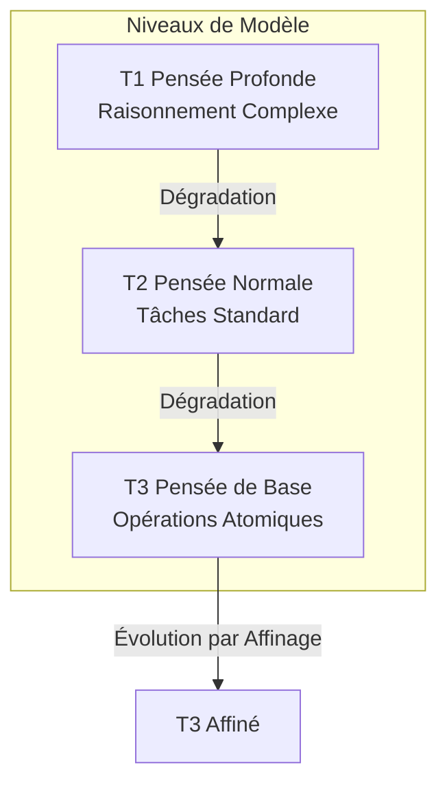
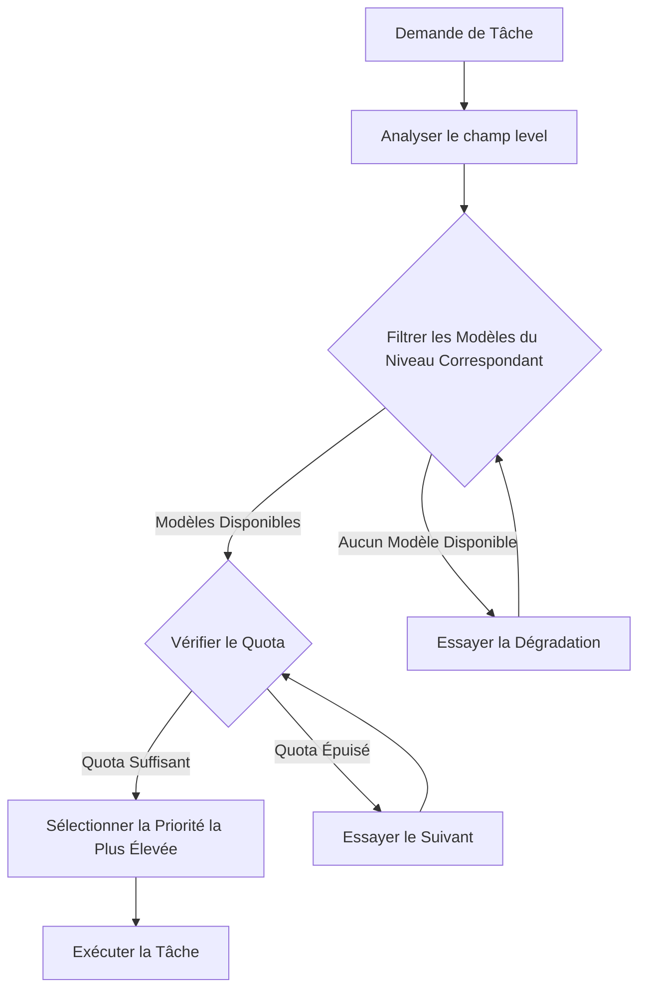
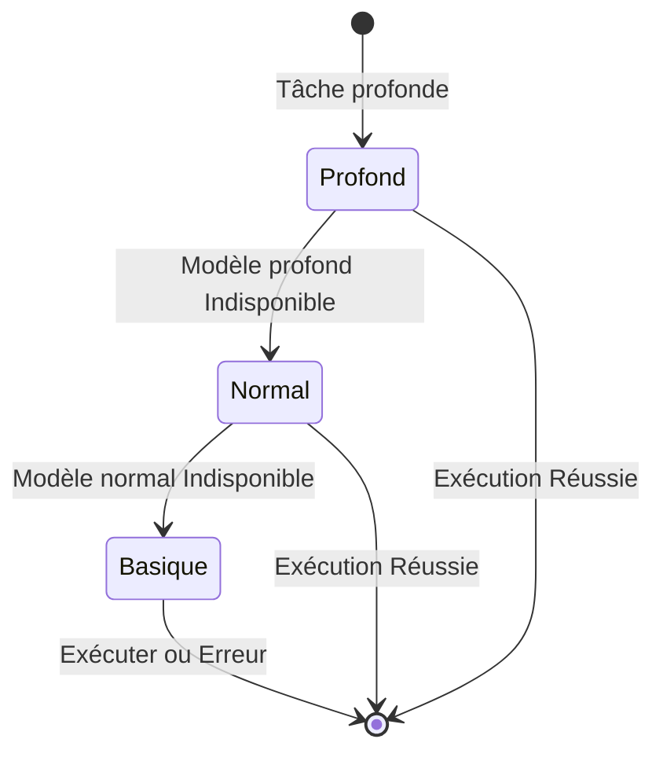
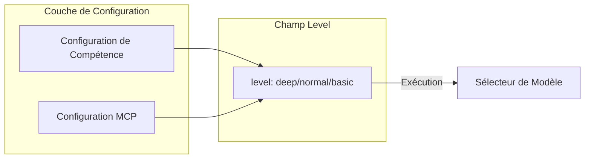
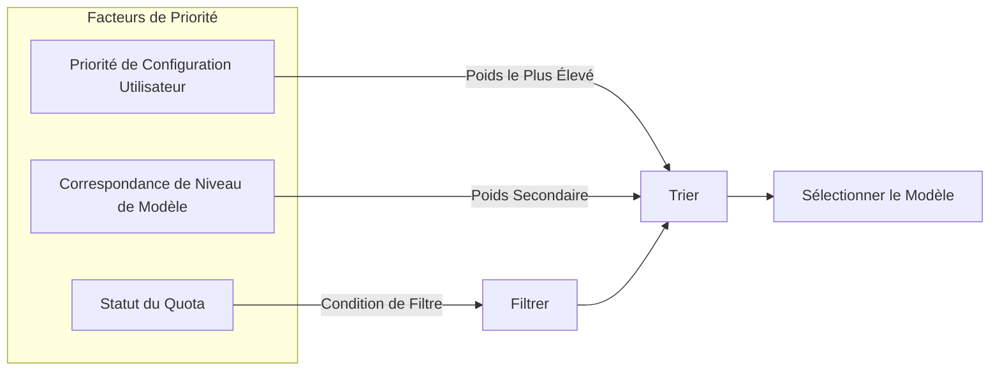
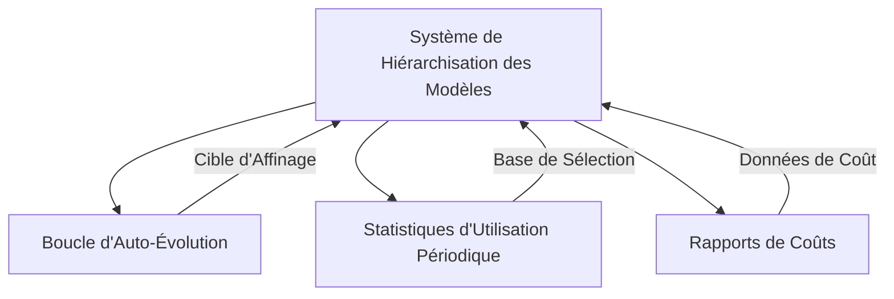

+++
title = "Conception du Système de Hiérarchisation des Modèles"
description = """Le Système de Hiérarchisation des Modèles est un mécanisme de sélection intelligente de modèles qui attribue des niveaux de modèle appropriés en fonction de la complexité de la tâche, maximisant l'util"""
lang = "fr"
category = "design"
subcategory = "core"
+++

# Conception du Système de Hiérarchisation des Modèles

## Aperçu

Le Système de Hiérarchisation des Modèles est un mécanisme de sélection intelligente de modèles qui attribue des niveaux de modèle appropriés en fonction de la complexité de la tâche, maximisant l'utilisation des ressources tout en garantissant la qualité.

> **Document Associé** : Le système de modèles à trois niveaux défini dans ce document est le fondement du [Système de Boucle d'Auto-Évolution](04-self-evolution-loop.md).

## Principes Fondamentaux

### Système de Modèles à Trois Niveaux

### Comparaison des Niveaux

| Niveau | Positionnement | Coût | Scénarios Typiques |
| --- | --- | --- | --- |
| T1 (profond) | Raisonnement complexe, décisions | Le plus élevé | Conception d'architecture, analyse de problèmes |
| T2 (normal) | Tâches standard | Moyen | Écriture de code, génération de documents |
| T3 (basique) | Opérations atomiques | Le plus bas | Lecture de fichiers, conversion de format |

## Mécanisme de Sélection de Modèle

### Processus de Sélection

### Stratégie de Dégradation

## Mécanisme de Configuration

### Annotation de Niveau Compétence/MCP

Chaque Compétence et outil MCP déclare le niveau de modèle requis via le champ `level` :

### Contrôle de Priorité

## Relation avec les Autres Modules

## Considérations de Conception

### Optimisation des Coûts

- Prioriser les modèles de niveau inférieur
- La dégradation automatique évite l'échec de la tâche
- Alertes de surveillance du quota

### Assurance Qualité

- Les tâches complexes nécessitent un niveau élevé
- La dégradation nécessite une validation de faisabilité
- Nouvel essai automatique en cas d'échec

### Extensibilité

- Prise en charge des niveaux personnalisés
- Configuration de priorité flexible
- Stratégies de sélection enfichables
