+++
title = "Conception du Système de Statistiques de Période d'Utilisation"
description = """Le Système de Statistiques de Période d'Utilisation gère et suit l'utilisation des jetons LLM en fonction des périodes de temps, prenant en charge plusieurs types de périodes (5 heures, 7 jours, 30 j"""
lang = "fr"
category = "design"
subcategory = "core"
+++

# Conception du Système de Statistiques de Période d'Utilisation

## Aperçu

Le Système de Statistiques de Période d'Utilisation gère et suit l'utilisation des jetons LLM en fonction des périodes de temps, prenant en charge plusieurs types de périodes (5 heures, 7 jours, 30 jours, personnalisé), fournissant une base de données pour le contrôle des coûts et la gestion des quotas.

## Principes Fondamentaux

### Agrégation par Fenêtre Temporelle

Le système utilise un mécanisme d'agrégation par fenêtre glissante pour calculer les statistiques d'utilisation en temps réel pour toute plage temporelle via des vues de base de données :

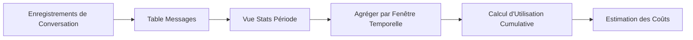

### Flux de Données

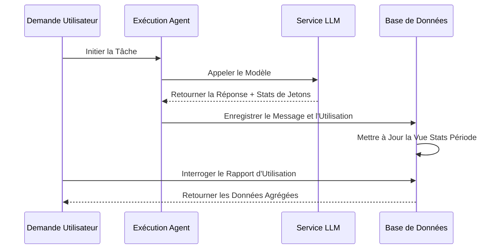

## Types de Périodes

| Type de Période | Durée | Utilisation Typique |
| --- | --- | --- |
| Court terme | 5 heures | Développement itératif rapide |
| Moyen terme | 7 jours | Contrôle de quota hebdomadaire |
| Long terme | 30 jours | Comptabilité mensuelle des coûts |
| Personnalisé | Quelconque | Besoins métier flexibles |

## Conception de l'Architecture

### Architecture d'Agrégation par Vue

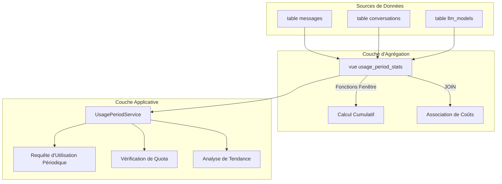

### Logique de Calcul Centrale

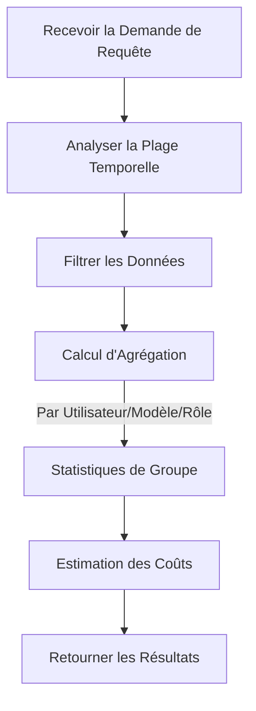

## Mécanisme de Contrôle de Quota

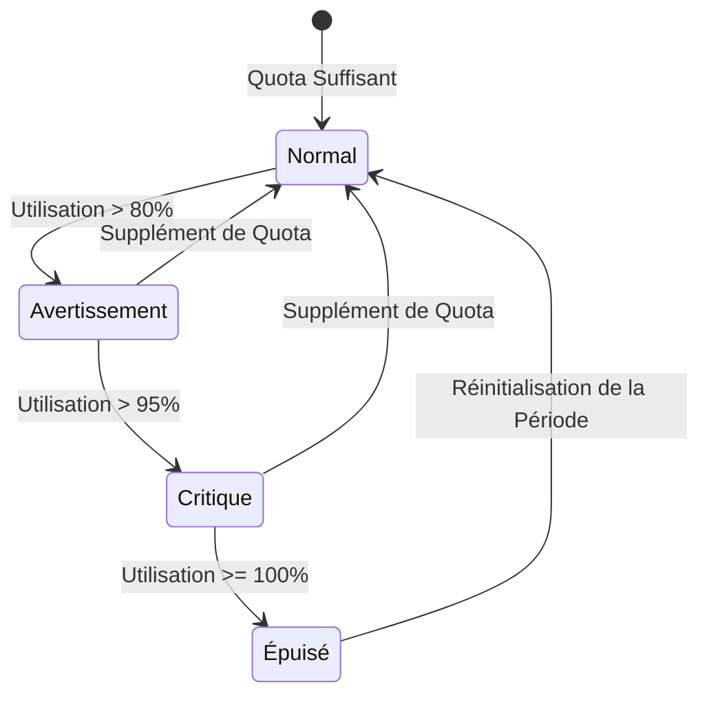

## Relation avec les Autres Modules

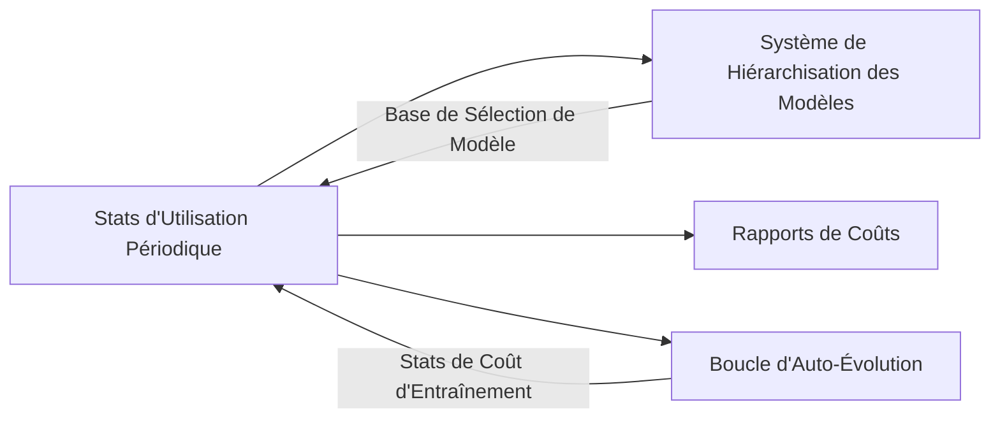

## Considérations de Conception

### Optimisation des Performances

- Utiliser des vues de base de données pour la pré-agrégation
- Les fonctions fenêtre évitent les calculs redondants
- Les index temporels accélèrent les requêtes de plage

### Extensibilité

- Prise en charge de nouveaux types de périodes
- Dimensions d'agrégation extensibles
- Modèles de calcul de coûts flexibles

### Cohérence des Données

- Les vues en lecture seule garantissent l'intégrité des données
- Les horodatages utilisent UTC uniformément
- Les transactions garantissent l'atomicité d'écriture

# Conception du Flux de Configuration LLM

## Aperçu

Ce document décrit le flux complet permettant aux utilisateurs de configurer les Fournisseurs LLM, incluant l'interaction avec l'interface de configuration, la transmission de données, le traitement côté serveur et l'utilisation en conversation.

## Architecture du Flux de Configuration

### Flux Global

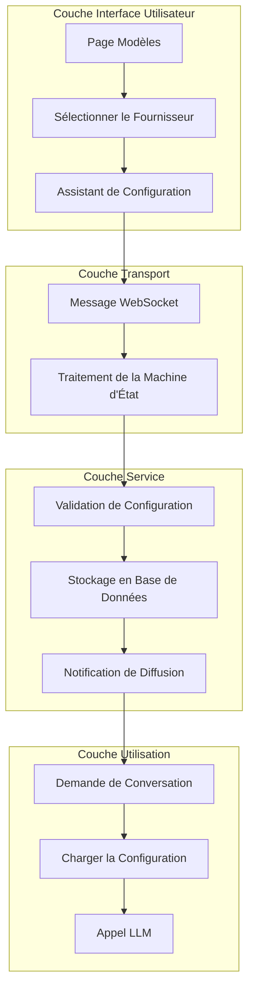

## Flux de Configuration du Fournisseur

### Séquence d'Étapes de Configuration

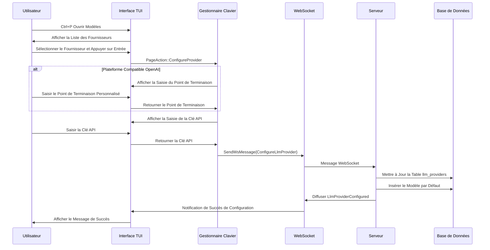

### Machine d'État de Configuration

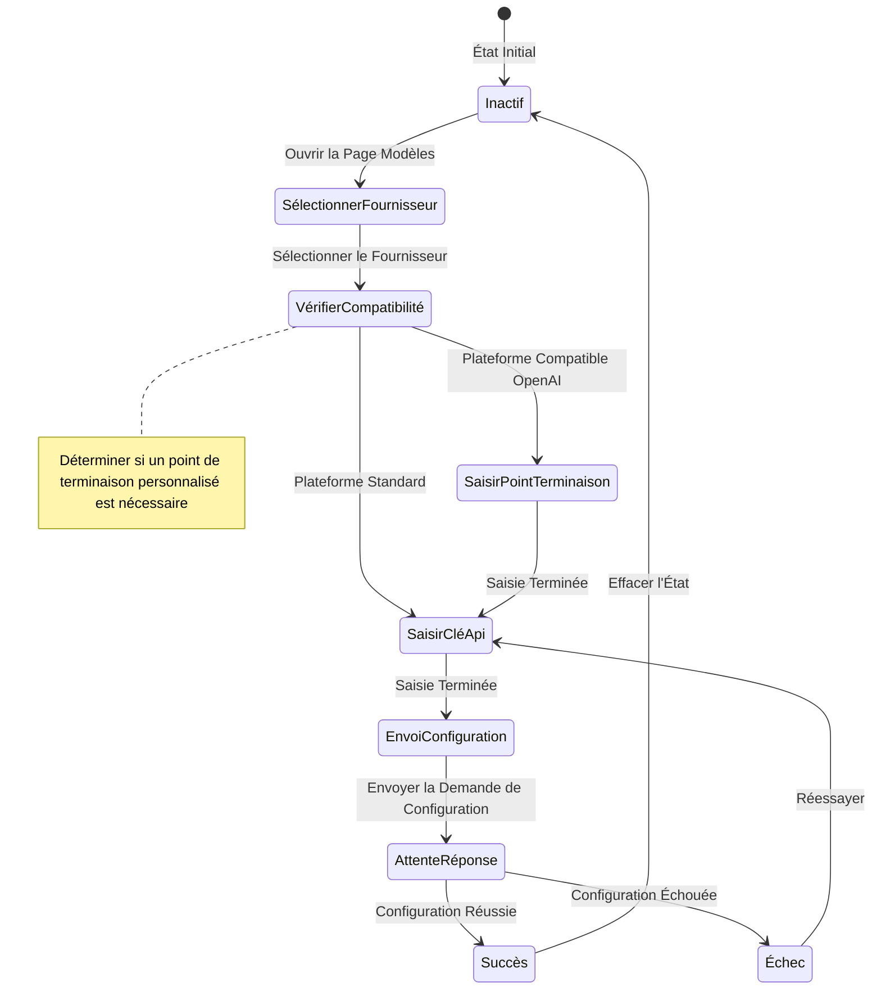

## Flux d'Utilisation en Conversation

### Séquence d'Appel LLM

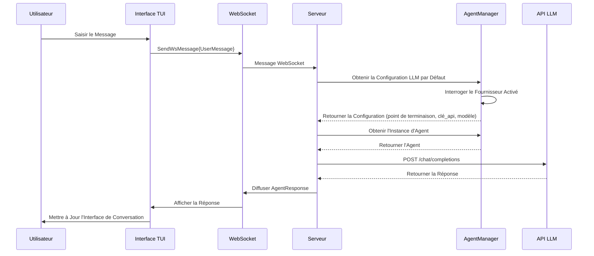

## Décisions de Conception Clés

### Flux de Configuration en Deux Étapes

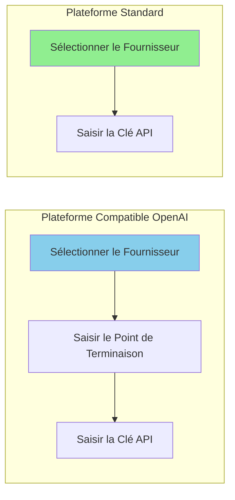

| Type de Plateforme | Étapes de Configuration | Raison |
| --- | --- | --- |
| Compatible OpenAI | Point de Terminaison + Clé API | Besoin d'un point de terminaison de service personnalisé |
| Plateforme Standard | Clé API Uniquement | Utiliser le point de terminaison officiel |

### Gestion de l'État de Configuration

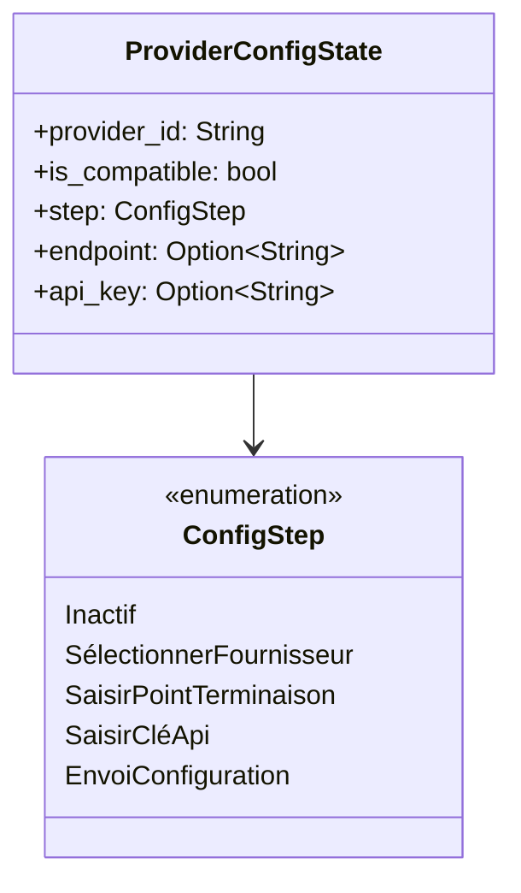

### Auto-insertion du Modèle par Défaut

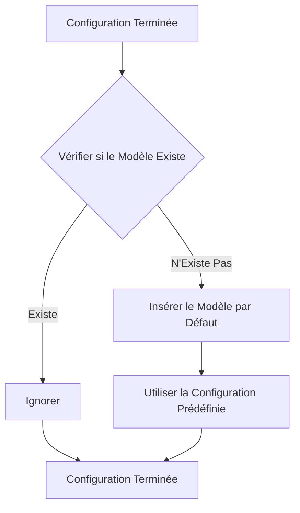

## Optimisation des Performances

### Stratégie de Cache de Configuration

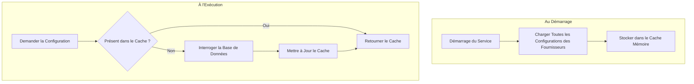

### Gestion du Pool de Connexions

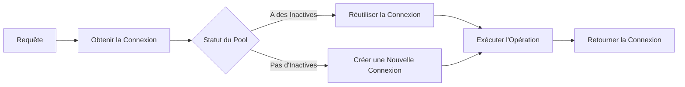

## Gestion des Erreurs

### Validation des Entrées Utilisateur

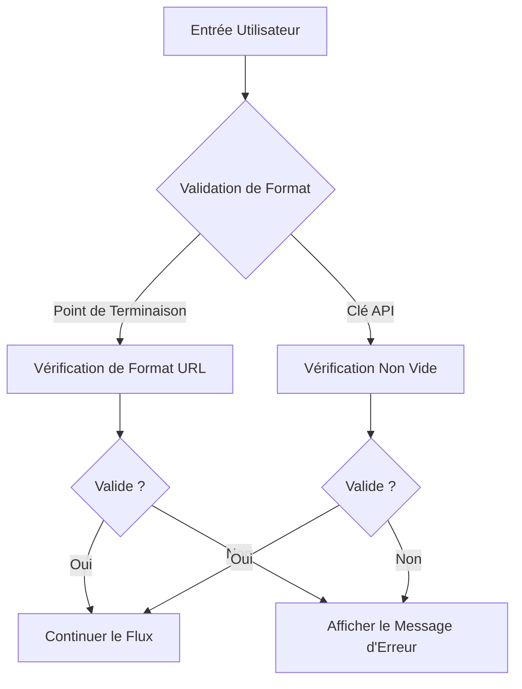

### Gestion des Erreurs Réseau

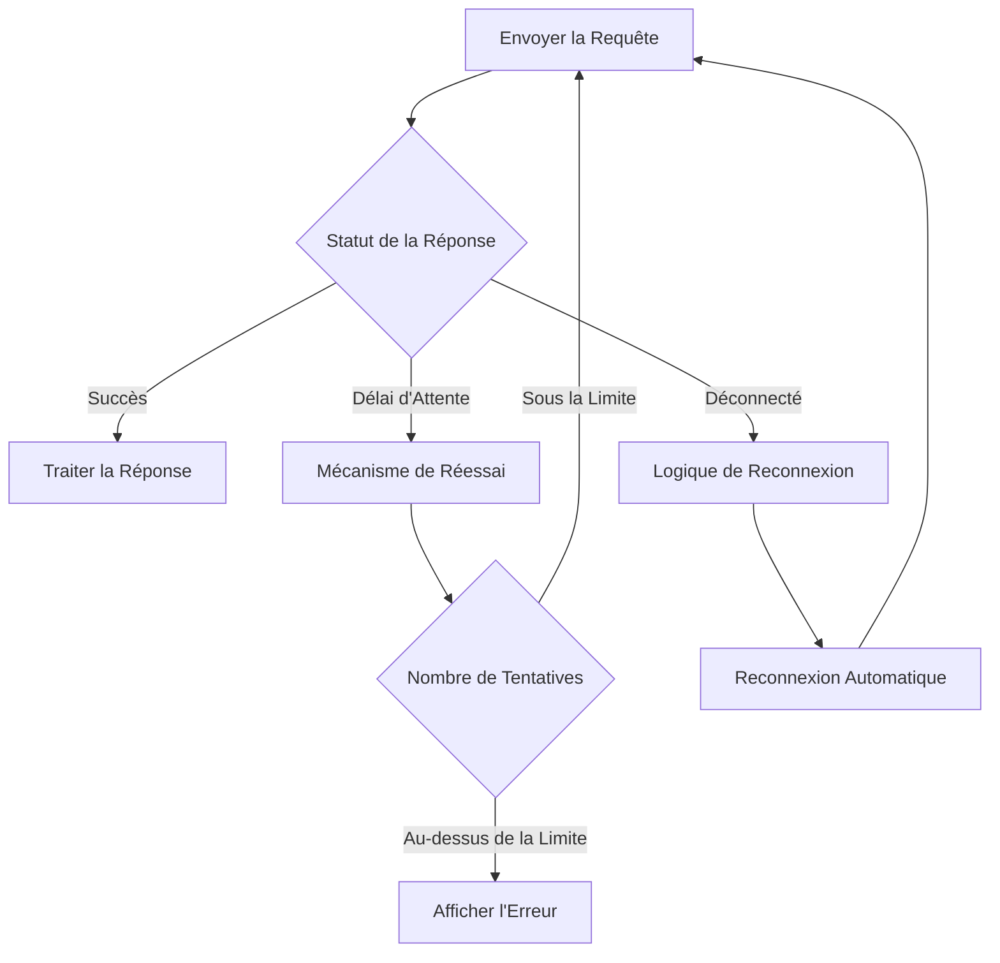

## Considérations de Sécurité

### Protection de la Clé API

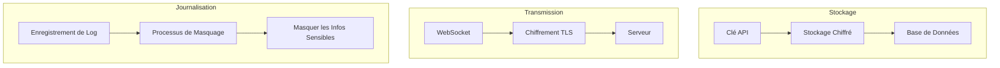

### Mesures de Sécurité

| Étape | Mesure | Description |
| --- | --- | --- |
| Stockage | Stockage chiffré | Chiffrer la Clé API dans la base de données |
| Transmission | Chiffrement TLS | WebSocket utilise un canal chiffré |
| Journalisation | Masquage | Ne pas journaliser la Clé en clair |
| Entrée | Requêtes paramétrées | Empêcher l'injection SQL |

## Conception d'Extensibilité

### Ajout d'un Nouveau Fournisseur

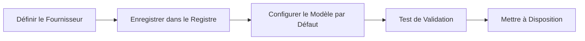

### Support Multi-Fournisseurs

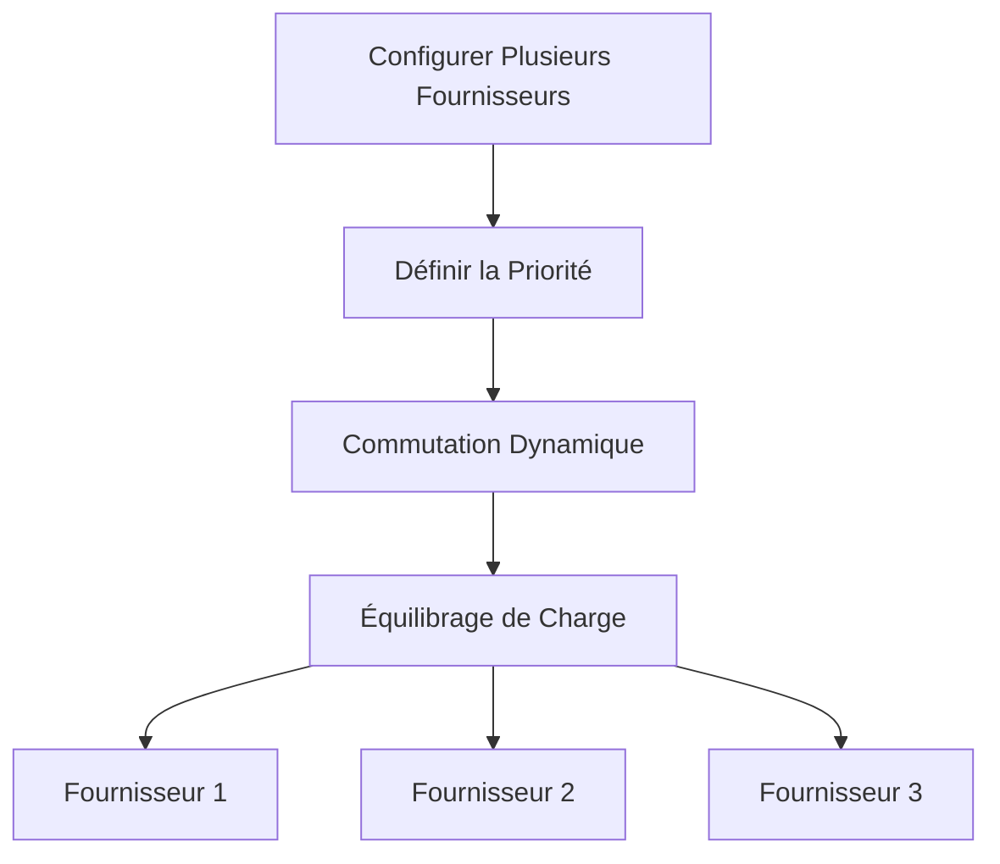

## Définition des Types de Messages

### Messages WebSocket

| Type de Message | Direction | Description |
| --- | --- | --- |
| ConfigureLlmProvider | TUI → Serveur | Demande de configuration |
| LlmProviderConfigured | Serveur → TUI | Résultat de configuration |
| UserMessage | TUI → Serveur | Conversation utilisateur |
| AgentResponse | Serveur → TUI | Réponse de l'agent |

## Planification Future

| Fonctionnalité | Description | Priorité |
| --- | --- | --- |
| Import/Export de Configuration | Prise en charge de la migration de fichiers de configuration | Haute |
| Vérification de Santé du Fournisseur | Détection périodique de la disponibilité du Fournisseur | Moyenne |
| Basculement Automatique | Commutation automatique lorsque le Fournisseur est indisponible | Moyenne |
| Intégration des Stats d'Utilisation | Lien avec le système de statistiques d'utilisation | Basse |

# Mécanisme d'Injection de Prompt MCP et de Compression de Contexte

## Aperçu

Ce document décrit deux conceptions architecturales clés : le mécanisme d'injection de Prompt obligatoire des outils MCP et le mécanisme de compression de contexte basé sur les marqueurs Todo. Ces deux mécanismes fonctionnent ensemble pour normaliser le comportement des Agents et optimiser la gestion du contexte dans les scénarios de conversation longue.

## I. Injection de Documentation des Outils MCP (Exec-Only)

### Concept Central

Sous l'architecture de micro-noyau exec-only, le LLM ne reçoit que **trois définitions d'outils** : `exec`, `write_to_var` et `write_to_var_json`. Les outils MCP sont des APIs internes invoquées via le runtime JS d'exec. La documentation des outils MCP est injectée dans le prompt de compétence comme documentation API JS via le mécanisme `related_tools` — pas comme définitions d'outils séparées envoyées au LLM.

```mermaid
flowchart LR
    A[related_tools de la Compétence] --> B[McpToolDocLoader]
    B --> C[Lire les paramètres TOML + description MD]
    C --> D[Formater comme docs API JS]
    D --> E[Injecter dans le prompt système]

    style D fill:#90EE90
```

### Caractéristiques Clés

| Caractéristique | Description |
| --- | --- |
| Surface exec-only | Le LLM ne voit que `exec`, `write_to_var`, `write_to_var_json` ; les outils MCP ne sont jamais exposés comme définitions d'outils |
| Portée par compétence | Les docs d'outils sont injectées par compétence via `related_tools`, pas globalement |
| Format API JS | Docs formatées comme `référence API d'import de module ES — description` |
| Routage interne | McpToolRegistry est par agent mais utilisé uniquement pour la distribution interne |

### Motivation de la Conception

```mermaid
flowchart TB
    subgraph Scénarios Problématiques
        A[Trop de définitions d'outils gonflent le contexte]
        B[L'injection de prompt par outil est fragile]
        C[Le LLM est confus par la prolifération d'outils]
    end

    subgraph Solutions
        D[Surface à trois outils : exec, write_to_var, write_to_var_json]
        E[Docs MCP comme références API JS]
        F[Injection related_tools à portée de compétence]
    end

    A --> D
    B --> E
    C --> F
```

### Flux d'Injection

```mermaid
sequenceDiagram
    participant Competence as Compétence (related_tools)
    participant Chargeur as McpToolDocLoader
    participant MCP as Configuration Outil MCP (TOML + MD)
    participant Prompt as Prompt Système

    Competence->>Chargeur: Liste des noms d'outils associés
    Chargeur->>MCP: Lire les paramètres TOML + description MD
    MCP-->>Chargeur: Métadonnées de l'outil

    Chargeur->>Chargeur: Formater comme référence API d'import de module ES — description
    Chargeur->>Prompt: Injecter dans la section compétence du prompt système

    Note over Prompt: Le LLM ne voit que l'outil exec<br/>Les docs MCP apparaissent comme références API JS
```

### Format d'Injection

La documentation de chaque outil MCP est formatée comme une référence API JS :

$agent.todo_list_view() — Voir la structure actuelle de l'arbre todo
$agent.todo_create({ title: String, description: String }) — Créer un nouvel élément todo
$agent.todo_update_status({ `todo_id`: String, status: String }) — Mettre à jour le statut d'un élément todo

### Exemple de Configuration

```mermaid
flowchart TB
    subgraph related_tools de la Compétence
        A[TOML de Compétence : champ related_tools]
        A --> A1["[tool_name]"]
        A1 --> B[todo_list_view]
        A1 --> C[todo_create]
        A1 --> D[todo_update_status]
    end

    subgraph McpToolDocLoader
        E[Lire les paramètres TOML]
        F[Lire la description MD]
        G[Formater comme doc API JS]
    end

    B --> E
    C --> E
    D --> E
    E --> F --> G
```

### Niveaux de Permission

Chaque entrée `[[related_tools]]` peut optionnellement déclarer un `access_mode` :

[[`related_tools`]]
`agent_name` = "polemos"
`tool_name` = "`node_execute`"
`access_mode` = "read"       # La compétence n'a besoin que d'un accès en lecture (par défaut : "read")

La passerelle de double autorisation vérifie que :

1. La `ToolCapability` déclarée de l'outil prend en charge le `access_mode` demandé
1. Le `TrustLevel` du nœud cible permet l'opération
1. Pour les nœuds externes, un filtrage supplémentaire par niveau de risque s'applique

Voir `docs/design/en/22-mcp-tool-permission-model.md` pour plus de détails.

### Avantages et Compromis

```mermaid
graph TB
    subgraph Avantages
        A[Surface d'outils minimale]
        B[Documentation à portée de compétence]
        C[Format API cohérent]
        D[Flexibilité de routage interne]
    end

    subgraph Compromis
        E[Le LLM doit construire des appels JS]
        F[Le débogage nécessite le traçage exec]
        G[related_tools doit être maintenu]
    end
```

## II. Mécanisme de Compression de Contexte Basé sur les Marqueurs Todo

### Concept Central

La compression traditionnelle repose sur le résumé de texte, ce qui perd des détails clés. Le nouveau mécanisme passe au marquage des éléments Todo clés, préservant les détails originaux comme entrée utilisateur, continuant directement l'exécution de la Compétence originale.

```mermaid
flowchart LR
    subgraph Méthode Traditionnelle
        A1[Contexte] --> B1[Texte Résumé]
        B1 --> C1[Nouvelle Conversation]
        C1 --> D1[Perte de Détails Possible]
    end

    subgraph Méthode Marqueur Todo
        A2[Contexte] --> B2[Marquer le Todo Clé]
        B2 --> C2[Préserver les Détails Originaux]
        C2 --> D2[Aucune Perte d'Information]
    end
```

### Comparaison de Motivation de Conception

| Problèmes de la Méthode Traditionnelle | Avantages du Marqueur Todo |
| --- | --- |
| Perte d'information | Préservation originale |
| Dérive sémantique | Traçable |
| Invérifiable | Vérifiable |
| Invalidation de compétence | Continuité de compétence |

### Flux de Compression

```mermaid
sequenceDiagram
    participant User as Utilisateur
    participant Agent as Agent Original
    participant Marker as Marqueur Todo
    participant NewAgent as Nouvel Agent
    participant TodoMCP as Todo MCP

    User->>Agent: Demander la Compression de Contexte
    Agent->>Marker: Obtenir les Éléments Todo Clés

    Note over Marker: Appliquer la Stratégie de Marquage

    Marker-->>Agent: Liste d'Éléments Marqués
    Agent->>TodoMCP: Obtenir les Détails par Lot
    TodoMCP-->>Agent: Détails Todo

    Agent->>NewAgent: Démarrer une Nouvelle Session

    Note over NewAgent: Prompt système = Compétence Originale<br/>Entrée utilisateur = Détails Todo

    NewAgent->>TodoMCP: Voir l'Arbre Todo
    Note over NewAgent: Trouver les détails déjà dans l'entrée<br/>Continuer directement
```

### Stratégies de Marquage

```mermaid
flowchart TB
    subgraph Types de Stratégies
        A[Marquage Manuel]
        B[AutoCritical Chemin Critique]
        C[AutoUnfinished Tâches Inachevées]
        D[Stratégie Hybride]
    end

    A --> A1[L'Utilisateur Sélectionne les Éléments Clés]
    B --> B1[Identifier Automatiquement la Chaîne de Tâche Principale]
    C --> C1[Marquer Tous les Éléments Inachevés]
    D --> D1[Combiner Plusieurs Stratégies]
```

### Comparaison des Stratégies

| Stratégie | Contenu Marquage | Scénarios Applicables |
| --- | --- | --- |
| Manuelle | Spécifié par l'utilisateur | Contrôle précis |
| AutoCritical | Chaîne de tâche principale + tâches bloquantes | Tâches complexes |
| AutoUnfinished | Toutes les tâches inachevées | Récupération simple |
| Hybride | Combiné + marques utilisateur | Scénarios généraux |

### Structure d'Élément Marquée

```mermaid
classDiagram
    class MarkedTodoItem {
        +todo_id: String
        +include_depth: u32
        +include_ancestors: bool
        +include_artifacts: bool
    }

    class MarkerStrategy {
        <<enumeration>>
        Manuel
        AutoCritical
        AutoUnfinished
        Hybride
    }

    class TodoMarker {
        +marked_items: List~MarkedTodoItem~
        +marker_strategy: MarkerStrategy
        +mark_critical_todos()
    }

    TodoMarker --> MarkedTodoItem
    TodoMarker --> MarkerStrategy
```

## III. Collaboration des Deux Mécanismes

### Flux de Collaboration

```mermaid
sequenceDiagram
    participant User as Utilisateur
    participant OldAgent as Ancien Agent
    participant Marker as Marqueur Todo
    participant Chargeur as McpToolDocLoader
    participant NewAgent as Nouvel Agent

    Note over OldAgent: Contexte proche de la limite

    User->>OldAgent: Compresser le Contexte
    OldAgent->>Marker: Marquer le Todo Clé
    Marker-->>OldAgent: Liste d'Éléments Marqués

    OldAgent->>NewAgent: Créer une Nouvelle Session

    Note over NewAgent: Prompt système = Âme + Compétence<br/>related_tools chargés par McpToolDocLoader

    NewAgent->>Chargeur: Charger les docs d'outils pour related_tools
    Chargeur-->>NewAgent: Docs API JS formatées

    Note over NewAgent: Le prompt système contient :<br/>1. Identité de l'âme<br/>2. Template de compétence + docs related_tools<br/>3. Trois outils : exec, write_to_var, write_to_var_json

    NewAgent->>NewAgent: Exécuter via le runtime JS exec
    Note over NewAgent: Les outils MCP sont des APIs internes<br/>Trouver les détails déjà dans l'entrée

    NewAgent-->>User: Continuation Transparente de la Tâche
```

### Points de Collaboration Clés

```mermaid
flowchart TB
    subgraph Mécanisme de Collaboration
        A[McpToolDocLoader injecte les docs API JS]
        B[Le Marqueur Fournit un Contexte Complet]
        C[Âme + Prompt de Compétence Préservés]
    end

    A --> D[La compétence a des références API JS pour les outils MCP]
    B --> E[Des informations complètes suffisantes sont fournies]
    C --> F[La cohérence comportementale est maintenue]

    D --> G[Continuation Transparente de la Tâche]
    E --> G
    F --> G
```

## IV. Feuille de Route d'Implémentation

```mermaid
flowchart LR
    subgraph Phase 1 Haute Priorité
        A[Injection de Prompt MCP]
        A --> A1[Structure de Données]
        A --> A2[Logique d'Injection]
        A --> A3[Gestion de Configuration]
    end

    subgraph Phase 2 Priorité Moyenne
        B[Mécanisme de Marqueur Todo]
        B --> B1[Stratégie de Marquage]
        B --> B2[Récupération par Compression]
        B --> B3[Marquage Manuel]
    end

    subgraph Phase 3 Priorité Basse
        C[Stratégie Intelligente]
        C --> C1[AutoCritical]
        C --> C2[Hybride]
        C --> C3[Suggestions Intelligentes]
    end
```

## V. Évaluation des Risques et Atténuation

### Matrice de Risques

| Risque | Impact | Mesures d'Atténuation |
| --- | --- | --- |
| Surcharge de jetons trop importante | Dégradation des performances | Limiter le nombre marqué, niveau de compression configurable |
| Prompt trop strict | Flexibilité réduite | Fournir un mécanisme de contournement, guidage de gestion d'exception |
| Stratégie de marquage imprécise | Omission d'information | Remplacement manuel, confirmation visuelle |

### Flux de Gestion d'Erreur

```mermaid
flowchart TB
    A[Opération Échouée] --> B{Type d'Échec}
    B -->|Jetons Dépassés| C[Élaguer les Éléments Non Critiques]
    B -->|Stratégie Échouée| D[Repli en Mode Manuel]
    B -->|Injection Échouée| E[Utiliser le Comportement par Défaut]

    C --> F[Réessayer l'Opération]
    D --> F
    E --> F
```

## VI. Intégration de Configuration

### Structure de Configuration Globale

```mermaid
flowchart TB
    subgraph Configuration de Compétence
        A[related_tools]
        B[liste tool_names]
    end

    subgraph Configuration de Compression
        C[activé]
        D[stratégie_par_défaut]
        E[seuil_de_déclenchement]
    end

    subgraph Configuration de Stratégie
        F[inclure_chemin_critique]
        G[inclure_inachevé]
        H[éléments_marqués_max]
    end

    A --> I[Génération de Doc API JS]
    C --> J[Contrôle de Compression]
    F --> K[Règles de Marquage]
```

## VII. Extensions Futures

| Fonctionnalité | Description | Priorité |
| --- | --- | --- |
| Génération Dynamique de Prompt | Ajuster les contraintes selon la complexité de la tâche | Moyenne |
| Partage Multi-session | Plusieurs Agents partagent les marqueurs Todo | Moyenne |
| Suggestions de Marquage Intelligent | Auto-recommander les éléments marqués | Basse |
| Outil de Marquage Visuel | Interface de marquage graphique | Basse |

## VIII. Injection de Contexte RAG Complémentaire (v2.1+)

L'injection d'outils MCP décrite dans les Sections I-VII fournit au LLM des **références API** — elle indique au LLM *comment* appeler les outils. Un mécanisme complémentaire, l'Injection de Contexte RAG, fournit au LLM des **connaissances pré-calculées** — elle injecte les *résultats* des requêtes RAG directement dans le prompt système.

| Aspect | Injection d'Outils MCP | Injection de Contexte RAG |
| --- | --- | --- |
| Ce que le LLM reçoit | Docs de référence API (imports de modules ES) | Contenu de connaissance réel (nœuds de mémoire, docs d'espace de travail) |
| Quand injecté | Par compétence, basé sur `related_tools` | Par étape de compétence, basé sur le contexte de compétence |
| Implication du LLM | Le LLM doit appeler l'outil | Aucune implication du LLM — pré-calculé |
| Impact sur la latence | N allers-retours (un par appel) | 1 pré-calcul par étape de compétence |
| Modules IEPL | `{agent}` (distribution MCP) | `rag/{philia,aporia}` (lecture de tampon) |

Les deux mécanismes coexistent : les outils MCP restent disponibles comme solution de repli pour les requêtes que le contexte pré-calculé ne couvre pas. Voir `docs/design/en/26-rag-context-injection.md` pour la conception complète.

# Conception de la Double Identité des Agents et de la Frontière de Visibilité

## Objectifs

- Séparer entièrement les instances d'exécution de Compétence visibles des fournisseurs internes d'outils MCP/LLM.
- Permettre uniquement aux invocations de Compétence de créer des agents visibles temporaires avec des badges à 3 chiffres.
- Attribuer l'utilisation du modèle et des jetons MCP/LLM à l'instance de Compétence attachée au lieu de créer des agents visibles supplémentaires.
- Conserver l'identité UUID d'exécution pour l'audit, l'historique et la relecture sans la laisser fuiter dans la chronologie TUI.

## Couches d'Identité

- `agent_number` : le badge à 3 chiffres orienté interface utilisateur et la clé stable pour les nœuds visibles de la chronologie.
- `agent_uuid` : l'UUID d'exécution utilisé pour le registre, l'audit et l'historique.
- `agent_id` : un champ de compatibilité.
  - Dans les charges utiles TUI visibles, `agent_id` doit correspondre au `agent_number` orienté panneau.
  - Dans les registres internes et les chemins d'exécution MCP, `agent_id` peut rester de style UUID.

## Règles de Visibilité et d'Instanciation

- Seules les invocations de Compétence créent des instances d'agent visibles temporaires.
- Les fournisseurs SimpleTool/MCP ne doivent pas créer d'agents visibles supplémentaires simplement parce qu'un de leurs outils est appelé.
- Lorsqu'une Compétence utilise des outils MCP ou un appel interne `llm_chat`, ces invocations restent une exécution subordonnée sous cette instance de Compétence.
- Exemple : si HubRis appelle ApoRia `llm_chat`, ApoRia reste un exécuteur interne et ne doit pas apparaître comme un second nœud visible dans la chronologie en haut à droite.

## Règles d'Attribution MCP et LLM

- Si un appel MCP/LLM appartient à une instance de Compétence visible, le nom de son modèle et son utilisation de jetons doivent être attribués à cette instance de Compétence.
- Les fournisseurs internes peuvent toujours conserver leur propre audit ou comptabilité globale, mais ces statistiques internes ne doivent pas déclencher la création de nœuds TUI.
- Les logs MCP et le contexte doivent préserver :
  - `agent_number`
  - `agent_uuid`
  - `tool_name`
  - `phase` (`start`/`finish`)
  - `success` et `error`

## Contrat de Rendu TUI

- La TUI crée des nœuds de chronologie uniquement pour les IDs de panneau explicites à 3 chiffres.
- Les charges utiles sans `agent_number` visible peuvent mettre à jour uniquement les statistiques globales de modèle/jeton et ne doivent pas créer de nœuds d'agent visibles.
- Les étiquettes d'affichage et les clés de nœud ne doivent jamais dériver un badge visible d'UUIDs ou de chiffres arbitraires trouvés dans `agent_id`.
- Pour les nœuds visibles :
  - `agent_number` est utilisé pour l'affichage et l'interaction.
  - `agent_uuid` est conservé uniquement pour l'audit, l'historique et le débogage.

## Allocation et Cycle de Vie du Badge

- `agent_number` est alloué aléatoirement depuis le pool disponible `000`-`999` plutôt qu'assigné séquentiellement.
- Les numéros libérés sont réutilisables.
- Lorsque les 1000 badges sont actifs, l'allocateur peut revenir à une réutilisation aléatoire ; la désambiguïsation historique doit alors reposer sur `agent_uuid`.
- Le nettoyage des instances visibles et la récupération des badges sont gérés par le gestionnaire de cycle de vie des Compétences.

## Contraintes de Compatibilité

- Les charges utiles héritées qui ne portent que `agent_id` peuvent toujours être analysées en interne, mais l'interface visible ne doit pas synthétiser de nouveaux nœuds à partir d'IDs de style UUID.
- Lorsque `agent_number` et `agent_uuid` sont tous deux présents, le modèle de double identité s'applique :
  - `agent_number` est pour l'affichage et l'interaction.
  - `agent_uuid` est pour l'audit et l'historique.

# Architecture de Concurrence des Requêtes

## Aperçu

Scepter gère deux couches de concurrence indépendantes :

```mermaid
flowchart LR
    Utilisateur["Requêtes Utilisateur"] --> Semaphore["Sémaphore de Requêtes"]
    Semaphore --> Cosmos["Conteneurs Cosmos"]
    Cosmos --> FileAttente["File d'Attente par Niveau (RequestPool)"]
    FileAttente --> LLM["API LLM"]
```

## Analogie

Pensez à un restaurant :

- **Les clients** (requêtes utilisateur) arrivent et passent commande simultanément
- **Les tables** (conteneurs Cosmos) sont créées par requête — chacune obtient son propre espace de travail
- **Les postes de cuisine** (concurrence du fournisseur LLM) sont limités — peut-être 3 au total
- **Le système de tickets** (file d'attente par niveau `RequestPool`) gère l'ordonnancement FIFO par niveau

30 clients peuvent commander en même temps (scepter accepte plusieurs requêtes), mais la cuisine ne peut cuisiner que 3 plats à la fois (limite de débit de l'API LLM).

## Couche 1 : Sémaphore de Requêtes

**Emplacement** : `state_machine/domains/control_domain.rs` — `concurrent_request_semaphore`

Contrôle combien de requêtes utilisateur scepter accepte simultanément. Chaque requête crée un conteneur Cosmos indépendant avec son propre gestionnaire LLM.

```mermaid
flowchart LR
    Utilisateur1["Message Utilisateur"] -->|"N = somme de tous les max_concurrent du modèle"| Semaphore["Semaphore(N)"]
    Utilisateur2["Message Utilisateur"] --> Semaphore
    Utilisateur3["Message Utilisateur"] --> Semaphore
    Semaphore --> Conteneur1["Conteneur Cosmos + gestionnaire LLM"]
    Semaphore --> Conteneur2["Conteneur Cosmos + gestionnaire LLM"]
    Semaphore --> Conteneur3["Conteneur Cosmos + gestionnaire LLM"]
```

N = total des créneaux simultanés pour tous les modèles activés. Si les modèles A (3 créneaux) + B (2 créneaux) = 5 requêtes simultanées.

Auparavant, c'était `AtomicBool` (N=1), maintenant c'est `Semaphore(N)`.

## Couche 2 : File d'Attente par Niveau (RequestPool)

**Emplacement** : `infra/request_pool.rs` — `RequestPool`

File d'attente FIFO par niveau avec sémaphores par modèle. Dans un niveau :

1. Les requêtes LLM entrantes entrent dans la file d'attente du niveau
1. Essayer d'acquérir un créneau sur le modèle de priorité la plus élevée d'abord
1. Si occupé, essayer le modèle suivant dans l'ordre de priorité
1. Si tous occupés, attendre dans la file FIFO — le premier modèle qui se libère sert la requête suivante

```mermaid
flowchart TB
    subgraph Niveau["Niveau : 'normal'"]
        direction TB
        FileAttente["File FIFO : req1 → req2 → req3 → req4"]
        MA["Modèle A (priorité 10) : Semaphore(3) ■■□"]
        MB["Modèle B (priorité 5) :  Semaphore(2) □□"]
        MC["Modèle C (priorité 1) :  Semaphore(1) ■"]
        FileAttente -->|"req1 → Modèle A (disponible)"| MA
        FileAttente -->|"req2 → Modèle B (disponible, A occupé)"| MB
        FileAttente -->|"req3 → attend... Modèle A libéré → servir"| MA
        FileAttente -->|"req4 → attend... Modèle C libéré → servir"| MC
    end
```

### Propriétés Clés

- **Isolation par fournisseur** : Le `max_concurrent` de chaque modèle est indépendant
- **Ordonnancement par priorité** : Les modèles de priorité supérieure sont préférés lorsqu'ils sont disponibles
- **Repli** : Si le modèle de haute priorité est saturé, les modèles de priorité inférieure servent immédiatement
- **Équité FIFO** : Les requêtes en attente sont servies dans l'ordre d'arrivée

### Configuration

# provider_config.toml
[[models]]
id = "gpt-5.4"
tier = "normal"
priority = 10
`max_concurrent` = 3        # 3 appels API simultanés vers ce modèle

[[models]]
id = "gpt-4o-mini"
tier = "normal"
priority = 5
`max_concurrent` = 5        # 5 appels API simultanés

[[models]]
id = "deepseek-v3"
tier = "deep"
priority = 8
`max_concurrent` = 2

Avec cette configuration :

- Niveau `normal` : Modèle A (3 créneaux) + Modèle B (5 créneaux) = 8 appels LLM simultanés de niveau normal
- Niveau `deep` : Modèle C (2 créneaux) = 2 appels LLM simultanés de niveau profond
- Sémaphore de Requêtes : 3 + 5 + 2 = 10 requêtes utilisateur simultanées

## Flux : Message Utilisateur → Réponse LLM

    1. L'utilisateur envoie un message via TUI/CLI/socket
    1. `handle_user_message`() :

a. `try_acquire`() sur le Sémaphore de Requêtes (Couche 1)

          - Si pas de créneaux : retourner l'erreur "occupé"
          - Chaque créneau → conteneur Cosmos indépendant

b. `execute_skill_chain`() → `invoke_aporia_llm_chat`()

    1. `invoke_aporia_llm_chat`() :

a. `acquire_tier`("normal", `excluded_models`) sur `RequestPool` (Couche 2)

          - Essayer chaque modèle dans l'ordre de priorité (non bloquant)
          - Si tous occupés : attendre dans FIFO jusqu'à ce qu'un créneau de modèle se libère
          - Retourne TierPermit { `model_id`, `display_name` }

b. `chat_loop` → llm_backend.chat() → LlmService::`chat_with_tools`()

          - Utilise le modèle sélectionné pour l'appel API

c. TierPermit libéré → créneau de sémaphore libéré

    1. `finish_handling`() :

a. Permis du Sémaphore de Requêtes retourné
b. Le conteneur Cosmos peut être nettoyé (ou réutilisé)

## Tests E2E

Les tests utilisent un délai d'inactivité (pas une échéance absolue). Le minuteur se réinitialise à chaque événement significatif :

# L'activité réinitialise le minuteur d'inactivité — la chaîne peut s'exécuter indéfiniment tant qu'elle reste active
ACTIVE_METHODS = {
"Tui.`OrchestrationStatus`",
"Tui.`McpToolResult`",
"Tui.`AgentReport`",
"Tui.`AgentStreamingChunk`",
"Tui.`TaskStatusUpdate`",
"Tui.`AskHumanRequest`",
"Tui.AgentPatch",
"Tui.`ContainerSnapshot`",
}

Cela garantit :

- Un délai d'inactivité court (120s) capture les chaînes vraiment bloquées
- Les chaînes de longue durée mais actives (multi-compétences complexes) ne sont jamais tuées prématurément

# Base de Données de Développement Embarquée et Isolation de Production par Portes de Fonctionnalités

## Aperçu

entelecheia utilise [pglite-oxide](https://crates.io/crates/pglite-oxide) comme PostgreSQL embarqué à deux fins :

1. **Développement local** : Lorsqu'aucun `DATABASE_URL` n'est configuré, scepter démarre automatiquement un PostgreSQL en processus (PG 17.5 via WASM/wasmer) avec support pgvector.
1. **Tests d'intégration** : Les tests d'intégration PG utilisent pglite-oxide au lieu de Docker/testcontainers.

En production (Docker), la fonctionnalité `embedded-db` est exclue, et scepter se connecte à un vrai conteneur PostgreSQL.

## Motivation de la Conception

Auparavant, le développement local nécessitait soit Docker Compose, soit une installation manuelle de PostgreSQL. Les tests d'intégration reposaient sur `testcontainers`, ajoutant une complexité Docker-dans-Docker en CI. pglite-oxide élimine les deux exigences — `cargo run` "fonctionne" pour le développement local, et `cargo test` s'exécute sans Docker.

## Architecture de Porte de Fonctionnalité

```mermaid
flowchart TB
    Cargo["scepter Cargo.toml<br/>[features] default = ['all-agents', 'embedded-db']  ← dev<br/>embedded-db = ['dep:pglite-oxide']<br/>[dependencies] pglite-oxide = { workspace = true, optional = true }"]

    Cargo -->|"cargo build (par défaut)"| Dev["pglite-oxide + wasmer WASM<br/>inclus"]
    Cargo -->|"Dockerfile<br/>--no-default-features<br/>--features all-agents"| Prod["Pas de pglite, pas de wasmer<br/>(production)"]
```

| Contexte de Construction | Commande | pglite-oxide | wasmer | DATABASE_URL |
| --- | --- |  ---  |  ---  | --- |
| `cargo run` (dev local) | fonctionnalités par défaut | ✓ | ✓ | Optionnel — démarre automatiquement PG embarqué si absent |
| `cargo test` (tests) | fonctionnalités par défaut | ✓ | ✓ | Démarré automatiquement par le harnais de test |
| `just build` (release) | `--no-default-features --features all-agents` | ✗ | ✗ | Requis |
| Docker `Dockerfile` | `--no-default-features --features all-agents` | ✗ | ✗ | Requis (pointe vers le conteneur PG) |

## Ordre de Résolution de la BD à l'Exécution

// packages/scepter/src/app/setup.rs
let `db_url` = if let Ok(url) = std::env::var("DATABASE_URL") {
// 1. Variable d'environnement (production : Docker PG, dev : fichier .env)
url
} else if !user_config.database.url.is_empty() {
// 2. Fichier de configuration utilisateur (~/.config/entelecheia/config.toml)
user_config.database.url.clone()
} else {
// 3. pglite-oxide embarqué (par porte de fonctionnalité)
#[cfg(feature = "embedded-db")]
{
let server = `PgliteServer`::builder()
.extension(`pglite_oxide`::extensions::VECTOR)  // support pgvector
.start()?;
let url = server.database_url();
std::mem::forget(server);  // maintenir en vie pour la durée du processus
url
}
#[cfg(not(feature = "embedded-db"))]
{
return Err(/* "aucun DATABASE_URL configuré" */);
}
};

## Modèle de Harnais de Test

```no_run
// tests/pg_integration/auth_test.rs
static PG: OnceCell<(String, PgliteServer)> = OnceCell::const_new();

# [test]
fn pg_integration_tests() {
    let rt = tokio::Runtime::new().unwrap();
    rt.block_on(async {
        let url = ensure_pg_url().await;
        let db = connect_db(&url).await;  // max_connections=1
        pg_user_crud(&db).await;
        pg_unique_username(&db).await;
        pg_rbac_role_persistence(&db).await;
        pg_rbac_audit_log(&db).await;
    });
    std::process::exit(0);  // contourner le blocage du pool sqlx
}
```

## Tables Créées

Les 23 tables + 1 table à schéma spécifique + 4 vues sont créées via les migrations SeaORM :

**Cœur** : `users`, `rbac_user_roles`, `rbac_audit_log`, `agents`, `conversations`, `messages`, `tasks`
**Objectifs** : `goals`, `tracks`, `goal_tasks`
**Connaissance** : `knowledge_bases`, `knowledge_documents` (embeddings pgvector), `rag_subscriptions`
**Consensus** : `consensus_records`, `consensus_references`, `consensus_verifications`
**Infrastructure** : `credentials`, `ssh_credentials`, `container_snapshots`, `model_usage_stats`
**Espace de Travail** : `workspace_registry`, `todo_items`, `workspace_bindings`
**Journalisation** : `log.entries` (schéma `log` séparé)
**Vues** : `usage_period_stats`, `usage_model_stats`, `usage_role_stats`, `usage_session_stats`

## Contraintes PGlite

| Contrainte | Impact | Atténuation |
| --- | --- | --- |
| `max_connections=1` | Un seul pool à la fois | Connexion DB partagée entre les sous-tests ; pas de `db.close()` entre les tests |
| Conversion de type stricte | `uuid = text` échoue | Toujours passer des valeurs typées (par exemple, `Uuid` pas `String` pour les colonnes UUID) |
| Pas d'accès concurrent | Les tests doivent être séquentiels | Un seul exécuteur `#[test]` avec tous les sous-tests en ligne |
| Tâches d'arrière-plan du pool sqlx | `close()` se bloque indéfiniment | `std::process::exit(0)` après que tous les tests sont terminés |

## Durcissement de la Construction Docker

Tous les Dockerfiles de production excluent embedded-db :

# Dockerfile
RUN cargo build --release -p scepter \
--no-default-features --features all-agents

Cela garantit zéro code wasmer/pglite dans les images de production, maintenant la taille binaire minimale et la surface d'attaque réduite.
